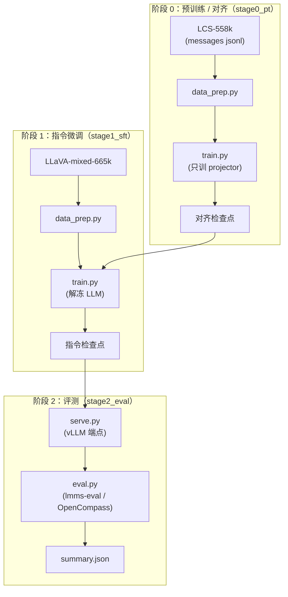
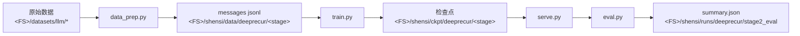

# DeepRecur 训练配方

一个视觉-语言模型的**受控对比配方**：同一 Qwen3-VL 主干下，三条视觉注入路线（多层注入 / 编码器-自由 / 深度轴跨模态递归）共用同一套数据、超参与评测口径，可训练、可服务、可评测。

## 论文

**arXiv**: [2406.04334](https://arxiv.org/abs/2406.04334)（DeepStack：把高分辨率视觉 token 分组成多份、逐深度注入 LLM 中间层）。

> **公开数据复现**：配方只用公开数据（LCS-558k / LLaVA-mixed-665k 等）。与使用私有数据的官方结果会有差距——本配方的用途是**方法论参考**：同一数据、同一冻结口径下比较不同的视觉注入路线。

## 模型概述

| 项目 | 值 |
|---|---|
| 骨干 | Qwen3-VL 家族（2B / 4B / 8B，文本塔 + ViT 视觉塔） |
| 视觉注入路线 | 三臂：`native` / `unified` / `deeprecur`（见表） |
| 深度连接 | GDAR：行银行 + 门控 delta 更新 + 白化读（两塔单流） |
| 递归结构 | 两塔共享块数（`recur_blocks`），逐块 reinject（硬覆盖）+ feedback（软回注） |
| 训练段 | 2（预训练/对齐 → 指令微调）+ 评测段 |
| 评测 | lmms-eval（默认）与 OpenCompass（可选）双 harness |

### 三臂对照

| 臂 | `model.variant` | 视觉路径 | PT 可训件 | 备注 |
|---|---|---|---|---|
| 多层注入 | `native` | Qwen3-VL 原生：ViT + 多点（deepstack）注入 | projector + deepstack 投影 | 继承权重，对齐件重随机 |
| 编码器-自由 | `unified` | 无 ViT：48×48×3 合并 patch 经单 matmul（LN→Dense→LN→位置→LN→无缩放 RMSNorm→Linear） | 视觉嵌入器 | 视觉 token 预算 {70,140,280,560,1120} |
| 深度轴递归 | `deeprecur` | GDAR 两塔 + 逐块 reinject/feedback | GDAR 连接件 + projector | 块数 = 递归次数 |

### 架构细节

| 组件 | 值 |
|---|---|
| 视觉 patch | 16px patch × 3×3 merge → 48px 合并 patch（encoder-free 口径） |
| 文本塔 | Qwen3-VL 文本 config（层数/头数/词表按规模档） |
| GDAR 状态 | 前缀流 + 行银行（每块一行）；状态打包在 hidden 宽度里（宽度 = h + 行数×h） |
| 块划分 | `floor(i × depth / n)`：两塔块数相同（2B=7 / 4B=6 / 8B=9） |
| 交换 | reinject：图像位硬覆盖最新视觉；feedback：逐 clip 语言→视觉软门控回注 |

### 关键特性

- **三臂同脚本**：`--set model.variant=…` 切换，数据/超参/评测完全一致。
- **公平口径**：与预训练权重相关的"视觉↔语言对齐件"不继承、按初始化口径重随机；主干冻结。
- **原生优先**：训练走 HF Trainer 或 Megatron-Bridge；推理走 vLLM（主干注意力/KV/融合原生，自研连接件走桥）；mcore 侧两塔只换层类/层规格。
- **离线可验**：全部冒烟与闸门不下载权重（tiny 随机几何），无卡环境也能跑。

## 训练流水线



| 阶段 | 用途 | 产物 |
|---|---|---|
| [阶段 0：预训练/对齐](./stage0_pt/) | LCS-558k 对齐视觉与语言（只训 projector） | 对齐检查点 |
| [阶段 1：指令微调](./stage1_sft/) | LLaVA-mixed-665k 指令微调（解冻 LLM） | 指令检查点 |
| [阶段 2：评测](./stage2_eval/) | 基准套件评测（双 harness） | `summary.json` |

## 前置条件

| 项 | 要求 |
|---|---|
| Python | 仓库 venv（torch / transformers / vLLM；mcore 路径另需 Megatron-Bridge） |
| GPU | 冒烟与 debug 用单卡即可；正式档按规模（见「可训规模」） |
| 文件系统 | `SHENSI_FS` 指到数据/产物根（本机 `/home/louzo/fsdata`） |
| 权重 | 按 `common/model_zoo.py` 的档位获取（HF / ModelScope 同名 id，或本地目录） |
| 分词器 | 配方自带 `common/tokenizer/Qwen3-0.6B`（冒烟与 tiny 档离线可用） |
| 评测 | lmms-eval（默认）；OpenCompass 为可选后端 |

## 可训规模

| key | 型号 | 参数 | 几何 | `recur_blocks` | 单卡档位 |
|---|---|---|---|---|---|
| `2b` | `Qwen/Qwen3-VL-2B-Instruct` | 2.1B | text 28×2048 · vision 24×1024 | 7 | 三臂 PT+SFT |
| `4b` | `Qwen/Qwen3-VL-4B-Instruct` | 4.4B | text 36×2560 · vision 24×1024 | 6 | PT 必做；SFT 视显存 |
| `8b` | `Qwen/Qwen3-VL-8B-Instruct` | 7.2B 级 | text 36×4096 · vision 27×1152 | 9 | 只 PT（冻结主干） |

档位文件：`common/config/geoms/qwen3_vl_{2b,4b,8b}.yaml`（`--profile geoms/qwen3_vl_2b` 直接选）。

## 快速开始

```bash
cd src/shensi/recipes/paper/deeprecur

# ① 冒烟（tiny 随机模型 + 合成数据，离线）
python stage0_pt/train.py --smoke
python stage1_sft/train.py --smoke
python stage0_pt/train.py --smoke --set model.variant=deeprecur

# ② 数据准备
cd stage0_pt && python data_prep.py --discover && python data_prep.py --prepare

# ③ 训练（以 2B 档为例）
python train.py --profile geoms/qwen3_vl_2b --tokens 0.14e9            # PT
cd ../stage1_sft
python train.py --profile geoms/qwen3_vl_2b --tokens 0.9e9 --load <PT 检查点>

# ④ 评测（论文口径）
cd ../stage2_eval
python serve.py --arm deeprecur --ckpt <指令检查点>
python eval.py --suite main --arm deeprecur --base-url http://127.0.0.1:8000/v1
```

## 命令行

各训练 stage 共用开关（`common/config.py` 注册）：

| 开关 | 说明 |
|---|---|
| `--profile <名字>` / `--config <路径>` | 选 `config/<名字>.yaml`（两者等价；`geoms/<名字>` 走共享几何档） |
| `--smoke` | tiny 随机模型 + 合成数据，全程离线 |
| `--tokens 0.9e9` | token 预算 → `max_steps`（按 global batch × 估序长换算） |
| `--load <目录>` | 接续的 HF 检查点（PT → SFT → 变体） |
| `--set 键=值` | 点号键覆写，可多次，最后应用 |
| `--data-dir <目录>` | 数据产物目录（含 `<stage>_train.jsonl`） |
| `--dry-run` | 打印训练计划（不装载模型） |
| `--early-stop N` / `--no-early-stop` | eval loss 早停耐心 / 关闭 |

数据准备：`data_prep.py --discover`（报落位）/ `--prepare`（`--config tiny` 小切片、`--blend data_blend_hd.json` 换 HD 混合、`--offline` 只用本地已有）。

## 配置文件

| 文件 | 用途 |
|---|---|
| `config/default.yaml` | 生产档（训练口径、几何、优化器、早停） |
| `config/tiny.yaml` | 冒烟档（tiny 几何 + 合成数据 + 5 步） |
| `config/data_prep/{default,tiny}.yaml` | 数据准备参数（`blend_path` / `sample` / `valid_ratio` / `output_dir`） |
| `config/data_prep/data_blend_{raw,tiny,hd}.json` | 配比（条目：`name` / `path` / `kind` / `count` / `fields`） |
| `common/config/geoms/qwen3_vl_*.yaml` | 规模几何档（跨 stage 共享） |

覆写示例：

```bash
python stage0_pt/train.py --profile geoms/qwen3_vl_2b --set train.global_batch_size=64
python stage1_sft/train.py --set model.variant=deeprecur --set model.recur_blocks=7
```

## 产物流



## 执行方式

```bash
# 直接脚本（当前节点）
python stage0_pt/train.py --profile geoms/qwen3_vl_2b

# 多卡（HF Trainer 的 accelerate 启动）
accelerate launch --num_processes 8 stage1_sft/train.py --profile geoms/qwen3_vl_2b

# 离线冒烟与闸门（不需要 GPU 数据；权重不下）
python stage0_pt/train.py --smoke
python -m shensi.recipes.paper.deeprecur.common.models.transformers.smoke_test
```

## 昇腾实践

面向单卡到多卡昇腾集群的落地要点（结合昇腾原生训练/推理的通行做法）：

| 项 | 做法 | 本配方落点 |
|---|---|---|
| 多维并行 | TP/PP/CP/EP 组合，通信尽量收敛在超节点内；长上下文优先 CP | mcore 路径走 Megatron-Bridge 的并行配置；`geoms` 档给单卡口径 |
| 混合精度 | bf16 计算 + fp32 归约；融合算子按硬件能力开 | 训练档 `bf16: true`；GDAR 的门控/白化读在 fp32 内算再回落 |
| 自定义算子 | 新组件（门控连接、白化读）缺原生算子时先要 torch 参考路径可用，再逐步做融合 | GDAR 连接件全部是 torch 原语（无 CUDA 专属依赖）；kernel 优化留给后续 |
| 数据流水线 | 预处理与训练解耦，产物落盘（jsonl/bin）以便 checkpoint 续训 | `data_prep.py` 产物为 messages jsonl，`--load` 接续 |
| 高可用 | 定期存检查点 + 早停看门狗 | `save_steps` + `--early-stop`（eval loss 监控） |
| RL 后训练 | 以 verl 为编排内核 + 昇腾原生后端做 Actor/Rollout/Reward 协同 | 本配方不含 RL 段；训练/评测栈可直接接 verl 系 |
| 推理 | 昇腾原生推理（vllm-ascend 系）承接 OpenAI 兼容端点 | `stage2_eval/serve.py` 的端点即 OpenAI 兼容；换后端只改启动命令 |
| 环境 | torch↔torch_npu 配对、CANN 版本对齐；CUDA 专属件（flashinfer 等）在昇腾不可用 | 冒烟与闸门不上 NPU；正式跑前按仓库根的 `pyproject.ascend.toml` 装配并逐项自查 |

> 昇腾路径按组件文档整理，**未在本机 NPU 上实测**；CUDA 专有件在昇腾上不可用，已在本配方中避免依赖。

## 阶段文档

- [阶段 0：预训练/对齐](./stage0_pt/README.md)：LCS-558k，只训 projector
- [阶段 1：指令微调](./stage1_sft/README.md)：LLaVA-mixed-665k，解冻 LLM
- [阶段 2：评测](./stage2_eval/README.md)：基准套件 + 双 harness

## 局限与边界

- **占位模型**：论文的视觉塔是 CLIP-large-336 + MLP projector；本配方用 Qwen3-VL 系列暂代，`paper:` 配置块记录论文侧架构参数（stacking 深度、采样、分辨率口径），换真实模型时由模型实现消费。
- **分辨率口径**：`native` 臂用 Qwen3-VL 动态分辨率；`unified` 臂按视觉 token 预算（`visual_token_budget`）；两者对比时需按「进 LLM 的视觉 token 数」对齐。
- **数据**：665k 的条目级拆解按 LLaVA-1.5 官方口径推断（其余约 63K 未逐条公开），差异写在配比文件的 `_note`。
- **显存**：8B 全参 + AdamW 需 8×H100 级；本机 16GB 只够 tiny/debug 与 PT（projector-only）真跑。
- **mcore 交织容器**：要求单 PP 段、非 packed（THD）输入、空 deepstack、仅图像；多卡训练需打开 PP 接线。
- **评测**：真实出分需要装 harness 的机器（`--resolve-tasks` 会核对 task 名，对不上显式报错）。
