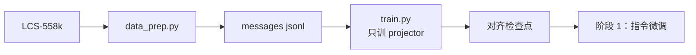

# 阶段 0：预训练 / 对齐（stage0_pt）

用 LCS-558k 把视觉特征对齐到语言空间：**只训 projector**，视觉塔与 LLM 冻结。产物交给阶段 1 做指令微调。

## 概述

本阶段把图像-文本对转成单轮对话（messages jsonl），按「只训 projector」口径做 1 epoch 对齐。冻结口径与数据都在配置里显式声明，换臂（`model.variant`）时数据与超参不变。

| 组件 | 说明 |
|---|---|
| `data_prep.py` | 采集 LCS-558k（内嵌图像的 parquet）→ messages jsonl |
| `train.py` | 对齐训练（HF Trainer；`freeze: [vision, llm]`） |
| `config/` | 数据准备与训练配置 |

## 快速开始

```bash
cd src/shensi/recipes/paper/deeprecur/stage0_pt

# 冒烟：tiny 随机模型 + 合成数据 + 5 步（离线）
python train.py --smoke
python train.py --smoke --set model.variant=deeprecur

# 数据准备
python data_prep.py --discover                 # 看数据落位
python data_prep.py --prepare                  # 采集 + 转换（558k 全量）
python data_prep.py --prepare --config tiny    # 小切片

# 训练（2B 档；--dry-run 先看计划）
python train.py --profile geoms/qwen3_vl_2b --tokens 0.14e9
```

## 数据准备

### 流水线

1. 采集：按配比 `path`（`hf://…`）下载或定位本地数据；
2. 转换：parquet → 单轮对话（`user: [图像]+caption 提示`，`assistant: caption`），图像落盘到数据集目录的 `images/`；
3. 切分：按 `valid_ratio` 切 train/val；
4. 落盘：`stage0_pt_train.jsonl` / `stage0_pt_val.jsonl`。

### 命令行

| 选项 | 说明 |
|---|---|
| `--discover` | 只报告每个数据集的登记条数与落位 |
| `--prepare` | 采集 + 转换 |
| `--config <名字>` | 选 `config/data_prep/<名字>.yaml` |
| `--blend <文件>` | 直接指定配比 json |
| `--sample N` / `--valid-ratio R` | 抽样上限 / 验证比例 |
| `--offline` | 只用本地已有数据（缺失显式报错） |

### 输入（配比与记录格式）

`config/data_prep/data_blend_raw.json`：

```json
{
  "datasets": [
    {"name": "LLaVA-Pretrain", "path": "hf://liuhaotian/LLaVA-Pretrain",
     "kind": "llava_pretrain", "count": 558390}
  ]
}
```

`kind` 决定转换器（`llava_pretrain` / `llava_instruct` / `vl_qa` / `sharegpt`）；`count` 是该数据集的登记条数；`fields` 传转换器参数。

### 输出

```
<FS>/shensi/data/deeprecur/stage0_pt/
├── stage0_pt_train.jsonl    # 每行一个样本（images + messages）
└── stage0_pt_val.jsonl
```

### 配置

`config/data_prep/default.yaml`：

| 键 | 说明 |
|---|---|
| `blend_path` | 配比文件（同目录内可写相对名） |
| `output_dir` | 产物目录；`null` = `<FS>/shensi/data/deeprecur/<stage>` |
| `sample` | 每数据集抽样上限（`null` = 不限） |
| `valid_ratio` | 验证集比例 |

## 训练

### 命令行

`train.py` 的公共开关见配方 README 的「命令行」一节（`--smoke` / `--tokens` / `--load` / `--set` / `--dry-run` / `--early-stop`）。

### 超参（`config/default.yaml`）

| 项 | 值 |
|---|---|
| 数据 | LCS-558k，1 epoch |
| 可训 | 仅 projector（`freeze: [vision, llm]`） |
| global batch | 256 |
| lr | 1e-3，cosine，warmup 0.03 |
| 优化器 | AdamW（wd 0，clip 1.0） |
| 精度 | bf16 |

各臂的「projector」对应件不同：`native` 臂是 `visual.merger`（+ deepstack 投影）、`unified` 臂是视觉嵌入器、`deeprecur` 臂是 GDAR 连接件 + merger。继承自预训练权重的**对齐件不继承、按初始化口径重随机**（公平口径）。

### 输出

- 检查点：`<FS>/shensi/ckpt/deeprecur/stage0_pt/<profile>/final`（HF 格式，含 processor）
- 运行记录：`<FS>/shensi/runs/deeprecur/stage0_pt/<profile>/{config.yaml,run.sh}`

### 覆写示例

```bash
python train.py --profile geoms/qwen3_vl_2b --set train.global_batch_size=128
python train.py --smoke --set model.recur_blocks=2
```

## 产物流



## 下一阶段

- [阶段 1：指令微调](../stage1_sft/README.md)：LLaVA-mixed-665k，解冻 LLM
