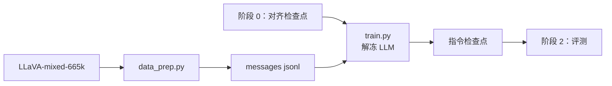

# 阶段 1：指令微调（stage1_sft）

在 LLaVA-mixed-665k 上做指令微调：**解冻 LLM + projector**，视觉塔冻结；附 `sft_v` 变体（视觉塔以分组学习率 2e-6 解冻）。

## 概述

本阶段把指令数据转成多轮对话（messages jsonl），按 assistant-only loss 微调；多轮样本每一段 assistant 内容都计入 loss，图像 token 与 prompt 置 -100。

| 组件 | 说明 |
|---|---|
| `data_prep.py` | 采集 LLaVA-mixed-665k（或 HD 748K 混合）→ messages jsonl |
| `train.py` | 指令微调（HF Trainer；`freeze: [vision]`） |
| `config/` | 数据准备与训练配置（含 `sft_v.yaml`） |

## 快速开始

```bash
cd src/shensi/recipes/paper/deeprecur/stage1_sft

# 冒烟（离线）
python train.py --smoke
python train.py --smoke --set model.variant=deeprecur

# 数据准备
python data_prep.py --discover
python data_prep.py --prepare                      # 665k 全量
python data_prep.py --blend data_blend_hd.json --prepare   # HD 748K 混合

# 训练（接阶段 0 的检查点）
python train.py --profile geoms/qwen3_vl_2b --tokens 0.9e9 --load <对齐检查点>
```

## 数据准备

### 流水线

1. 采集：按配比 `path` 下载或定位（LLaVA-Instruct 的 COCO/VG 图像放 `images/llava-instruct`）；
2. 转换：记录 → messages jsonl；学术集按 `fields.task_prompt` 拼任务提示；
3. 切分：按 `valid_ratio` 切 train/val；
4. 落盘：`stage1_sft_train.jsonl` / `stage1_sft_val.jsonl`。

### 命令行

与阶段 0 相同（`--discover` / `--prepare` / `--config` / `--blend` / `--sample` / `--valid-ratio` / `--offline`）。

### 输入

`config/data_prep/data_blend_raw.json`（条目 schema 同阶段 0）；图像路径相对 `fields.image_root`，根为 `<FS>/datasets/llm/post-training/`。

### 输出

```
<FS>/shensi/data/deeprecur/stage1_sft/
├── stage1_sft_train.jsonl
└── stage1_sft_val.jsonl
```

### 配置

`config/data_prep/{default,tiny}.yaml`：键与阶段 0 相同（`blend_path` / `output_dir` / `sample` / `valid_ratio`）。

## 训练

### 超参（`config/default.yaml`）

| 项 | 值 |
|---|---|
| 数据 | LLaVA-mixed-665k，1 epoch |
| 可训 | LLM + projector（`freeze: [vision]`） |
| global batch | 128 |
| lr | 2e-5，cosine，warmup 0.03 |
| 优化器 | AdamW（wd 0，clip 1.0） |
| 精度 | bf16 + 梯度检查点 |

### 变体（`config/sft_v.yaml`）

- `freeze: []`：视觉塔也训，分组学习率 `vision_lr: 2e-6`（其余 2e-5）；
- 数据换 HD 混合：`python data_prep.py --blend data_blend_hd.json --prepare`。

### 输出

- 检查点：`<FS>/shensi/ckpt/deeprecur/stage1_sft/<profile>/final`
- 运行记录：`<FS>/shensi/runs/deeprecur/stage1_sft/<profile>/`

### 覆写示例

```bash
python train.py --profile geoms/qwen3_vl_2b --set train.lr=2.0e-5
python train.py --config sft_v --set train.vision_lr=1.0e-6
```

## 产物流



## 上一阶段 / 下一阶段

- 上一阶段：[阶段 0：预训练/对齐](../stage0_pt/README.md)
- 下一阶段：[阶段 2：评测](../stage2_eval/README.md)
