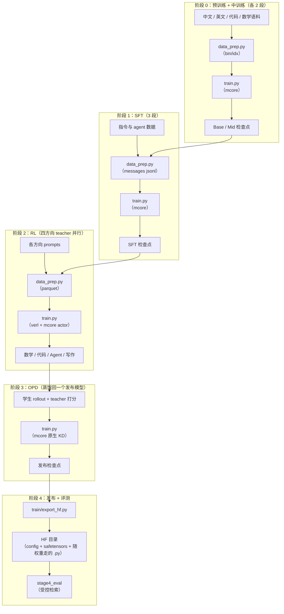
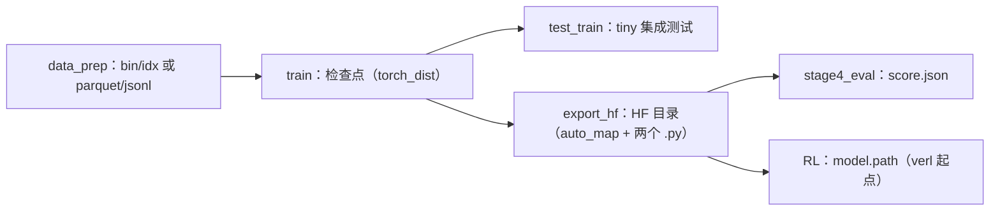

# GDAR 训练配方

门控 delta 残差（Gated Delta Attention Residual，GDAR）的完整训练配方：把 Transformer 的
残差流换成一份沿深度方向读写的逐通道状态，从原始语料一路训到发布模型并评测。

每个子层的输出带门控地（decay / erase / write 三个门）写进状态，输入从状态上做一次白化
多头 delta 读。初始化时整条连接与普通残差流**逐位相同**（`max|Δ logit| = 0.000e+00`，
27/27 张量离线校验），所以所有对照臂都从同一个函数出发——同 tokenizer、同数据顺序、同种子、
同超参，只差连接算子这一处。

---

## 模型概述

| 属性 | 值 |
|---|---|
| 骨干 | Qwen3 稠密：RMSNorm、RoPE、SwiGLU、GQA、QK-norm |
| 连接算子 | 门控 delta：decay / erase / write 三门、目标函数闭式更新、白化多头读、`Softmax¬1`、λ 夹紧 ≥ −0.5 |
| 恒等性 | `GDAR(0) == 普通残差` **逐位**（离线校验 27/27 张量、`max\|Δ logit\| = 0.000e+00`） |
| 规模档 | 0.6B / 1.7B / 4B / 8B / 14B 稠密，加 30B-A3B MoE 门面；另有 220M / 1.04B 机制曲线档 |
| 变体 | `gdar` / `ar` / `dar` / `denseformer` / `mudd` / `hc` / `mhc` / `realformer` 八种连接 |
| 阶段 | 预训练 2 段 → 中训练 2 段 → SFT 3 段 → RL 4 方向 → OPD → 发布 + 评测 |

### 架构细节

| 组件 | 值 |
|---|---|
| 块粒度 | `B = 4`（主行）；`B = 1` 的逐子层形态并列报告 |
| 低秩预算 | gate / query / key 秩 `r = 64`（主行）；`r = 16` 为参数匹配行 |
| 读头 | 8 个（白化，带可学习 null source） |
| decay 参数化 | 逐通道可学时间常数（`decay_tau` 阶梯 64 档）+ 投影式正性 |
| RealFormer | 残差注意力：跨层累加 softmax 前的注意力分数（可切换 running mean） |

### 关键性质

- **初始化即恒等**：连接在零点处恰为 `norm(prefix + delta) × weight`，与普通 pre-norm
  残差逐位相同；四个 deviation scale 是唯一的逃逸口，梯度按 scale → 门 → 读投影逐级放活。
- **所有对照臂同源**：AR / DAR / DenseFormer / MUDD / HC / mHC / RealFormer 与主行共用
  一套块结构，各自与自己的公开实现逐位对拍（13/13 通过）。
- **训练与推理同源**：mcore 训练件与 vLLM 推理件共用同一份连接算子，逐位对拍在闸门里。
- **早停默认开**：所有 stage 的步数/轮次都给到无限大，loss / 奖励平台后由看门狗收尾，
  按成功计。

---

## 训练流水线



| 阶段 | 目的 | 框架 | 产物 |
|---|---|---|---|
| [阶段 0：预训练与中训练](./stage0_pretrain/README.md) | 语言能力（stable）→ 高质量退火（decay）→ 能力强化 → 长文档适配 | Megatron-Core | Base / Mid 检查点 |
| [阶段 1：SFT](./stage1_sft/README.md) | deep-thinking → hybrid-thinking → agent | Megatron-Core | SFT 检查点 |
| [阶段 2：RL](./stage2_rl/README.md) | 四个方向的专用 teacher 并行分训 | verl + Megatron-Core | 各方向 teacher 检查点 |
| [阶段 3：OPD](./stage3_opd/README.md) | 蒸馏回同一个发布模型 | Megatron-Core / verl | 发布检查点 |
| [阶段 4：评测](./stage4_eval/README.md) | 受控检索（答案位置与随机基线都已知） | transformers / vLLM | `score.json` |

---

## 目录结构

**只有一个 `common/`**：所有不属于某一个 stage 的东西都在这里。stage 目录里只放这一段
自己的入口与配置（`__init__.py` / `train.py` / `data_prep.py` / `config/` / `README.md`）。

```text
gated_delta_attn_res/
├── README.md                        本文件
├── common/                          公共件（stage 以外的全部）
│   ├── __init__.py                  公共件入口（惰性导出，见文件内说明）
│   ├── paths.py  algos.py  config.py  runner.py  rl.py
│   │                                路径 / 算法注册表 / 配置组装 / 训练运行时 / RL 启动
│   ├── prep_pt.py  train_pt.py      预训练与中训练的语料准备 / 训练入口
│   ├── prep_sft.py  train_sft.py    SFT 的语料准备 / 训练入口
│   ├── prep_rl.py  train_rl.py      RL 的语料准备 / 启动入口
│   ├── prep_opd.py  train_opd.py    OPD 的语料准备 / 训练入口
│   ├── models/                      三份互为镜像的模型实现
│   │   ├── megatron/                mcore 训练件（连接算子、层、层规格与消融）
│   │   ├── transformers/            HF 参考实现（对拍与导出的基准）
│   │   └── vllm/                    vLLM 原生件（rollout 与评测）
│   ├── train/                       训练运行时：入口、主循环、launcher、导出、校验
│   ├── kernels/                     白化算子的算子级实现（六档可切换）
│   ├── cluster/                     集群与本机真跑的提交件
│   └── tokenizer/Qwen3-0.6B/        自带分词器（全链路统一）
├── stage0_pretrain/                 预训练 + 中训练（两个子 stage）
├── stage1_sft/                      监督微调
├── stage2_rl/                       四方向 RL（四个子 stage）
├── stage3_opd/                      蒸馏
└── stage4_eval/                     评测
```

---

## 前置条件

| 项 | 说明 |
|---|---|
| Python 环境 | 仓库虚拟环境（uv 管理）：Megatron-Core、Megatron-Bridge、verl、vLLM 都在 `3rdparty/` 下 |
| GPU | 单卡可跑 tiny / debug 冒烟与 0.6B 试点；正式主跑需要集群 |
| 分词器 | 全链路统一用配方自带的 `common/tokenizer/Qwen3-0.6B` |
| 存储 | `SHENSI_ROOT`（仓库根）、`SHENSI_FS`（数据 / 检查点 / 运行目录的根） |

```bash
export SHENSI_ROOT=/path/to/shensi
export SHENSI_FS=/path/to/filestorage
```

> 本机没有 APEX：配置里 `no_gradient_accumulation_fusion: true`，RL 侧对应
> `override_transformer_config.gradient_accumulation_fusion: false`。

---

## 快速开始

### 单卡冒烟（每条几分钟内跑完）

```bash
R=src/shensi/recipes/paper/gated_delta_attn_res

python $R/stage0_pretrain/stage1_pretrain/train.py --smoke        # 预训练冒烟（5 步）
python $R/stage0_pretrain/stage2_midtrain/train.py --dry-run      # 中训练：打印命令
python $R/stage1_sft/train.py --smoke                             # SFT 冒烟（合成 jsonl）
python $R/stage2_rl/stage2_math/train.py --profile gspo --dry-run # RL：打印 verl 命令
python $R/stage3_opd/train.py --dry-run                           # OPD：打印命令
python $R/stage3_opd/test_opd_reward.py                           # OPD 的 reward 闸门
python $R/stage4_eval/test_train.py                               # 评测冒烟（40 题）
```

### 完整流水线（正式跑）

```bash
R=src/shensi/recipes/paper/gated_delta_attn_res

# 阶段 0：PT-1 stable → PT-2 decay → Mid-1 → Mid-2
cd $R/stage0_pretrain/stage1_pretrain
python data_prep.py --prepare --config default        # 语料 → bin/idx
python train.py --config default --tokens 9e9         # PT-1
python data_prep.py --prepare --config decay
python train.py --config decay --tokens 1e9 --load <PT-1 检查点>
cd ../stage2_midtrain
python data_prep.py --prepare --config default && python train.py --config default --tokens 5e8 --load <PT-2>
python data_prep.py --prepare --config mid2   && python train.py --config mid2   --tokens 3e8 --load <Mid-1>

# 阶段 1：SFT 三段
cd ../../stage1_sft
python data_prep.py --prepare --config default && python train.py --config default --load <Mid-2>
python data_prep.py --prepare --config hybrid  && python train.py --config hybrid  --load <SFT-1>
python data_prep.py --prepare --config agent   && python train.py --config agent   --load <SFT-2>

# 阶段 2：四个方向 teacher（各自独立）
cd ../stage2_rl
for arm in stage2_math stage2_code stage2_agent stage2_writing; do
  ( cd $arm && python data_prep.py --prepare --config default && python train.py )
done

# 阶段 3：OPD
cd ../stage3_opd && python train.py --config default --load <SFT-3 检查点> --teacher-cache <缓存目录>

# 阶段 4：发布 + 评测
python -m shensi.recipes.paper.gated_delta_attn_res.common.train.export_hf --ckpt <OPD 检查点> --out $HF/gdar-release
cd ../stage4_eval && python make_depth_retrieval.py --config default && python run_depth_retrieval.py --config default --model $HF/gdar-release
```

---

## CLI 命令

| 命令 | 说明 |
|---|---|
| `python train.py --config <名字或路径>` | 起训（`--config decay` 与 `--profile decay` 等价） |
| `python data_prep.py --prepare --config <名字>` | 语料准备（`--config tiny` 用小样本） |
| `python <段目录>/train.py --stage <子 stage>` | 段级派发（`stage0_pretrain`、`stage2_rl` 两个段有子 stage） |
| `--smoke` / `--dry-run` | tiny 规模跑 5 步 / 只打印命令 |
| `--tokens N` / `--load <检查点>` / `--set k=v` | token 预算 / 接续检查点 / 点号覆写 |
| `--no-early-stop`、`--early-stop N` | 关看门狗 / 调耐心（默认开） |
| `--set train.system.gdar_whiten_impl=<档>` | 白化实现换档：`eager`（默认）/ `fused` / `fused_apply` / `per_head` / `ns` / `triton`（后两档只在良态数据上等价，见 [kernels/README.md](./common/kernels/README.md)） |
| `python <段目录>/test_train.py` | 该 stage 的集成测试 |

---

## 配置说明

每个 stage（含子 stage）的目录结构一致：

```text
stage*/
├── README.md
├── __init__.py
├── train.py                  # 训练入口（--config config/<名字>.yaml）
├── data_prep.py              # 语料准备入口（--config config/data_prep/<名字>.yaml）
├── config/
│   ├── default.yaml          # 生产档
│   ├── tiny.yaml             # 冒烟档
│   └── data_prep/
│       ├── default.yaml      # 数据准备参数（配比 / 条数上限 / 进程数）
│       ├── tiny.yaml
│       ├── data_blend_raw.json      # 配比（数据源清单与权重）
│       └── data_blend_tiny.json
└── test_train.py             # 集成测试
```

跨 stage 共用的实现都在 `common/`（见上面的目录结构）；stage 目录里不放公共件。

---

## 模型算法（`--model-algo`）

所有 stage 共用一份注册表（默认 `qwen3_gdar_paper` = 主行）。一个臂名就是设计矩阵的一行。

| 类别 | 名字 |
|---|---|
| GDAR 主行 | `qwen3_gdar_paper`、`qwen3_gdar_main`、`qwen3_gdar_upstream` |
| GDAR 形态 | `qwen3_gdar`、`qwen3_gdar_theory`、`qwen3_gdar_fullrank`、`qwen3_gdar_block{2,4,8,16}`、`qwen3_gdar_r16`、`qwen3_gdar_noladder`、`qwen3_gdar_no_output_route` |
| 对照臂 | `base`（plain Qwen3）、`qwen3_ar`（+`_block4`）、`qwen3_dar`（+`_block4`） |
| 连接矩阵 | `qwen3_denseformer`、`qwen3_mudd`、`qwen3_hc`、`qwen3_mhc`、`qwen3_gated_ar`、`qwen3_realformer`（+`_identity` / `_reference` / `_mean`） |
| 设计消融 | `a1a_gate_prefix`、`a1b_gate_delta`、`a3_decay_projected`、`a4_lambda_free`、`a6_reference`、`a9_half_init`、`a9_uniform_init`、`e3_{scalar_gate,no_gate,decay_only,erase_only,write_only}` |

```bash
python train.py --config config/default.yaml --model-algo qwen3_gdar_paper
python train.py --config config/default.yaml --model-algo base          # plain Qwen3 对照
```

优先级：`--set train.model.spec=...` > `--model-algo` > profile 自带 spec > 默认算法——
消融档不会被默认算法静默覆盖。

---

## 产物流转



---

## 昇腾（Ascend）路径

本配方的三段（训练 / RL / 推理）在昇腾上的做法与组件清单；装配完成后跑 `python -m
shensi.utils.ascend_env` 逐项自查（CANN、torch↔torch_npu 配对、设备、组件 import、五处已知差异）。
依赖清单见仓库根的 `pyproject.ascend.toml`。

| 段 | 昇腾上的做法 | 本配方已经就位的地方 |
|---|---|---|
| 预训练 / SFT / OPD | Megatron-Core 的并行与算子由 MindSpeed 承接（TP/PP/CP/EP 与 `train.system.*` 一一对应）；`MegatronAdaptor + TransformerEngineNPU` 让 mcore 与 TE 在 NPU 上开箱可用；混合精度 bf16；数据流水线共用同一份 bin/idx | 档里已关掉 TE 与 apex 的全部融合（`no_persist_layer_norm` / `no_masked_softmax_fusion` / `no_gradient_accumulation_fusion` / `no_rope_fusion`），连接走 `transformer_impl: local`，不吃厂商融合件；开关一开即走 NPU 的 TE 实现 |
| 连接算子 | NPU 侧的融合算子可走 **MindSpeed-Ops**（`torch.ops.mindspeed_ops.*`，AscendC / Triton-Ascend 两套实现按芯片自动分发）：其中**分块门控 delta 规则递推**这一族与 GDAR 的门控 delta 直接对应，上 NPU 时优先对齐算子语义再谈替换；白化读保持 `local` 参考实现（等价性已由闸门钉住） | 白化实现六档开关在 `common/kernels/`；连接融合内核的挂点见 [kernels/README.md](./common/kernels/README.md) 的"下一步" |
| RL | verl + 昇腾原生后端（MindSpeed engine 路径）+ HCCL；rollout 用 vllm-ascend；长程稳定性适合配合 Prefill/Decode 分离与路由重放的做法 | RL 侧的运行期补丁机制（`VERL_USE_EXTERNAL_MODULES` 挂 `gdar_bridge`）与设备无关，配置照用 |
| 推理 / 评测 | vllm-ascend（可与训练侧 1P1D 分离部署同一套做法：P 节点 / D 节点分置，ansible 拉起）；模型登记沿用同一套 `ModelRegistry` 插件入口 | `common/models/vllm/register_model.py` 写的是 `vllm.general_plugins` 入口点，装到哪个 vLLM（CUDA 或昇腾）都生效 |
| 高可用 | 训练用 torch_dist 检查点 + 早停看门狗；RL 用 verl 的检查点状态 | 早停看门狗在 `common/runner.py`，指标口径按段配置 |

版本配套（与组件文档一致）：CANN 8.5.1 / 9.x + torch_npu（与 torch 主版本严格配对，`ascend_env`
会点名不配对的组合）；`triton-ascend==3.2.2`；MindSpeed 与 mcore 版本对齐关系见
`pyproject.ascend.toml` 的注释。CUDA 专属件（flashinfer、fast-hadamard-transform 一类）在昇腾上
不可用，`ascend_env` 会点名报出来；本配方的 vLLM 实现只组合 Llama 件，不依赖它们。

> 昇腾路径按组件文档整理成清单与自查脚本，本机没有 NPU，**未上 NPU 实测**。

## 判据与验证

| 检查 | 命令 | 结果 |
|---|---|---|
| 恒等 / 前向 / 梯度流 | `python -m ...common.train.checks` | 27/27 张量逐位、`max\|Δ logit\| = 0.000e+00` |
| HF 参考单测 | `common/models/transformers/test_{theory,ablation_switches,autoclass}.py` | 58/58、64/64、126/126 |
| 与各自实现逐位对拍 | `python .../test_upstream_alignment.py` | 13/13（AR / MUDD / DenseFormer / GDAR） |
| RealFormer | `test_realformer.py` / `test_realformer_mcore.py` | 17/17 / 11/11 |
| 权重通路（verl 桥） | `python -m ...stage2_rl.test_gdar_bridge` | 12/12（装载零缺键、HF 对拍 2.4e-07、导出逐位） |
| 权重表往返 | `python -m ...stage2_rl.convert.test_convert_tiny` | 80/80 张量逐位 |
| 四 stage 集成冒烟 | `python <段目录>/test_train.py` | rc=0、到最后一 iter、正常收尾 |
| OPD reward | `python stage3_opd/test_opd_reward.py` | 10/10 |
| 评测链 | `export_hf` + `stage4_eval/run_depth_retrieval.py` | HF 目录可加载、40 题约 3 秒出分、`chance = 0.25` |
| 白化内核 | `python common/kernels/test_whiten.py` / `test_whiten_extra.py` | 14/14 + 13/13（融合读 1.3e-06、per_head 逐位相同、批量白化 1.8e-06、三阶加速良态 5→3 步且等价） |
| 格式化 | `ruff check` / `ruff format --check` | 干净 |

---

## 各阶段文档

- [阶段 0：预训练与中训练](./stage0_pretrain/README.md) —— 2+2 段位设计
- [阶段 0.1：预训练](./stage0_pretrain/stage1_pretrain/README.md) —— stable / decay 两档
- [阶段 0.2：中训练](./stage0_pretrain/stage2_midtrain/README.md) —— 能力强化与长文档两段
- [阶段 1：SFT](./stage1_sft/README.md) —— 三段式
- [阶段 2：RL](./stage2_rl/README.md) —— 四方向 teacher 与算法档
- [阶段 3：OPD](./stage3_opd/README.md) —— 静态 KD 与 RL 式两条路
- [阶段 4：评测](./stage4_eval/README.md) —— 受控检索

## 进阶

- [kernels](./common/kernels/README.md) —— 白化算子级实现（六档）与精度包线
- [cluster](./common/cluster/README.md) —— 机制级真跑与集群提交件
- [模型：HF 参考实现](./common/models/transformers/README.md)
- [模型：vLLM rollout](./common/models/vllm/README.md)
