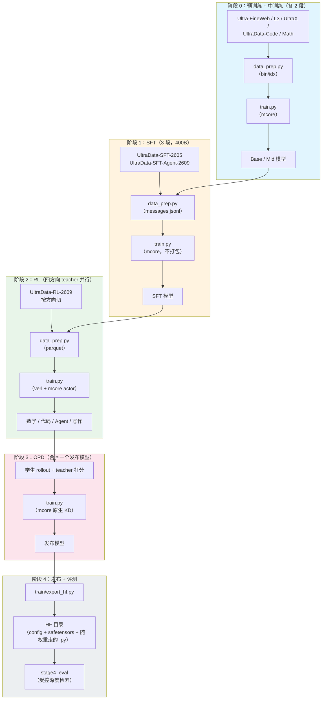
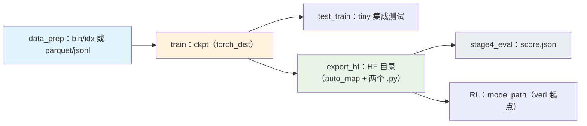

# GDAR 训练配方

Qwen3 骨干 + **深度轴门控 delta 残差**（GDAR）的完整训练配方：预训练两段、中训练两段、
SFT 三段、四个方向的 RL teacher、OPD 蒸馏回一个发布模型，最后发布成 HuggingFace 目录并评测。
默认训论文主行，换一个 `--model-algo` 可切到任意对照臂（plain Qwen3、AR / DAR / DenseFormer /
MUDD / HC / mHC / RealFormer 七种连接，以及 20 多条单旋钮消融行）。

## 模型概览

每个子层的残差流都被一份逐通道的深度状态**读写**：输出带门控（decay / erase / write）写进状态，
输入从状态上做一次白化多头 delta 读。初始化时整条连接**逐位**等于普通残差流，所以所有对照臂
都从同一个函数出发。

| 属性 | 值 |
|---|---|
| 骨干 | Qwen3 稠密：RMSNorm、RoPE、SwiGLU、GQA、QK-norm |
| 连接算子 | 门控 delta：decay / erase / write 三门、目标函数闭式更新、白化多头读、`Softmax¬1`、λ 夹紧 ≥ −0.5 |
| 恒等性 | `GDAR(0) == plain Qwen3` **逐位**（离线校验 27/27 张量、`max|Δ logit| = 0.000e+00`） |
| 规模 | 0.6B / 1.7B / 4B / 8B / 14B 稠密 + 30B-A3B MoE 门面；220M / 1.04B 机制曲线（`geoms/qwen3_0p22b`、`qwen3_1p04b`） |
| 变体 | `gdar` / `ar` / `dar` / `denseformer` / `mudd` / `hc` / `mhc` / `realformer` |
| 阶段 | PT（2 段）→ Mid（2 段）→ SFT（3 段）→ RL（4 方向）→ OPD → 发布 + 评测 |

### 架构细节

| 组件 | 值 |
|---|---|
| 块粒度 | `B = 4`（主行）；`B = 1` 的逐子层形态并列报告 |
| 低秩预算 | gate / query / key 秩 `r = 64`（主行）；`r = 16` 为参数匹配行 |
| 读头 | 8 个（白化，带可学习 null source） |
| decay 参数化 | 逐通道可学时间常数（`decay_tau` ladder 64）+ 投影式正性 |
| RealFormer | 残差注意力：跨层累加 **softmax 前**的注意力分数（可切换 running mean） |

### 训练特性

- **早停默认开**：所有 stage 的步数/轮次都给到无限大，loss/奖励平台后由看门狗收尾，按成功计；
- **优化器**：AdaMuon（矩阵腿）+ AdEMAMix（标量腿）整套旋钮，训练与 RL 两侧一致；
- **RL 算法**：GRPO 基线与 7 个可选档（`dapo` / `drgrpo` / `token_baseline` / `critic` / `fsdp` /
  `gspo` / `cispo`）；
- **RL 式 OPD**：verl 原生多 teacher on-policy distillation（按 `data_source` 路由 teacher，
  `loss_mode=k1` + policy gradient）；
- **吞吐**：骨干全为 Megatron-Core 原生件；连接算子是唯一自研算子（融合内核另立项）。

## 训练管线



| 阶段 | 目的 | 框架 | 产物 |
|---|---|---|---|
| [阶段 0：预训练与中训练](./stage0_pretrain/README.md) | 语言能力（stable）→ 高质量退火（decay）→ 能力强化 → 长文档适配 | Megatron-Core | Base / Mid ckpt |
| [阶段 1：SFT](./stage1_sft/README.md) | deep-thinking → hybrid-thinking → agent | Megatron-Core | SFT ckpt |
| [阶段 2：RL](./stage2_rl/README.md) | 四方向专用 teacher 并行分训 | verl + Megatron-Core | 各方向 teacher ckpt |
| [阶段 3：OPD](./stage3_opd/README.md) | 蒸馏回同一个发布模型（静态 KD 与 RL 式两条路） | Megatron-Core / verl | 发布 ckpt |
| [阶段 4：评测](./stage4_eval/README.md) | 受控深度检索（T0）+ 通用与长上下文评测 | transformers / vLLM | `score.json` + 榜单 |
| 发布 | mcore ckpt → HF 目录 | Megatron-Bridge | 可服务目录 |

## 模型算法（`--model-algo`）

所有 stage 共用一份注册表（默认 `qwen3_gdar_paper` = 论文主行）。一个臂名就是设计矩阵的一行。

| 类别 | 名字 |
|---|---|
| GDAR 主行 | `qwen3_gdar_paper`、`qwen3_gdar_main`、`qwen3_gdar_upstream` |
| GDAR 形态 | `qwen3_gdar`、`qwen3_gdar_theory`、`qwen3_gdar_fullrank`、`qwen3_gdar_block{2,4,8,16}`、`qwen3_gdar_r16`、`qwen3_gdar_noladder`、`qwen3_gdar_no_output_route` |
| 对照臂 | `base`（plain Qwen3）、`qwen3_ar`（+`_block4`）、`qwen3_dar`（+`_block4`） |
| 连接矩阵 | `qwen3_denseformer`、`qwen3_mudd`、`qwen3_hc`、`qwen3_mhc`、`qwen3_gated_ar`、`qwen3_realformer`（+`_identity` / `_reference` / `_mean`） |
| 设计消融 | `a1a_gate_prefix`、`a1b_gate_delta`、`a3_decay_projected`、`a4_lambda_free`、`a6_reference`、`a9_half_init`、`a9_uniform_init`、`e3_{scalar_gate,no_gate,decay_only,erase_only,write_only}` |

```bash
python train.py --config config/default.yaml --model-algo qwen3_gdar_paper
python train.py --config config/default.yaml --model-algo base          # plain Qwen3 对照
python train.py --config config/default.yaml --model-algo a14_r16       # 设计矩阵的一行
```

优先级：`--set train.model.spec=...` > `--model-algo` > profile 自带 spec > 默认算法 ——
消融档不会被默认算法静默覆盖。

## 前置条件

| 项 | 说明 |
|---|---|
| Python 环境 | 仓库虚拟环境（uv 管理）：Megatron-Core、Megatron-Bridge、verl、vLLM 都在 `3rdparty/` 下 |
| GPU | 单卡可跑 tiny/debug 冒烟与 0.6B pilot；论文主跑需要集群 |
| Tokenizer | 全链路统一 `tokenizer/Qwen3-0.6B` |
| 存储 | `SHENSI_ROOT`（仓库根）、`SHENSI_FS`（ckpt / data / runs 根） |

```bash
export SHENSI_ROOT=/path/to/shensi
export SHENSI_FS=/path/to/filestorage
```

> 本机没有 APEX：配置里 `no_gradient_accumulation_fusion: true`，RL 侧对应
> `override_transformer_config.gradient_accumulation_fusion: false`。

## 快速开始

### 单卡冒烟（每条都能在几分钟内跑完）

```bash
R=src/shensi/recipes/paper/gated_delta_attn_res

python $R/stage0_pretrain/train.py --stage stage1_pretrain --smoke        # 预训练冒烟（5 步）
python $R/stage0_pretrain/train.py --stage stage2_midtrain --dry-run      # 中训练：打印命令
python $R/stage1_sft/train.py --smoke                                     # SFT 冒烟（合成 jsonl）
python $R/stage2_rl/stage2_math/train.py --profile gspo --dry-run         # RL：打印 verl 命令
python $R/stage3_opd/train.py --dry-run                                   # OPD：打印命令
python $R/stage3_opd/test_opd_reward.py                                   # OPD 的 reward 闸门
python $R/stage4_eval/test_train.py                                       # 评测冒烟（40 题）
```

### 论文主跑（集群）

```bash
R=src/shensi/recipes/paper/gated_delta_attn_res

# 阶段 0：PT-1 stable → PT-2 decay → Mid-1 → Mid-2
cd $R/stage0_pretrain/stage1_pretrain
python data_prep.py --prepare --config default        # 语料 → bin/idx
python train.py --config default --tokens 9e9         # PT-1
python data_prep.py --prepare --config decay
python train.py --config decay --tokens 1e9 --load <PT-1 ckpt>
cd ../stage2_midtrain
python data_prep.py --prepare --config default && python train.py --config default --tokens 5e8 --load <PT-2>
python data_prep.py --prepare --config mid2   && python train.py --config mid2 --tokens 3e8 --load <Mid-1>

# 阶段 1：SFT 三段（旗舰对 400B）
cd ../../stage1_sft
python data_prep.py --prepare --config default && python train.py --config default --tokens 2e11 --load <Mid-2>
python data_prep.py --prepare --config hybrid  && python train.py --config hybrid  --tokens 2e11 --load <SFT-1>
python data_prep.py --prepare --config agent   && python train.py --config agent   --tokens 2e10 --load <SFT-2>

# 阶段 2：四个方向 teacher（各臂独立）
cd ../stage2_rl
for arm in stage2_math stage2_code stage2_agent stage2_writing; do
  ( cd $arm && python data_prep.py --prepare --config default && python train.py )
done

# 阶段 3：OPD（静态 KD 或 RL 式）
cd ../stage3_opd && python train.py --config default --load <SFT-3 ckpt> --teacher-cache <缓存>

# 阶段 4：发布 + 评测
python -m shensi.recipes.paper.gated_delta_attn_res.train.export_hf --ckpt <OPD ckpt> --out $HF/gdar-release
cd ../stage4_eval && python make_depth_retrieval.py --config default && python run_depth_retrieval.py --config default --model $HF/gdar-release
```

## CLI 速查

| 命令 | 说明 |
|---|---|
| `python train.py --config <名字或路径>` | 起训（`--config decay` 与 `--profile decay` 等价） |
| `python data_prep.py --prepare --config <名字>` | 语料准备（`--config tiny` 用小样本） |
| `python <stage>/train.py --stage <子 stage>` | 段级派发（`stage0_pretrain`、`stage2_rl` 两个段有子 stage） |
| `--smoke` / `--dry-run` | tiny 规模跑 5 步 / 只打印命令 |
| `--tokens N` / `--load <ckpt>` / `--set k=v` | token 预算 / 接续 ckpt / 点号覆写 |
| `--no-early-stop`、`--early-stop N` | 关看门狗 / 调耐心（默认就开） |
| `--set train.system.gdar_whiten_impl=<impl>` | 白化/读换实现：`eager`（默认）/ `fused` / `per_head` / `ns` / `triton`（后两个只在良态数据上等价，见 `kernels/README.md` 的精度包线） |
| `python <stage>/test_train.py` | 该 stage 的集成测试 |

## 配置说明

每个 stage（含子 stage）的目录结构一致：

```
stage*/
├── README.md
├── __init__.py
├── train.py                  # 训练入口（--config config/<名字>.yaml）
├── data_prep.py              # 语料准备入口（--config config/data_prep/<名字>.yaml）
├── config/
│   ├── default.yaml          # 生产档
│   ├── tiny.yaml             # 冒烟档
│   └── data_prep/
│       ├── default.yaml      # 数据准备参数（blend / limit / workers …）
│       ├── tiny.yaml
│       ├── data_blend_raw.json      # 配比（数据源清单）
│       └── data_blend_tiny.json
└── common/                   # 本段（或多个子 stage）共用的实现
```

跨 stage 共用的在配方根 `common.py` 与 `train/`；段内重复使用的下沉到各段的 `common/`。

## 注释与风格

| 范围 | 规则 |
|---|---|
| 本配方自写的代码（`train/`、`stage*/`、`common.py`、`cluster/`、`kernels/`） | 只保留必要处的**简洁中文注释**（按 Google Python 风格指南写：讲约束与原因，不复述代码）；每文件一行中文模块说明 |
| `models/megatron/`、`models/transformers/`、`models/vllm/`、`stage2_rl/convert/` | 这些是**逐行移植/对齐各自上游仓库**的实现件（上游对齐由 `test_upstream_alignment.py` 等闸门对拍），保留各自上游的注释风格与英文 docstring——对齐是这些文件的产品属性；它们同时排除在 ruff format 之外（见 LIMITATIONS A12） |
| `models/transformers/upstream/**` | vendored 官方件，**逐字未改**（sha256 见 `upstream/PROVENANCE.md`） |

## 产物与数据流



## 判据与验证

| 检查 | 命令 | 结果 |
|---|---|---|
| 恒等 / 前向 / 梯度流 | `python -m ...train.checks` | 27/27 张量逐位、`max|Δ logit| = 0.000e+00` |
| HF 参考单测 | `models/transformers/test_{theory,ablation_switches,autoclass}.py` | 58/58、64/64、126/126（八个变体的 AutoConfig/AutoModel 分发） |
| 与上游算子对拍 | `python models/transformers/test_upstream_alignment.py` | 13/13（AR / MUDD / DenseFormer 逐位） |
| RealFormer | `python models/transformers/test_realformer.py` / `models/megatron/test_realformer_mcore.py` | 17/17（恒等逐位、与上游转写四层对拍）/ 11/11 |
| 权重通路（verl 桥） | `python -m ...stage2_rl.test_gdar_bridge` | 12/12（分发、规格、装载、HF 对拍 2.4e-07、导出逐位） |
| 权重表往返 | `python -m ...stage2_rl.convert.test_convert_tiny` | 80/80 张量逐位 |
| 四 stage 集成冒烟 | `python <stage>/test_train.py` | rc=0、到最后一 iter、`[after training is done]` |
| RL 档位 | `python <arm>/train.py --profile <p> --dry-run` | 4 臂 × 8 档全绿（含 gspo / cispo） |
| OPD reward | `python stage3_opd/test_opd_reward.py` | 10/10（KL 数学、对齐、缓存、报错路径） |
| 评测链 | `train/export_hf.py` + `stage4_eval/run_depth_retrieval.py` | HF 目录可加载、40 题 ~3 秒出分、`chance = 0.25` |
| 早停 | 任一 stage 加 `--early-stop 0` | 看门狗收尾、写报告、按成功返回 0 |
| 白化内核（B6） | `python kernels/test_whiten.py` / `kernels/test_whiten_extra.py` | 12/12 + 10/10（融合读 1.3e-06、per_head 开关 `read` **逐位相同**、批量白化 1.8e-06；NS 在 full 档有精度包线，不达容差按包线报告、不当等价） |
| 三类真跑（B5） | `python cluster/b5_mechanism_ab.py` / `b5_longctx.py` / `bash cluster/b5_ruler.sh --dry-run` | 本机档已跑出数（见 LIMITATIONS B5）；集群件的 dry-run 校验通过 |
| 格式化 | `ruff check` / `ruff format --check` | 干净 |

## 各 stage 文档

- [阶段 0：预训练与中训练](./stage0_pretrain/README.md) —— 2+2 段位设计与依据
- [阶段 0.1：预训练](./stage0_pretrain/stage1_pretrain/README.md) —— PT-1 / PT-2 档位与完整矩阵
- [阶段 0.2：中训练](./stage0_pretrain/stage2_midtrain/README.md) —— 能力强化与长文档两段
- [阶段 1：SFT](./stage1_sft/README.md) —— 三段式 400B
- [阶段 2：RL](./stage2_rl/README.md) —— 四方向 teacher 与八个算法档
- [阶段 3：OPD](./stage3_opd/README.md) —— 静态 KD 与 RL 式两条路
- [阶段 4：评测](./stage4_eval/README.md) —— 受控深度检索与发布步
- [模型：HF 参考实现](./models/transformers/README.md)
- [模型：vLLM rollout](./models/vllm/README.md)

## 进阶

- [cluster/](./cluster/README.md) —— 三类真跑（主表 / 多 seed / 长上下文）的本机跑法与集群提交件
- [kernels/](./kernels/README.md) —— 白化的算子级实现（Triton 协方差 + Newton–Schulz）
- [LIMITATIONS.md](./LIMITATIONS.md) —— 已知局限与处置、证据、边界（含训练/推理几何的两处修正）
- [MINICPM5_ALIGNMENT.md](./MINICPM5_ALIGNMENT.md) —— 与 MiniCPM5-2B 公开配方的逐项核对
