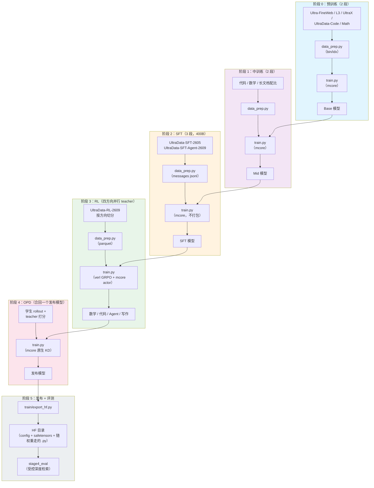
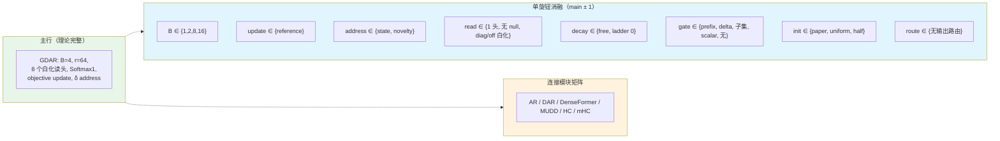

# Gated Delta Attention Residuals（GDAR）训练配方

一套完整的 **GDAR** 训练管线：骨干是 Qwen3，残差流通过**深度轴上的门控 delta 规则**被读写。
配方默认训的是论文期望的模型（设计矩阵的 **main** 行），换一个 `--model-algo` 就能切到任意对照臂
—— plain Qwen3、AR / DAR / DenseFormer / MUDD / HC / mHC 六种连接、以及 20 多条单旋钮消融行。

## 参考与出处

| 来源 | 是什么 |
|---|---|
| `gdar_package`（`code/train/RECIPE.md`） | 本配方实现的方案总纲：预算、LR 计划、语料配比 |
| `gdar_package`（`code/models/`） | 七个变体的 HF 参考实现（官方件 vendored 在 `models/transformers/upstream/`） |
| `gdar_package`（`code/FlagScale/**/megatron/{gdar,depth}/`） | `models/megatron/` 各模块的移植来源 |
| [MINICPM5_ALIGNMENT.md](./MINICPM5_ALIGNMENT.md) | 与 MiniCPM5-2B 公开五段式配方的逐项核对 |
| `EXPERIMENT_MATRIX.md` / `RUN_EXPERIMENTS.md` / `FIGURE_PLAN.md` | 随论文计划交付的设计矩阵、跑法与图计划 |

## 模型总览

GDAR 在 stock Qwen3 的每个子层上加了一条深度连接：子层输出带着门控 decay / erase **写**进一份
逐通道的深度状态，子层输入再从这份状态上做一次**白化多头 delta 读**取回。初始化时整条连接
**逐位**等于 plain 残差流（`GDAR(0) == Qwen3`），所以所有对比都从同一个函数出发。

| 属性 | 值 |
|---|---|
| 骨干 | Qwen3 稠密：RMSNorm、RoPE、SwiGLU、GQA、QK-norm（全部 mcore 原生件） |
| 连接 | 深度轴门控 delta 规则：decay / erase / write 三门、目标函数闭式更新、白化多头读、`Softmax¬1`、λ 夹紧 ≥ −0.5 |
| 恒等性 | `GDAR(0) == plain Qwen3` **逐位**成立（`train/checks.py`：27/27 张量，`max|Δ logit| = 0.000e+00`） |
| 变体 | 7 个：`gdar` / `ar` / `dar` / `denseformer` / `mudd` / `hc` / `mhc`，各自对齐各自上游仓库 |
| 规模 | 0.6B / 1.7B / 4B / 8B / 14B 稠密，外加 30B-A3B MoE 门面；220M / 1.04B 机制曲线 |
| 阶段 | 6 段：PT（stable+decay）→ Mid（2 段）→ SFT（3 段）→ RL（四方向）→ OPD → 评测 |
| 工具链 | Megatron-Core（训练 + `--spec` 层规格）、Megatron-Bridge（HF ↔ mcore）、verl（RL）、vLLM（rollout） |

### 架构细节

| 组件 | 值 |
|---|---|
| 块粒度 | `B = 4`（main 行）；`B = 1` 的逐子层形态并列报告 |
| 低秩预算 | gate / query / key 秩 `r = 64`（论文主行）；`r = 16` 为参数匹配行 |
| 读头数 | 8（白化 + 可学习 null source） |
| decay 参数化 | 逐通道可学时间常数（`decay_tau` ladder 64）+ 投影式正性保证 |
| 对齐几何 | `config/minicpm5_2b.yaml` —— 发布版 2.5B 几何，逐字段反推核对 |

## 训练管线



| 阶段 | 目的 | 框架 | 产物 |
|---|---|---|---|
| [阶段 0：预训练](./stage0_pretrain/) | 基础语言能力（stable）+ 高质量子集退火（decay） | Megatron-Core | Base ckpt |
| [阶段 1：中训练](./stage0_pretrain/stage2_midtrain/) | 能力强化（代码/数学）→ 分布适配（长文档） | Megatron-Core | Mid ckpt |
| [阶段 2：SFT](./stage1_sft/) | deep-thinking → hybrid-thinking → agent，400B tokens | Megatron-Core | SFT ckpt |
| [阶段 3：RL](./stage2_rl/) | 四方向（数学/代码/Agent/写作）teacher 并行分训 | verl + Megatron-Core | 各方向 teacher ckpt |
| [阶段 4：OPD](./stage3_opd/) | 把四个 teacher 蒸馏回同一个发布模型 | Megatron-Core（原生 KD） | 发布 ckpt |
| [阶段 5：发布](./train/export_hf.py) | mcore ckpt → HuggingFace 目录 | Megatron-Bridge | 可服务 HF 目录 |
| [阶段 5：评测](./stage4_eval/) | 受控深度检索（T0）、lm-eval、RULER | transformers / vLLM | `score.json` + 榜单 |

## 模型算法（`--model-algo`）

所有 stage 共用同一份注册表（`common.py::MODEL_ALGOS`，默认 `qwen3_gdar_paper` = 论文主行）。
一个臂名就是设计矩阵的一行。

| 类别 | 名字 |
|---|---|
| GDAR（论文主行） | `qwen3_gdar_paper` ★、`qwen3_gdar_main`、`qwen3_gdar_upstream`（与上游 shensi 分支逐位对齐：逐头白化） |
| GDAR 形态 | `qwen3_gdar`、`qwen3_gdar_theory`、`qwen3_gdar_fullrank`、`qwen3_gdar_block{2,4,8,16}`、`qwen3_gdar_r16`（参数匹配）、`qwen3_gdar_noladder`、`qwen3_gdar_no_output_route` |
| 对照臂 | `base`（plain Qwen3）、`qwen3_ar`（+`_block4`）、`qwen3_dar`（+`_block4`） |
| 连接模块矩阵 | `qwen3_denseformer`、`qwen3_mudd`、`qwen3_hc`、`qwen3_mhc`、`qwen3_gated_ar` |
| 设计消融 | `a1a_gate_prefix`、`a1b_gate_delta`、`a3_decay_projected`、`a4_lambda_free`、`a6_reference`、`a9_half_init`、`a9_uniform_init`、`e3_{scalar_gate,no_gate,decay_only,erase_only,write_only}` |

```bash
python train.py --model-algo base              # plain Qwen3 对照臂
python train.py --model-algo qwen3_ar          # AR 臂
python train.py --model-algo a14_r16           # 设计矩阵的一行
```

优先级：`--set train.model.spec=...` > `--model-algo` > profile 自带 spec > 默认算法 ——
消融档不会被默认算法静默覆盖。

## 前置条件

| 项 | 说明 |
|---|---|
| Python 环境 | 仓库虚拟环境（uv 管理）；Megatron-Core / Megatron-Bridge / verl / vLLM 都 vendored 在 `3rdparty/` |
| GPU | 单卡即可跑 tiny/debug 冒烟与 0.6B pilot；论文主跑需要集群 |
| Tokenizer | 全链路统一用 vendored Qwen3（`tokenizer/Qwen3-0.6B`） |
| 存储 | 设 `SHENSI_ROOT`（仓库根）与 `SHENSI_FS`（ckpt / data / runs 根），默认值是集群路径 |

```bash
export SHENSI_ROOT=/path/to/shensi
export SHENSI_FS=/path/to/filestorage          # ckpt / data / runs 都在它下面
```

> **说明**：各 stage 配置里的 `no_gradient_accumulation_fusion: true` 是因为本机没有 APEX；
> RL 侧对应的开关是 provider 覆盖 `gradient_accumulation_fusion: false`。

## 快速开始

### 全链路（单卡 tiny 路径）

```bash
R=src/shensi/recipes/paper/gated_delta_attn_res

# 阶段 0 —— 预训练冒烟（5 步、tiny 几何）
python $R/stage0_pretrain/stage1_pretrain/train.py --smoke
python $R/stage0_pretrain/stage2_midtrain/train.py --dry-run

# 阶段 2 —— SFT 冒烟（自带合成 messages jsonl，不碰语料）
python $R/stage1_sft/train.py --smoke

# 阶段 3 —— RL（打印 verl 命令；4 臂 × 6 个算法档）
python $R/stage2_rl/stage2_math/train.py --profile dapo --dry-run

# 阶段 4 —— OPD 预检
python $R/stage3_opd/train.py --dry-run

# 阶段 5 —— 把 mcore ckpt 发布成 HF 目录，再评测它
python -m shensi.recipes.paper.gated_delta_attn_res.train.export_hf \
    --ckpt $SHENSI_FS/shensi/ckpt/gated_delta_attn_res/stage3_opd \
    --out  $SHENSI_FS/shensi/models/gdar-release-hf
python $R/stage4_eval/test_train.py            # 生成 40 题 + 给 tiny ckpt 评一遍
```

### 论文主跑（集群）

```bash
R=src/shensi/recipes/paper/gated_delta_attn_res

# 阶段 0：PT-1 stable → PT-2 decay
cd $R/stage0_pretrain/stage1_pretrain
python data_prep.py --prepare                  && python train.py --tokens 9e9
python data_prep.py --prepare --blend decay.json && python train.py --profile decay --tokens 1e9 --load <PT-1>

# 阶段 1：Mid-1 → Mid-2
cd ../stage2_midtrain
python data_prep.py --prepare                  && python train.py --tokens 5e8 --load <PT-2>
python data_prep.py --prepare --blend mid2.json && python train.py --profile mid2 --tokens 3e8 --load <Mid-1>

# 阶段 2：SFT-1 → SFT-2 → SFT-3（旗舰对 400B）
cd ../../stage1_sft
python data_prep.py --prepare --blend default.json
python train.py --profile geoms/qwen3_30b_a3b --tokens 2e11 --data-jsonl <sft_train.jsonl> --load <Mid-2>

# 阶段 3：四个方向 teacher 并行（见 stage2_rl/README.md）
# 阶段 4：OPD（见 stage3_opd/README.md）
# 阶段 5：发布 + 评测（见 stage4_eval/README.md）
```

每篇 stage README 末尾都有一段**「跑完整论文实验」**：该 stage 在设计矩阵里的那一份命令。

## 设计矩阵



| 范围 | 规模 | seed |
|---|---|---|
| 架构结论 | 0.6B 阶梯（3 seed）、1.7B / 4B / 8B / 14B（单 seed） | 0.6B ≥3 |
| 机制曲线 | 220M / 1.04B | 1 |
| 门面 | 30B-A3B MoE（不承担架构结论） | 1 |

## 吞吐

- **骨干全部是 mcore 原生件**：embedding、RoPE、注意力、MLP、norm、MTP、优化器（含 emerging 的
  Muon 系）、TP/PP/CP/EP、`torch_dist` 检查点、bin/idx 数据管线；模型通过官方 `--spec`
  层规格扩展点接入。
- **唯一的自研算子是连接本身**（`models/megatron/gdar_connection.py`），它包裹在 mcore
  `TransformerLayer` 内部；它包裹的子层由 `get_gpt_layer_local_submodules` 构造，与 plain
  模型逐位同初始化。
- **`config/perf.yaml`** 把骨干切到 TransformerEngine + 本机实测可用的三个融合
  （bias SwiGLU / bias GeLU / gradient accumulation）。`masked_softmax`（要 APEX）与
  `persist_layer_norm`（torch LayerNorm 不支持）保持关闭 —— 两条都是实测报错，见
  `LIMITATIONS.md` A5。
- local 路径是逐位恒等的验收基线（`GDAR(0) == Qwen3` 精确成立）；TE 路径是吞吐路径，
  在 bf16 舍入量级一致（`max|Δ logit| = 9.8e-3`）。

## 验证清单

以下每一项都在本仓跑过，数字可由 `LIMITATIONS.md` 里的命令复现。

| 检查 | 命令 | 结果 |
|---|---|---|
| 恒等 / 前向 / 梯度流 | `python -m ...train.checks` | 27/27 张量逐位、`max|Δ logit| = 0.000e+00` |
| HF 参考单测 | `models/transformers/test_{theory,ablation_switches,autoclass}.py` | 58/58、64/64、42/42 |
| 上游对齐 | `python models/transformers/test_upstream_alignment.py` | 13/13（AR / MUDD / DenseFormer 逐位；GDAR per-head 逐位） |
| 四 stage 集成冒烟 | `python <stage>/test_train.py` | rc=0、到最后一 iter、`[after training is done]`、无 Traceback |
| verl 通路（桥/权重/rollout 同步） | `python -m ...stage2_rl.test_gdar_bridge` | 12/12（分发、规格、装载、HF 对拍 `2.4e-07`、导出逐位） |
| 权重表往返 | `python -m ...stage2_rl.convert.test_convert_tiny` | 80/80 张量逐位 |
| RL 算法档 | `python stage2_rl/stage2_math/train.py --dry-run` | 4 臂 × 6 档 = 24 个 dry-run 全绿 |
| vLLM rollout | `python -m ...models.vllm.smoke_generate --all` | 7/7 变体，与纯 transformers 参考逐 token 一致（lcp = 16/16） |
| 发布 + 评测 | `train/export_hf.py` + `stage4_eval/run_depth_retrieval.py` | HF 目录 `trust_remote_code` 可加载，40 题 ~3 秒出分、`chance = 0.25` |
| 早停 | 任一 stage 加 `--early-stop 0` | 看门狗 SIGTERM 训练组、写报告、launcher 返回 0（按成功处理） |
| 格式化 | `ruff check` / `ruff format --check` | 干净 |

## 局限

`LIMITATIONS.md` 用「问题 → 处置 → 证据」的格式逐条记录：已解决的（早停默认开、融合真因、
OPD reverse KL、verl 桥、两处注意力几何修正）与未解决的（`opd_reward.py`、GSPO、MoE CLI 旋钮、
集群真跑、连接算子融合内核）。

## 各 stage 文档

- [阶段 0：预训练与中训练](./stage0_pretrain/README.md) —— 2+2 段位设计、语料配比、LR 计划
- [阶段 0.1：PT](./stage0_pretrain/stage1_pretrain/README.md) —— PT-1 / PT-2 档位与完整矩阵
- [阶段 0.2：中训练](./stage0_pretrain/stage2_midtrain/README.md) —— 能力强化与分布适配两段
- [阶段 1：SFT](./stage1_sft/README.md) —— deep-thinking / hybrid / agent 三段
- [阶段 2：RL](./stage2_rl/README.md) —— 四方向 teacher、六个算法档、verl 桥
- [阶段 3：OPD](./stage3_opd/README.md) —— 蒸馏回发布模型的 on-policy 流程
- [阶段 4：评测](./stage4_eval/README.md) —— 受控深度检索与发布步
- [模型：HF 参考实现](./models/transformers/README.md) —— 七个变体的 HF 实现
- [模型：vLLM rollout](./models/vllm/README.md) —— 引擎注册与深度桥

## 延伸阅读

- [LIMITATIONS.md](./LIMITATIONS.md) —— 每条已知局限的处置、证据与升级路径
- [MINICPM5_ALIGNMENT.md](./MINICPM5_ALIGNMENT.md) —— 与 MiniCPM5-2B 公开配方的逐项对齐
- [train/export_hf.py](./train/export_hf.py) —— 检查点发布（mcore → HuggingFace）
- [stage2_rl/gdar_bridge.py](./stage2_rl/gdar_bridge.py) —— verl / Megatron-Bridge 的注册
