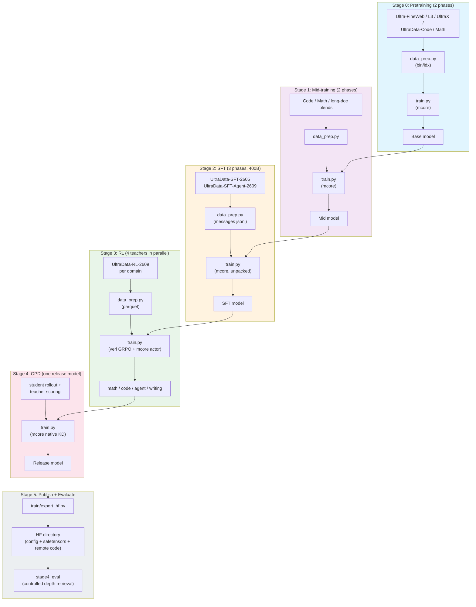
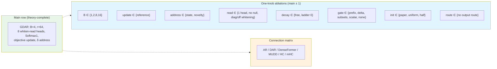

# Gated Delta Attention Residuals (GDAR) Training Recipe

A complete training pipeline for **GDAR**, a Qwen3 backbone whose residual stream is *read* and
*written* through a depth-axis gated delta rule. The recipe trains the paper's expected model (the
**main** row of the design matrix) by default, and switches to any comparison arm — plain Qwen3, the
AR / DAR / DenseFormer / MUDD / HC / mHC depth connections, or one of 20+ single-knob ablations —
with a single flag (`--model-algo`).

## Reference

| Source | What it is |
|--------|------------|
| `gdar_package` (`code/train/RECIPE.md`) | The plan this recipe implements: budgets, LR schedules, corpus blends |
| `gdar_package` (`code/models/`) | HuggingFace reference implementations of the seven variants (vendored under `models/transformers/upstream/`) |
| `gdar_package` (`code/FlagScale/**/megatron/{gdar,depth}/`) | The Megatron port the in-repo `models/megatron/` modules are ported from |
| [MINICPM5_ALIGNMENT.md](./MINICPM5_ALIGNMENT.md) | Item-by-item alignment with MiniCPM5-2B's published five-stage recipe |
| `EXPERIMENT_MATRIX.md`, `RUN_EXPERIMENTS.md`, `FIGURE_PLAN.md` | Design matrix, run book and figure plan shipped with the paper plan |

## Model Overview

GDAR adds a depth connection to a stock Qwen3 block: every sublayer *writes* its output into a
per-channel depth state with gated decay / erase, and *reads* its input back from a whitened
multi-head delta read over that state. At initialization the whole connection is bit-exactly the
plain residual stream (`GDAR(0) == Qwen3`), so every comparison starts from the same function.

| Property | Value |
|----------|-------|
| Backbone | Qwen3 dense: RMSNorm, RoPE, SwiGLU, GQA, QK-norm (all Megatron-Core native) |
| Connection | Gated delta rule on the depth axis: decay / erase / write gates, closed-form objective update, whitened multi-head read, `Softmax¬1`, λ clamp ≥ −0.5 |
| Identity | `GDAR(0) == plain Qwen3`, bit-exact (checked by `train/checks.py`: 27/27 tensors, `max|Δ logit| = 0.000e+00`) |
| Variants | 7: `gdar`, `ar`, `dar`, `denseformer`, `mudd`, `hc`, `mhc` — each aligned to its own upstream repository |
| Sizes | 0.6B / 1.7B / 4B / 8B / 14B dense, plus a 30B-A3B MoE facade; 220M / 1.04B mechanism curves |
| Stages | 6: PT (stable + decay) → Mid (2) → SFT (3) → RL (4 teachers) → OPD → eval |
| Toolkits | Megatron-Core (training + `--spec` layer specs), Megatron-Bridge (HF ↔ mcore), verl (RL), vLLM (rollout) |

### Architecture Details

| Component | Value |
|-----------|-------|
| Block granularity | `B = 4` (main row); `B = 1` per-sublayer form reported alongside |
| Low-rank budget | gate / query / key ranks `r = 64` (paper main); `r = 16` parameter-matched row |
| Read heads | 8 (whitened, with learned null source) |
| Decay parameterization | learned per-channel time constants (`decay_tau` ladder 64) + projected positivity |
| Reference geometry | `config/minicpm5_2b.yaml` — the released 2.5B geometry, back-derived field by field |

## Training Pipeline



| Stage | Purpose | Framework | Output |
|-------|---------|-----------|--------|
| [Stage 0: Pretraining](./stage0_pretrain/) | Base language ability (stable) + anneal on high-quality data (decay) | Megatron-Core | Base checkpoint |
| [Stage 1: Mid-training](./stage0_pretrain/stage2_midtrain/) | Capability strengthening (code/math) then distribution adaptation (long documents) | Megatron-Core | Mid checkpoint |
| [Stage 2: SFT](./stage1_sft/) | Deep-thinking → hybrid-thinking → agent, 400B tokens | Megatron-Core | SFT checkpoint |
| [Stage 3: RL](./stage2_rl/) | Four domain teachers in parallel (math / code / agent / writing) | verl + Megatron-Core | Per-domain teacher checkpoints |
| [Stage 4: OPD](./stage3_opd/) | Distill all teachers back into one release model | Megatron-Core (native KD) | Release checkpoint |
| [Stage 5: Publish](./train/export_hf.py) | mcore checkpoint → HuggingFace directory | Megatron-Bridge | Servable HF directory |
| [Stage 5: Eval](./stage4_eval/) | Controlled depth retrieval (T0), lm-eval, RULER | transformers / vLLM | `score.json` + benchmark tables |

## Model Algorithms (`--model-algo`)

Every stage accepts the same registry (`common.py::MODEL_ALGOS`, default
`qwen3_gdar_paper` = the paper's main row). An arm name is one row of the design matrix.

| Family | Names |
|--------|-------|
| GDAR (paper main) | `qwen3_gdar_paper` ★, `qwen3_gdar_main`, `qwen3_gdar_upstream` (bit-aligned with the upstream shensi branch: per-head whitening) |
| GDAR forms | `qwen3_gdar`, `qwen3_gdar_theory`, `qwen3_gdar_fullrank`, `qwen3_gdar_block{2,4,8,16}`, `qwen3_gdar_r16` (parameter-matched), `qwen3_gdar_noladder`, `qwen3_gdar_no_output_route` |
| Baselines | `base` (plain Qwen3), `qwen3_ar` (+`_block4`), `qwen3_dar` (+`_block4`) |
| Connection matrix | `qwen3_denseformer`, `qwen3_mudd`, `qwen3_hc`, `qwen3_mhc`, `qwen3_gated_ar` |
| Design ablations | `a1a_gate_prefix`, `a1b_gate_delta`, `a3_decay_projected`, `a4_lambda_free`, `a6_reference`, `a9_half_init`, `a9_uniform_init`, `e3_{scalar_gate,no_gate,decay_only,erase_only,write_only}` |

```bash
python train.py --model-algo base              # plain Qwen3 control arm
python train.py --model-algo qwen3_ar          # AR arm
python train.py --model-algo a14_r16           # one design-matrix row
```

Precedence: `--set train.model.spec=...` > `--model-algo` > the profile's own spec > the default
algorithm — an ablation profile can never be silently overridden by the default.

## Prerequisites

| Requirement | Notes |
|-------------|-------|
| Python environment | The repository virtualenv (`uv`-managed); Megatron-Core, Megatron-Bridge, verl and vLLM are all vendored under `3rdparty/` |
| GPU | A single GPU is enough for the tiny/debug smoke paths and the 0.6B pilot; the paper runs need a cluster |
| Tokenizer | Vendored Qwen3 (same tokenizer for every stage, `tokenizer/Qwen3-0.6B`) |
| Storage | Set `SHENSI_ROOT` (repository root) and `SHENSI_FS` (checkpoint/data/run root); both default to cluster paths |

```bash
export SHENSI_ROOT=/path/to/shensi
export SHENSI_FS=/path/to/filestorage          # ckpt / data / runs live under here
```

> **Note**: `no_gradient_accumulation_fusion: true` is set in the stage configs because this
> machine has no APEX; the RL configs carry the equivalent provider override
> (`gradient_accumulation_fusion: false`).

## Quick Start

### End-to-end (tiny paths on one GPU)

```bash
R=src/shensi/recipes/paper/gated_delta_attn_res

# Stage 0 — pretraining (mock smoke: 5 steps, tiny geometry)
python $R/stage0_pretrain/stage1_pretrain/train.py --smoke
python $R/stage0_pretrain/stage2_midtrain/train.py --dry-run

# Stage 2 — SFT (synthetic messages jsonl; no corpus needed)
python $R/stage1_sft/train.py --smoke

# Stage 3 — RL (print the verl command; 4 arms x 6 algorithm profiles)
python $R/stage2_rl/stage2_math/train.py --profile dapo --dry-run

# Stage 4 — OPD (preflight)
python $R/stage3_opd/train.py --dry-run

# Stage 5 — publish an mcore checkpoint as an HF directory, then evaluate it
python -m shensi.recipes.paper.gated_delta_attn_res.train.export_hf \
    --ckpt $SHENSI_FS/shensi/ckpt/gated_delta_attn_res/stage3_opd \
    --out  $SHENSI_FS/shensi/models/gdar-release-hf
python $R/stage4_eval/test_train.py            # generate 40 questions + score the tiny ckpt
```

### Paper runs (cluster)

```bash
R=src/shensi/recipes/paper/gated_delta_attn_res

# Stage 0: PT-1 stable -> PT-2 decay
cd $R/stage0_pretrain/stage1_pretrain
python data_prep.py --prepare                  && python train.py --tokens 9e9
python data_prep.py --prepare --blend decay.json && python train.py --profile decay --tokens 1e9 --load <PT-1>

# Stage 1: Mid-1 -> Mid-2
cd ../stage2_midtrain
python data_prep.py --prepare                  && python train.py --tokens 5e8 --load <PT-2>
python data_prep.py --prepare --blend mid2.json && python train.py --profile mid2 --tokens 3e8 --load <Mid-1>

# Stage 2: SFT-1 -> SFT-2 -> SFT-3 (400B on the flagship pair)
cd ../../stage1_sft
python data_prep.py --prepare --blend default.json
python train.py --profile geoms/qwen3_30b_a3b --tokens 2e11 --data-jsonl <sft_train.jsonl> --load <Mid-2>

# Stage 3: four RL teachers in parallel (see stage2_rl/README.md)
# Stage 4: OPD (see stage3_opd/README.md)
# Stage 5: publish + evaluate (see stage4_eval/README.md)
```

Every stage README ends with a **Run the Full Paper Experiment** block: the exact commands for
that stage's slice of the design matrix.

## Design Matrix



| Scope | Sizes | Seeds |
|-------|-------|-------|
| Architecture conclusions | 0.6B ladder (3 seeds), 1.7B / 4B / 8B / 14B (1 seed) | ≥3 at 0.6B |
| Mechanism curves | 220M / 1.04B | 1 |
| Facade | 30B-A3B MoE (does not carry architecture conclusions) | 1 |

## Throughput

- **Backbone is all Megatron-Core native**: embedding, RoPE, attention, MLP, norms, MTP,
  optimizer (including emerging Muon-style optimizers), TP/PP/CP/EP, `torch_dist` checkpoints,
  the bin/idx data pipeline. The model attaches through the official `--spec` layer-spec
  extension point.
- **The only bespoke operator is the connection itself** (`models/megatron/gdar_connection.py`),
  wrapped inside an mcore `TransformerLayer`; the sublayers it wraps are built by
  `get_gpt_layer_local_submodules`, i.e. identically to the plain model.
- **`config/perf.yaml`** switches the backbone to TransformerEngine with the three fusions that
  are verified to work here (bias SwiGLU, bias GeLU, gradient accumulation). `masked_softmax`
  (needs APEX) and `persist_layer_norm` (unsupported by torch LayerNorm) stay off — both are
  measured failures, see `LIMITATIONS.md` A5.
- Local path is the bit-exactness baseline (`GDAR(0) == Qwen3` exactly); TE path is the
  throughput path and matches at bf16 rounding (`max|Δ logit| = 9.8e-3`).

## Verification

Everything below was run in this repository; the numbers are reproducible from the commands in
`LIMITATIONS.md`.

| Check | Command | Result |
|-------|---------|--------|
| Identity / forward / gradient flow | `python -m ...train.checks` | 27/27 tensors bit-identical, `max|Δ logit| = 0.000e+00` |
| HF reference units | `models/transformers/test_{theory,ablation_switches,autoclass}.py` | 58/58, 64/64, 42/42 |
| Upstream alignment | `python models/transformers/test_upstream_alignment.py` | 13/13 (AR / MUDD / DenseFormer bit-exact; GDAR per-head bit-exact) |
| Stage integration (PT / Mid / SFT / OPD) | `python <stage>/test_train.py` | rc=0, last iteration reached, `[after training is done]`, no tracebacks |
| verl path (bridge, weights, rollout sync) | `python -m ...stage2_rl.test_gdar_bridge` | 12/12 (dispatch, spec, load, HF parity `2.4e-07`, export bit-identical) |
| Weight table round trip | `python -m ...stage2_rl.convert.test_convert_tiny` | 80/80 tensors bit-exact |
| RL algorithms | `python stage2_rl/stage2_math/train.py --dry-run` | 4 arms × 6 profiles = 24 dry-runs green |
| vLLM rollout | `python -m ...models.vllm.smoke_generate --all` | 7/7 variants, token-identical with the transformers reference (lcp = 16/16) |
| Publish + evaluate | `train/export_hf.py` then `stage4_eval/run_depth_retrieval.py` | HF dir loads with `trust_remote_code`, 40 questions scored in ~3 s, `chance = 0.25` |
| Early stopping | any stage with `--early-stop 0` | watchdog SIGTERMs the run, writes a report, launcher returns 0 (success) |
| Formatting | `ruff check` / `ruff format --check` | clean |

## Limitations

`LIMITATIONS.md` carries the full list in the form *problem → disposition → evidence*, including
the solved items (early stopping defaults, fusion truth, OPD reverse KL, the verl bridge, the
attention-geometry fixes) and the open ones (`opd_reward.py`, GSPO, MoE CLI knobs, cluster runs,
fused connection kernels).

## Stage Documentation

- [Stage 0: Pretraining](./stage0_pretrain/README.md) — stable + decay, corpus blends, LR schedules
- [Stage 0.1: PT](./stage0_pretrain/stage1_pretrain/README.md) — PT-1 / PT-2 profiles and full matrix
- [Stage 0.2: Mid-training](./stage0_pretrain/stage2_midtrain/README.md) — capability + distribution phases
- [Stage 1: SFT](./stage1_sft/README.md) — deep-thinking / hybrid / agent phases
- [Stage 2: RL](./stage2_rl/README.md) — four teachers, six algorithm profiles, the verl bridge
- [Stage 3: OPD](./stage3_opd/README.md) — on-policy distillation into the release model
- [Stage 4: Eval](./stage4_eval/README.md) — controlled depth retrieval and the publish step
- [Models: HF reference](./models/transformers/README.md) — the seven HF implementations
- [Models: vLLM rollout](./models/vllm/README.md) — engine registration and the depth bridge

## Further Reading

- [LIMITATIONS.md](./LIMITATIONS.md) — every known limitation with evidence and upgrade path
- [MINICPM5_ALIGNMENT.md](./MINICPM5_ALIGNMENT.md) — alignment with MiniCPM5-2B's public recipe
- [train/export_hf.py](./train/export_hf.py) — checkpoint publishing (mcore → HuggingFace)
- [stage2_rl/gdar_bridge.py](./stage2_rl/gdar_bridge.py) — the verl/Megatron-Bridge registration
