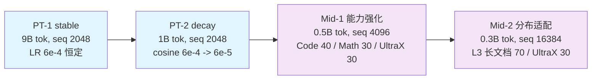

# 阶段 0：预训练 + 中训练

建立基础语言模型：先两段预训练（stable → decay），再两段中训练（能力强化 → 分布适配）。
语料全部来自同步开源的 Ultra-FineWeb / Ultra-FineWeb-L3 / UltraX / UltraData-Code /
UltraData-Math，配比 json 在各子 stage 的 `config/data_prep/` 下。

这一大段对**所有模型算法是同一份**——`--model-algo` 的架构对比只有在所有臂看到完全相同的数据、
计划和预算时才干净。

## 总览

| 组件 | 说明 |
|---|---|
| [`stage1_pretrain/`](./stage1_pretrain/) | PT-1 stable + PT-2 decay（0.6B 档 9B + 1B tokens） |
| [`stage2_midtrain/`](./stage2_midtrain/) | Mid-1 能力强化（0.5B）+ Mid-2 长文档（0.3B） |



## 段位设计（为什么是 2 + 2）

| 段 | 命令 | tokens | seq | LR | 配比 | 目的 |
|---|---|---|---|---|---|---|
| PT-1 stable | `stage1_pretrain`（default） | 9B（90%） | 2048 | 6e-4 **恒定**（WSD 的 stable），warmup 2% | Ultra-FineWeb(en+zh) 85% + Code 10% + Math 5% | 基础语言能力；恒定 LR 让稳定性读数干净 |
| PT-2 decay | `stage1_pretrain --profile decay` | 1B（10%） | 2048 | cosine 6e-4 → 6e-5 | ≥50% 高质量：UltraX 30% + Ultra-FineWeb-L3 40% + Code 15% + Math 15% | 高质量子集上的退火（Nemotron/GLM 的 decay 口径） |
| Mid-1 能力强化 | `stage2_midtrain`（default） | 0.5B（5%） | 4096 | 6e-5 **恒定**（10% 峰值），warmup 1% | Code 40% + Math 30% + UltraX 30% | 序列加长 + 目标能力 |
| Mid-2 分布适配 | `stage2_midtrain --profile mid2` | 0.3B（3%） | 16384 | cosine 6e-5 → 3e-5 | Ultra-FineWeb-L3 长文档 70% + UltraX 30% | SFT 之前先适配长文档分布 |

设计依据：

- **预训练分两段**是最小实现的"逐级推进"：stable 段固定架构对比的读数，decay 段把最后 10%
  花在高质量数据上。所有臂跑**同一套**两段。
- **中训练分两段**是把"能力"与"分布"分开：第二段同时动长文档占比、序列长度和 LR 尾巴，
  之所以可以这样做，是因为第一段已经把能力搬过去了。
- **峰值 LR 6e-4** 是 `RECIPE.md` §3 给 0.6B 档的先验；论文主跑前先用 {3e-4, 6e-4, 1e-3}
  各跑约 2000 步 pilot 校准。
- **接续**：PT-2 从 PT-1 起，Mid-1 从 PT-2 起，Mid-2 从 Mid-1 起（`--load <ckpt>`）。
  每段都默认带早停看门狗。

## 快速开始

```bash
R=src/shensi/recipes/paper/gated_delta_attn_res

cd $R/stage0_pretrain/stage1_pretrain
python data_prep.py --prepare                        # PT-1 混合 → bin/idx（Qwen3 tokenizer）
python train.py --tokens 9e9                         # PT-1 stable
python data_prep.py --prepare --blend decay.json     # PT-2 高质量混合
python train.py --profile decay --tokens 1e9 --load <PT-1 ckpt>

cd ../stage2_midtrain
python data_prep.py --prepare                        # Mid-1 混合
python train.py --tokens 5e8 --load <PT-2 ckpt>
python data_prep.py --prepare --blend mid2.json      # Mid-2 长文档混合
python train.py --profile mid2 --tokens 3e8 --load <Mid-1 ckpt>
```

## 各子 stage 文档

- [阶段 0.1：预训练](./stage1_pretrain/README.md) —— PT-1 / PT-2 档位、完整设计矩阵命令块、吞吐档
- [阶段 0.2：中训练](./stage2_midtrain/README.md) —— Mid-1 / Mid-2 档位、8B 与 30B-A3B 中训练块

## 延伸阅读

- [配方总 README](../README.md) —— 管线总览、`--model-algo` 注册表、规模阶梯
- [LIMITATIONS.md](../LIMITATIONS.md) —— 早停、融合真因、已知注意点
