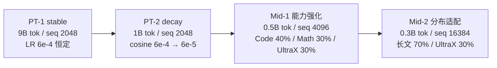
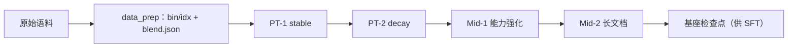

# 阶段 0：预训练与中训练

语言建模能力的底座：预训练两档（stable → decay）之后接中训练两档（能力强化 → 长文档适配）。
四档共用同一套几何、同一份 tokenizer 与同一批语料；配比文件在各子段自己的
`config/data_prep/data_blend_*.json`。

这一大段对**所有模型算法是同一份**：架构对比只有在所有臂看到相同数据、相同计划时才干净。

## 总览

| 组件 | 说明 |
|---|---|
| [`stage1_pretrain/`](./stage1_pretrain/) | PT-1 stable + PT-2 decay |
| [`stage2_midtrain/`](./stage2_midtrain/) | Mid-1 能力强化 + Mid-2 长文档适配 |
| `train.py` / `data_prep.py` | 段级派发：`--stage stage1_pretrain\|stage2_midtrain` |
| `config/{default,tiny}.yaml` | 本段的执行计划（子段顺序与各自配置） |

段间关系与预算：



## 段位设计（为什么 2 + 2）

| 段 | 配置 | tokens | seq | LR | 配比（按角色） | 目的 |
|---|---|---|---|---|---|---|
| PT-1 stable | `stage1_pretrain/config/default.yaml` | 9B（90%） | 2048 | 6e-4 **恒定**，warmup 2% | 中英网页 85% + 代码 10% + 数学 5% | 基础语言能力；恒定 LR 让稳定性读数干净 |
| PT-2 decay | `stage1_pretrain/config/decay.yaml` | 1B（10%） | 2048 | cosine 6e-4 → 6e-5 | 精选长文 40% + 高质量子集 30% + 代码 15% + 数学 15% | 高质量子集上的退火 |
| Mid-1 能力强化 | `stage2_midtrain/config/default.yaml` | 0.5B（5%） | 4096 | 6e-5 恒定，warmup 1% | 代码（L2/L3 分级）40% + 数学 30% + 高质量子集 30% | 升长度 + 目标能力 |
| Mid-2 分布适配 | `stage2_midtrain/config/mid2.yaml` | 0.3B（3%） | 16384 | cosine 6e-5 → 3e-5 | 长文 70% + 高质量子集 30% | 为 SFT 的长序列打底 |

- 分两段是"逐级推进"的最小实现：stable 段固定架构对比的读数，decay 段把最后 10% 花在
  高质量子集上；中训练同理，先把代码/数学能力加权练起来，再调长序列分布。
- 各档的 token 数、LR 计划、序列长都在对应 `config/*.yaml` 里显式写死，不靠默认值。

## 快速开始

```bash
cd src/shensi/recipes/paper/gated_delta_attn_res/stage0_pretrain/stage1_pretrain

# 冒烟：tiny 几何 + mock 数据 + 5 步
python train.py --smoke

# PT-1 stable
python data_prep.py --prepare --config default
python train.py --config default --tokens 9e9

# PT-2 decay
python data_prep.py --prepare --config decay
python train.py --config decay --tokens 1e9 --load <PT-1 检查点>

# 中训练（在 stage2_midtrain 下）
cd ../stage2_midtrain
python data_prep.py --prepare --config default && python train.py --config default --tokens 5e8 --load <PT-2 检查点>
python data_prep.py --prepare --config mid2   && python train.py --config mid2   --tokens 3e8 --load <Mid-1 检查点>
```

## 数据准备

```bash
python data_prep.py --discover --config default   # 只看数据面貌，不产出
python data_prep.py --prepare --config default    # 产出 bin/idx + blend.json
```

- 输入：`$SHENSI_FS` 下的原始语料（网页、代码、数学、长文四类角色）；
- 配比：`config/data_prep/data_blend_{raw,decay,mid2,tiny}.json`（按数据集列清单与权重）；
- 输出：`$SHENSI_FS/shensi/data/gated_delta_attn_res/<子段>/`（`blend.json` + `*_text_document.bin/.idx`）。

## 训练

| 档 | 说明 |
|---|---|
| `config/default.yaml` | 生产档（PT-1 stable / Mid-1） |
| `config/decay.yaml` | PT-2 退火档（余弦退火、10% 预算） |
| `config/mid2.yaml` | Mid-2 长文档档（序列变长到 16K） |
| `config/geoms/*.yaml` | 几何档：规模阶梯（1.7B/4B/8B/14B/30B-A3B）与机制曲线档（0.22B/1.04B），PT/Mid/SFT 共享一份 |
| `config/{ar,dar,gdar}.yaml` | 对照臂入口档（只换连接算子） |
| `config/ablations/*.yaml` | 设计矩阵的消融档（逐旋钮） |
| `config/tiny.yaml` / `debug.yaml` | 冒烟档 / 真数据小档 |

覆盖示例：

```bash
python train.py --config geoms/qwen3_1p04b --tokens 2e10          # 1.04B 机制曲线档
python train.py --model-algo qwen3_ar --config default --dry-run  # 对照臂
python train.py --set train.model.global_batch_size=64 --dry-run  # 点号覆写
```

**早停默认开着**：步数给到无限大，`lm loss value` 平台后看门狗按成功收尾
（`--early-stop N` 调耐心，`--no-early-stop` 关）。

## 产物流转



## 判据

| 项 | 命令 | 结果 |
|---|---|---|
| 冒烟 | `python train.py --smoke` | 5 步跑通、检查点落盘 |
| 集成测试 | `python stage1_pretrain/test_train.py`、`stage2_midtrain/test_train.py` | rc=0、到最后一 iter、正常收尾 |
| 早停看门狗 | 任一档加 `--early-stop 0` | SIGTERM 收尾、写 `early_stop.json`、按成功返回 |

## 下一步

- 预训练档细节：[stage1_pretrain/README.md](./stage1_pretrain/README.md)
- 中训练档细节：[stage2_midtrain/README.md](./stage2_midtrain/README.md)
- 下一段：[阶段 1：SFT](../stage1_sft/README.md)
