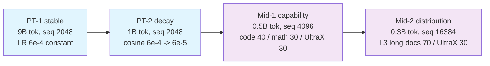

# Stage 0: Pretraining and Mid-training

Build the base language model: a two-phase pretraining run (stable → decay) followed by a
two-phase mid-training run (capability strengthening → distribution adaptation). The corpus comes
exclusively from the open Ultra-FineWeb / Ultra-FineWeb-L3 / UltraX / UltraData-Code /
UltraData-Math releases; the blends are the JSON files under each sub-stage's `config/data_prep/`.

This stage is the same for **every** model algorithm — the architecture comparison (`--model-algo`)
is only clean if all arms see exactly the same data, schedule and budget.

## Overview

| Component | Description |
|-----------|-------------|
| [`stage1_pretrain/`](./stage1_pretrain/) | PT-1 stable + PT-2 decay (9B + 1B tokens at the 0.6B scale) |
| [`stage2_midtrain/`](./stage2_midtrain/) | Mid-1 capability (0.5B) + Mid-2 long documents (0.3B) |



## Segment Design (why 2 + 2)

| Segment | Command | Tokens | Seq | LR | Blend | Purpose |
|---------|---------|--------|-----|----|-------|---------|
| PT-1 stable | `stage1_pretrain` (default) | 9B (90%) | 2048 | 6e-4 **constant** (WSD stable), 2% warmup | Ultra-FineWeb (en+zh) 85% + Code 10% + Math 5% | Base language ability; constant LR keeps the stability reading clean |
| PT-2 decay | `stage1_pretrain --profile decay` | 1B (10%) | 2048 | cosine 6e-4 → 6e-5 | ≥50% high quality: UltraX 30% + Ultra-FineWeb-L3 40% + Code 15% + Math 15% | Anneal on the high-quality subset (Nemotron/GLM decay recipe) |
| Mid-1 capability | `stage2_midtrain` (default) | 0.5B (5%) | 4096 | 6e-5 **constant** (10% peak), 1% warmup | Code 40% + Math 30% + UltraX 30% | Longer sequences + target capabilities |
| Mid-2 distribution | `stage2_midtrain --profile mid2` | 0.3B (3%) | 16384 | cosine 6e-5 → 3e-5 | Ultra-FineWeb-L3 long documents 70% + UltraX 30% | Adapt to long-document distribution before SFT |

Design notes:

- **Two pretraining phases** are the minimal "progressive" schedule: stable fixes the architecture
  comparison, decay spends the last 10% on high-quality data. All arms run the *same* two phases.
- **Two mid-training phases** separate capability from distribution: phase 2 changes long-document
  share, sequence length and LR tail at once, which is only acceptable because phase 1 already
  moved the capabilities.
- **Peak LR 6e-4** is the 0.6B prior from `RECIPE.md` §3; pilot {3e-4, 6e-4, 1e-3} for ~2,000
  steps each before the paper run.
- **Continuation**: PT-2 loads PT-1, Mid-1 loads PT-2, Mid-2 loads Mid-1 (`--load <ckpt>`).
  Every stage runs with the early-stop watchdog on by default.

## Quick Start

```bash
R=src/shensi/recipes/paper/gated_delta_attn_res

cd $R/stage0_pretrain/stage1_pretrain
python data_prep.py --prepare                        # PT-1 blend -> bin/idx (Qwen3 tokenizer)
python train.py --tokens 9e9                         # PT-1 stable
python data_prep.py --prepare --blend decay.json     # PT-2 high-quality blend
python train.py --profile decay --tokens 1e9 --load <PT-1 ckpt>

cd ../stage2_midtrain
python data_prep.py --prepare                        # Mid-1 blend
python train.py --tokens 5e8 --load <PT-2 ckpt>
python data_prep.py --prepare --blend mid2.json      # Mid-2 long-document blend
python train.py --profile mid2 --tokens 3e8 --load <Mid-1 ckpt>
```

## Stage Documentation

- [Stage 0.1: Pretraining](./stage1_pretrain/README.md) — PT-1 / PT-2 profiles, the full design
  matrix command block, throughput profiles
- [Stage 0.2: Mid-training](./stage2_midtrain/README.md) — Mid-1 / Mid-2 profiles, the 8B and
  30B-A3B mid-training block

## Further Reading

- [Recipe README](../README.md) — pipeline overview, `--model-algo` registry, scale ladder
- [LIMITATIONS.md](../LIMITATIONS.md) — early stopping, fusion truth, known caveats
