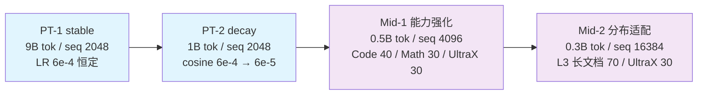

# 阶段 0：预训练 + 中训练

建立基础语言模型：预训练两段（stable → decay）之后接中训练两段（能力强化 → 长文档适配）。
四段共用同一套几何、同一份 tokenizer 与同一批公开语料（Ultra-FineWeb / Ultra-FineWeb-L3 /
UltraX / UltraData-Code / UltraData-Math），配比文件在各子 stage 的
`config/data_prep/data_blend_*.json`。

这一大段对**所有模型算法是同一份**：架构对比只有在所有臂看到相同数据、相同计划时才干净。

## 概览

| 组件 | 说明 |
|---|---|
| [`stage1_pretrain/`](./stage1_pretrain/) | PT-1 stable + PT-2 decay |
| [`stage2_midtrain/`](./stage2_midtrain/) | Mid-1 能力强化 + Mid-2 长文档 |
| `train.py` / `data_prep.py` | 段级派发：`--stage stage1_pretrain\|stage2_midtrain` |
| `common/` | 两段共用的训练入口与 bin/idx 语料准备 |
| `config/{default,tiny}.yaml` | 本段的执行计划（子 stage 顺序与各自配置） |



## 段位设计（为什么 2 + 2）

| 段 | 配置 | tokens | seq | LR | 配比 | 目的 |
|---|---|---|---|---|---|---|
| PT-1 stable | `stage1_pretrain/config/default.yaml` | 9B（90%） | 2048 | 6e-4 **恒定**，warmup 2% | Ultra-FineWeb(en+zh) 85% + Code 10% + Math 5% | 基础语言能力；恒定 LR 让稳定性读数干净 |
| PT-2 decay | `stage1_pretrain/config/decay.yaml` | 1B（10%） | 2048 | cosine 6e-4 → 6e-5 | UltraX 30% + L3 40% + Code 15% + Math 15% | 高质量子集上的退火 |
| Mid-1 能力强化 | `stage2_midtrain/config/default.yaml` | 0.5B（5%） | 4096 | 6e-5 恒定，warmup 1% | Code 40% + Math 30% + UltraX 30% | 升长度 + 目标能力 |
| Mid-2 分布适配 | `stage2_midtrain/config/mid2.yaml` | 0.3B（3%） | 16384 | cosine 6e-5 → 3e-5 | L3 长文档 70% + UltraX 30% | 为 SFT 的长序列打底 |

- 预训练分两段是"逐级推进"的最小实现：stable 段固定架构对比的读数，decay 段把最后 10% 花在
  高质量数据上；两段对**所有臂**相同。
- 中训练分两段是把"能力"与"分布"分开：第二段同时动长文档占比、序列长度与 LR 尾巴，
  之所以可以这样做，是因为第一段已经把能力搬过去了。
- 峰值 LR 6e-4 是 0.6B 档的先验，正式跑前用 {3e-4, 6e-4, 1e-3} 各 ~2000 步 pilot 校准。
- 接续：PT-2 从 PT-1 起，Mid-1 从 PT-2 起，Mid-2 从 Mid-1 起（`--load <ckpt>`）。
- **早停默认开**：四段的步数都给到无限大，loss 平台后由看门狗收尾，按成功计。

## 快速开始

```bash
R=src/shensi/recipes/paper/gated_delta_attn_res

cd $R/stage0_pretrain/stage1_pretrain
python data_prep.py --prepare --config tiny            # 小样本，几分钟出真实 bin/idx
python train.py --config default --tokens 9e9          # PT-1
python train.py --config decay --tokens 1e9 --load <PT-1 ckpt>

cd ../stage2_midtrain
python train.py --config default --tokens 5e8 --load <PT-2 ckpt>
python train.py --config mid2 --tokens 3e8 --load <Mid-1 ckpt>
```

段级派发（等价写法）：

```bash
python $R/stage0_pretrain/train.py --stage stage2_midtrain --config mid2 --tokens 3e8
python $R/stage0_pretrain/data_prep.py --stage stage1_pretrain --prepare --config tiny
```

## 数据准备

| 项 | 说明 |
|---|---|
| 输入 | `$SHENSI_FS/datasets/llm/pre-training/<name>/`（jsonl/parquet，多源按配比采样） |
| 配比 | `config/data_prep/data_blend_raw.json`（生产）、`data_blend_tiny.json`（冒烟）、`data_blend_{decay,mid2}.json`（后段） |
| 参数 | `config/data_prep/{default,tiny}.yaml`：`blend` / `limit` / `workers` / `only` / `data_dir` |
| 输出 | `$SHENSI_FS/shensi/data/gated_delta_attn_res/<stage>/`：`*_text_document.bin/.idx` + `blend.json` |
| 只看数据面貌 | `python data_prep.py --discover --config tiny` |

## 训练

```bash
python train.py --config default --tokens 9e9 --model-algo qwen3_gdar_paper
```

| 参数 | 说明 |
|---|---|
| `--config <名字或路径>` | 配置文件（`config/default.yaml`、`config/decay.yaml`、`config/geoms/qwen3_8b.yaml` …） |
| `--model-algo <名字>` | 连接 / 基线（默认 `qwen3_gdar_paper`；`base` = plain Qwen3） |
| `--tokens N` / `--load <ckpt>` | token 预算 / 接续 ckpt |
| `--set k=v` | 点号覆写（`train.model.seq_length=16384` …） |
| `--smoke` / `--dry-run` | tiny 5 步 / 只打印命令 |
| `--no-early-stop`、`--early-stop N` | 关看门狗 / 调耐心 |

## 判据

| 检查 | 命令 | 判据 |
|---|---|---|
| 集成测试 | `python <stage>/test_train.py` | tiny 5 步：rc=0、到最后一 iter、`[after training is done]`、无 Traceback |
| 离线校验 | `python -m ...train.checks` | 恒等 27/27 逐位、参数开销表、梯度流 |
| 冒烟 | `python <stage>/train.py --smoke` | 同集成测试判据 |

## 跑完整论文实验

架构结论只由这一大段承担：全部变体 × 规模阶梯，0.6B 三 seed、其余单 seed。

```bash
cd stage0_pretrain/stage1_pretrain
python data_prep.py --prepare --config default
python data_prep.py --prepare --config decay

ARMS="base qwen3_ar_block4 qwen3_dar_block4 qwen3_denseformer qwen3_mudd qwen3_hc qwen3_mhc \
      qwen3_realformer qwen3_gdar_paper qwen3_gdar_theory qwen3_gdar_upstream qwen3_gdar_block2 \
      qwen3_gdar_block8 qwen3_gdar_r16 qwen3_gdar_noladder qwen3_gdar_no_output_route \
      a1a_gate_prefix a1b_gate_delta a3_decay_projected a4_lambda_free a6_reference \
      a9_half_init a9_uniform_init"
for seed in 0 1 2; do for algo in $ARMS; do
  python train.py --config default --model-algo $algo --tokens 1e10 \
      --set experiment.seed=$seed --set experiment.exp_dir=$SHENSI_FS/shensi/runs/pt06/$algo-s$seed
  python train.py --config decay --model-algo $algo --tokens 1e9 \
      --load $SHENSI_FS/shensi/runs/pt06/$algo-s$seed/ckpt --set experiment.seed=$seed
done; done

# 规模阶梯（单 seed）：1.7B / 4B / 8B / 14B + 30B-A3B 门面
for size in qwen3_1p7b qwen3_4b qwen3_8b qwen3_14b; do for algo in base qwen3_ar_block4 qwen3_dar_block4 qwen3_gdar_main; do
  python train.py --config geoms/$size --model-algo $algo --tokens <预算>
done; done

# 机制曲线：220M / 1.04B（config/geoms/qwen3_0p22b.yaml / qwen3_1p04b.yaml；
#   A/B 与多 seed 用 cluster/b5_mechanism_ab.py，长上下文用 cluster/b5_longctx.py）
```

## 索引

- [阶段 0.1：预训练](./stage1_pretrain/README.md) —— PT-1 / PT-2 档位与完整矩阵
- [阶段 0.2：中训练](./stage2_midtrain/README.md) —— 能力强化与长文档
- [配方 README](../README.md) —— 管线总览与 `--model-algo` 注册表
