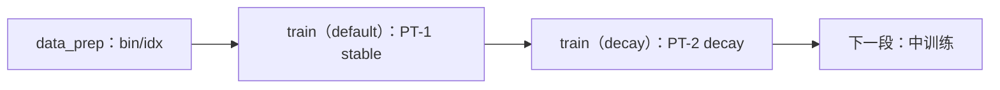

# 阶段 0.1：预训练（PT-1 stable → PT-2 decay）

PT-1 用恒定学习率建立语言能力并给出干净的稳定性读数；PT-2 在高质量子集上退火收尾，从 PT-1 接续。
所有模型算法跑同一份配方——这正是架构对比干净的前提。

## 总览

| 组件 | 说明 |
|---|---|
| `data_prep.py` | 配比 json → 训练用的 bin/idx（`--discover` 只看面貌） |
| `train.py` | 训练入口 |
| `test_train.py` | 集成测试：tiny 几何 5 步并按日志判定 |
| `config/` | `default`、`decay`、`perf`、`tiny`、`debug`、`geoms/*`、`ablations/*` |
| `../train.py` / `../data_prep.py` | 段级派发入口（`--stage stage1_pretrain`） |

## 档位

| 档 | 是什么 |
|---|---|
| `default` | PT-1 stable：9B tokens(90%) / seq 2048 / LR 6e-4 **恒定** / warmup 2%；0.6B 几何就在这一档 |
| `decay` | PT-2 decay：1B tokens(10%) / seq 2048 / cosine 6e-4 → 6e-5 / `data_blend_decay.json` |
| `perf` | 吞吐档：TransformerEngine 骨干 + 三个实测可用的融合 |
| `debug` | 极小几何（4 层 / 256 hidden / seq 512）+ 真实 bin/idx |
| `tiny` | mock 冒烟档（`--smoke` 用） |
| `geoms/qwen3_{1p7b,4b,8b,14b,30b_a3b}.yaml` | 规模阶梯；跨段共享（Mid / SFT 也指得到） |
| `geoms/qwen3_0p22b.yaml` / `qwen3_1p04b.yaml` | 机制曲线的两端（约 214M / 1.04B 非嵌入参数）；短预算、多臂、多 seed 用它 |
| `ablations/*` | 设计矩阵与门结构消融行（自带层规格） |

## 快速开始

```bash
python data_prep.py --discover --config tiny      # 看数据面貌
python data_prep.py --prepare --config default    # 生产配比 → bin/idx
python train.py --smoke                           # tiny 5 步
python train.py --config default --tokens 9e9     # PT-1
python train.py --config decay --tokens 1e9 --load <PT-1 检查点>
python test_train.py                              # 集成测试
```

## 数据准备

| 项 | 说明 |
|---|---|
| 输入 | `$SHENSI_FS/datasets/llm/pre-training/<名字>/` |
| 配比 | `config/data_prep/data_blend_{raw,tiny,decay}.json` |
| 参数 | `config/data_prep/{default,tiny}.yaml`（`blend` / `limit` / `workers` / `only` / `data_dir`） |
| 输出 | `$SHENSI_FS/shensi/data/gated_delta_attn_res/stage1_pretrain/`（bin/idx + `blend.json`，训练自动读取） |

## 训练

| 参数 | 说明 |
|---|---|
| `--config <名字或路径>` | `default` / `decay` / `perf` / `geoms/qwen3_8b` … |
| `--model-algo <名字>` | 连接 / 基线（默认主行；`base` = plain Qwen3） |
| `--tokens N` | token 预算 → `train_iters`（按 global batch × seq 换算） |
| `--load <检查点>` | 接续（PT-2 或更后面的段） |

吞吐：默认 local 实现（逐位恒等验收基线）；集群主跑切
`--set train.model.transformer_impl=transformer_engine`（TE 骨干 + `perf` 档里的三个融合）。
local 下 GDAR 每步约为 plain Qwen3 的 2.2×（连接算子尚无融合内核）。

## 判据

| 检查 | 判据 |
|---|---|
| `python test_train.py` | tiny 5 步：rc=0、到最后一 iter、`[after training is done]`、无 Traceback |
| `python -m shensi.recipes.paper.gated_delta_attn_res.common.train.checks` | 恒等 27/27 逐位、`max\|Δ logit\| = 0.000e+00`、参数开销与梯度流符合预期 |

## 产物流转与下一步



- [阶段 0 总览](../README.md) —— 2+2 段位设计与依据
- [中训练](../stage2_midtrain/README.md) —— 从 PT-2 接续的下一段
