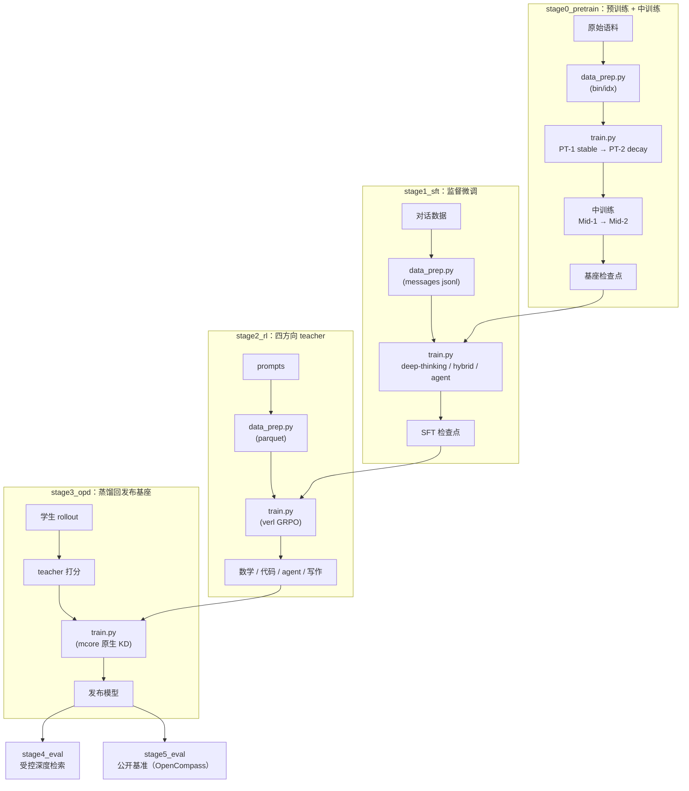

# Looma 训练配方：块不动点 + 深度轴门控 delta 规则

把 Llama 的每一层变成一个 **block**：块把交给它的流存成"一行"，把层内映射反复迭代到不再移动，
停下来的那个点就是块与块之间的边界。残差位置换成**深度轴上的门控 delta 规则**——decay / erase /
write 三个门 + 闭式解更新 + 白化 Softmax₁ 读，读的候选是"已经贴出的行 + 本块写入前的流"。
骨干保持在 Llama 几何上，只换深度连接与求解器，所以同规模内的比较是干净的：同 tokenizer、
同数据顺序、同 seed、同超参，只差 `train.model.spec` 这一处。

## 模型概述

| 项目 | 值 |
|---|---|
| 骨干 | Llama（GQA + SwiGLU + RoPE + RMSNorm，无 qk norm） |
| 深度连接 | 门控 delta 规则：deviation scales + 逐通道时间常数阶梯 + 白化多读头 Softmax₁ |
| 层内求解 | 固定点迭代：上界 8 次、相对残差 1e-2、一步 phantom 梯度 |
| 训练段 | 5（预训练 → 中训练 → SFT → RL → OPD）+ 评测 |
| 模型实现 | 三份互为镜像：HuggingFace 参考 / Megatron-Core 训练件 / vLLM 原生件 |

### 架构细节

| 组件 | 值 |
|---|---|
| 几何（默认档） | 7 层 / hidden 2048 / ffn 6144 / 16 heads / 2 KV / head_dim 128 / RoPE θ=5e6 |
| 几何出处 | 与 MiniCPM5-2B 的 `config.json` 一致，只把 `num_hidden_layers` 改成 7 |
| 词表 | 130,560（同一份 tokenizer，全链路统一） |
| 上下文 | `max_position_embeddings` 131,072；训练序列长按段递增（2048 → 8192 → 32768） |
| 块状态 | `stream`、`prefix` 与其行银行（每块一行，宽度逐层增长） |
| 连接投影 | 门 / 查询 / 地址三处低秩对，rank 64 |
| 读头 | 8（每头独立白化协方差，Softmax₁ 留出空路由） |
| 时间常数 | 逐通道几何阶梯，顶端 `log(2L)` |
| 注意力 K/V | 块内冻结：首轮投出，后续迭代只移动 query |
| 优化器 | AdaMuon（矩阵腿）+ AdEMAMix（标量腿），共用一条 LR 曲线 |

### 关键性质

- **初始化即恒等**：连接在零点处恰为 `norm(prefix + delta) × weight`，与 Llama 的 pre-norm 逐位相同；
  四个 deviation scale 是唯一的逃逸口，梯度按 scale → 门 → 读投影逐级放活。
- **训练与推理同源**：mcore 训练件与 vLLM 推理件共用同一份连接算子（逐位对拍见下）。
- **深度状态不需要引擎缓存**：块状态逐 token 重建，只有 K/V 走 paged cache。
- **层数少但每层更贵**：块内迭代把算力花在深度上，所以默认档 7 层就能撑起对比实验。

## 训练流水线



| 段 | 做什么 | 产出 |
|---|---|---|
| [stage0_pretrain](./stage0_pretrain/) | 预训练（stable → decay）+ 中训练（能力强化 → 长文档适配） | 基座检查点 |
| [stage1_sft](./stage1_sft/) | 监督微调（deep-thinking → hybrid → agent） | 指令模型 |
| [stage2_rl](./stage2_rl/) | 四方向 RL teacher（数学 / 代码 / agent / 写作） | 四个 teacher |
| [stage3_opd](./stage3_opd/) | 把 teacher 蒸馏回发布基座（on-policy 蒸馏） | 发布模型 |
| [stage4_eval](./stage4_eval/) | 受控深度检索评测（chance / Wilson / 位置偏差） | 分数 |
| [stage5_eval](./stage5_eval/) | 公开基准评测（vLLM 端点 + OpenCompass；工具类走 harness） | 分数 |

## 目录约定

只有**一个** `common/`，stage 目录里只放这一段自己的东西：

```text
looma/
├── common/                          所有 stage 以外的东西
│   ├── paths.py  algos.py  config.py  runner.py  rl.py
│   ├── prep.py  prep_sft.py  prep_rl.py  train_pt.py  train_sft.py  launch_rl.py
│   ├── models/transformers/         HF 参考实现（评测/导出/转换的基准）
│   ├── models/megatron/             mcore 训练件（--spec 预设 + 逐位对拍测试）
│   ├── models/vllm/                 引擎原生件（rollout/评测）+ 登记 + tiny ckpt
│   ├── train/                       训练入口 / 数据 provider / 导出 / KD 方向
│   └── tokenizer/MiniCPM5-2B/       自带分词器（全链路统一）
├── stage0_pretrain/
│   ├── stage1_pretrain/             __init__.py · data_prep.py · train.py · config/ · README
│   └── stage2_midtrain/             同上（中训练两段）
├── stage1_sft/{config,...}          data_prep.py · train.py · config/
├── stage2_rl/
│   ├── looma_bridge.py              verl 的 Megatron 后端 ↔ 检查点（导入即注册）
│   ├── test_looma_bridge.py         闸门：注册 → 装载零缺键 → 与 HF 单步对拍
│   ├── harness_tool.py · config/tools/harness.yaml
│   └── stage2_{math,code,agent,writing}/
├── stage3_opd/                      data_prep / rollout / score / train
├── stage4_eval/                     受控检索的生成器与评分器
└── stage5_eval/                     eval.py · opencompass_eval.py · benchmarks.py · setup_env.sh
```

## 前置条件

| 项 | 要求 |
|---|---|
| Python | 仓库 venv（`.venv`：torch / megatron-core / transformers / verl / vLLM） |
| GPU | 单卡可跑冒烟与 debug 档；多卡按配置里的 `experiment.runner.nproc_per_node` 调 |
| 文件系统 | `SHENSI_FS` 指到数据/产物根（默认 `/root/work/filestorage`） |
| 语料 | `SHENSI_FS` 下的原始语料与 post-training 数据；先 `data_prep.py --discover` 看面貌 |
| 分词器 | 自带 `common/tokenizer/MiniCPM5-2B`；`SHENSI_LOOMA_TOKENIZER` 可覆盖 |
| 评测 | OpenCompass 装在独立 venv（`bash stage5_eval/setup_env.sh` 会装）；agent 类基准要 dsh |

产物位置（`common/config.py` 按 stage 与 profile 强制赋值）：

```text
${SHENSI_FS}/shensi/
├── data/looma/<stage>/         bin/idx、blend.json、messages jsonl、RL parquet
├── runs/looma/<stage>/<profile>/{config.yaml,run.sh,logs/}
└── ckpt/looma/<stage>/<profile>/
```

## 快速开始

```bash
cd src/shensi/recipes/paper/looma

# ① 冒烟：tiny 几何 + mock 数据 + 5 步（不碰语料）
cd stage0_pretrain/stage1_pretrain && python train.py --smoke

# ② 预训练（PT-1 stable → PT-2 decay）
python data_prep.py --prepare
python train.py --tokens 9e9
python train.py --config decay --tokens 1e9 --load <stable 检查点>

# ③ 中训练（Mid-1 能力强化 → Mid-2 长文档）
cd ../stage2_midtrain
python train.py --tokens 5e8 --load <decay 检查点>
python train.py --config mid2 --tokens 3e8 --load <Mid-1 检查点>

# ④ SFT（deep-thinking → hybrid → agent）
cd ../../stage1_sft && python data_prep.py --prepare && python train.py --tokens 2e9 --load <Mid-2 检查点>

# ⑤ RL（四臂并行，从 SFT 检查点起）
cd ../stage2_rl/stage2_math && python data_prep.py --prepare && python train.py

# ⑥ OPD（蒸馏回发布基座）
cd ../../stage3_opd && python train.py --tokens 5e8 --load <SFT 检查点> --teacher-cache <目录>

# ⑦ 导出
python -m shensi.recipes.paper.looma.common.train.export_hf \
    --ckpt ${SHENSI_FS}/shensi/ckpt/looma/stage3_opd/default --out /tmp/looma_release --verify

# ⑧ 评测：受控深度检索（stage4）与公开基准（stage5，vLLM 端点 + OpenCompass）
cd ../stage5_eval && bash setup_env.sh && python opencompass_eval.py --selftest
python eval.py --suite minicpm5
```

每个 run 的最终配置与完整命令落在 `<exp_dir>/config.yaml` 与 `<exp_dir>/run.sh`，可以照抄手工起
torchrun。**早停默认开着**：步数给到无限大，靠看门狗收尾（PT/Mid/SFT/OPD 看 `lm loss value` 最小，
RL 看 `val/reward` 最大），早停按成功返回；`--early-stop <patience>` 改耐心，`--no-early-stop` 关掉。

## 命令行

### 训练（所有 stage 同一套公共开关）

| 开关 | 说明 |
|---|---|
| `--profile <名字>` / `--config <路径>` | 选 `config/<名字>.yaml`（两者等价） |
| `--model-algo <名字>` | 模型算法（见下表）；不给则用 profile 自带的 spec |
| `--smoke` | tiny 几何 + mock 数据；每次从零开始（会先清掉上次的冒烟检查点） |
| `--tokens 9e9` | token 预算，按 `global_batch_size × seq_length` 换算 `train_iters` |
| `--load <目录>` | 接续段的起点检查点 |
| `--set 键=值` | 点号键覆写，可多次，最后应用 |
| `--dry-run` | 只打印命令，不启动 |
| `--early-stop N` / `--no-early-stop` | 早停耐心 / 关闭看门狗 |

### 模型算法（`common/algos.py` 的注册表，默认 `looma`）

| 类别 | 名字 |
|---|---|
| 主行 | `looma` |
| 求解器 | `looma_no_loop` · `looma_iter64` · `looma_tol1e3` · `looma_fixed_count` · `looma_tau05` · `looma_grad0` |
| 连接 | `looma_rank16` · `looma_rankfull` · `looma_heads1` · `looma_no_output_route` · `looma_lambda_free` · `looma_flat_ladder` · `looma_carrier0` |

### 数据准备

| stage | 命令 |
|---|---|
| 预训练 / 中训练 | `python data_prep.py --discover --config default`、`--prepare --config tiny` |
| SFT | `python data_prep.py --prepare --config {default,hybrid,agent}` |
| RL 四臂 | `python data_prep.py --prepare --config default`（`--smoke` 用合成的算术 prompts） |

## 配置文件

每个 stage 一份自足配置（不继承别处）：

| 文件 | 用途 |
|---|---|
| `config/default.yaml` | 生产档（几何 = MiniCPM5-2B 的 config.json，7 层；LR 曲线、语料配比、优化器） |
| `config/tiny.yaml` | 冒烟档：tiny 几何 + mock 数据 + 5 步 |
| `config/debug.yaml` | 真实语料的小档（本地验证） |
| `config/{decay,mid2,sft2_hybrid,sft3_agent,...}.yaml` | 该段的其余 profile |
| `config/data_prep/{default,tiny}.yaml` | 数据准备参数（blend / limit / workers / data_dir） |
| `config/data_prep/data_blend_{raw,tiny,...}.json` | 语料配比 |

覆盖示例：

```bash
python train.py --config tiny --set train.model.global_batch_size=8
python train.py --model-algo looma_heads1 --set train.model.seq_length=4096 --dry-run
```

## 三个模型实现

Looma 的算法在三处落地，互为镜像：

| 实现 | 角色 | 自研件 | 验证入口 |
|---|---|---|---|
| `common/models/transformers` | HF 参考（评测/导出/转换基准） | 连接 + 求解器 | `python -m …transformers.smoke_test` |
| `common/models/megatron` | mcore 训练件（`--spec`） | 连接 + 求解器 + 块层 | 冒烟训练 + `…megatron.test_connection_parity` |
| `common/models/vllm` | 引擎原生件（rollout/评测） | 连接 + 求解器（与训练侧同一份） | `…vllm.tiny_checkpoint` + `…vllm.smoke_generate` |

- **mcore 侧原生性**：embedding / RoPE / 注意力与 GQA 头布局 / MLP / norm / 优化器 / 检查点全部用
  mcore 原生件，只有深度连接与不动点求解是自研的；K/V 复用、THD 打包、TP/PP/CP 走 mcore 自己的路径。
- **vLLM 侧原生性**：骨干直接组合 vLLM 的 Llama 件（`QKVParallelLinear`、paged `Attention`、
  `RowParallelLinear`、`RotaryEmbedding`、`LlamaMLP`、`RMSNorm`），decoder 层经
  `LlamaModel(layer_type=…)` 注入，权重走 `AutoWeightsLoader` 与 Llama 的 hf→vllm 映射。
- **连接算子只有一份**：训练（mcore）与推理（vLLM）共用 `common/models/megatron/looma_connection.py`；
  HF 侧因为要随检查点走 `trust_remote_code`，另有一份逐行对应的实现，二者由逐位对拍保证一致。

## 昇腾（Ascend）路径

本配方的三段（训练 / RL / 推理）在昇腾上的对应做法，和组件清单一起放在这里；装配完成后跑
`python -m shensi.utils.ascend_env` 逐项自查（CANN、torch↔torch_npu 配对、设备、组件 import、
五处已知差异）。依赖清单见仓库根的 `pyproject.ascend.toml`（mindspeed / mindspeed-ops、
vllm-ascend、torch-npu、triton-ascend、verl + verl-hardware-plugin）。

| 段 | 昇腾上的做法 | 本配方已经就位的地方 |
|---|---|---|
| 预训练 / SFT / OPD | Megatron-Core 的并行与算子由 MindSpeed 承接；多维并行（TP/PP/CP/EP）与 `train.system.*` 一一对应；混合精度 bf16；数据流水线共用同一份 bin/idx | 档里已关掉 TE 与 apex 的全部融合（`no_persist_layer_norm` / `no_masked_softmax_fusion` / `no_gradient_accumulation_fusion` / `no_rope_fusion`），连接走 `transformer_impl: local`，不吃厂商融合件 |
| RL | verl + 昇腾原生后端（verl 的 MindSpeed engine 路径），rollout 用 vllm-ascend | RL 侧同样不开 TE；三条实测边界（层式优化器、rollout 编译、packed 序列）与设备无关，配置照用 |
| 推理 / 评测 | vllm-ascend；模型登记沿用同一套 `ModelRegistry` 插件入口 | `common/models/vllm/register_model.py` 写的是 `vllm.general_plugins` 入口点，装到哪个 vLLM（CUDA 或昇腾）都生效 |
| 高可用 | 训练用 torch_dist 检查点 + 本配方的早停看门狗；RL 用 verl 的检查点与 TransferQueue 状态 | 早停看门狗在 `common/runner.py`，指标口径按段配置 |

CUDA 专属件（flashinfer、fast-hadamard-transform 一类）在昇腾上不可用，`ascend_env` 会点名报出来；
本配方的 vLLM 实现只组合 Llama 件，不依赖它们。

> 昇腾路径按组件文档整理成清单与自查脚本，本机没有 NPU，**未上 NPU 实测**。

## 已验证

| 项 | 命令 | 结果 |
|---|---|---|
| HF 参考 | `python -m …transformers.smoke_test` | 13/13：初始化恒等 `max\|Δ\| = 0`、读在零点静默、求解器收敛、梯度逃逸阶梯 45/45 张量、非默认旋钮存档往返逐位相等 |
| 逐位对拍 | `python -m …megatron.test_connection_parity` | 前向（hidden=64/32）、反传（逐参数）、求解器（值+梯度）、边界口径、初始化锚定全部 `max\|Δ\| = 0` |
| 冒烟训练 | `train.py --smoke` | 5 步跑通（AdaMuon + AdEMAMix），loss 2.534619 → 2.378692，检查点落盘 |
| 激活重算 | `--set train.system.recompute_granularity={selective,full}`（`full` 还要 `recompute_method`） | 与基线 **loss 逐位相同**；峰值显存 204.00 → 154.59（selective）/ 154.31 MB（full+block） |
| fp32 残差流 | `--set train.model.fp32_residual_connection=true` | 跑通，loss 有限 |
| 跨实现一致 | `export_hf --verify` 的 logits 档 | fp32 `8.3e-05 … 1.6e-04`、bf16 `1.4e-02 … 4.7e-02`（seq 1…16），argmax 全长度一致 |
| 导出 | `export_hf --verify` | V1：100 个 1:1 张量与检查点逐位相等；V3：8 个融合行按交错约定重建后逐位相等；V2a：单步接线 1.20e-04 |
| RL 通路（桥闸门） | `python -m …stage2_rl.test_looma_bridge --ckpt <HF 目录> --dtype fp32` | B1 注册与分发、B2 装载零缺键、B3 单步接线 1.788e-07（同精度） |
| RL 真起训 | `stage2_math/train.py --profile tiny …`（边界见 [stage2_rl/README](./stage2_rl/README.md)） | 3 步跑通：rollout → logprob → advantage → actor 更新 → 权重同步（60/60），`rollout_probs_diff_max ≈ 6e-08` |
| vLLM | `python -m …vllm.smoke_generate --tokens 16` | 登记成功；生成 16/16 token 与纯 transformers 参考一致 |
| 评测链 | `make_depth_retrieval` + `run_depth_retrieval` | 40 题 7.8 秒出分（`chance = 25.00%`，`usable` 门按 Wilson 下界判定） |
| OpenCompass 接通 | `python opencompass_eval.py --selftest` | 8/8：配置里有端点 / leaderboard 集合 / OpenAI 模型、命令走独立 venv、口径表可解、数据集枚举（1512 个配置）、summary 解析、参考分对照 |
| OpenCompass 真跑 | `stage5_eval/eval.py --config tiny --limit 2 --set opencompass.datasets=gsm8k.gsm8k_gen` | 端点（原生实现）→ 推样本 → 出分与对照：`gsm8k 实测 0.00 参考 82.1 Δ -82.10`，`rc=0` |
| 代码卫生 | `ruff check src/shensi/recipes/paper/looma` | All checks passed |

## 发布与 rollout

- **导出**：`common/train/export_hf.py` 把 mcore 的 `torch_dist` 检查点导出成 HF 目录（自带 `auto_map`
  与两个建模文件），`--verify` 跑上面三道校验；导出侧建的模型规格与训练时那份逐旋钮对账，不一致直接停。
- **rollout**：`common/models/vllm/` 登记后引擎按 `model_type = looma` 加载原生实现；不登记也有退路
  （检查点自带远程代码，`trust_remote_code` 可加载）。v1 引擎的 EngineCore 是独立进程：登记要么走
  `register_model install` 写入口点，要么本地冒烟时 `VLLM_ENABLE_V1_MULTIPROCESSING=0`。
- **RL**：`stage2_rl/looma_bridge.py` 把检查点接进 verl 的 Megatron 后端（导入即注册），`common/rl.py`
  用 `VERL_USE_EXTERNAL_MODULES` 让每个 verl 进程都加载它。

## 段文档

- [stage0_pretrain](./stage0_pretrain/README.md)：预训练（stable → decay）与中训练（能力强化 → 长文档）
- [stage1_sft](./stage1_sft/README.md)：监督微调（deep-thinking → hybrid → agent）
- [stage2_rl](./stage2_rl/README.md)：四方向 RL teacher
- [stage3_opd](./stage3_opd/README.md)：on-policy 蒸馏回发布基座
- [stage4_eval](./stage4_eval/README.md)：受控深度检索评测
- [stage5_eval](./stage5_eval/README.md)：公开基准评测（OpenCompass）

## 边界（会显式报错，不静默）

- **MTP**：`mtp_num_layers > 0` 与本配方的层规格不能同时用——组合 MTP 块时 mcore 要求
  `spec.module is TransformerLayer`（`megatron/core/models/gpt/gpt_layer_specs.py`），自定义层不在其列；
  入口会带这句话停下。
- **`recompute_granularity: full`** 需同时给 `recompute_num_layers`（1…每 stage 层数）与
  `recompute_method`（`block` 或 `uniform`），这是 mcore 的规矩；只给前者会停在
  `Using recompute_granularity: full so recompute_method must be "block" or "uniform"`。
- **推理**：块层只实现训练/评测前向；服务侧走导出后的 HF/vLLM 路径。
- **vLLM 侧 `pipeline_parallel_size > 1`**：块状态是三件套、行银行宽度逐层增长，跨 stage 的 p2p 契约未
  实现（mcore 侧靠 `variable_seq_lengths` 的动态形状支持）。
- **激活内存随深度线性**：行银行每块一行、宽度逐层增长，这是架构本身的开销；降峰值用激活重算。
- **评测集合**：OpenCompass 里没有的项（`mmlu_redux` 之类）不会静默跳过——口径表里 `oc=None` 的项走
  harness 或另配数据集，给成集合名时入口会直接报出来。
- **分词器的 chat 模板要写两处**：vendored 目录里模板既在 `chat_template.jinja`，也拷进
  `tokenizer_config.json`——transformers 读前者，vLLM 的 chat 端点只认后者，缺了服务端直接 400
  （`default chat template is no longer allowed …`）。`tiny_checkpoint.py` 与 `export_hf.py` 都会补。
- **昇腾**：路径按组件文档整理并附自查脚本，未上 NPU 实测；CUDA 专属件在昇腾上不可用。
