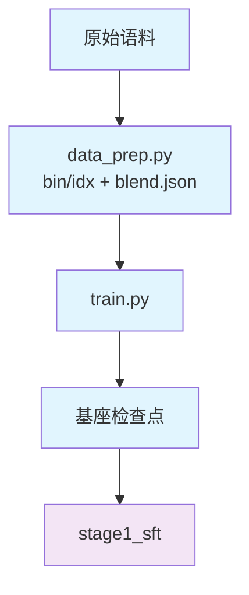

# Stage 0：预训练与中训练

从零训练基座，再分两步把分布与能力推到中训练目标：**预训练 2 段（stable → decay）+ 中训练 2 段
（能力强化 → 长文档）**。产出基座检查点，供 SFT 与 RL 起跑。

## Overview

| 组件 | 说明 |
|---|---|
| `common/prep.py` | 预训练段与中训练段共用的语料准备入口 |
| `common/train.py` | 两段共用的训练入口（公共开关 + 组配置 + 起训） |
| `stage1_pretrain/` | PT-1 stable 与 PT-2 decay 两段的入口与配置 |
| `stage2_midtrain/` | Mid-1 能力强化与 Mid-2 长文档两段的入口与配置 |
| `stage{1_pretrain,2_midtrain}/config/` | 该段的几何、LR、语料配比、数据准备参数 |

## Quick Start

```bash
# ① PT-1 stable（默认 9B token 预算，LR 恒定）
cd stage1_pretrain
python data_prep.py --discover --config default     # 先看语料面貌
python data_prep.py --prepare --config default      # 产出 bin/idx + blend.json
python train.py --tokens 9e9

# ② PT-2 decay（高质量子集 + cosine 退火，接续 stable 检查点）
python data_prep.py --prepare --config default --blend data_blend_decay.json
python train.py --config decay --tokens 1e9 --load ${SHENSI_FS}/shensi/ckpt/looma/stage1_pretrain/default

# ③ Mid-1 能力强化（升 4K、代码/数学拉满）
cd ../stage2_midtrain
python train.py --tokens 5e8 --load <PT-2 检查点>

# ④ Mid-2 长文档（16K + LR 末段再退火）
python data_prep.py --prepare --config default --blend data_blend_mid2.json
python train.py --config mid2 --tokens 3e8 --load <Mid-1 检查点>
```

链路自检与本地验证（不碰大规模语料）：

```bash
python train.py --smoke                        # tiny 几何 + mock 数据 + 5 步
python train.py --config debug --tokens 1e6    # 真实语料的小档
python train.py --tokens 9e9 --dry-run          # 只看命令
```

## 段位设计

| 段 | profile | tokens | seq | LR | 语料 |
|---|---|---|---|---|---|
| PT-1 stable | `default` | 9B（90%） | 2048 | 6e-4 **恒定**，warmup 2% | 通用网页 + 代码 + 数学 |
| PT-2 decay | `decay` | 1B（10%） | 2048 | cosine 6e-4 → 6e-5 | 高质量子集为主 |
| Mid-1 能力强化 | `default` | 0.5B（5%） | 4096 | 6e-5 恒定，warmup 1% | 代码 / 数学 / 高质量通用 |
| Mid-2 长文档 | `mid2` | 0.3B（3%） | 16384 | cosine 6e-5 → 3e-5 | 长文档为主 |

stable/decay 两段是"逐级推进"的最小实现：恒定段保证稳定性读数干净，退火段切高质量子集收尾；中训练把
"能力强化"与"分布适配"拆成两步，避免一次动三个变量。逐段接续用 `--load`；LR 峰值是 0.6B 档的先验，
正式跑前先 pilot 校准。

## 数据准备

```bash
python data_prep.py --prepare --config {default,tiny}
```

| 选项 | 说明 |
|---|---|
| `--discover` | 只打印数据面貌（配比命中情况、token 数估计），不产出 |
| `--prepare` | 产出 `*_text_document.bin/.idx` 与 `blend.json` |
| `--config` | 读 `config/data_prep/<名字>.yaml`（默认 `default`） |
| `--blend` | 直接指定配比 json（相对 `config/data_prep/`） |
| `--limit N` | 每数据集最多取多少条（调试档） |
| `--workers N` / `--only <子串>` / `--data-dir <目录>` | 并发数 / 只处理匹配的数据集 / 产物目录 |

配比文件（`config/data_prep/`）：

| 文件 | 用途 |
|---|---|
| `data_blend_raw.json` | 生产配比（通用 + 代码 + 数学） |
| `data_blend_decay.json` | decay 段的高质量子集 |
| `data_blend_mid2.json` | Mid-2 的长文档配比 |
| `data_blend_tiny.json` | 调试配比（小样本，几分钟出真实 bin/idx） |

产物落在 `${SHENSI_FS}/shensi/data/looma/<stage>/`：`*_text_document.bin/.idx` 与 `blend.json`
（`train.py` 会自动拾取；`--data-dir` 可改）。

## 训练

```bash
python train.py [公共开关] [--set 键=值]
```

公共开关见[根 README](../README.md#命令行)。本段常用的覆盖：

```bash
# 换几何（规模阶梯）
python train.py --config geoms/qwen3_4b
# 吞吐档（Transformer Engine 骨干 + 可用融合）
python train.py --config perf
# 关掉早停、给固定步数
python train.py --set train.model.train_iters=20000 --no-early-stop
```

| 文件 | 用途 |
|---|---|
| `config/default.yaml` | PT-1 stable（或 Mid-1）生产档 |
| `config/{decay,mid2}.yaml` | 该 stage 的第二段 profile |
| `config/tiny.yaml` | 冒烟档（tiny 几何 + mock 数据 + 5 步） |
| `config/debug.yaml` | 真实语料的小档（8 层 / 256 hidden / seq 512） |
| `config/perf.yaml` | 吞吐档（TE + 三融合） |
| `config/geoms/*.yaml` | 规模阶梯（1.7B / 4B / 8B / 14B / 30B-A3B） |
| `config/minicpm5_2b.yaml` | 2B 发布几何档 |

## 产物

- 检查点：`${SHENSI_FS}/shensi/ckpt/looma/<stage>/<profile>/`
- run 记录：`${SHENSI_FS}/shensi/runs/looma/<stage>/<profile>/{config.yaml,run.sh,logs/}`
- 日志与早停报告：同上 `logs/host_0_localhost.output`、`logs/early_stop.json`



## Next Steps

基座就绪后进入 [stage1_sft](../stage1_sft/README.md) 做监督微调；RL 与 OPD 见
[stage2_rl](../stage2_rl/README.md) 与 [stage3_opd](../stage3_opd/README.md)。
