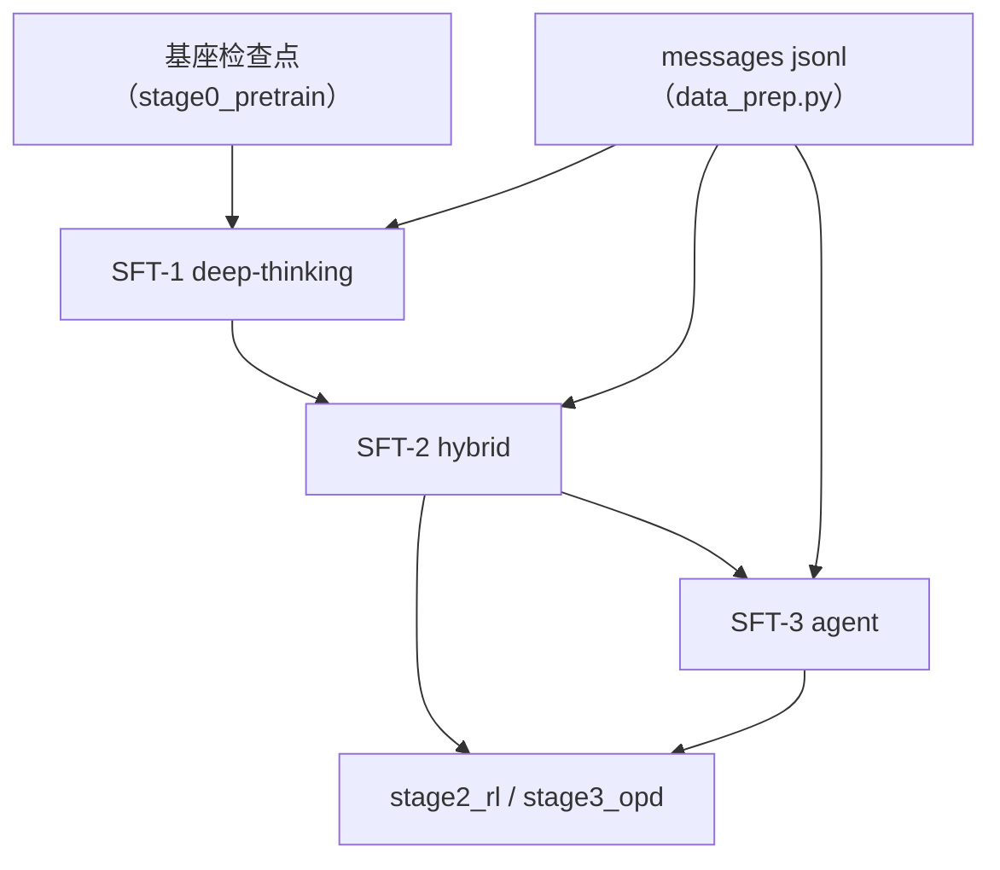

# Stage 1：监督微调

在基座检查点上做三段监督微调：**deep-thinking → hybrid → agent**。产出指令模型，供 RL 四方向
teacher 与 OPD 起跑。

## Overview

| 组件 | 说明 |
|---|---|
| `../common/prep_sft.py` | 语料准备：parquet / jsonl → messages jsonl（按 `val_frac` 切分） |
| `../common/train_sft.py` | 训练入口（公共开关 + `--data-jsonl`） |
| `data_prep.py` | 语料准备的命令行入口 |
| `train.py` | 训练的命令行入口 |
| `config/` | 三段的几何、LR、数据准备参数与配比 |

本段走**不打包**口径（一条对话一条样本 + 右侧 padding）：块层的注意力是 local 实现，不吃 THD
打包序列；loss mask 由 SFT 分词器按 tokenizer 自带的 chat 模板生成。

## Quick Start

```bash
cd src/shensi/recipes/paper/looma/stage1_sft

# ① 语料：把 post-training 数据规范成 messages jsonl
python data_prep.py --prepare --config default

# ② SFT-1 deep-thinking
python train.py --tokens 2e9 --load <Mid-2 检查点>

# ③ SFT-2 hybrid / SFT-3 agent（同量同配，换数据与 profile）
python data_prep.py --prepare --blend data_blend_hybrid.json
python train.py --config sft2_hybrid --load <SFT-1 检查点> --data-jsonl <data>/sft_train_hybrid.jsonl
python data_prep.py --prepare --blend data_blend_agent.json
python train.py --config sft3_agent --load <SFT-2 检查点> --data-jsonl <data>/sft_train_agent.jsonl

# 链路自检：合成 16 条对话的 jsonl + tiny 几何 + 5 步
python train.py --smoke
```

## 数据准备

```bash
python data_prep.py --prepare --config {default,tiny}    # hybrid / agent 集用 --blend 指定配比
```

| 选项 | 说明 |
|---|---|
| `--prepare` | 产出 `sft_train<suffix>.jsonl` 与 `sft_val<suffix>.jsonl` |
| `--config` | 读 `config/data_prep/<名字>.yaml` |
| `--blend` | 直接指定配比 json |
| `--limit N` | 总共最多取多少条（累计到上限就停） |
| `--val-frac` | 验证集比例（默认 0.02） |
| `--root` / `--out-dir` | 输入根目录 / 产物目录 |

配比文件（`config/data_prep/`）：`data_blend_raw.json`（deep-thinking）、`data_blend_hybrid.json`
（混合）、`data_blend_agent.json`（agent 轨迹）、`data_blend_tiny.json`（冒烟小样本）。产物落在
`${SHENSI_FS}/shensi/data/looma/stage1_sft/`。

## 训练

```bash
python train.py [公共开关] [--data-jsonl <messages jsonl>]
```

| 文件 | 用途 |
|---|---|
| `config/default.yaml` | SFT-1 deep-thinking（seq 8192，LR 2e-5 cosine → 2e-6，warmup 1%） |
| `config/sft2_hybrid.yaml` | SFT-2 hybrid |
| `config/sft3_agent.yaml` | SFT-3 agent |
| `config/tiny.yaml` | 冒烟档（mock SFT 路径） |
| `config/debug.yaml` | 真实 jsonl + 小几何（本地验证） |

```bash
# 换数据文件
python train.py --tokens 2e9 --data-jsonl /path/to/sft_train_agent.jsonl
# 覆盖序列长度与全局 batch
python train.py --set train.model.seq_length=4096 --set train.model.global_batch_size=128
```

## 产物

- 检查点：`${SHENSI_FS}/shensi/ckpt/looma/stage1_sft/<profile>/`
- run 记录与日志：`${SHENSI_FS}/shensi/runs/looma/stage1_sft/<profile>/`
- RL 四臂默认从 `${SHENSI_FS}/shensi/ckpt/looma/stage1_sft/sft2_hybrid`（SFT-2）起跑；agent 臂想从
  agent 档起就改各臂配置的 `model.path`（如 `sft3_agent`）



## Next Steps

指令模型就绪后：[stage2_rl](../stage2_rl/README.md) 训四方向 teacher，[stage3_opd](../stage3_opd/README.md)
把它们蒸馏回发布基座。
