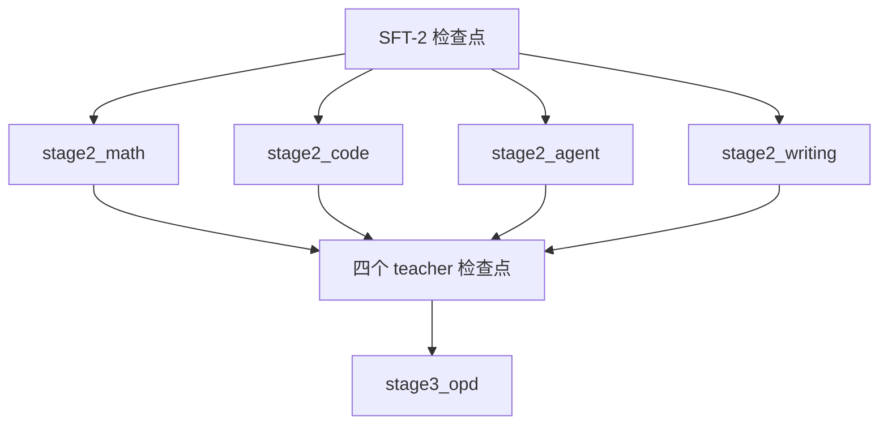

# Stage 2：四方向 RL teacher

从 SFT 检查点出发，四个方向**并行分开训**专用 teacher：数学（答案比对）、代码（单测执行）、agent
（多轮工具环境）、写作（rubric 打分）。四份产出供 OPD 蒸馏回同一个发布模型。

## Overview

| 组件 | 说明 |
|---|---|
| `../common/prep_rl.py` | prompts → verl RLVR parquet（四臂共用） |
| `../common/train_rl.py` | 启动 verl GRPO（四臂共用） |
| `looma_bridge.py` | 检查点接进 verl 的 Megatron 后端（导入即注册；输出路由在两侧的位置不同，见下） |
| `test_looma_bridge.py` | 闸门：注册 → 装载零缺键 → 与 HF 单步对拍（接线判据用 `--dtype fp32`） |
| `harness_tool.py` · `config/tools/harness.yaml` | agent 方向的多轮工具环境接线 |
| `stage2_{math,code,agent,writing}/` | 四个臂，各有 `data_prep.py` / `train.py` / `reward.py` |

每个臂的 `config/` 有九种档：`default`（GRPO）· `dapo` · `drgrpo` · `gspo` · `cispo` ·
`token_baseline`（长度基线）· `critic`（带 critic）· `fsdp`（FSDP actor）· `tiny`（冒烟）。
子档都只写相对 `default` 的变化。

## Quick Start

```bash
cd src/shensi/recipes/paper/looma/stage2_rl/stage2_math      # 以数学臂为例

python data_prep.py --prepare --config default               # prompts → train/val parquet
python train.py --dry-run                                    # 先看 verl 命令行
python train.py --set model.path=<SFT-2 检查点>              # 起训
```

链路闸门（改过桥或导出逻辑后跑）：

```bash
cd ..   # stage2_rl/
python -m shensi.recipes.paper.looma.stage2_rl.test_looma_bridge --ckpt <导出的 HF 目录>
```

## 数据准备

```bash
python data_prep.py --prepare --config {default,tiny}
```

| 选项 | 说明 |
|---|---|
| `--prepare` | 产出 `train.parquet` 与 `val.parquet`（RLVR schema：prompt / data_source / ability / reward_model / extra_info） |
| `--config` | 读 `config/data_prep/<名字>.yaml` |
| `--limit N` / `--val-frac` | 每数据集条数上限 / 验证集比例 |
| `--root` | prompts 根目录（默认 `SHENSI_FS` 下的 post-training 数据） |

产物落在 `${SHENSI_FS}/shensi/data/looma/stage2_<方向>/`。奖励函数在臂自己的 `reward.py` 里
（verl 按 `reward.custom_reward_function.path` + `name=compute_score` 引用）。

## 训练

```bash
python train.py [--dry-run] [--set 键=值] [--profile <档>]
```

关键旋钮（在臂的 `config/*.yaml` 里，或命令行 `--set`）：

| 键 | 说明 |
|---|---|
| `model.path` | 起点检查点（默认 `…/ckpt/looma/stage1_sft/sft2_hybrid`） |
| `rollout.{n,temperature,top_p,max_model_len}` | rollout 采样 |
| `rollout.multi_turn.*` · `rollout.agent.default_agent_loop` | 多轮工具（agent 方向在起点命中工具族时自动打开） |
| `algorithm.{adv_estimator,kl_coef,filter_groups.*}` | 优势估计、KL、动态采样 |
| `actor.{optim.*,ppo_*,clip_ratio_*,megatron.*}` | actor 侧（Megatron 后端） |
| `trainer.{n_gpus_per_node,nnodes,total_epochs}` | 起法 |

```bash
python train.py --profile dapo                        # 换算法档
python train.py --set model.path=/path/to/sft3_agent  # 换起点检查点
```

启动环境由 `common/verl_launch.py` 配好：`VERL_USE_EXTERNAL_MODULES` 让每个 verl 进程都加载桥与运行时登记，
`VERL_PLATFORM=nvidia_noipc`，代理剥离。日志与早停报告落在 `${SHENSI_FS}/shensi/runs/looma/<臂>/`。

### 与 verl 的配置口径（实测得来的几条，改配置前先看）

- **`override_transformer_config` 的子键要用 `++`**：本环境 verl 把该字段声明成**空 dict**，hydra
  的结构里没有 `gradient_accumulation_fusion` 这类子键，普通覆写会被拒（`Key … is not in struct`）；
  而 ref 侧用 `oc.select` 继承了 actor 的那份，`+` 又会报"已存在"。`common/verl_launch.py` 因此把
  `actor/ref.megatron.override_transformer_config.*` 一律发成 `++…=…`（有则覆写、无则追加）。
- **`actor.optim.use_layer_wise_param_layout` 不要写进配置**：同样不在 hydra 结构里；而且
  Muon + LayerWise 这条路上，verl 引擎自己会 `setdefault("use_layer_wise_param_layout", True)`，
  显式写 `false` 反而与引擎的预期相反。
- **`--set` 用配置侧的键名**（`rollout.max_model_len`、`model.path`、`actor.ppo_mini_batch_size`…），
  不是展开后的 verl CLI 名（`actor_rollout_ref.…`）；`data.train_files/val_files` 由 `--data-dir`
  直接决定，不要再 `--set`。
- **没有映射到 verl CLI 的配置键会直接报错**（`build_verl_command` 的闸门），不静默丢弃。
- **自动接线的旋钮不覆盖显式 `--set`**：起点命中工具族时会自动开 `rollout.multi_turn.*` +
  `rollout.agent.default_agent_loop`；命令行显式给过同名键就不再加。

### 本环境（单卡 0.6B 对比档）的四条硬边界

| 边界 | 现象 | 处理 |
|---|---|---|
| **mcore 没有 DDP 的 `use_layer_wise_param_layout`** | `ValueError: Muon layer-wise distributed optimizer requires DistributedDataParallelConfig.use_layer_wise_param_layout …`（根因是 `DistributedDataParallelConfig.__init__()` 的 `TypeError`） | tiny 档里已关（`actor.optim.use_layer_wise_distributed_optimizer: false`）；真档要用 layer-wise 优化器得等本环境 mcore 补上这个参数布局 |
| **rollout 引擎会 torch.compile 模型** | dynamo 在块求解器的停止判据（`if diff.max() < tol`，数据相关的 Python 分支）上失败 | tiny 档里已开（`rollout.enforce_eager: true`），vLLM 会连带关掉 torch.compile 与 CUDAGraph |
| **mcore 的 `DotProductAttention` 不吃 packed（THD）** | `AssertionError: Packed sequence is not supported by DotProductAttention …` | `model.use_remove_padding: false` + `ref.megatron.use_remove_padding: false`（本配方 RL 侧不开 TE） |
| **verl v1 的超长过滤** | `dataset len: 7 → filter dataset len: 0`：chat 模板量长度这一步会把整批丢掉 | tiny 档里已关（`data.filter_overlong_prompts: false`）；真实档给足 `max_prompt_length`（默认 8192） |

上面四条与 `rollout.max_model_len`（tiny 检查点的 512 上限）、起点 `model.path` 都写在
`config/tiny.yaml` 里，所以 `train.py --profile tiny` 直接可跑。

## 已验证：真起训（3 步跑通，tiny 档）

```bash
# 数据（自足冒烟数据）
python stage2_math/data_prep.py --prepare --smoke          # 8 条带答案 → train/val parquet
# 起训（tiny 档自足：起点、上下文与上面四条边界都在 config/tiny.yaml 里）
cd stage2_math && python train.py --profile tiny
```

实测（`stage2_math`，1×GPU，7 训练 / 1 验证）：

| 项 | 结果 |
|---|---|
| 全链路 | `Total training steps: 3` → rollout（vLLM）→ old_log_prob → advantage → update_actor → update_weights → `rc=0` |
| 训练/rollout 一致 | `training/rollout_probs_diff_max = 1.06e-07 … 1.62e-07`、`rollout_actor_probs_pearson_corr = 0.99990 … 0.99992` |
| 权重同步 | 每一步 `update_weights` 都走 `Converting to HuggingFace ⇄ LoomaForCausalLMBridge 100% (60/60)` |
| 多轮工具 | `num_turns = 2`（起点命中工具族时自动开多轮） |
| 奖励 | `critic/score/mean = 0.0`：tiny 是随机初始化的 2 层模型，拿 0 分是应该的；链路本身跑通 |
| 长度 | prompt 26 token、response 486 token（触到 tiny 检查点 512 的上下文上限，`response_length/clip_ratio = 1.0`） |

## 桥的名字与位置（容易踩的两处）

- **连接是三处一组的**：mcore 与 HF 两侧都是 `self_attention_attn_res`、`mlp_attn_res`（每层两组）
  加上一个输出路由；但**输出路由的位置不同**——mcore 把它放在末层里
  （`decoder.layers.{末}.output_attn_res`），HF 参考放在模型上（`model.output_attn_res`）。
  桥的映射表两侧名字逐字写死，改结构时两边要一起改（写错的表现是装载报"HF 侧缺张量"）。
- **判据要同精度**：`--dtype` 决定两侧的精度；混着比（一侧 bf16 一侧 fp32）时 bf16 自身舍入就有
  1e-2 量级。fp32 下实测单步 `max|Δ| = 1.788e-07`（接线正确到 fp32 噪声），参考设置（`max_iter=8`）
  是 5.5e-02——那是不动点循环对 fp32 噪声的放大，属架构性质。

## 产物



## Next Steps

四个 teacher 就绪后进入 [stage3_opd](../stage3_opd/README.md)：学生 rollout → 各方向 teacher 打
token 级 logprob → 学生在自己的 token 上做 forward-KL。
