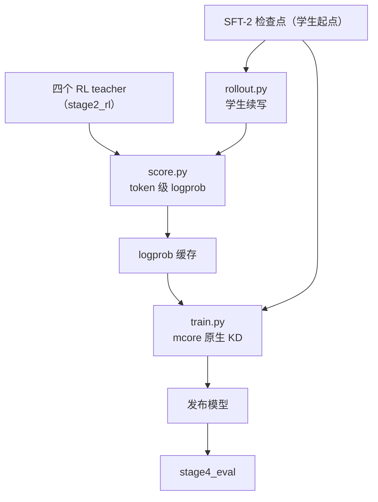

# Stage 3：OPD（on-policy 蒸馏回发布基座）

把四个方向的 RL teacher 蒸馏回**同一个发布模型**：学生（SFT 基座）自己 rollout → 各方向 teacher
打 token 级 logprob → 学生在**自己的 token** 上做 forward KL。训练侧是 mcore 原生 KD
（`--logits-load-dir`）。

## Overview

| 组件 | 说明 |
|---|---|
| `rollout.py` | 第 ① 步：起 vLLM 端点跑学生 rollout |
| `score.py` | 第 ② 步：各方向 teacher 对 rollout 打分（写 token 级 logprob 缓存） |
| `data_prep.py` | 第 ③ 步前置：学生 rollout 文本 → bin/idx（训练语料） |
| `train.py` | 第 ③ 步：学生在缓存上做 KD 训练 |
| `config/default.yaml` | seq 8192 / 全局 batch 64 / LR 1e-5 cosine → 1e-6 / KD alpha 1.0 |
| `config/opd_rl.yaml` | RL 式 OPD 档（见 [RL 段](../stage2_rl/README.md)的说明） |

## Quick Start

```bash
cd src/shensi/recipes/paper/looma/stage3_opd

# ① 学生 rollout（vLLM 端点）
python rollout.py --load <SFT-2 检查点> --prompts <prompt 目录> --out <文本目录>

# ② 各方向 teacher 打分（写 logprob 缓存）
python score.py --load <teacher 检查点> --data-dir <文本目录> --out <缓存目录>

# ③ 学生 KD 训练
python data_prep.py --prepare                       # rollout 文本 → bin/idx
python train.py --tokens 5e8 --load <SFT-2 检查点> --teacher-cache <缓存目录>

# 链路自检（复用预训练段的 tiny 档）
python train.py --smoke
```

## 数据准备

```bash
python data_prep.py --prepare [--config default] [--limit N] [--data-dir <目录>]
```

| 阶段 | 输入 | 输出 |
|---|---|---|
| ① rollout | prompts（`config/data_prep/data_blend_raw.json` 指定的四个方向） | 学生续写文本 |
| ② score | ①的文本 + teacher 检查点 | token 级 logprob 缓存（`--logits-save-top-k` / `--logits-save-top-p`） |
| ③ data_prep | ①的文本 | `*_text_document.bin/.idx` + `blend.json` |

产物落在 `${SHENSI_FS}/shensi/data/looma/stage3_opd/`。

## 训练

```bash
python train.py --tokens 5e8 --load <SFT-2 检查点> --teacher-cache <logprob 缓存目录>
```

| 开关 | 说明 |
|---|---|
| `--teacher-cache <目录>` | 接成 `train.model.logits_load_dir`（mcore 原生 KD） |
| `--set train.model.logits_load_kd_loss_alpha=1.0` | KL 项系数 |
| `--set train.model.logits_load_reverse_kl=true` | 用 reverse KL（`KL(student‖teacher)`，OPD 口径） |
| `--set train.model.freeze_all_layers=true` | 只跑前向（配合打分步骤） |

多轮迭代（每轮重新 rollout → 打分 → KL）：

```bash
for round in 1 2 3; do
  python rollout.py --load <上一轮学生检查点> --prompts <prompts> --out /tmp/opd/$round
  python score.py --load <teacher 检查点> --data-dir /tmp/opd/$round --out /tmp/opd/score_$round
  python train.py --tokens 5e8 --load <上一轮学生检查点> --teacher-cache /tmp/opd/score_$round
done
```

## 产物



- 检查点：`${SHENSI_FS}/shensi/ckpt/looma/stage3_opd/<profile>/`
- 发布：用 `common/train/export_hf.py` 导出成 HF 目录（自带 `auto_map` 与两个建模文件）

## Next Steps

发布模型就绪后进入 [stage4_eval](../stage4_eval/README.md) 做公开基准评测；导出命令见
[根 README](../README.md)。
