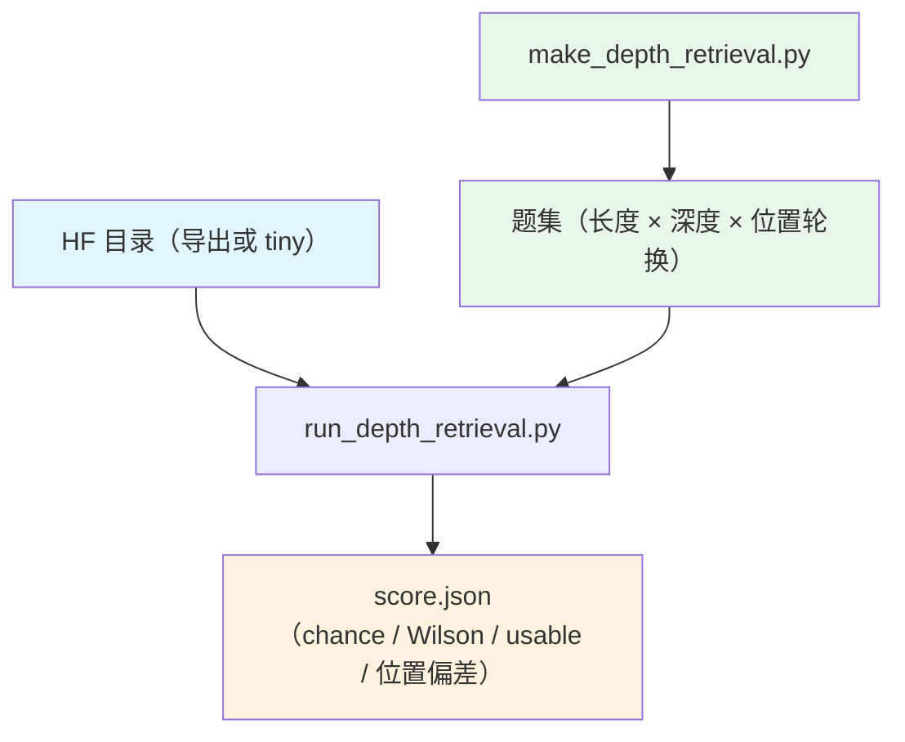

# Stage 4：受控深度检索评测

按位置/深度控制的检索题测"模型有没有用到深度记忆"：正确答案句埋在长上下文的不同位置，选项打乱、
控制 shuffle、按 Wilson 区间给出可用性门。评测集与口径与训练完全解耦，任意 HF 目录都能评。

## Overview

| 组件 | 说明 |
|---|---|
| `make_depth_retrieval.py` | 生成受控检索题集（长度 × 深度 × 位置轮换） |
| `run_depth_retrieval.py` | 评分与报告（准确率、位置偏差、chance、Wilson 下界、usable 门） |

两个脚本都只依赖 `transformers` 与分词器：模型按 `--model <HF 目录>` 加载（`trust_remote_code`
可加载本配方导出的自带建模代码的目录）。

## Quick Start

```bash
cd src/shensi/recipes/paper/looma/stage4_eval

# ① 生成题集（40 题、长度 1024、每个深度 1 个干扰项）
python make_depth_retrieval.py --out /tmp/looma_eval/items --n 40 --lengths 1024 --ks 1,2

# ② 评分（模型用导出的发布模型或 tiny 冒烟检查点）
python run_depth_retrieval.py --model /tmp/looma_release --data /tmp/looma_eval/items \
    --tokenizer ../common/tokenizer/MiniCPM5-2B --limit 40 --out-json /tmp/looma_eval/score.json
```

不训练也能跑通整条评测链（tiny 检查点自带真分词器）：

```bash
python -m shensi.recipes.paper.looma.common.models.vllm.tiny_checkpoint --out /tmp/looma_smoke
python run_depth_retrieval.py --model /tmp/looma_smoke --data /tmp/looma_eval/items --limit 40
```

## 题集生成

```bash
python make_depth_retrieval.py --out <目录> [--n 1000] [--lengths 1024,2048,4096] \
    [--ks 1,2,4,8] [--repeats 3] [--seed 42] [--filler-random] [--emit-harness]
```

| 选项 | 说明 |
|---|---|
| `--n` | 题数 |
| `--lengths` | 上下文长度阶梯 |
| `--ks` | 每个深度的干扰项个数（难度） |
| `--repeats` | 每个组合重复几次（位置轮换） |
| `--filler-random` | 干扰文本用随机 token（默认用词表里的真实词） |
| `--emit-harness` | 额外产出可交给工具环境跑的格式 |

生成时会自检（答案位置分布是否均匀、正确答案句是否都在上下文里），不合格会直接报出来。

## 评分

```bash
python run_depth_retrieval.py --model <HF 目录> --data <题集> [选项]
```

| 选项 | 说明 |
|---|---|
| `--limit N` | 只评前 N 题 |
| `--max-length` | 上下文上限（超出裁掉） |
| `--device` / `--dtype` | 评测设备与精度 |
| `--control-shuffle-labels` / `--control-seed` | 打乱标签的对照（测位置偏差而不是内容匹配） |
| `--out-json` | 报告落盘（含逐深度分数与门判定） |
| `--smoke` / `--smoke-dir` | 用 tiny 检查点做冒烟 |

报告包含：总体准确率、逐深度/逐位置的准确率、chance 基线、Wilson 95% 下界，以及 `usable` 门
（`max(acc, acc_norm)` 的 Wilson 下界是否高于 chance）。**门不过时任何高于 chance 的准确率都要
怀疑**——报告里同时给出位置偏差读数，正是为了区分"真答对"与"总选某个位置"。

## 产物



实测（40 题、长度 1024、`ks=1,2`）：**7.8 秒出分**，`chance = 25.00%`，随机初始化的 tiny 检查点
`usable = False`（正确读数——门在工作）。

## 说明

- 评测只看模型前向，不写检查点、不训练；`--model` 可以是任意 HF 目录（含本配方导出的发布模型、
  tiny 冒烟检查点、或其它同结构模型）。
- 离线评测默认走 HF 路径（`trust_remote_code`）；要用引擎（paged attention / 连续批处理）评，走
  `common/models/vllm/` 的登记或 `vllm serve <目录> --trust-remote-code`。
