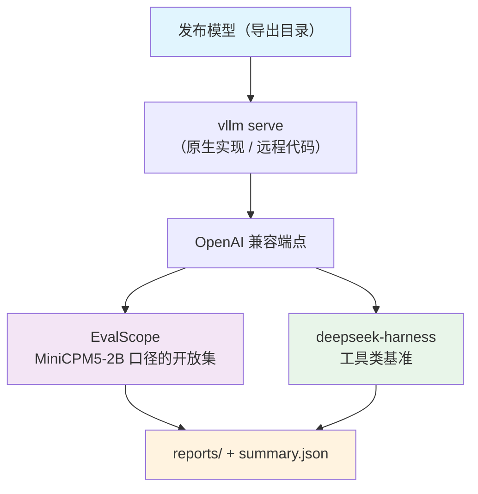

# Stage 5：基准评测（MiniCPM5-2B 口径）

用 **vLLM 起的端点**跑 **EvalScope** 的基准，评测集与口径**与 MiniCPM5-2B 一致**（对照表与参考分数在
[`benchmarks.py`](./benchmarks.py)）；工具类基准（SWE-Bench / BFCL / τ²-Bench / GAIA / Terminal-Bench）
交给 **deepseek-harness**，打的是同一个端点。

## Overview

| 组件 | 说明 |
|---|---|
| `setup_env.sh` | 建独立评测 venv（不动训练用的 `.venv`）、装 EvalScope 与 harness SDK、装 vLLM 插件、初始化 dsh profile 指向我们的端点 |
| `eval.py` | 起 `vllm serve` → 跑 EvalScope（开放集）→ 可选跑 harness（工具集）→ 写 `summary.json` |
| `benchmarks.py` | MiniCPM5-2B 的评测项对照表（EvalScope 数据集名 / 口径名 / 参考分数 / HF 双胞胎 / 谁跑）+ 集合定义 |
| `check_datasets.py` | 核这张表：名字在不在 EvalScope 注册表、HF 双胞胎的仓库与子集对不对得上、能不能真装载 |
| `config/{default,tiny}.yaml` | 端点、EvalScope、harness 三段配置；`tiny` 是离线小档 |

## Quick Start

```bash
cd src/shensi/recipes/paper/looma/stage5_eval

# ① 一次性准备评测环境（独立 venv + EvalScope + harness + vLLM 插件 + dsh profile）
bash setup_env.sh

# ② 核数据集（名字 / 双胞胎 / 真装载；--load 会下载）
.venv_eval/bin/python check_datasets.py --suite main
.venv_eval/bin/python check_datasets.py --datasets gsm8k --load

# ③ 先看三条命令（vllm serve / evalscope / dsh）
$SHENSI_ROOT/.venv/bin/python eval.py --dry-run

# ④ 跑主表（通用/数学/指令/代码）
$SHENSI_ROOT/.venv/bin/python eval.py --suite main

# ⑤ 只跑工具类（交给 harness）
$SHENSI_ROOT/.venv/bin/python eval.py --suite agent

# ⑥ 离线自检：tiny 检查点 + 单数据集 + 少量样本（先造 tiny 检查点）
$SHENSI_ROOT/.venv/bin/python -m shensi.recipes.paper.looma.common.models.vllm.tiny_checkpoint --out /tmp/looma_smoke
$SHENSI_ROOT/.venv/bin/python eval.py --config tiny --datasets gsm8k --limit 2
```

## 评测集（与 MiniCPM5-2B 一致）

`benchmarks.py` 的 `BENCHMARKS` 是逐项对照表：**EvalScope 注册表名**、口径名、MiniCPM5-2B 公布的参考
分数（没公开值就留空）、HF 双胞胎（见下）、以及由谁跑（`open` = EvalScope 直打端点；`agent` = 要工具
环境，走 harness）。集合：

| 集合 | 内容 |
|---|---|
| `mini` | `mmlu_pro` · `math_500` · `ifeval` · `humaneval`（冒烟/回归） |
| `main` | 通用知识（`mmlu_pro`/`mmlu_redux`/`super_gpqa`/`gpqa_diamond`/`mmlu`/`ceval`/`cmmlu`/`bbh`）+ 数学（`math_500`/`aime24`/`aime25`/`aime26`/`gsm8k`）+ 指令（`ifeval`/`ifbench`）+ 代码（`live_code_bench`/`scicode`/`humaneval`/`mbpp`） |
| `long` | `needle_haystack` · `longbench_v2` · `longmemeval` |
| `agent` | `swe_bench_verified` · `terminal_bench_v2_1` · `bfcl_v4` · `gaia` · `tau2_bench`（走 harness） |
| `all` | 全部对照项 |

跑完的报告：`<runs>/stage5_eval/<profile>/evalscope/reports/`（EvalScope 原样输出：逐数据集 JSON、
逐样本预测、`report.html`），以及本 stage 汇总的 `summary.json`（含每项在 MiniCPM5-2B 公布的参考分数，
便于同口径对照）。

## 数据从哪来

EvalScope 的默认数据集源是 ModelScope；本 stage 默认走 **Hugging Face**（`evalscope.dataset_hub`），
因为 EvalScope 里不少基准的默认 id 是 ModelScope 镜像，而 HF 上有同名或同源仓库。两种情形分开处理：

* **有 HF 双胞胎**：`benchmarks.py` 的 `hf_id` 写明，`eval.py` 注入
  `--dataset-args '{"<数据集>": {"dataset_id": "<HF 仓库>", "subset_list": [...]}}'`。
  双胞胎的 config 名与默认口径不同时才带 `subset_list`（例：`gpqa_diamond` 要用 `Idavidrein/gpqa`
  的 `gpqa_diamond` 配置；`aime25` 要用 `opencompass/AIME2025` 的 `AIME2025-I/II`）。
* **没有双胞胎**（`cmmlu` / `live_code_bench` / `needle_haystack` / `aime26`：HF 侧是脚本型数据集，
  `datasets` 4.x 已拒收）：改 `evalscope.dataset_hub: modelscope`，或先把数据落进缓存（见下）。
  `eval.py` 在 HF 档下会把这些项列出来提示。

`evalscope.dataset_dir` 是**缓存根**（不是本地数据集目录）：首次从 hub 拉，落在
`<dataset_dir>/datasets/<id>-<hash>/`（`save_to_disk` 形态）；之后同一份直接 `load_from_disk`，不再碰
hub。所以联网跑过一次就等价于**离线可用**，换机器时把整个 `datasets/` 目录拷过去即可。缓存里已有
的项连 `--dataset-hub` 都不用改。

`check_datasets.py` 就是核这套映射的：`--registry`（默认）核名字、`--defaults` 打印注册表里的默认
id/切分/子集、`--load` 真装载报行数。

## 命令与配置

```bash
python eval.py [--profile default] [--suite main] [--datasets <名字…>] [--limit N] \
               [--model-path <HF 目录>] [--dry-run] [--no-serve] [--set 键=值]
```

| 开关 | 说明 |
|---|---|
| `--suite <集合>` | `mini` / `main` / `long` / `agent` / `all` |
| `--datasets <名字…>` | 显式数据集名（覆盖 `--suite`；可用集合名或注册表名） |
| `--limit N` | 每个数据集最多评多少条（调试/冒烟） |
| `--model-path` | 覆盖 `serving.model_path`（默认指 OPD 的发布检查点） |
| `--no-serve` | 端点已起好，直接打（配合 `serving.start: false`） |
| `--set 键=值` | 点号键覆写，可多次 |

配置三段（`config/default.yaml`）：

- `serving`：`vllm serve` 的参数（`model_path` / 端口 / TP / `max_model_len` / `dtype` /
  `trust_remote_code` / `enforce_eager`）。
- `endpoint`：EvalScope 与 harness 共用的 OpenAI 兼容端点。
- `evalscope`：`dataset_hub`、`dataset_dir`（缓存根）、`generation_config`（`max_tokens` /
  `temperature`）、`eval_batch_size`、`timeout`、逐数据集的 `dataset_args`（与 `hf_id` 覆写合并，
  同名键以配置为准）。
- `harness`：工具类基准的 harness 段（`name: dsh` + 追加参数）。

配置里的 `${oc.env:变量,默认值}` 由 `eval.py` 自己展开（装载器是朴素 YAML，不做插值）；
`model_path`、`dataset_dir` 都吃这一套。

## 被测模型的加载路径

| 路径 | 何时走 | 说明 |
|---|---|---|
| 原生实现（推荐） | `setup_env.sh` 装过 vLLM 插件 | 每个 vLLM 进程（含 EngineCore）都登记 `LoomaForCausalLM`，骨干跑 vLLM 自己的算子与 paged attention |
| 远程代码（兜底） | 没装插件 | 引擎按检查点自带的 `auto_map` 走 Transformers 后端；注意连接会落到引擎改写之外，行为与训练不一定逐位一致 |

`setup_env.sh` 的第 ③ 步就是装插件；训练 venv 里的 vLLM 用它，所以 **RL 的 rollout 也一起受益**
（同一份登记，不需要再配一次）。

**代理**：单机带代理时，EvalScope 子进程要**保留**代理（它要连数据集 hub；本地端点在 `no_proxy` 里），
`vllm serve` 子进程则**去掉**代理（引擎初始化需要）。`eval.py` 两侧分开处理；这一点错了会以
`ConnectionError: Couldn't reach '<数据集>' on the Hub` 的形式报出来。

## 已验证

| 项 | 结果 |
|---|---|
| 环境 | `bash setup_env.sh`：独立 venv + EvalScope 1.12.0 + harness SDK + vLLM 插件 + dsh profile（自检通过） |
| 命令拼装 | `eval.py --dry-run`：`vllm serve` / `evalscope eval` / `dsh <task>` 三条命令逐项正确（含 `--generation-config`、`--dataset-args`、`--dataset-hub`、`--dataset-dir`） |
| 端点 | tiny 检查点起 vLLM：插件生效，由原生实现服务 OpenAI 兼容端点 |
| **真跑出分数（5 个数据集）** | `--config tiny --datasets gsm8k --limit 2` 与 `--datasets mmlu_pro math_500 ifeval humaneval --limit 1`：EvalScope 从 HF 拉数据 → 走完推理 → 出分表。产物：`reports/looma/{gsm8k,mmlu_pro,math_500,ifeval,humaneval}.json` + `predictions/` + `reviews/` + `report.html`；口径示例：`MMLU-Pro / computer science`、`MATH-500 / Level 1…5`、`IFEval / inst_level_strict:weighted_mean`、`HumanEval / Pass@k`、`GSM8K / main`。分数基本是 0%（tiny 是随机初始化的 2 层模型 + `max_tokens=32` 截断），要的是链路而不是分 |
| 数据集表 | `check_datasets.py --suite all`：28 项名字全部命中 EvalScope 注册表；13 个 HF 双胞胎逐个核过仓库与 config 名单（`gpqa_diamond` 是 gated，需 `HF_TOKEN`，已标注） |
| 依赖 | IFEval 的指标要 `langdetect`，而 evalscope 1.12 的元数据里没声明（报错提的 `evalscope[ifeval]` extra 在该版本不存在）→ `setup_env.sh` 里显式装 |

## 产物



## 与其它 stage 的关系

- 评测的输入是 **OPD 之后的发布模型**（也可以是任意 HF 目录：SFT、RL teacher、tiny 冒烟检查点）。
- 受控深度检索（论文口径的那套）在 [stage4_eval](../stage4_eval/README.md)；这里跑的是公开基准。
- 报告里的参考分数取自 MiniCPM5-2B 公开口径，用来做**同口径对照**，不是 pass/fail 门。
