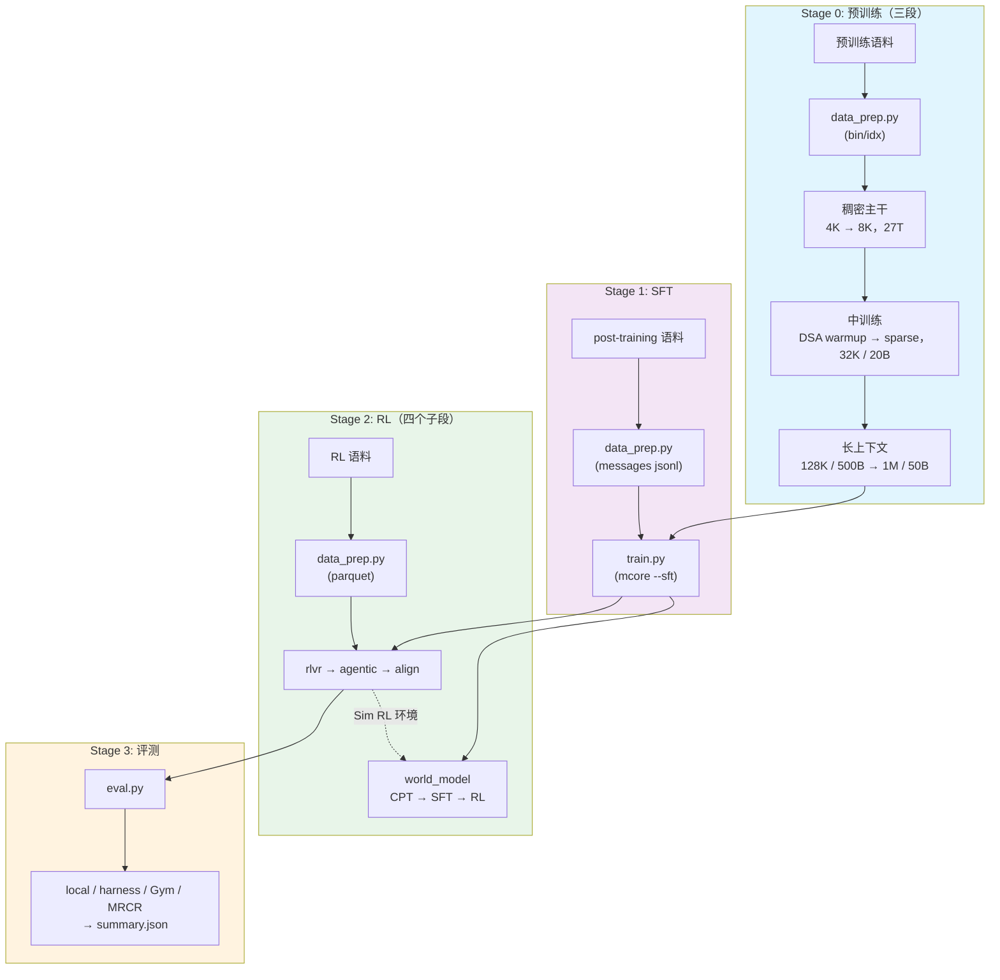
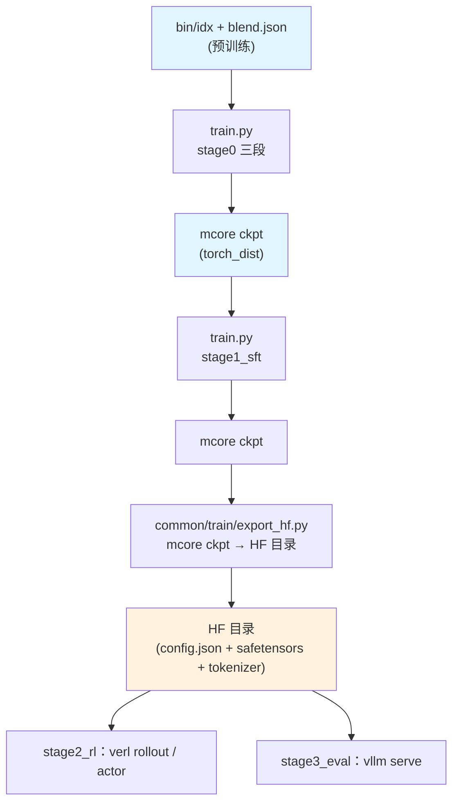

# Shensi 训练配方

从原始语料到成品模型的完整流水线：预训练三段（稠密主干 → DSA 引入 → 1M 长上下文）→ 指令微调 →
RL（四个子段，含世界模型）→ 评测。面向本地单机 1~8 卡：预训练与 SFT 走上游 Megatron-Core 的训练
循环，RL 走 verl，评测与推理用 vLLM。

## 模型总览

稀疏注意力 MoE：每个解码层按逐层计划在三条注意力路径里选一条（压缩稀疏 / 重压缩 / 滑窗），
残差流是一组可读写的多流超连接，层按 attention-residual block 分组，前几层是 token-embedding 门控的
稠密 MLP，其余层是低秩瓶颈的 MoE。几何以 [`common/config/hf/9b_a4b.json`](common/config/hf/9b_a4b.json)。

| 属性 | 值 |
|------|-----|
| 主干 | 35 层 + 3 层共享 MTP |
| hidden / 头 | 2560，32 头，`head_dim 512`（`qk_rope 64`），`q_lora 640` |
| 混合注意力 | CSA 16 层 + HCA 15 层 + 滑窗 4 层；DSA Lightning Indexer 挂在 CSA 层（`index_topk 512`） |
| 残差流 | mHC 多流超连接（`hc_mult 16`，活跃 4 / 固定 2）+ AttnRes 深度连接（block 4） |
| MoE | 256 专家选 6（`sqrtsoftplus`，`routed_scaling 1.5`），低秩专家 `rank 640`，前 3 层 hash-MoE |
| 规模 | 9.150B 总参 / 4.235B 每 token 激活；上下文 1M；词表 129280 |
| loss | 路由 aux 0.001 + ERC 1.0 / α 0.5 + DSA indexer KL 0.01 |
| 优化器 | AdaMuon（矩阵腿）+ AdEMAMix（标量腿），两条腿共用一条 LR 曲线；PT / SFT / RL actor 同一套 |

### 优化器

| 腿 | 实现 | 说明 |
|----|------|------|
| 矩阵腿 | AdaMuon（`--optimizer adaptive_muon`） | 张量并行感知的 Newton–Schulz + 每参数谱尺度 + 第二矩自适应；`muon_split_qkv` 拆 q/kv，再叠加 MLA 的按头 / 按组切分 |
| 标量腿 | AdEMAMix（默认）或 GrokFastAdamW | embedding / 输出头 / norm / MoE router / mHC 静态与 AttnRes 门控 / 哈希嵌入 / 压缩器位置表；`--muon-scalar-optimizer ademamix` 选它 |

两条腿共用一条 LR 曲线：`muon_extra_scale_factor: 0.18` 把 AdaMuon 的更新幅度归一到 Adam 系量级。
接入层在 [`../../utils/optimizer.py`](../../utils/optimizer.py)：标量腿扩展（上游的标量腿分支只认
adam/adamw/lion/sgd，这里在运行时包一层，借用上游自己的 lion 分支完成构造与全部包装）、checkpoint
的状态键表（AdEMAMix 的慢 EMA、GrokFastAdamW 的滤波状态）、以及把两个名字登记进 emerging 优化器表。
生产档统一关掉 LayerWise 的 shard-aligned param layout（`no_use_layer_wise_param_layout`）：默认 layout
会把标量腿交给独立 DistributedOptimizer，而那条路保存优化器状态会撞上游断言；关掉后两条腿都进
LayerWise，状态仍然分片、可存可续。对照档 `adamw` / `lion` / `muon` / `ademamix` / `grokfast` 保留。

## 训练流水线



| 阶段 | 内容 | 框架 | 产物 |
|------|------|------|------|
| [Stage 0: 预训练](./stage0_pretrain/) | 稠密主干 → DSA 两段式 → 长上下文 | 本仓 `common/train/` | 基座 ckpt（1M 上下文） |
| [Stage 1: SFT](./stage1_sft/) | 多域指令微调（chat 模板 + loss mask） | 本仓 `common/train/`（mcore `--sft`） | 指令模型 ckpt |
| [Stage 2: RL](./stage2_rl/) | RLVR → agentic → 对齐 → 世界模型 | verl + mcore actor + vLLM rollout | 对齐模型 / 世界模型 |
| [Stage 3: 评测](./stage3_eval/) | vLLM 起服务 + 基准评测 | vLLM + local / harness / Gym / MRCR | `summary.json` |

## 前置条件

- **环境**：见仓库根目录 `README.md` 的装环境一节（依赖清单、哪些包要现场编、本机补丁、昇腾侧清单）。
- **数据与权重**放在 `$SHENSI_FS` 下，由三个环境变量定位：

| 变量 | 默认 | 含义 |
|------|------|------|
| `SHENSI_ROOT` | `/root/work/shensi`（不给就从本文件往上找带 `3rdparty/common` 的那层） | 代码工作区 |
| `SHENSI_FS` | `/root/work/filestorage` | 存储根（语料 / 产物 / 权重） |
| `SHENSI_TOKENIZER` | `$SHENSI_FS/models/DeepSeek-V4-Flash-0731` | tokenizer 目录（极小档可用自训的小 tokenizer） |

| 内容 | 路径 |
|------|------|
| 预训练语料 | `$SHENSI_FS/datasets/llm/pre-training/<数据集名>/` |
| 后训练语料 | `$SHENSI_FS/datasets/llm/post-training/<数据集名>/` |
| 数据产物 | `$SHENSI_FS/shensi/data/<stage>/` |
| ckpt / run / 模型 | `$SHENSI_FS/shensi/{ckpt,runs,models}/` |

## 快速开始

```bash
# 冒烟：配方级冒烟档（2 层 / hidden 128 / mock 数据 / 5 步），不需要任何真实语料
cd stage0_pretrain/stage1_pretrain
python train.py --smoke                 # 等价 --profile tiny（每 stage 的冒烟档都指向它）

# 集成测试：tiny 几何 + 该 stage 的档，跑 5 步并自动判 PASS/FAIL
python test_train.py

# 真实数据的极小档
python data_prep.py --discover                                  # 语料面貌
python data_prep.py --prepare --config config/data_prep/tiny.yaml
python train.py --profile debug                                 # 极小档真跑几步

# 正式跑（token 预算换算 train_iters；按卡数与显存调 GBS）
python train.py --tokens 27e12
```

每次运行都把最终配置与完整命令落到 `<exp_dir>/config.yaml` 与 `<exp_dir>/run.sh`，日志实时写
`<exp_dir>/logs/host_0_localhost.output`（早停看门狗盯的就是这个文件）。

极小档需要两个本地产物（tokenizer + 一个 HF 格式的小模型目录，RL 与评测起 vLLM 用）：

```bash
python -m shensi.recipes.shensi.common.tiny_artifacts     # → $SHENSI_FS/shensi/models/{tiny-tok,tiny-rl}
```

## 命令行

```bash
python data_prep.py --discover|--prepare [--config config/data_prep/<档>.yaml]
python train.py --profile <档>                    # 或 --config config/<档>.yaml（等价）
python train.py --step cpt|sft|rl|all             # stage2_rl/stage4_world_model（三段各用现成训练器）
python eval.py --suite gym|local|harness|mrcr|all # stage3_eval
```

| 开关 | 说明 |
|------|------|
| `--profile <名字>` / `--config <路径>` | 选档：`default` / `tiny`（冒烟）/ `debug`（极小档）/ 各段自己的对照档 |
| `--dry-run` | 只算配置、写 run 目录并打印将要执行的命令 |
| `--set k=v` | 点号键覆写，可多次 |
| `--tokens N` | 按 token 预算换算 `train_iters = N / (global_batch_size × seq_length)` |
| `--wait` | 提交后等本次 run 跑完再返回（串接多段时用） |
| `--early-stop N` / `--no-early-stop` / `--early-stop-grace S` | 早停耐心（默认 3）/ 关掉 / 宽限秒数（默认 600） |

## 配置文件

```
recipes/shensi/
├── common/                   # stage 以外的公共件
│   ├── config/tiny.yaml      # 配方级冒烟档（mock 数据）
│   ├── config/hf/9b_a4b.json # HF 参考几何（逐字段与 mcore 对拍）
│   ├── train/                # 训练运行时（launcher / train_shensi / export_hf / erc / sft_dataset）
│   └── …                     # common（路径与配置）/ rl / early_stop / tiny_* / harness / codev3
└── stage*/…                  # 每个 stage：config/{default,tiny,debug,…}.yaml + config/data_prep/
```

每个 stage 的 `config/`：`default.yaml`（全量档）+ `tiny.yaml`（冒烟档，base 指向配方级冒烟档）+
`debug.yaml`（极小几何 + 真实数据）+ 该段自己的对照档；`config/data_prep/`：`data_blend_raw.json`
（生产配比）+ `data_blend_tiny.json`（小配比）+ `default.yaml` / `tiny.yaml`（数据准备档）。

## 产物流



```bash
python -m shensi.recipes.shensi.common.train.export_hf \
    --ckpt $SHENSI_FS/shensi/ckpt/stage1_sft_debug \
    --out  $SHENSI_FS/shensi/models/sft-hf --tiny
```

导出全部复用 Bridge：`AutoBridge.from_hf_config(...).to_megatron_provider(load_weights=False)` 建模型 →
`dist_checkpointing.load(...)` 载权 → `save_hf_pretrained` 导出；ckpt 里带的 MTP 层数自动探测
（也可 `--mtp N` 指定、`--hf-config` 对齐几何口径）。

## 执行方式

`common/train/launcher.py` 把配置摊平成 mcore 的 CLI 并直接起 torchrun（单机 `nnodes=1`）：

- `experiment.exp_dir` / `exp_name` / `runner.nproc_per_node` 决定产物落哪、起几个进程；
- 合并顺序：`default.yaml`（可带 `base:`）→ `config/<profile>.yaml`（也可带 `base:`，相对本 stage 的
  `config/` 解析）→ `debug` 档注入极小几何 → `--set` 覆写（显式 `--set` 永远最后生效）；
- 摊平语义：bool `False` 丢掉（关掉写 `no_xxx: true`）、list 摊成 `--key v1 v2 ...`、嵌套字典不带前缀。

`stage2_rl` 的四个子段由 `common/rl.py` 把 yaml 映射成 `verl.trainer.main_ppo` 的命令行并起进程；
`stage3_eval` 由 `eval.py` 起 `vllm serve` 再打端点。

## 阶段文档

- [Stage 0: 预训练](./stage0_pretrain/README.md) — 稠密主干、DSA 两段式、长上下文
  - [Stage 0.1: 主预训练](./stage0_pretrain/stage1_pretrain/README.md)
  - [Stage 0.2: 中训练 + DSA 引入](./stage0_pretrain/stage2_midtrain/README.md)
  - [Stage 0.3: 长上下文扩展](./stage0_pretrain/stage3_longctx/README.md)
- [Stage 1: SFT](./stage1_sft/README.md)
- [Stage 2: RL](./stage2_rl/README.md)
  - [Stage 2.1: RLVR](./stage2_rl/stage1_rlvr/README.md)
  - [Stage 2.2: Agentic](./stage2_rl/stage2_agentic/README.md)
  - [Stage 2.3: 对齐](./stage2_rl/stage3_align/README.md)
  - [Stage 2.4: 世界模型](./stage2_rl/stage4_world_model/README.md)
- [Stage 3: 评测](./stage3_eval/README.md)

## 验证

| 项 | 结果（本机单卡 RTX 5080 16G） |
|----|------|
| 结构 | 配方级冒烟 rc=0；每 stage `--profile tiny` rc=0（2 层 / seq 128 / mock）；`--config` 与 `--profile` 命令行等价；`data_prep --config` 能解析同目录配比 |
| 四个闸门 | stage1_pretrain / stage2_midtrain / stage3_longctx / stage1_sft 全 PASS（命令里带 `adaptive_muon` + `ademamix`） |
| 优化器状态往返 | 生产口径（LayerWise，无 layout）：第 5 步存（含优化器状态）→ 从 `iter_0000005` 续训到 10；检查点里 `exp_avg` / `exp_avg_sq` / `exp_avg_slow` / `momentum_buffer` 齐全 |
| MTP × mHC | 极小档 1 / 2 层都跑过（日志里有 `mtp_1` / `mtp_2` loss）；带 `mtp.*` 的 ckpt 能转换、导出、进 RL / 评测 |
| 评测 | vLLM 起服务 → local 套件 → `summary.json`；官方 MRCR 套件（`--suite mrcr`）判分器四种行为自检 + 取数自检 |
| 判分服务 | `local_judge.py` 在 CPU 上用小模型当裁判（`--check` 自检输出五维键齐全），不再需要同卡第二个模型服务 |
| 昇腾 | `python -m shensi.utils.ascend_env` 逐项自查（CANN / torch↔torch_npu 配对 / 设备 / 组件 import / 五处已知差异） |

## 环境注意事项（实测）

| 现象 | 原因 | 现在怎么处理 |
|------|------|-------------|
| `make: No targets specified` / `pybind11 not found` | mcore 起训时 `make -C core/datasets` 现编 helper，隔离装法不带 Makefile / pybind11 | launcher 把本 venv 的 `bin` 放到 `PATH` 最前；清单里声明 `pybind11`/`ninja` |
| `no kernel image is available`（DSA 的 Hadamard 旋转） | `fast-hadamard-transform` 上游 `setup.py` 没有 SM120 的 `-gencode` | `patches/fast-hadamard-transform-sm120.patch` 本地编 |
| 前向段错误（SM120） | FlagGems 的 flagos 后端在 `te_general_grouped_gemm` 上崩 | launcher `setdefault TE_FL_PREFER=vendor` |
| flashinfer 起不来 | SM120 上要 JIT 补稀疏 MLA 内核 | launcher 在 `/usr/local/cuda/bin/nvcc` 存在时 `setdefault CUDA_HOME` |
| `vllm version ... not supported` | fork 只有分支没 tag，vcs-versioning 算出 `0.1.devNNNN` | 编 vllm 带 `VLLM_VERSION_OVERRIDE=0.30.1rc0.dev360+g54c5060a1` |
| RL 起不来：ray / vLLM 初始化失败 | 代理环境变量被 ray worker 继承 | `rl.launch` 起子进程前删掉 `http(s)_proxy` |
| RL 起不来：`Unknown platform 'nvidia_noipc'` | WSL2 没有跨进程 CUDA IPC | `VERL_PLATFORM=nvidia_noipc` + `shensi.runtime` 先注册平台再让别的模块 import |
| OOM（41G 级机器） | ray dashboard + 按核数预起的 worker + TransferQueue unit 常驻 | 默认档关 dashboard、`num_cpus: 8`、`num_data_storage_units: 2` |
| `--optimizer` / `--muon-scalar-optimizer` 报 `invalid choice` | 上游 choices 只列内置名字 | `common/train/args.py` 扩 choices（`ademamix` / `grokfastadamw`） |
| 标量腿状态在 checkpoint 里丢键 | `DistributedOptimizer.optimizer_state_keys` 按名字硬编码 | `utils/optimizer.py` 补状态键表 |
| 分布式 + LayerWise 存优化器状态撞断言 | 默认 param layout 把标量腿交给独立 DistributedOptimizer | 生产档关掉 layout（`no_use_layer_wise_param_layout`） |
| RL 极小档：`rollout world_size ... not divisible` | verl 的 `RolloutConfig.tensor_model_parallel_size` 默认 2 | 极小档显式写 `tensor_model_parallel_size / pipeline_model_parallel_size: 1` |
| 图捕获不稳：`operation not permitted when stream is capturing` | 本机 SM120 上 CUDA graph capture 不稳 | 极小档 `rollout.enforce_eager: true` / `--enforce-eager` |
| 单卡同时起两个 vLLM：`device not ready` | 16G 卡装不下「判分 + rollout + actor」 | 一次只起一个引擎；判分用 CPU 的 `local_judge.py` |
| SFT：`Packed sequence is not supported for DSv4HybridAttention` | mcore 的 SFT 数据集一定 THD 打包，CSA 断言不打包 | `common/train/sft_dataset.py`：一条对话一条样本 + 右 padding；回上游口径加 `--shensi-sft-packed` |
| SFT：`unknown SFT prompt format` | 上游 `SFTTokenizer` 只认四个模板名 | 正式档 `default`（tokenizer 自带 chat_template）；极小档 `identity` |
| 极小档 rollout 起不来（fused quant+cache / arange / num_heads / 非法访存） | vLLM + FlashInfer + deepgemm 在 SM120 上对几何有硬约束 | `common/tiny_model.py` 按约束取值（每条都在注释里写了原因） |

### 词表口径

mcore 把词表补齐到 `make_vocab_size_divisible_by` 的倍数（哈希嵌入表按补齐值建），HF 侧必须用同一个
补齐值（`tiny_model.aligned_vocab_size`），否则加载导出的 ckpt 会报 `deepemb.weight` 行数不一致。
生产词表（129280）本来就整除 128。

## 局限

1. 配方在**极小几何**与本机单卡上验证到"跑得通、存得住、续得上、判得出分"；**全规模收敛需要真机预算**，
   各段的验证边界写在各自的「验证」与「局限」里。
2. 优化器的收敛曲线没有做同预算对照（对照档只保证能跑）；`muon_extra_scale_factor` 等系数取公开口径，
   换规模要重新扫 LR。
3. 长上下文分两类做法落地：自然长文档靠 `min_chars` 与权重上调；合成与多针检索（MRCR 类）由
   `stage0_pretrain/stage3_longctx/build_longctx.py` 本地产出，训练与评测共用同一批针。官方
   `openai/mrcr` 开放集接在 `stage3_eval --suite mrcr`（要有长上下文模型才跑得出分数）。
4. 昇腾路径的清单与步骤已按组件文档整理，并提供装配自查脚本；**未上 NPU 实测**。
5. 世界模型 RL 段的判分可以用 CPU 小模型（`local_judge.py`）或外部端点；判分器自身的偏好会进入
   世界模型，换更强裁判时要小规模对拍。
6. 极小档的分数不代表能力：评测/奖励都是拿「小模型 + 极简语料」跑通链路；判分口径本身是严的
   （多针检索要求按出现顺序全对，规则类题按精确/数字匹配）。

## 参考

- 混合注意力与 Lightning Indexer：[arXiv 2606.19348](https://arxiv.org/abs/2606.19348)
- AdaMuon / AdEMAMix / GrokFastAdamW 的实现：[pytorch_optimizer](https://github.com/kozistr/pytorch_optimizer)
- 官方 MRCR 开放集：[openai/mrcr](https://huggingface.co/datasets/openai/mrcr)（判分口径见数据集卡片）
- 预训练与后训练语料：[nemotron-pre-training-datasets](https://huggingface.co/collections/nvidia/nemotron-pre-training-datasets)
- 训练 / RL / 推理栈：[Megatron-Core](https://github.com/NVIDIA/Megatron-LM)、
  [Megatron-Bridge](https://github.com/NVIDIA-NeMo/Megatron-Bridge)、
  [verl](https://github.com/volcengine/verl)、[vLLM](https://github.com/vllm-project/vllm)
