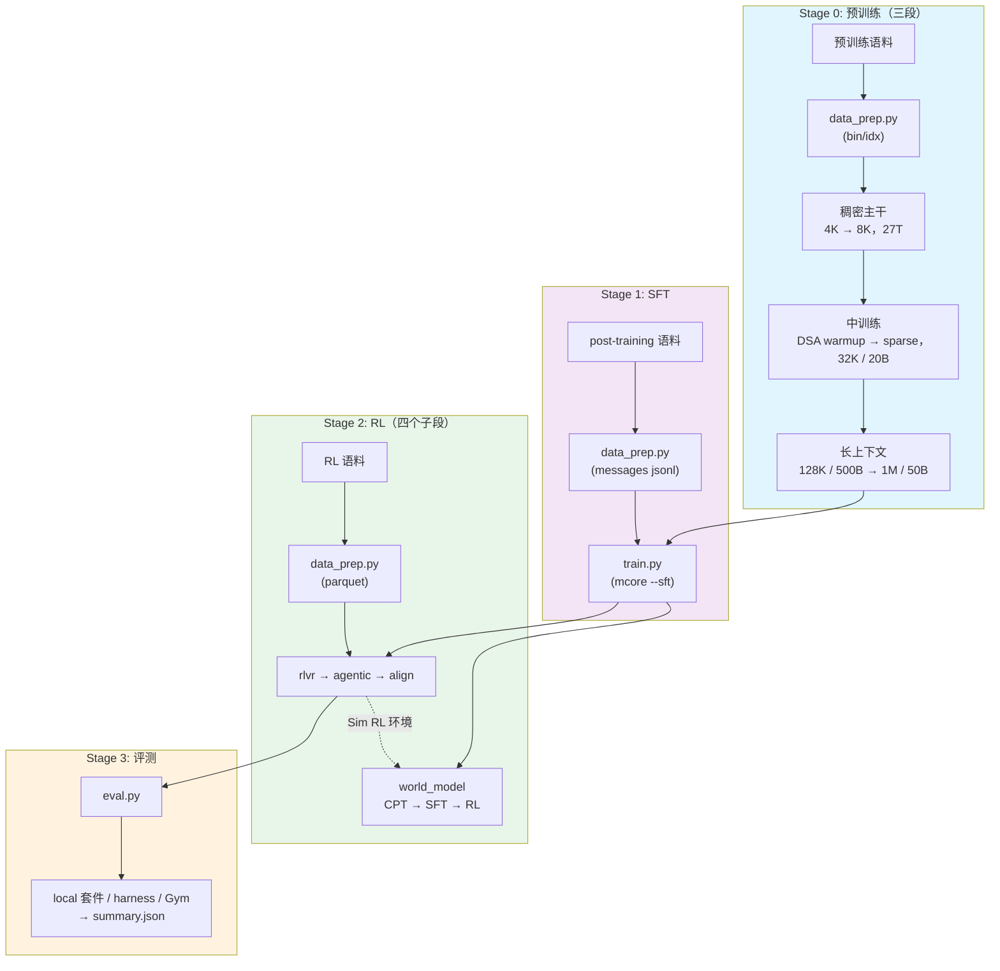
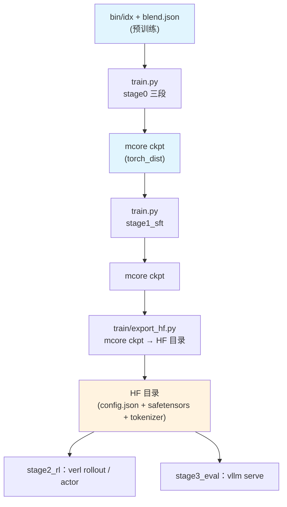

# Shensi 训练配方

从原始语料到成品模型的完整流水线：预训练三段（稠密主干 → DSA 引入 → 1M 长上下文）→ 指令微调 →
RL（四个子段，含世界模型）→ 评测。按本地单机 1~8 卡写：预训练与 SFT 走上游 Megatron-Core 的训练
循环（模型来自 [Megatron-Bridge 的 `models/shensi/`](https://github.com/zongzhilou/Megatron-Bridge/tree/shensi)），
RL 走 verl，评测与推理用 vLLM。

## 模型总览

Shensi 是稀疏注意力 MoE 模型：每个解码层按逐层计划在三条注意力路径里选一条（压缩稀疏 / 重压缩 /
滑窗），残差流是一组可读写的多流超连接，层按 attention-residual block 分组，前几层是
token-embedding 门控的稠密 MLP，其余层是低秩瓶颈的 MoE。几何的权威出处是
[`config/hf/9b_a4b.json`](config/hf/9b_a4b.json)。

| 项 | 值 |
|----|-----|
| 主干 | 35 层 + 3 层共享 MTP |
| hidden / 头 | 2560，32 头，`head_dim 512`（`qk_rope 64`），`q_lora 640` |
| 混合注意力 | CSA 16 层 + HCA 15 层 + 滑窗 4 层；DSA Lightning Indexer 挂在 CSA 层（`index_topk 512`） |
| 残差流 | mHC 多流超连接（`hc_mult 16`，活跃 4 / 固定 2）+ AttnRes 深度连接（block 4） |
| MoE | 256 专家选 6（`sqrtsoftplus`，`routed_scaling 1.5`），低秩专家 `rank 640`，前 3 层 hash-MoE |
| 规模 | 9.150B 总参 / 4.235B 每 token 激活；上下文 1M；词表 129280 |
| loss | 路由 aux 0.001 + ERC 1.0 / α 0.5 + DSA indexer KL 0.01 |
| 优化器 | **AdaMuon（矩阵腿）+ AdEMAMix（标量腿）**，两条腿共用一条 LR 曲线；SFT 与 RL actor 同一条口径 |

### 优化器

所有 stage（PT 三段 / SFT / RL actor）用同一套：

| 腿 | 谁 | 出处 |
|----|----|------|
| 矩阵腿 | **AdaMuon**：上游 mcore 自带（`--optimizer adaptive_muon` → `TensorParallelAdaptiveMuon`，含张量并行与 torch_dist 状态初始化） | mcore 原生 |
| 标量腿 | **AdEMAMix**（默认）或 **GrokFastAdamW**：embedding / 输出头 / norm / MoE router / mHC 静态与 AttnRes 门控 / 哈希嵌入 / 压缩器位置表 | [pytorch_optimizer](https://github.com/kozistr/pytorch_optimizer) 的对应类 |

两条腿共用一条 LR 曲线：`muon_extra_scale_factor: 0.18` 把 AdaMuon 的更新幅度归一到 Adam 系量级。
上游的标量腿只认 adam/adamw/lion/sgd，接入层在
[`../../utils/optimizer.py`](../../utils/optimizer.py)（借用上游 lion 分支做构造与全部包装、
按名字补 checkpoint 的状态键、把这两个名字登记进 `emerging_optimizers` 名字表）；对照档
`adamw` / `lion` / `muon` / `ademamix` / `grokfast` 都保留。逐条判据与本机实测见「验证」一节。

## 训练流水线



| 阶段 | 内容 | 框架 | 产物 |
|------|------|------|------|
| [stage0 预训练](./stage0_pretrain/) | 稠密主干 → DSA 两段式 → 长上下文 | 本仓 `train/`（上游 mcore 循环） | 基座 ckpt（1M 上下文） |
| [stage1 SFT](./stage1_sft/) | 多域指令微调（chat 模板 + loss mask） | 本仓 `train/`（mcore `--sft`） | 指令模型 ckpt |
| [stage2 RL](./stage2_rl/) | RLVR → agentic → 对齐 → 世界模型 | verl + mcore actor + vLLM rollout | 对齐模型 / 世界模型 |
| [stage3 评测](./stage3_eval/) | vLLM 起服务 + 基准评测 | vLLM + harness / Gym / local 套件 | `summary.json` |

## 环境与目录

- **装环境**：按 [`src/README.md`](../../../README.md) 的装环境一节走（本机实际顺序、哪些包要现场编、
  本机补丁都在那里）；昇腾 / NPU 机换 `pyproject.ascend.toml` 那份清单。
- **数据与权重**放在 `$SHENSI_FS` 下，路径由三个环境变量定位：

| 变量 | 默认 | 含义 |
|------|------|------|
| `SHENSI_ROOT` | `/root/work/shensi`（不给就从本文件往上找带 `3rdparty/common` 的那层） | 代码工作区（`3rdparty/common/{Megatron-LM,Megatron-Bridge,verl,vllm}`） |
| `SHENSI_FS` | `/root/work/filestorage` | 存储根（语料 / 产物 / 权重） |
| `SHENSI_TOKENIZER` | `$SHENSI_FS/models/DeepSeek-V4-Flash-0731` | tokenizer 目录（极小档可用自训的小 tokenizer） |

| 用途 | 路径 |
|------|------|
| 预训练语料 | `$SHENSI_FS/datasets/llm/pre-training/<数据集名>/`（目录名去掉 `nvidia/` 前缀） |
| 后训练语料 | `$SHENSI_FS/datasets/llm/post-training/<数据集名>/` |
| 数据产物 | `$SHENSI_FS/shensi/data/<stage>/` |
| ckpt / run / 模型 | `$SHENSI_FS/shensi/{ckpt,runs,models}/` |

## 快速开始

```bash
# ① 冒烟：仓库内 tiny 档（2 层 / hidden 128 / mock 数据 / 5 步），不需要任何真实语料
cd stage0_pretrain/stage1_pretrain
python train.py --smoke

# ② 集成测试：tiny 几何 + 该 stage 的档，跑 5 步并自动判 PASS/FAIL
python test_train.py                 # 有 data_prep 产物就用真实 bin/idx，没有就退回 mock
python test_train.py --profile adamw # 换档对照（优化器对照档同理）

# ③ 真实数据的极小档
python data_prep.py --discover                       # 语料面貌（格式 / 条数 / 字段名 / 权重）
python data_prep.py --prepare --blend config/data_prep/debug_sample.json
python train.py --profile debug                      # 极小档真跑几步

# ④ 正式跑（token 预算换算 train_iters；按卡数与显存调 GBS）
python train.py --tokens 27e12
```

每次运行都把最终配置与完整命令落到 `<exp_dir>/config.yaml` 与 `<exp_dir>/run.sh`，日志实时写
`<exp_dir>/logs/host_0_localhost.output`（早停看门狗盯的就是这个文件）。

极小档需要两个本地产物（tokenizer + 一个 HF 格式的小模型目录，RL 与评测起 vLLM 用）：

```bash
python -m shensi.recipes.shensi.tiny_artifacts     # → $SHENSI_FS/shensi/models/{tiny-tok,tiny-rl}
```

## 命令行

每个 stage 都有自己的入口，开关语义一致：

```bash
python data_prep.py --discover|--prepare         # 各 stage 的语料准备（RL 段是 rl.prepare 的薄封装）
python train.py --profile <档>                    # stage0_pretrain/*（三段）与 stage1_sft
python train.py --profile <档> --data-dir <目录>   # stage2_rl/*（rl.launch 的薄封装）
python train.py --step cpt|sft|rl|all             # stage2_rl/stage4_world_model（三段各用现成训练器）
python eval.py --profile <档>                     # stage3_eval
```

| 开关 | 说明 |
|------|------|
| `--profile <名字>` | 选 `config/<名字>.yaml`：`default` / `debug`（极小档）/ 各段自己的对照档 |
| `--dry-run` | 只算配置、写 run 目录并打印将要执行的命令 |
| `--set k=v` | 点号键覆写，可多次（等效于把配置铺平到 CLI） |
| `--smoke` | 跑仓库内 tiny 档（`config/tiny.yaml`，mock 数据） |
| `--tokens N` | 按 token 预算换算 `train_iters = N / (global_batch_size × seq_length)` |
| `--wait` | 提交后等本次 run 跑完再返回（串接多段时用） |
| `--early-stop N` | 早停耐心（默认 3；0 或负数 = 不看门狗） |
| `--no-early-stop` | 关掉看门狗（按 profile 的 `train_iters` 跑满） |
| `--early-stop-grace S` | 宽限秒数（这段时间内不判耐心，默认 600） |

## 配置档

每段一个 `config/` 目录：`default.yaml`（全量档）+ `debug.yaml`（极小档）+ 该段自己的对照档；
数据配比在 `config/data_prep/`（`data_blend_raw.json` + `debug_sample.json` + `default.yaml`）。

| 段 | 档案 |
|----|------|
| stage1_pretrain | `default` / `debug` / `adamw` / `lion` / `muon` / `ademamix` / `grokfast` |
| stage2_midtrain | `default`（sparse adaptation）/ `dsa_warmup` / `mtp_draft` / `debug` |
| stage3_longctx | `default`（128K）/ `1m` / `debug` |
| stage1_sft | `default` / `debug` |
| stage2_rl/stage1_rlvr | `default` / `debug` / `gspo` / `dapo` |
| stage2_rl/stage2_agentic | `default` / `world_model` / `debug`（+ `config/tools/world_model.yaml`） |
| stage2_rl/stage3_align | `default` / `debug` |
| stage2_rl/stage4_world_model | `default` / `debug` + `config/rl/{default,debug}.yaml` |
| stage3_eval | `default`（全量）/ `tiny`（云端极小）/ `tiny_local`（本机离线） |

## 产物链路



`stage2_rl` 与 `stage3_eval` 读的是 **HF 目录**，中间的转换由 `train/export_hf.py` 补：

```bash
python -m shensi.recipes.shensi.train.export_hf \
    --ckpt $SHENSI_FS/shensi/ckpt/stage1_sft_debug \
    --out  $SHENSI_FS/shensi/models/sft-hf --tiny
# 之后：stage2_rl 用 --set model.path=<out>，stage3_eval 用 --model-path <out>
```

实现全部复用 Bridge：`AutoBridge.from_hf_config(...).to_megatron_provider(load_weights=False)` 建模型 →
`dist_checkpointing.load(...)` 载权 → `save_hf_pretrained` 导出；ckpt 里带的 MTP 层数会被自动探测
（也可以用 `--mtp N` 指定、用 `--hf-config` 对齐几何口径）。

## 本机执行语义

`train/launcher.py` 把配置摊平成 mcore 的 CLI 并直接起 torchrun（单机 `nnodes=1`）：

- `experiment.exp_dir` / `exp_name` / `runner.nproc_per_node` 决定产物落哪、起几个进程；
- profile 合并顺序：`default.yaml` → `config/<profile>.yaml` → `debug` 档再注入 `tiny_model.TINY` 的几何
  → `--set` 覆写（显式 `--set` 永远最后生效）；
- 三套摊平语义与 FlagScale 一致：bool `False` 丢掉（关掉写 `no_xxx: true`）、list 摊成 `--key v1 v2 ...`、
  嵌套字典不带前缀摊平（`checkpoint.save` 就是 `--save`）。

`stage2_rl` 的四个子段由 `rl.py` 把 yaml 映射成 `python -m verl.trainer.main_ppo ...` 的命令行并起进程；
`stage3_eval` 由 `eval.py` 起 `vllm serve` 再打端点。

## 早停

所有段默认带早停看门狗（`early_stop.py`，由 `common.run_process` 与训练**并发**起）：

| 段 | 盯的指标 | 方向 | 默认 |
|----|---------|------|------|
| PT / midtrain / longctx / SFT | `lm loss value`（验证行里的损失值） | 越小越好 | patience=3、grace=600s、poll=20s |
| stage2_rl（四个子段） | `acc/mean@1:np.float64(`（验证准确率） | 越大越好 | 同上 |

- **步数/轮次可以给很大**：`train_iters` 与 `--tokens` 一起用时 LR 地平线被钉在这次预算上
  （`common.build_config` 里 `lr_decay_iters`），之后放大 `train_iters` 不会拉长余弦退火；
  RL 的 `total_epochs` 只是上限，`total_training_steps` 保持 null。
- **收尾怎么发生**：训练跑在自己的进程组里，看门狗连续 patience 次没改善（或达到 `target`）就给那个进程组
  发 SIGTERM；早停按**成功**返回（`rc=0`），并在 `<exp_dir>/early_stop.json` 留下 `why/metric/best/patience`。
  指标一次都没出现时看门狗只是空转，训练结束后自己退出。
- **验证依赖验证集**：PT / 长上下文靠 `split: 98,1,1`、SFT 同一份 jsonl 切 1%、RL 靠 `test_freq`。
- **实测**：SFT 极小档把 `train_iters` 设 200、patience=1、grace=5s，看门狗在**第 42 步**收尾
  （`early_stop.json`：`why=patience, best=6.491295`），入口返回 0。

## 验证

### 优化器口径（本轮改动）与本机实测

| 判据 | 结果 |
|------|------|
| 参数路由不变量 | 2D 非标量参数全部进 AdaMuon；embedding / 输出头 / 1D / 名单（router、mHC、AttnRes 门控、哈希嵌入、压缩器位置表）进 AdEMAMix |
| 冒烟（tiny + mock，5 步） | rc=0、loss 4.91 → 4.45、`[after training is done]` |
| 四个 stage 闸门 | stage1_pretrain PASS(iter 5) / stage2_midtrain PASS(iter 10) / stage3_longctx PASS(iter 15) / stage1_sft PASS(iter 5)——全部跑在 `--optimizer adaptive_muon --muon-scalar-optimizer ademamix` 上 |
| 优化器状态往返 | 第 5 步存（含优化器状态）→ 从 `iter_0000005` 载入 → 续训到 10；检查点元数据里三种状态键都在：`exp_avg`（462 处）、`exp_avg_sq`（154）、`exp_avg_slow`（154）+ AdaMuon 的 `momentum_buffer`（144）+ `fp32_param` 主权重 |
| RL actor（`stage1_rlvr` debug） | 1 epoch 100%（step 19）、权重同步 20 次（`update_weights done`）、actor 指标里 `actor/lr`/`grad_norm`/`entropy` 正常，0 报错 |
| 对照档 | `ademamix`（两条腿都 AdEMAMix）、`grokfast`（标量腿换 GrokFastAdamW）与旧口径 `adamw` / `lion` / `muon` 都保留 |

一条本机边界：**分布式优化器 + LayerWise 在极小几何上保存优化器状态**会撞 mcore 的
`sharded_param_state_dp_reshardable` 断言（`muon + lion` 的旧口径同样撞，与优化器无关）；
本机极小档都用非分布式档位跑，正式档才有分布式。

### 集成测试

`test_train.py` 是每个 stage 的"这条链路还活着吗"闸门，判据统一在 `tiny_test.py`：

| stage 类型 | 测什么 | 判据 |
|-----------|--------|------|
| 预训练 / SFT | tiny 几何跑 5 步（有真实数据用真实数据，否则 mock） | rc=0、跑到最后一次 iteration、出现 `[after training is done]`、日志无 Traceback/Error |
| RL（`stage2_rl/*`） | 预检：配置→命令、数据 parquet、ray、GPU、import、环境变量 | 每项 ✓ 才算 PASS（环境变量缺只提示） |
| 评测（`stage3_eval`） | 预检：配置、`vllm serve` 命令、vllm CLI、模型目录、GPU、import | 同上（模型目录不在本机只提示） |

极小几何的定义在 `tiny_model.py`：2 层（一层 CSA 带 indexer + 一层 HCA）、一层 hash-MoE + 一层 MoE、
`hc_mult 16`、AttnRes block 4、hidden 128、seq 128——家族独有的每一处结构都保留，只是规模压到单卡几十秒。

## 公共模块

| 文件 | 做什么 |
|------|--------|
| `common.py` | 路径（`env_paths`）/ 配置合并（`build_config`）/ 启动（`run_process`、`watchdog_spec`）/ 语料（`discover`、`prepare`） |
| `tiny_model.py` | 极小几何的单一出处：`as_cli_overrides()` 给 launcher、`make_tiny_shensi_provider()` 给 Bridge 侧 |
| `tiny_test.py` | 集成测试的公共部分（跑 tiny 档 + 按日志判 PASS/FAIL + preflight 小工具） |
| `tiny_artifacts.py` | 本地产物：小 BPE tokenizer（带 chat template）与 HF 格式的 tiny 模型 |
| `rl.py` | RL 的 yaml → verl CLI 映射、RL schema 归一与启动（四个子段共用） |
| `early_stop.py` | 日志看门狗：验证指标超耐心就发 SIGTERM 并写 `early_stop.json` |
| `harness.py` | 外部 harness 的统一接线（默认 DeepSeek Harness；Gym 是它的宿主之一）——stage2_agentic 与 stage3_eval 共用 |
| `train/` | 本地训练运行时：`launcher.py`（摊平 + torchrun）、`train_shensi.py`（mcore 训练循环入口）、`export_hf.py`（ckpt → HF）、`erc.py`、`sft_dataset.py` |

## 环境注意事项（实测）

装环境本身（哪些包要现场编、`uv sync` 的 exact 语义、SM120 的 hadamard 补丁）见
[`src/README.md`](../../../README.md)。这里只列**训练时才暴露**的坑，launcher 已经把能自动的都自动了：

| 现象 | 原因 | 现在怎么处理 |
|------|------|-------------|
| `make: No targets specified and no makefile found` / `pybind11 not found` | mcore 起训时会 `make -C core/datasets` 现编 helper；隔离装法不带 Makefile，也不带 pybind11 | launcher 把本 venv 的 `bin` 放到 `PATH` 最前（`python3` 就能找到 pybind11）；清单里也声明了 `pybind11`/`ninja` |
| `no kernel image is available`（DSA indexer 的 Hadamard 旋转） | `fast-hadamard-transform` 上游 `setup.py` 没有 SM120 的 `-gencode` | `patches/fast-hadamard-transform-sm120.patch` 本地编（步骤见 src/README） |
| 前向段错误（SM120） | FlagGems 的 flagos 后端在 `te_general_grouped_gemm` 上崩 | launcher `setdefault TE_FL_PREFER=vendor`（走 TE 自带 CUDA kernel） |
| flashinfer 起不来 | SM120 上它要 JIT 补稀疏 MLA 内核 | launcher 在 `/usr/local/cuda/bin/nvcc` 存在时 `setdefault CUDA_HOME=/usr/local/cuda` |
| `vllm version ... not supported`（verl 闸门要求 ≥0.18） | fork 只有分支没 tag，vcs-versioning 会算出 `0.1.devNNNN` | 编 vllm 时带 `VLLM_VERSION_OVERRIDE=0.30.1rc0.dev360+g54c5060a1`（清单的 `extra-build-variables` 里也写了） |
| RL 起不来：ray/vLLM 引擎初始化失败 | 代理环境变量被 ray worker 继承 | `rl.launch` 起子进程前删掉 `http(s)_proxy` 等 |
| RL 起不来：`Unknown platform 'nvidia_noipc'` | WSL2 没有跨进程 CUDA IPC，且 verl 的 engine 模块一 import 就查平台名 | `VERL_PLATFORM=nvidia_noipc` + `shensi.runtime` 先注册平台再让别的模块 import（顺序写在 `runtime.setup()` 注释里） |
| OOM（41G 级机器） | ray dashboard（6 个约 1.4G 的进程）+ 按核数预起的 worker + 每个 TransferQueue unit 约 0.9G | 默认档已关 dashboard、`num_cpus: 8`、`num_data_storage_units: 2`（见 `stage2_rl/stage1_rlvr/config/default.yaml`） |
| `AttributeError: 'NoneType' object has no attribute 'storage'` | verl 在 `use_distributed_optimizer=false` 时无条件解引用 flat buffer | `shensi.runtime` 补判空（同一文件里上游自己判过） |
| `--optimizer` / `--muon-scalar-optimizer` 报 `invalid choice` | 上游的 choices 只列了内置名字 | `train/args.py` 注册时扩 choices（`ademamix` / `grokfastadamw`），名字表与标量腿由 `shensi/utils/optimizer.py` 装 |
| 标量腿状态在 checkpoint 里丢键 | `DistributedOptimizer.optimizer_state_keys` 按名字硬编码（lion → `exp_avg`，其余 → 两个） | `shensi/utils/optimizer.py` 补一张表（`ademamix` → 三个键、`grokfastadamw` → `exp_avg`/`exp_avg_sq`/`grok_exp_avg`），并把"主优化器是 Muon 家族时看 `muon_scalar_optimizer`"的特判补到 `adaptive_muon` |
| `FLASHINFER_MLA_SPARSE_DSV4 on SM120 requires a FlashInfer DSV4 sparse MLA decode specialization` | flashinfer 自带的 kernels 被整体禁用——它要 JIT，而 `ninja` 不在 `PATH`（或没有 `CUDA_HOME`） | 三个 launcher（训练 / RL / 评测）共用 `common.subprocess_env()`：本 venv 的 `bin` 放 `PATH` 最前 + `CUDA_HOME` + 去代理 |
| `rollout world_size: 1 is not divisible by infer_world_size: 2` | verl 的 `RolloutConfig.tensor_model_parallel_size` 默认是 2（生产档 8 卡够用，极小档没显式写就会撞） | 极小档的 `config/*.yaml` 显式写 `rollout.tensor_model_parallel_size / pipeline_model_parallel_size: 1` |
| `CUDA error: operation not permitted when stream is capturing` | 本机（RTX 5080 / SM120）上 CUDA graph capture 不稳 | 极小档 `rollout.enforce_eager: true`（评测档同理，`serving.extra_args` 里也是 `--enforce-eager`） |
| RL/评测同时起两个 vLLM 时：`CUDA driver error: device not ready` | 16G 卡装不下"判分端点 + rollout 引擎 + actor"，WSL 的 GPU 驱动先失败（`dmesg` 里是 `dxgkio_make_resident: Ioctl failed: -12`） | 单卡跑就一次只起一个引擎：世界模型 RL 段要额外的判分端点，本机跑不了；其他段把 `rollout.gpu_memory_utilization` 压到 0.3 |
| rollout 全被丢掉：`Cannot use chat template functions because tokenizer.chat_template is not set` → `num_samples=0` | verl 的 rollout 数据集要 `apply_chat_template`，而自训的小 tokenizer 没有模板 | `tiny_artifacts.py` 写 `chat_template.jinja`；生产用官方 tokenizer（自带 DSv4 模板） |
| SFT 起不来：`AssertionError: Packed sequence is not supported for DSv4HybridAttention` | mcore 的 SFT 数据集一定 THD 打包，而 CSA 明确断言 `packed_seq_params is None` | `train/sft_dataset.py` 的 `ShensiSFTDataset`：一条对话一条样本 + 右 padding（不产出 `cu_seqlens`）；要回上游打包口径加 `--shensi-sft-packed` |
| SFT 起不来：`NotImplementedError: ('unknown SFT prompt format', ...)` | 上游 `SFTTokenizer` 只认四个模板名（`nemotron-nano-v2` / `nemotron-h-aligned` / `identity` / `default`），没有 DSv4 模板 | 正式档 `default`（用 tokenizer 自带的 chat_template）；极小档 `identity`（只把 content 串起来） |
| 极小档 RL 起不来（fused quant+cache / arange / num_heads / `sparse_mla_sm120_prefill.cu` 非法访存） | vLLM + FlashInfer + deepgemm 在 SM120 上跑 DSv4 稀疏注意力对几何有硬约束 | `tiny_model.TINY` 按这些约束取值（`head_dim=512`、`num_attention_heads=16`、`index_n_heads=16`、`sliding_window/index_topk=128`）；每条都在 `tiny_model.py` 的注释里写了原因 |

### 词表口径

小 tokenizer 练出来的词表（如 614）不整除 128，而 mcore 会把词表补齐、哈希嵌入表按补齐值（640）建。
HF 侧（`tiny-rl` 的 config、`export_hf --tiny`）必须用同一个补齐值（`tiny_model.aligned_vocab_size`），
否则加载导出的 ckpt 会报 `deepemb.weight: ckpt(640,128) vs model(614,128)`。生产的词表（129280）
本来就整除 128，没有这个问题。

### 世界模型 RL 段的判分端点

那一段的奖励是 LLM 裁判（`stage4_world_model/reward.py` 走 `SHENSI_JUDGE_URL` / `SHENSI_WORLD_MODEL_URL`）。
真裁判是另一个模型服务，16G 单卡上"判分服务 + rollout 引擎 + actor"会把 WSL 的 GPU 驱动压爆；
`stage4_world_model/stub_judge.py` 是一个只靠标准库、跑在 CPU 上的 OpenAI 兼容桩：按 AgentWorldBench 的
格式返回五维分数（`--mode hash` 按输入伪随机，保证 GRPO 组内有区分度），不占显存，用来把
"rollout → 判分 → 优势 → actor 更新"这条链路完整跑通：

```bash
python -m shensi.recipes.shensi.stage2_rl.stage4_world_model.stub_judge --port 8000 &
SHENSI_WORLD_MODEL_URL=http://127.0.0.1:8000/v1 SHENSI_WORLD_MODEL=stub-judge \
  python train.py --step rl --profile debug --data-dir $SHENSI_FS/shensi/data/stage2_world_model
```

分数本身没有意义（桩不看内容）；要真分数就换成一个裁判模型的端点。

## 阶段文档

- [Stage 0: 预训练](./stage0_pretrain/README.md) — 稠密主干、DSA 两段式、长上下文三段
  - [Stage 0.1: 主预训练](./stage0_pretrain/stage1_pretrain/README.md)
  - [Stage 0.2: 中训练 + DSA 引入](./stage0_pretrain/stage2_midtrain/README.md)
  - [Stage 0.3: 长上下文扩展](./stage0_pretrain/stage3_longctx/README.md)
- [Stage 1: SFT](./stage1_sft/README.md)
- [Stage 2: RL](./stage2_rl/README.md)
  - [Stage 2.1: RLVR](./stage2_rl/stage1_rlvr/README.md)
  - [Stage 2.2: Agentic](./stage2_rl/stage2_agentic/README.md)
  - [Stage 2.3: 对齐](./stage2_rl/stage3_align/README.md)
  - [Stage 2.4: 世界模型](./stage2_rl/stage4_world_model/README.md)
  - [agentworld/](./stage2_rl/agentworld/README.md) — 世界模型的提示词与判分工具
- [Stage 3: 评测](./stage3_eval/README.md)

## 参考

- DeepSeek-V4-Flash（CSA / HCA 混合注意力、Lightning Indexer、mHC、Muon、1M 上下文）：
  [2606.19348](https://arxiv.org/abs/2606.19348)；权重：ModelScope `deepseek-ai/DeepSeek-V4-Flash-0731`
- Muon 的 token 效率与每参数尺度：[2502.16982](https://arxiv.org/abs/2502.16982)；
  AdEMAMix：[2409.03137](https://arxiv.org/abs/2409.03137)；GrokFastAdamW：[2405.20233](https://arxiv.org/abs/2405.20233)
  （实现都在 [pytorch_optimizer](https://github.com/kozistr/pytorch_optimizer)）
- 预训练 / 后训练语料：[nemotron-pre-training-datasets](https://huggingface.co/collections/nvidia/nemotron-pre-training-datasets)
- 世界模型当环境（Sim RL）：[2606.24597](https://arxiv.org/abs/2606.24597)；
  提示词与判分工具的出处见 [agentworld/](./stage2_rl/agentworld/README.md)
- 上游库：[Megatron-Core](https://github.com/NVIDIA/Megatron-LM)、
  [Megatron-Bridge](https://github.com/NVIDIA-NeMo/Megatron-Bridge)、
  [verl](https://github.com/volcengine/verl)、[vLLM](https://github.com/vllm-project/vllm)

## 局限

1. 全部配方在**极小几何**上验证过（集成测试 + ckpt 往返 + 各段跑到训练步），**全规模收敛结论需要真机预算**；
   验证边界与判据见各 stage README 的「验证」与「局限」；
2. **优化器**：AdaMuon + AdEMAMix（或 GrokFastAdamW）在本机的四个 stage 上都实跑过（含优化器状态往返），
   但**收敛曲线没有与旧口径（Muon + Lion / AdamW）做过同预算对照**；`muon_extra_scale_factor` 等系数
   取自公开口径，换规模要重新扫 LR；
3. **MTP**：几何自带 3 层共享 MTP（生产档 `mtp_num_layers: 3`），极小档把 1 层与 2 层都真跑过
   （日志里有 `mtp_1`/`mtp_2` loss）；与 mHC 同开已打通（Bridge 侧有 mHC 感知的 MTP 层：多流张量先按
   主头口径收缩再进 MTP 的 final_layernorm，并有功能测试），带 `mtp.*` 的 ckpt 能正常转换、导出、
   进 RL / 评测；
4. **长上下文语料**分三类：① 自然长文档——对现成长文档源拉高 `min_chars` 并上调权重；
   ② 合成——NextLong 式与 EntropyLong 式由 `build_longctx.py --step synth` 本地产出；
   ③ 200K 段的 MRCR 类多针检索由 `--step mrcr` 产出，训练与评测共用同一批针；
5. **昇腾 / NPU 路径**：依赖清单与从零开始的命令见 `src/README.md` 的昇腾一节，
   命令按组件 README 编写、**未上 NPU 实测**；
6. **世界模型 RL 段的真裁判**依赖同卡上的第二个模型服务：16G 单卡上「判分服务 + rollout 引擎 + actor」
   会把 WSL 的 GPU 驱动压爆（`CUDA driver error: device not ready`）。链路本身用 `stub_judge.py`（CPU 桩）
   跑到过训练步；真分数要么接外部判分端点，要么换大卡；
7. 极小档的分数不代表能力：评测/奖励都是拿「3M 模型 + 极简语料」跑通链路，判分口径本身是严的
   （长上下文套件要求按出现顺序全对，规则类题按精确/数字匹配）；
8. HF 侧的混合精度：参考实现是 **fp32 口径**，直接以 bf16 加载会在 fp32-keep 组里撞
   `expected m1 and m2 to have the same dtype`；fp32 加载则前向正常，且与 mcore（bf16）的端到端对拍
   已有功能测试（tiny 档 max abs diff ≈ 5e-3，阈值 5e-2）。vLLM 那条路有自己的 cast，不受影响。
