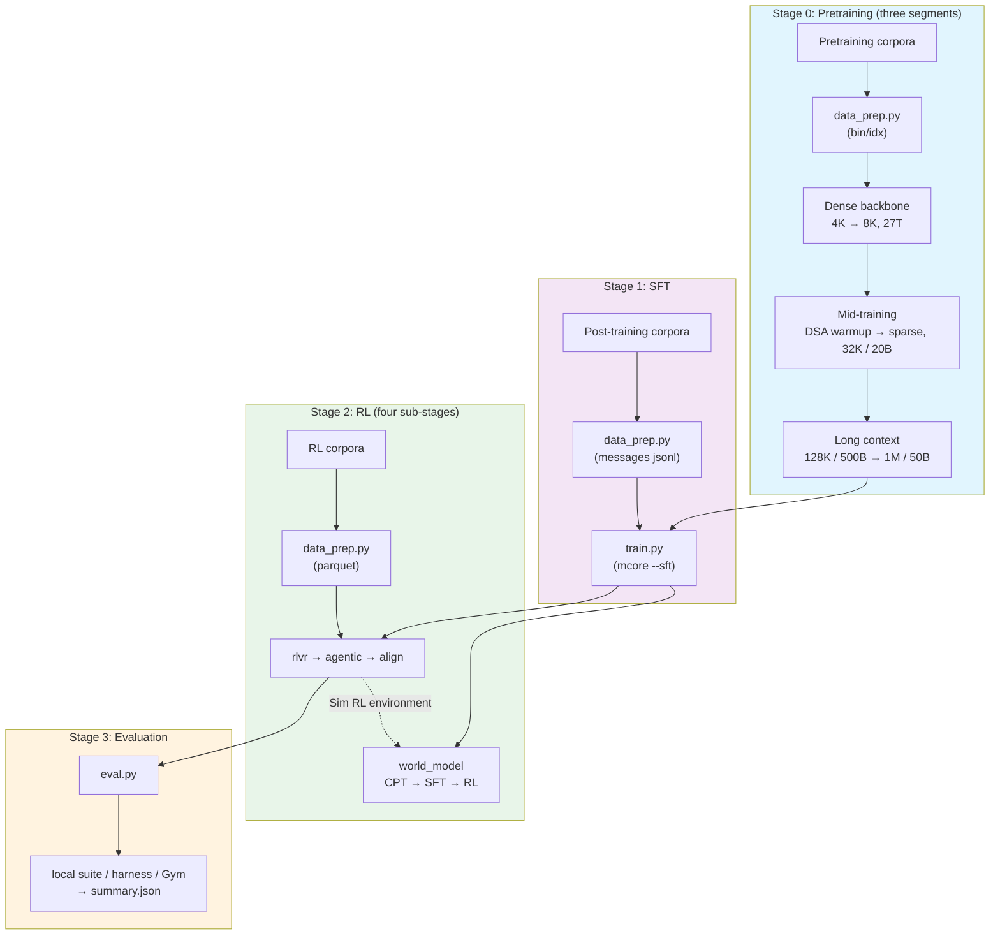
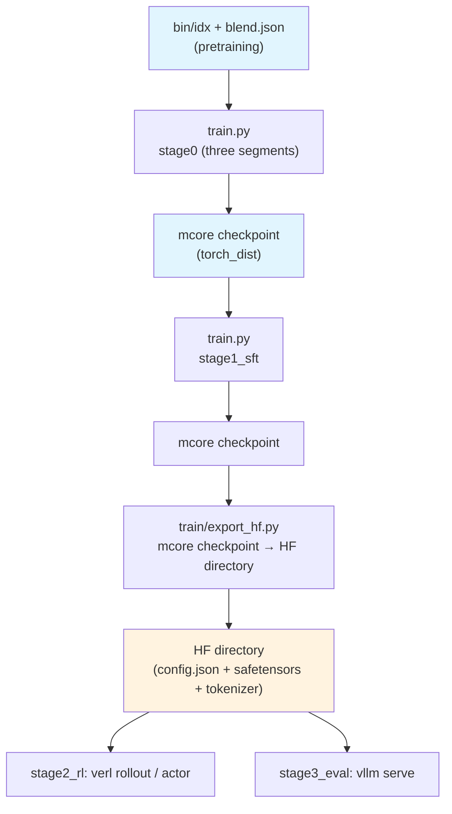

# Shensi Training Recipe

A complete pipeline from raw corpora to a finished model: three pretraining segments (dense backbone →
DSA introduction → 1M long context) → supervised fine-tuning → RL (four sub-stages, including a world
model) → evaluation. Written for a single box with 1–8 GPUs: pretraining and SFT run upstream
Megatron-Core's training loop (the model comes from
[Megatron-Bridge's `models/shensi/`](https://github.com/zongzhilou/Megatron-Bridge/tree/shensi)),
RL runs verl, evaluation and inference run vLLM.

## Model Overview

Shensi is a sparse-attention Mixture-of-Experts model: every decoder layer picks one of three attention
paths from a per-layer plan (compressed sparse attention, heavily compressed attention or a sliding
window), the residual stream is a pool of streams that sublayers read from and write back into, layers
are grouped into attention-residual blocks, the leading layers are token-embedding-gated dense MLPs and
the remaining layers run routed experts through a low-rank bottleneck. The authoritative geometry is
[`config/hf/9b_a4b.json`](config/hf/9b_a4b.json).

| Property | Value |
|----------|-------|
| Backbone | 35 layers + 3 shared MTP layers |
| Hidden / heads | 2560, 32 heads, `head_dim 512` (`qk_rope 64`), `q_lora 640` |
| Hybrid attention | CSA 16 layers + HCA 15 + sliding window 4; DSA Lightning Indexer on the CSA layers (`index_topk 512`) |
| Residual stream | mHC multi-stream hyper-connections (`hc_mult 16`, 4 active / 2 fixed) + AttnRes depth connections (block 4) |
| MoE | 256 experts top-6 (`sqrtsoftplus`, `routed_scaling 1.5`), low-rank experts `rank 640`, first 3 layers hash-MoE |
| Size | 9.150B total / 4.235B active per token; 1M context; vocab 129280 |
| Losses | router aux 0.001 + ERC 1.0 / α 0.5 + DSA indexer KL 0.01 |
| Optimizer | pretraining: Muon (matrices) + Lion (non-matrices); SFT and RL run Adam-family |

## Training Pipeline



| Stage | Purpose | Framework | Output |
|-------|---------|-----------|--------|
| [Stage 0: Pretraining](./stage0_pretrain/) | Dense backbone → two-phase DSA → long context | in-repo `train/` (upstream mcore loop) | Base checkpoint (1M context) |
| [Stage 1: SFT](./stage1_sft/) | Multi-domain instruction tuning (chat template + loss mask) | in-repo `train/` (mcore `--sft`) | Instruction-tuned checkpoint |
| [Stage 2: RL](./stage2_rl/) | RLVR → agentic → alignment → world model | verl + mcore actor + vLLM rollout | Aligned model / world model |
| [Stage 3: Evaluation](./stage3_eval/) | vLLM server + benchmarks | vLLM + harness / Gym / local suite | `summary.json` |

## Prerequisites

- **Environment**: follow the install section of [`src/README.md`](../../../README.md) (the actual
  install order, which packages must be built locally and the local patches all live there); on an
  Ascend / NPU machine switch to `pyproject.ascend.toml`.
- **Data and weights** live under `$SHENSI_FS`; three environment variables locate them:

| Variable | Default | Meaning |
|----------|---------|---------|
| `SHENSI_ROOT` | `/root/work/shensi` (or the first ancestor of this file that contains `3rdparty/common`) | Code workspace (`3rdparty/common/{Megatron-LM,Megatron-Bridge,verl,vllm}`) |
| `SHENSI_FS` | `/root/work/filestorage` | Storage root (corpora / artifacts / weights) |
| `SHENSI_TOKENIZER` | `$SHENSI_FS/models/DeepSeek-V4-Flash-0731` | Tokenizer directory (a locally trained small tokenizer works for tiny runs) |

| Content | Path |
|---------|------|
| Pretraining corpora | `$SHENSI_FS/datasets/llm/pre-training/<dataset>/` (directory names drop the `nvidia/` prefix) |
| Post-training corpora | `$SHENSI_FS/datasets/llm/post-training/<dataset>/` |
| Prepared data | `$SHENSI_FS/shensi/data/<stage>/` |
| Checkpoints / runs / models | `$SHENSI_FS/shensi/{ckpt,runs,models}/` |

## Quick Start

```bash
# 1) Smoke: the in-repo tiny profile (2 layers / hidden 128 / mock data / 5 steps) — no corpora needed
cd stage0_pretrain/stage1_pretrain
python train.py --smoke

# 2) Integration test: tiny geometry + this stage's profile, 5 steps, PASS/FAIL from the log
python test_train.py                 # uses real bin/idx when prepared, falls back to mock data
python test_train.py --profile adamw # optimizer comparison profile

# 3) Tiny run on real corpora
python data_prep.py --discover                       # corpus shape (format / rows / field names / weights)
python data_prep.py --prepare --blend config/data_prep/debug_sample.json
python train.py --profile debug                      # a few real steps on one GPU

# 4) Production run (token budget → train_iters; size GBS to your GPUs and memory)
python train.py --tokens 27e12
```

Every run writes the resolved config and the full command to `<exp_dir>/config.yaml` and
`<exp_dir>/run.sh`, and streams the log to `<exp_dir>/logs/host_0_localhost.output` (the file the
early-stop watchdog reads).

Tiny runs need two local artifacts (a tokenizer plus an HF-format tiny model for vLLM in RL and
evaluation):

```bash
python -m shensi.recipes.shensi.tiny_artifacts     # → $SHENSI_FS/shensi/models/{tiny-tok,tiny-rl}
```

## CLI Commands

Every stage has its own entry point, with the same switches:

```bash
python data_prep.py --discover|--prepare         # corpus preparation (RL stages wrap rl.prepare)
python train.py --profile <name>                 # stage0_pretrain/* (three segments) and stage1_sft
python train.py --profile <name> --data-dir <dir> # stage2_rl/* (thin wrappers over rl.launch)
python train.py --step cpt|sft|rl|all            # stage2_rl/stage4_world_model (each step reuses an existing trainer)
python eval.py --profile <name>                  # stage3_eval
```

| Switch | Description |
|--------|-------------|
| `--profile <name>` | Selects `config/<name>.yaml`: `default` / `debug` (tiny) / per-stage comparison profiles |
| `--dry-run` | Resolve the config, write the run directory and print the command instead of launching |
| `--set k=v` | Dotted-key override, repeatable |
| `--smoke` | Run the in-repo tiny profile (`config/tiny.yaml`, mock data) |
| `--tokens N` | Convert a token budget to `train_iters = N / (global_batch_size × seq_length)` |
| `--wait` | Wait for this run to finish before returning (for chaining stages) |
| `--early-stop N` | Early-stop patience (default 3; 0 or negative disables the watchdog) |
| `--no-early-stop` | Disable the watchdog (run the profile's `train_iters` to completion) |
| `--early-stop-grace S` | Grace period in seconds before patience applies (default 600) |

## Configuration Files

Each segment owns a `config/` directory: `default.yaml` (production) + `debug.yaml` (tiny) + its own
comparison profiles; data blends live in `config/data_prep/` (`data_blend_raw.json`, `debug_sample.json`,
`default.yaml`).

| Stage | Profiles |
|-------|----------|
| stage1_pretrain | `default` / `debug` / `adamw` / `lion` / `muon` / `ademamix` |
| stage2_midtrain | `default` (sparse adaptation) / `dsa_warmup` / `mtp_draft` / `debug` |
| stage3_longctx | `default` (128K) / `1m` / `debug` |
| stage1_sft | `default` / `debug` |
| stage2_rl/stage1_rlvr | `default` / `debug` / `gspo` / `dapo` |
| stage2_rl/stage2_agentic | `default` / `world_model` / `debug` (+ `config/tools/world_model.yaml`) |
| stage2_rl/stage3_align | `default` / `debug` |
| stage2_rl/stage4_world_model | `default` / `debug` + `config/rl/{default,debug}.yaml` |
| stage3_eval | `default` / `tiny` (cloud) / `tiny_local` (offline) |

## Artifact Flow



`stage2_rl` and `stage3_eval` consume an **HF directory**; `train/export_hf.py` bridges the gap:

```bash
python -m shensi.recipes.shensi.train.export_hf \
    --ckpt $SHENSI_FS/shensi/ckpt/stage1_sft_debug \
    --out  $SHENSI_FS/shensi/models/sft-hf --tiny
# then: stage2_rl with --set model.path=<out>, stage3_eval with --model-path <out>
```

The export path reuses Bridge end to end: `AutoBridge.from_hf_config(...).to_megatron_provider(
load_weights=False)`, `dist_checkpointing.load(...)` for the weights, `save_hf_pretrained` for the
output. The MTP depth of the checkpoint is detected automatically (override with `--mtp N`, align the
geometry with `--hf-config`).

## Execution Methods

`train/launcher.py` flattens the config into mcore's CLI and launches torchrun directly (single node,
`nnodes=1`):

- `experiment.exp_dir` / `exp_name` / `runner.nproc_per_node` decide where artifacts land and how many
  processes run;
- profile resolution order: `default.yaml` → `config/<profile>.yaml` → for `debug`, the geometry of
  `tiny_model.TINY` is injected on top → `--set` overrides (an explicit `--set` always wins);
- three flattening rules, inherited from the FlagScale-era launcher: a `False` boolean is dropped
  (`no_xxx: true` turns something off), lists expand to `--key v1 v2 ...`, nested dictionaries expand
  without a prefix (`checkpoint.save` becomes `--save`).

The four `stage2_rl` sub-stages go through `rl.py`, which maps the YAML onto
`python -m verl.trainer.main_ppo ...` and launches the process; `stage3_eval` starts `vllm serve`
and then drives the endpoint.

## Early Stopping

Every stage runs with the early-stop watchdog on by default (`early_stop.py`, started **alongside** the
training process by `common.run_process`):

| Segment | Metric | Direction | Defaults |
|---------|--------|-----------|----------|
| PT / midtrain / longctx / SFT | `lm loss value` (the loss on the validation line) | minimize | patience=3, grace=600s, poll=20s |
| stage2_rl (four sub-stages) | `acc/mean@1:np.float64(` (validation accuracy) | maximize | same |

- **Steps/epochs can be huge**: when `train_iters` and `--tokens` are used together the LR horizon is
  pinned to that budget (`lr_decay_iters` in `common.build_config`), so raising `train_iters` later does
  not stretch the cosine decay; RL keeps `total_training_steps` null and uses `total_epochs` as a cap.
- **How it ends**: training runs in its own process group; after `patience` consecutive non-improving
  evaluations (or on `target`), the watchdog sends SIGTERM to that group. Early stop reports **success**
  (`rc=0`) and leaves `<exp_dir>/early_stop.json` with `why/metric/best/patience`. When the metric never
  appears the watchdog idles and exits on its own.
- **Validation needs a validation set**: PT / long context rely on `split: 98,1,1`, SFT on a 1 % slice of
  the same jsonl, RL on `test_freq`.
- **Measured**: the SFT tiny profile with `train_iters=200`, patience=1, grace=5s stopped at step **42**
  (`early_stop.json`: `why=patience, best=6.491295`) and the entry point returned 0.

## Integration Tests

`test_train.py` is each stage's "is this pipeline still alive" gate; the criteria live in `tiny_test.py`:

| Stage type | What it checks | Pass criteria |
|-----------|----------------|---------------|
| Pretraining / SFT | tiny geometry, 5 steps (real data when prepared, otherwise mock) | rc=0, reaches the last iteration, `[after training is done]` in the log, no Traceback/Error |
| RL (`stage2_rl/*`) | preflight: config → command, data parquet, ray, GPU, imports, env vars | every item ✓ (missing env vars are warnings) |
| Evaluation (`stage3_eval`) | preflight: config, `vllm serve` command, vllm CLI, model directory, GPU, imports | as above (a missing model directory is only a warning) |

The tiny geometry is defined once in `tiny_model.py`: 2 layers (one CSA with indexer + one HCA), one
hash-MoE layer + one MoE layer, `hc_mult 16`, AttnRes block 4, hidden 128, seq 128 — every structure
unique to the family is kept, only the scale is squeezed into tens of seconds on one GPU.

## Recipe Modules

| File | Description |
|------|-------------|
| `common.py` | Paths (`env_paths`) / config merge (`build_config`) / launch (`run_process`, `watchdog_spec`) / corpora (`discover`, `prepare`) |
| `tiny_model.py` | Single source of the tiny geometry: `as_cli_overrides()` for the launcher, `make_tiny_shensi_provider()` for the Bridge side |
| `tiny_test.py` | Shared integration-test plumbing (run the tiny profile, parse the log into PASS/FAIL, preflight helpers) |
| `tiny_artifacts.py` | Local artifacts: a small BPE tokenizer (with chat template) and an HF-format tiny model |
| `rl.py` | RL: YAML → verl CLI mapping, RL schema normalization and launch (shared by the four sub-stages) |
| `early_stop.py` | Log watchdog: SIGTERM on patience, writes `early_stop.json` |
| `harness.py` | Single harness wiring (DeepSeek Harness by default; Gym is one of its hosts) — shared by stage2_agentic and stage3_eval |
| `train/` | Local training runtime: `launcher.py` (flatten + torchrun), `train_shensi.py` (entry point equivalent to upstream `pretrain_gpt.py`), `export_hf.py` (checkpoint → HF), `erc.py`, `sft_dataset.py` |

## Environment Notes

Install-time issues (which packages must be built locally, the exactness of `uv sync`, the SM120
hadamard patch) live in [`src/README.md`](../../../README.md). What follows are the potholes that only
show up **during training**; `train/launcher.py` automates what can be automated:

| Symptom | Cause | Current handling |
|---------|-------|------------------|
| `make: No targets specified and no makefile found` / `pybind11 not found` | mcore compiles the dataset helper with `make -C core/datasets` at startup; an isolated install ships neither the Makefile nor pybind11 | The launcher puts this venv's `bin` first on `PATH` (so `python3` finds pybind11); the manifest also declares `pybind11`/`ninja` |
| `no kernel image is available` (DSA indexer Hadamard rotation) | `fast-hadamard-transform`'s `setup.py` has no SM120 `-gencode` | Build it locally with `patches/fast-hadamard-transform-sm120.patch` (steps in src/README) |
| Forward-pass segfault (SM120) | FlagGems' flagos backend crashes in `te_general_grouped_gemm` | The launcher defaults `TE_FL_PREFER=vendor` (TE's own CUDA kernels) |
| flashinfer won't start | On SM120 it JITs the sparse MLA kernels | The launcher sets `CUDA_HOME=/usr/local/cuda` when `/usr/local/cuda/bin/nvcc` exists |
| `vllm version ... not supported` (verl requires ≥0.18) | The fork has branches but no tags; vcs-versioning computes `0.1.devNNNN` | Build vLLM with `VLLM_VERSION_OVERRIDE=0.30.1rc0.dev360+g54c5060a1` (also in the manifest's `extra-build-variables`) |
| RL won't start: ray / vLLM engine init failure | Proxy env vars are inherited by ray workers | `rl.launch` strips `http(s)_proxy` before spawning |
| RL won't start: `Unknown platform 'nvidia_noipc'` | WSL2 has no cross-process CUDA IPC, and verl's engine module checks the platform name at import time | `VERL_PLATFORM=nvidia_noipc` + `shensi.runtime` registering the platform before anything imports the engine (order documented in `runtime.setup()`) |
| OOM on a ~41 GB machine | ray dashboard (six ~1.4 GB processes) + workers pre-spawned per core + ~0.9 GB per TransferQueue unit | The production profile disables the dashboard, `num_cpus: 8`, `num_data_storage_units: 2` (see `stage2_rl/stage1_rlvr/config/default.yaml`) |
| `AttributeError: 'NoneType' object has no attribute 'storage'` | verl dereferences a flat buffer unconditionally when `use_distributed_optimizer=false` | `shensi.runtime` adds the missing guard (upstream guards the same access elsewhere in the file) |
| `ademamix optimizer is not supported` | Upstream mcore's scalar leg only knows adam/adamw/lion/sgd | The production profile uses Lion on the scalar leg; AdEMAMix is available as `--profile ademamix` |
| `FLASHINFER_MLA_SPARSE_DSV4 on SM120 requires a FlashInfer DSV4 sparse MLA decode specialization` | flashinfer's bundled kernels are disabled wholesale because it needs JIT and `ninja` is not on `PATH` (or `CUDA_HOME` is unset) | All three launchers (training / RL / evaluation) share `common.subprocess_env()`: this venv's `bin` first on `PATH`, `CUDA_HOME`, proxies removed |
| `rollout world_size: 1 is not divisible by infer_world_size: 2` | verl's `RolloutConfig.tensor_model_parallel_size` defaults to 2 (fine on 8 GPUs, not on a tiny profile that never sets it) | Tiny profiles set `rollout.tensor_model_parallel_size / pipeline_model_parallel_size: 1` explicitly |
| `CUDA error: operation not permitted when stream is capturing` | CUDA graph capture is unstable on this box (RTX 5080 / SM120) | Tiny profiles set `rollout.enforce_eager: true` (evaluation likewise, via `--enforce-eager` in `serving.extra_args`) |
| Two vLLM engines at once: `CUDA driver error: device not ready` | A 16 GB card cannot host "judge endpoint + rollout engine + actor"; the WSL GPU driver fails first (`dxgkio_make_resident: Ioctl failed: -12` in `dmesg`) | Run one engine at a time on a single card: the world-model RL step needs an extra judge endpoint and does not fit; other stages push `rollout.gpu_memory_utilization` down to 0.3 |
| All rollouts dropped: `Cannot use chat template functions because tokenizer.chat_template is not set` → `num_samples=0` | verl's rollout dataset calls `apply_chat_template`, and the locally trained tokenizer has no template | `tiny_artifacts.py` writes `chat_template.jinja`; production uses the official tokenizer (ships the DSv4 template) |
| SFT won't start: `AssertionError: Packed sequence is not supported for DSv4HybridAttention` | mcore's SFT dataset always packs (THD), and CSA asserts `packed_seq_params is None` | `train/sft_dataset.py`'s `ShensiSFTDataset`: one conversation per sample + right padding (no `cu_seqlens`); add `--shensi-sft-packed` for the upstream packing path |
| SFT won't start: `NotImplementedError: ('unknown SFT prompt format', ...)` | Upstream `SFTTokenizer` only knows four template names (`nemotron-nano-v2` / `nemotron-h-aligned` / `identity` / `default`), none for DSv4 | Production uses `default` (the tokenizer's own chat_template); tiny profiles use `identity` (plain concatenation) |
| Tiny RL won't start (fused quant+cache / arange / num_heads / illegal access in `sparse_mla_sm120_prefill.cu`) | vLLM + FlashInfer + deepgemm impose hard geometry constraints on DSv4 sparse attention on SM120 | `tiny_model.TINY` picks values inside those constraints (`head_dim=512`, `num_attention_heads=16`, `index_n_heads=16`, `sliding_window/index_topk=128`); each choice is explained in `tiny_model.py` |

### Vocabulary alignment

A small tokenizer's vocabulary (say 614) is not divisible by 128, so mcore pads it and builds the hash
embedding table at the padded size (640). The HF side (the `tiny-rl` config, `export_hf --tiny`) must use
the same padded value (`tiny_model.aligned_vocab_size`), otherwise loading the exported checkpoint fails
with `deepemb.weight: ckpt(640,128) vs model(614,128)`. The production vocabulary (129280) is already
divisible by 128, so this only affects tiny runs.

### Judge endpoint for the world-model RL step

That step's reward is an LLM judge (`stage4_world_model/reward.py`, configured through `SHENSI_JUDGE_URL` /
`SHENSI_WORLD_MODEL_URL`). The real judge is a second model server, and on a 16 GB card
"judge + rollout engine + actor" blows up the WSL GPU driver. `stage4_world_model/stub_judge.py` is a
stdlib-only, CPU-resident OpenAI-compatible stub: it returns the five AgentWorldBench scores in the
expected format (`--mode hash` makes them pseudo-random per input, so GRPO groups keep a signal) and
takes no GPU memory, which is enough to run the whole "rollout → judge → advantage → actor update" chain:

```bash
python -m shensi.recipes.shensi.stage2_rl.stage4_world_model.stub_judge --port 8000 &
SHENSI_WORLD_MODEL_URL=http://127.0.0.1:8000/v1 SHENSI_WORLD_MODEL=stub-judge \
  python train.py --step rl --profile debug --data-dir $SHENSI_FS/shensi/data/stage2_world_model
```

The scores themselves are meaningless (the stub ignores the content); point the URLs at a real judge
endpoint to get real numbers.

## Stage Documentation

- [Stage 0: Pretraining](./stage0_pretrain/README.md) — dense backbone, two-phase DSA, long context
  - [Stage 0.1: Main pretraining](./stage0_pretrain/stage1_pretrain/README.md)
  - [Stage 0.2: Mid-training + DSA](./stage0_pretrain/stage2_midtrain/README.md)
  - [Stage 0.3: Long-context extension](./stage0_pretrain/stage3_longctx/README.md)
- [Stage 1: SFT](./stage1_sft/README.md)
- [Stage 2: RL](./stage2_rl/README.md)
  - [Stage 2.1: RLVR](./stage2_rl/stage1_rlvr/README.md)
  - [Stage 2.2: Agentic](./stage2_rl/stage2_agentic/README.md)
  - [Stage 2.3: Alignment](./stage2_rl/stage3_align/README.md)
  - [Stage 2.4: World model](./stage2_rl/stage4_world_model/README.md)
  - [agentworld/](./stage2_rl/agentworld/README.md) — prompts and judge utilities for the world model
- [Stage 3: Evaluation](./stage3_eval/README.md)

## References

- DeepSeek-V4-Flash (CSA / HCA hybrid attention, Lightning Indexer, mHC, Muon, 1M context):
  [2606.19348](https://arxiv.org/abs/2606.19348); weights: ModelScope `deepseek-ai/DeepSeek-V4-Flash-0731`
- Muon token efficiency and per-parameter scaling: [2502.16982](https://arxiv.org/abs/2502.16982)
- Pretraining / post-training corpora:
  [nemotron-pre-training-datasets](https://huggingface.co/collections/nvidia/nemotron-pre-training-datasets)
- Language world models as RL environments (Sim RL): [2606.24597](https://arxiv.org/abs/2606.24597);
  the prompts and judge utilities are vendored under [agentworld/](./stage2_rl/agentworld/README.md)
- Upstream libraries: [Megatron-Core](https://github.com/NVIDIA/Megatron-LM),
  [Megatron-Bridge](https://github.com/NVIDIA-NeMo/Megatron-Bridge),
  [verl](https://github.com/volcengine/verl), [vLLM](https://github.com/vllm-project/vllm)

## Limitations

1. Every recipe is verified at **tiny geometry** (integration tests + checkpoint round trips + each
   segment reaching a training step); full-scale convergence needs a real budget. Verification scope and
   criteria live in each stage README's "Verification" and "Limitations" sections.
2. **MTP**: the geometry carries 3 shared MTP layers (production profile `mtp_num_layers: 3`); tiny runs
   exercised 1 and 2 layers (the logs show `mtp_1`/`mtp_2` loss). Running MTP together with mHC works
   (the Bridge side ships an mHC-aware MTP layer that contracts the streams ahead of its final
   layernorm, with a functional test), so checkpoints carrying `mtp.*` convert, export and flow into
   RL / evaluation.
3. **Long-context corpora** come in three kinds: (a) natural long documents — existing long-document
   sources with a raised `min_chars` and up-weighted sampling; (b) synthetic — NextLong-style and
   EntropyLong-style, produced locally by `build_longctx.py --step synth`; (c) 200K-token MRCR-style
   multi-needle retrieval from `--step mrcr`, shared by training and evaluation.
4. **Ascend / NPU path**: the dependency manifest and step-by-step commands are in the
   Ascend install section of `src/README.md`; the commands follow each component's own README and have
   **not been run on an NPU**.
5. **The world-model RL step's real judge** needs a second model server on the same card: on a 16 GB card
   "judge + rollout engine + actor" blows up the WSL GPU driver (`CUDA driver error: device not ready`).
   The chain itself has run to a training step with `stub_judge.py` (a CPU stub); real scores need an
   external judge endpoint or a bigger card.
6. Tiny-run scores are not capability: evaluation and rewards only prove the chain
   ("3M model + minimal corpora"). The judging itself is strict — the long-context suite demands all
   needles in order, rule-based tasks use exact / numeric matching.
7. HF-side mixed precision: the reference implementation is **fp32**; loading it as bf16 hits
   `expected m1 and m2 to have the same dtype` in the fp32-keep group. fp32 loading works, and the
   end-to-end comparison against mcore (bf16) has a functional test (tiny run: max abs diff ≈ 5e-3,
   threshold 5e-2). The vLLM path applies its own casts and is unaffected.
