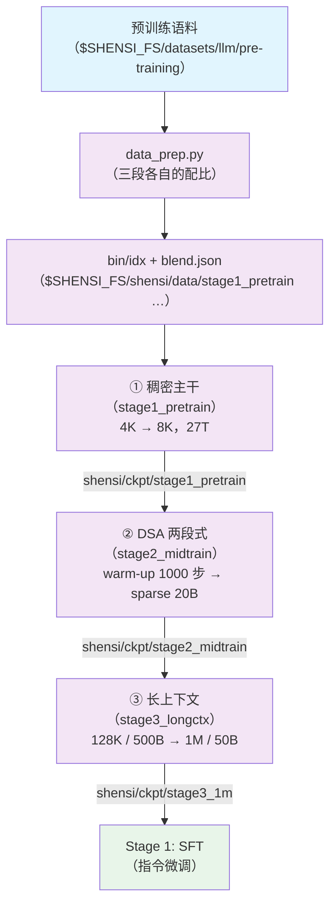

# Stage 0: 预训练

把基座从零训到 1M 上下文窗口，分三段：稠密主干 → DSA 两段式引入 → 长上下文扩展。

## 总览

每个子 stage 都是同一套文件：`train.py`（入口，`--profile` / `--config`）、`data_prep.py`
（语料 → bin/idx）、`test_train.py`（tiny 几何 5 步的集成测试）、`config/`（`default.yaml` / `tiny.yaml`
冒烟档 / `debug.yaml` 极小档 / 对照档）、`config/data_prep/`（配比 json + 数据准备档）。

| 组件 | 做什么 |
|------|--------|
| [`stage1_pretrain/`](./stage1_pretrain/README.md) | ① 稠密主干（`csa_dense_mode: true`，indexer 不参与），4K → 8K，27T 量级 |
| [`stage2_midtrain/`](./stage2_midtrain/README.md) | ② 32K；DSA 两段式：`dsa_warmup`（冻主干只训 indexer，1000 步）→ sparse adaptation（20B tokens） |
| [`stage3_longctx/`](./stage3_longctx/README.md) | ③ 长上下文：128K / 500B → 1M / 50B，长文档 up-sample |
| [`../common/codev3.py`](../common/codev3.py) | 只有元数据的代码数据集 → 按 `repo/rel_path@commit` 回代码托管平台落地文本 |
| [`../common/fetch_code_from_metadata.py`](../common/fetch_code_from_metadata.py) | 同一件事的独立小工具 |

| 段 | 序列长度 | token 预算 | 关键开关 |
|----|---------|-----------|---------|
| ① 稠密主干 | 4096 → 8192 | 27T | `csa_dense_mode: true`（indexer KL 为 0） |
| ② warm-up | 32768 | 1000 步 | `csa_dense_mode: false` + `dsa_indexer_use_sparse_loss: false` + `shensi_freeze: indexer` |
| ② sparse adaptation | 32768 | 20B | `dsa_indexer_use_sparse_loss: true`（KL 目标切到 top-k 集合） |
| ③ 长上下文 | 131072 → 1048576 | 500B → 50B | 稀疏注意力保持打开，YaRN factor 16 / 原位置 65536 |

## 快速开始

### 集成测试（闸门）

```bash
# tiny 几何 + 本段档，5 步判 PASS/FAIL（没准备语料就退回 mock 数据）
cd stage1_pretrain && python test_train.py
```

### 真实语料的极小档

```bash
python data_prep.py --discover                 # 看语料面貌（格式 / 条数 / 字段名 / 权重）
python data_prep.py --prepare --config config/data_prep/tiny.yaml
python train.py --profile debug                # 单卡 5 步
```

### 三段连跑（正式）

```bash
cd stage1_pretrain && python data_prep.py --prepare && python train.py --tokens 27e12
cd ../stage2_midtrain && python data_prep.py --prepare && python train.py --profile dsa_warmup
cd ../stage3_longctx && python data_prep.py --prepare && python train.py --tokens 500e9
```

日志实时写 `<exp_dir>/logs/host_0_localhost.output`；`train.py --dry-run` 只写 run 目录并打印 torchrun 命令。
早停看门狗在三段都默认开（盯 `lm loss value`，patience=3、grace=600s；`--no-early-stop` 关掉）：
步数给大、收尾交给它。

## 数据准备

语料放 `$SHENSI_FS/datasets/llm/pre-training/` 下（目录名 = 配比里的 `name`，云端仓库的组织前缀不带进本地目录名）。
三段各有一份 `config/data_prep/data_blend_raw.json`，后两段用 `base:` 继承上一段的权重、只改 `min_chars`
与个别权重；`--prepare` 把它们分别编码成 `.bin/.idx` + `blend.json`。

### Pipeline

1. **发现语料** → `--discover` 打印语料面貌（格式 / 条数 / 字段名 / 权重）；
2. **落地元数据类数据** → 只有元数据的代码数据集要先跑 `--codev3` 回捞文本（见下节）；
3. **编码** → `--prepare` 产出 `.bin/.idx`（一篇文章一条样本 + 尾部 EOD）与 `blend.json`
   （权重 × 前缀，交错；`train.py` 自动注入 `data_path`），同时留一份 `.jsonl` 中间文本便于回查。

### CLI 命令

```bash
python data_prep.py --discover | --prepare [选项]
```

| 选项 | 说明 |
|------|------|
| `--discover` | 只扫描并打印语料面貌 |
| `--prepare` | 产出 `.bin/.idx` 与 `blend.json` |
| `--config <档>` | 数据准备档（`config/data_prep/{default,tiny}.yaml`，档里的 `blend` / `limit` / `only` / `data_dir` 并进本次参数） |
| `--blend <json>` | 换一份配比（默认 `config/data_prep/data_blend_raw.json`） |
| `--limit N` / `--only <子串>` | 每个数据集最多取 N 条 / 只处理名字含子串的数据集（冒烟用） |
| `--root` / `--out` / `--tokenizer` | 语料根 / 产物目录 / tokenizer 目录（默认取 `SHENSI_FS` / `SHENSI_TOKENIZER`） |
| `--workers N` | 并行度（默认 32） |
| `--skip-missing` | 语料没齐时跳过缺的数据集（默认遇到缺的就停下报错） |
| `--include-metadata-only` | 把「只有元数据」的数据集当硬报错（提醒先回捞文本） |
| `--codev3`（+ `--hf-sample N`） | 见「Code-v3」一节 |

### 输入

- 语料根：`$SHENSI_FS/datasets/llm/pre-training/`（默认，`--root` 可改）；
- 配比：三段各自的 `config/data_prep/data_blend_raw.json`（后两段带 `base:` 继承链）+ 冒烟用的小配比；
- tokenizer：`$SHENSI_TOKENIZER`。

### 输出

产物落在 `$SHENSI_FS/shensi/data/<stage>/`：

```
<stage>/
├── <数据集>__<config>_text_document.bin / .idx   # 一篇文章一条样本 + 尾部 EOD
├── <数据集>__<config>.jsonl                      # 编码前的中间文本（便于回查）
└── blend.json                                    # 权重 × 前缀（交错），train.py 自动注入 data_path
```

### 语料构成（域与权重）

具体数据集目录名见各段配比 json（跑 `--discover` 看实际列名与条数）；这里按域给出构成与权重：

| 域 | 构成 | 权重 | 文本列 |
| --- | --- | --- | --- |
| 英文网页 | 高质量网页族（含 DQA / 合成 / 译英子集）、通用网页 baseline、教育网页 | 0.40 | `text` |
| 中文与多语 | 多语 wiki（只取英文档）、中文通用网页、中文教育网页 | 0.08 | `text` |
| 代码 | 代码网页、合成代码 / 问答 / 改写 / 转译、公开代码集（含按语言分的子集） | 0.35 | `text` / `content` |
| 数学与科学 | 数学网页（两个子集）、数学合集、综合合集 | 0.09 | `text` / `content` |
| 专门领域 | 代码概念 / 形式逻辑 / 事实检索 / 生成式 / 判例 / 类 SFT 合成（小权重） | 0.08 | `text` |
| 只有元数据 | 代码元数据（`repo / rel_path / language / commit_id` 四列，1.46 亿行） | 0.03（含在代码域内） | 无（先 `--codev3` 落地） |

文本列对应配比里的 `text_key`，留空表示自动探测（`text` / `content` / `raw_content` …）。

### Code-v3：只有元数据时的文本落地

只有元数据的代码数据集没有文本（`repo / rel_path / language / commit_id` 四列、1.46 亿行）。`codev3.py`
先读元数据（本地 parquet/jsonl 或 `--hf-sample N`），按 `(repo, rel_path)` 与 v1/v2 分类（重叠且 commit
相同 / 重叠但 commit 变了 / v3 增量），再按代码托管平台的 raw 地址模板（`<repo>/<commit>/<rel_path>`）落地
文本（带本地文本缓存与账本：404 / 跳过扩展名 / 超体积 / 太短）。

```bash
cd stage1_pretrain
python data_prep.py --codev3 --hf-sample 40 --limit 20   # 调试：分类 + 抓 20 条
python ../common/codev3.py --selftest                     # 离线自检
python data_prep.py --prepare                             # 落地产物自动进 blend
```

## 训练

三段共用一套结构（`train/system` 并行与显存、`train/model` 几何与优化器、`train/data` 语料），差异只在档里。

### CLI 命令

```bash
python train.py [选项] [--set k=v ...]
```

| 选项 | 说明 |
|------|------|
| `--profile <档>` / `--config <路径>` | 选档（两者等价，例：`--config config/tiny.yaml`） |
| `--smoke` | 跑仓库内 tiny 配置 5 步 |
| `--tokens N` | 按 token 预算换算 `train_iters = N / (global_batch_size × seq_length)` |
| `--data-dir <目录>` | 预处理产物目录（含 `blend.json`，默认 `$SHENSI_FS/shensi/data/<stage>`） |
| `--set k=v` | 点号键覆写，可多次 |
| `--dry-run` | 只打印命令，不启动 |
| `--early-stop N` / `--no-early-stop` / `--early-stop-grace S` | 早停耐心（默认 3）/ 关掉 / 宽限秒数（默认 600） |

### 档位与配置文件

| 档 | 用途 | 关键差异 |
|----|------|---------|
| `stage1_pretrain/config/{default,tiny,debug,adamw,lion,muon,ademamix,grokfast}.yaml` | ① 主预训练 | 全量档 GBS 128 / 35 层 / 8K / `mtp_num_layers: 3`；`tiny` 冒烟；`debug` 2 层小几何；对照档换优化器 |
| `stage2_midtrain/config/{default,tiny,debug,dsa_warmup,mtp_draft}.yaml` | ② 中训练 | `dsa_warmup` 冻主干只训 indexer（LR 5e-3 常数）；`mtp_draft` 冻主干只训 MTP |
| `stage3_longctx/config/{default,tiny,debug,1m}.yaml` | ③ 长上下文 | `1m` 把 `seq_length` 拉到 1048576、CP 8 |

`--profile tiny` 是 mock 档（2 层 / hidden 128 / seq 128 / 5 步，不碰语料）：即使数据目录里已经有
`blend.json`，也不会被注入 `data_path`；层计划用**名字式**（`shensi_attn_layer_types`），并把生产档的
数值式 `shensi_compress_ratios` 显式清空（两种形式在 mcore 里互斥）。

### 覆写示例

```bash
python train.py --set train.model.global_batch_size=256        # 改超参
python train.py --profile muon --set experiment.load=<ckpt>    # 从某个 ckpt 续
python train.py --early-stop 20                                # 换耐心（默认 3）
```

`experiment.load` 默认接上一段的产物；从头跑就把 `experiment.load` 与
`train.system.checkpoint.load` 设为空。所有 `train.py` 都是前台等返回码，串接多段直接顺序执行即可。

### 优化器

AdaMuon（矩阵腿）+ AdEMAMix（标量腿），两条腿共用一条 LR 曲线；生产档关掉 LayerWise 的
shard-aligned param layout（`no_use_layer_wise_param_layout`），两条腿都进 LayerWise，优化器状态可存可续。

## 验证

| 段 | 判据 |
| --- | --- |
| ① 稠密主干 | `validation loss` 稳定下行；三个 loss 列都在日志里；ckpt 可存可续（`torch_dist`，含优化器状态） |
| ② warm-up | `indexer loss` 非零并下降，且**主干权重逐位不变**（`--shensi-freeze indexer`） |
| ② sparse | `indexer loss` 继续下降；`lm loss` 不因切稀疏跳变 |
| ③ 长上下文 | 长度切换后 `lm loss` 无台阶式恶化；1M 档不 OOM；长文检索抽测通过 |

集成测试：`python test_train.py`（tiny 几何 5 步 + 收尾校验）。本机实测（单卡 RTX 5080 16G）：
三段 `--profile tiny` 真跑 rc=0（stage1_pretrain / stage2_midtrain / stage3_longctx 各 5 步、
按 `experiment.load` 接力存盘）；三段闸门（`test_train.py`）全 PASS，命令里带
`--optimizer adaptive_muon --muon-scalar-optimizer ademamix`；三段按顺序连着跑迭代号连续（5 → 10 → 15）；
优化器状态往返（第 5 步存 → 从 `iter_0000005` 续训到 10）通过，检查点里
`exp_avg` / `exp_avg_sq` / `exp_avg_slow` / `momentum_buffer` 齐全。

## 局限

1. 全规模收敛未验收（只跑过极小几何与集成测试）；
2. 云端数据集的实际列名与分片以 `--discover` 实测为准，blend 里给的是预期值；
3. MTP 与 mHC 可同开（1 / 2 层极小档都跑过）；生产档 `mtp_num_layers: 3`；
4. 优化器只在极小几何上验过"跑得通、存得住、续得上"；分布式 + LayerWise 默认 layout 下保存优化器状态
   会撞上游断言（`muon + lion` 旧口径同样撞），生产档已关掉 layout 规避。

## 产物流



## 下一步

预训练完成后进 [Stage 1: SFT](../stage1_sft/README.md) 做指令微调。

## 前序阶段

Stage 0 是流水线起点（上游只有原始语料与几何口径）：语料放 `$SHENSI_FS/datasets/llm/pre-training/`，
模型几何、档位命名与公共件见 [配方 README](../README.md)。
