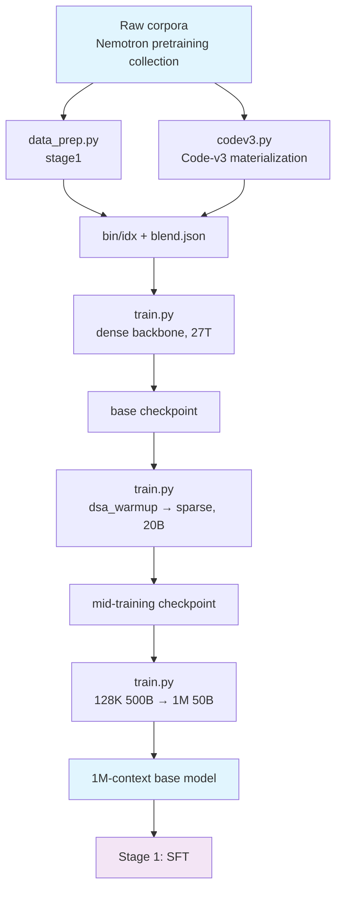

# Stage 0: Pretraining

Build the base model from scratch up to a 1M-token context window in three segments: dense backbone →
two-phase DSA introduction → long-context extension.

## Overview

| Component | Description |
|-----------|-------------|
| [`stage1_pretrain/`](./stage1_pretrain/README.md) | 1) Dense backbone (`csa_dense_mode: true`, the indexer stays out), 4K → 8K, on the order of 27T tokens |
| [`stage2_midtrain/`](./stage2_midtrain/README.md) | 2) 32K; two-phase DSA: `dsa_warmup` (frozen backbone, indexer only, 1000 steps) → sparse adaptation (20B tokens) |
| [`stage3_longctx/`](./stage3_longctx/README.md) | 3) Long context: 128K / 500B → 1M / 50B, with long documents up-sampled |
| `codev3.py` | `Nemotron-Pretraining-Code-v3` ships metadata only → fetch the text from GitHub by `repo/rel_path@commit` |
| `fetch_code_from_metadata.py` | The same job as a standalone small tool (for when you only need one batch of metadata) |

| Segment | Sequence length | Token budget | Key switches |
|---------|-----------------|--------------|--------------|
| 1) Dense backbone | 4096 → 8192 | 27T | `csa_dense_mode: true` (of the three losses, indexer KL is 0) |
| 2) warm-up | 32768 | 1000 steps | `csa_dense_mode: false` + `dsa_indexer_use_sparse_loss: false` + `shensi_freeze: indexer` |
| 2) sparse adaptation | 32768 | 20B | `dsa_indexer_use_sparse_loss: true` (KL target switches to the selected top-k set) |
| 3) Long context | 131072 → 1048576 | 500B → 50B | sparse attention stays on; YaRN factor 16 / original position 65536 |

Each sub-stage contains `train.py` (entry point), `data_prep.py` (corpora → bin/idx),
`test_train.py` (5 steps at tiny geometry) and `config/` (`default.yaml` production +
`debug.yaml` tiny + comparison profiles).

## Quick Start

```bash
# Integration test: tiny geometry + this stage's profile, 5 steps, PASS/FAIL (falls back to mock data)
cd stage1_pretrain && python test_train.py

# Tiny run on real corpora
python data_prep.py --discover                 # corpus shape (format / rows / field names / weights)
python data_prep.py --prepare --blend config/data_prep/debug_sample.json
python train.py --profile debug                # 5 steps on one GPU

# The three segments back to back (production)
cd stage1_pretrain && python data_prep.py --prepare && python train.py --tokens 27e12
cd ../stage2_midtrain && python data_prep.py --prepare && python train.py --profile dsa_warmup
cd ../stage3_longctx && python data_prep.py --prepare && python train.py --tokens 500e9
```

The log streams to `<exp_dir>/logs/host_0_localhost.output`; `train.py --dry-run` only writes the run
directory and prints the torchrun command. The early-stop watchdog is on by default in all three
segments (metric `lm loss value`, patience=3, grace=600s; `--no-early-stop` turns it off) — give the
step count room and let it end the run, see the
[recipe overview's "Early Stopping"](../README.md#early-stopping).

## Data Preparation

Corpora live under `$SHENSI_FS/datasets/llm/pre-training/<directory>/`, with directory names dropping
HuggingFace's `nvidia/` prefix. Each of the three segments has a `config/data_prep/data_blend_raw.json`;
the later two `base:`-inherit the previous segment's weights and only change `min_chars` and a few
weights. `--prepare` encodes each blend into `.bin/.idx` plus `blend.json`.

Output (`$SHENSI_FS/shensi/data/<stage>/`):

```text
<stage>/
├── <dataset>__<config>_text_document.bin / .idx   # one document per sample, trailing EOD
├── <dataset>__<config>.jsonl                      # intermediate text before tokenization (for lookup)
└── blend.json                                     # weights x prefixes, injected as data_path by train.py
```

Every source comes from the
[nemotron-pre-training-datasets](https://huggingface.co/collections/nvidia/nemotron-pre-training-datasets)
collection, weighted by domain:

| Domain | Datasets (directory names) | Text column |
|--------|----------------------------|-------------|
| English web | `Nemotron-CC-v2.1` (High-Quality / -DQA / -Synthetic / -Translated-To-English, ...), `DCLM-Baseline`, `FineWeb-Edu` | `text` |
| Chinese / multilingual | `FineWiki` (`en`), `SkyPile-150B`, `Fineweb-Edu-Chinese-V2.2` | `text` |
| Code | `Nemotron-CC-Code-v1`, `Nemotron-Pretraining-Code-v1`, `-v2` (the Synthetic-* configs), `OpenCoder-Pretrain`, `Ultra-FineWeb-L3`, `UltraData-Code` | `text` / `content` |
| Math and science | `Nemotron-CC-Math-v1`, `UltraData-Math`, `UltraX-Preview` | `text` / `content` / `cleaned_content` |
| Specialized | `Nemotron-Pretraining-Specialized-v1/v1.1/v1.2`, `Nemotron-Pretraining-Legal-v1`, `Nemotron-Pretraining-SFT-v1` (SFT-like synthetic, low weight) | `text` |
| Metadata only | `Nemotron-Pretraining-Code-v3` | none (see below) |

`data_prep.py --prepare` explicitly skips metadata-only datasets (`--include-metadata-only` makes them a
hard error instead); run `--codev3` first to materialize their text, which then joins the blend
automatically.

### Code-v3: materializing text from metadata

`Nemotron-Pretraining-Code-v3`'s `Nemotron-Code-Metadata` only carries `repo / rel_path / language /
commit_id` (146M rows, no text). `codev3.py` does three things:

1. **Read the metadata**: local parquet/jsonl (`--v1-meta/--v2-meta/--v3-meta`) or HF sampling
   (`--hf-sample N`, so debugging does not download everything);
2. **Classify against v1/v2**: per `(repo, rel_path)`, label every v3 row as "overlaps v1/v2 with the
   same commit / overlaps with a changed commit / new in v3", and report the reverse coverage (how much
   of the v1/v2 list is still in v3). v1/v2's `Synthetic-*` configs carry only a dataset-level
   `seed_source`, not file-level keys, so v1/v2 contribute a **file list** (to avoid duplicate fetches
   and duplicate training), not text;
3. **Materialize the text**: check the local text cache first (`--text-cache`; any file with
   `repo/rel_path + text/content` is reusable), otherwise fetch
   `raw.githubusercontent.com/<repo>/<commit>/<rel_path>` (percent-encoded), producing `{"text": ...}`
   jsonl (first line `# repo/rel_path @ commit`) plus a ledger of misses (404 / skipped extension /
   too large / too short).

```bash
cd stage1_pretrain
python data_prep.py --codev3 --hf-sample 40 --limit 20       # debug: classify + fetch 20 files
python data_prep.py --codev3 --v1-meta <v1 metadata> --v2-meta <v2> --v3-meta <v3>   # production
python ../codev3.py --selftest                                # offline self-test (classification/URL escaping/cache/ledger)
python data_prep.py --prepare                                  # the materialized text joins the blend
```

## Training

All three segments share one structure (`train/system` for parallelism and precision, `train/model` for
geometry and optimizer, `train/data` for the corpora); only the profiles differ:

| Profile | Purpose | Key differences |
|---------|---------|-----------------|
| `stage1_pretrain/config/{default,debug,adamw,lion,muon,ademamix}.yaml` | 1) Main pretraining | production: GBS 128 / 35 layers / 8K / `mtp_num_layers: 3`; `debug` is a 2-layer tiny geometry; four comparison profiles swap the optimizer |
| `stage2_midtrain/config/{default,debug,dsa_warmup,mtp_draft}.yaml` | 2) Mid-training | `dsa_warmup` freezes the backbone and trains the indexer only (constant LR 5e-3); `mtp_draft` freezes everything but MTP |
| `stage3_longctx/config/{default,debug,1m}.yaml` | 3) Long context | `1m` raises `seq_length` to 1048576 with CP 8 |

Overriding and debugging:

```bash
python train.py --set train.model.global_batch_size=256        # change a hyperparameter
python train.py --profile muon --set experiment.load=<ckpt>    # continue from a checkpoint
python train.py --early-stop 20                                # change the patience (default 3)
```

`experiment.load` points at the previous segment's artifact by default (stage2 loads
`stage1_pretrain`, stage3 loads `stage2_midtrain`); to start from scratch clear `experiment.load` and
`train.system.checkpoint.load`.

## Verification

| Segment | Criteria |
|---------|----------|
| 1) Dense backbone | `validation loss` trends down; all three loss columns appear in the log; checkpoints save and resume (`torch_dist`) |
| 2) warm-up | `indexer loss` is non-zero and decreasing while **the backbone weights are bit-identical** (`--shensi-freeze indexer`) |
| 2) sparse | `indexer loss` keeps decreasing; `lm loss` shows no step when switching to sparse |
| 3) Long context | No step-change in `lm loss` after the length switch; the 1M profile fits in memory; long-document retrieval spot checks pass |

Integration tests (each segment runs standalone): `python test_train.py` (tiny geometry, 5 steps plus
the end-of-run checks; criteria in the
[recipe overview's "Integration Tests"](../README.md#integration-tests)).

**Local verification** (WSL2 + RTX 5080 16G, single GPU): the three segments ran back to back with
**continuous** iteration numbers (mcore's counter carries across segments):

```bash
cd stage1_pretrain   && python data_prep.py --prepare --blend config/data_prep/debug_sample.json --limit 200 \
                     && python train.py --profile debug            # 5/5 steps, saved iter_0000005
cd ../stage2_midtrain && python train.py --profile debug            # loaded iter 5 → ran to 10
cd ../stage3_longctx  && python train.py --profile debug            # loaded iter 10 → ran to 15
```

Each `debug` profile carries its own `checkpoint.load` pointing at the previous segment's artifact, so
running `--profile debug` alone continues the chain; to start over, clear `experiment.load` and
`train.system.checkpoint.load`.

## Artifact Lineage



## Limitations

1. Full-scale convergence is not verified (only tiny geometry and the integration tests have run);
2. The three long-context corpus kinds are in place (natural long documents up-sampled, plus locally
   produced synthetic and MRCR-style data), see
   [`stage3_longctx/README.md`](./stage3_longctx/README.md);
3. Actual column names and shards of the cloud datasets must be confirmed with `--discover`; the tables
   in this README and in the blends are the expected values;
4. MTP and mHC run together (the Bridge side ships an mHC-aware MTP layer with a functional test); tiny
   runs exercised 1 and 2 layers (the logs show `mtp_1`/`mtp_2` loss).

## Next Steps

Once pretraining completes, proceed to [Stage 1: SFT](../stage1_sft/README.md) for instruction tuning.
Training-time potholes (SM120, the ray memory budget, pinning the vLLM version) are in the
[recipe overview's "Environment Notes"](../README.md#environment-notes).
