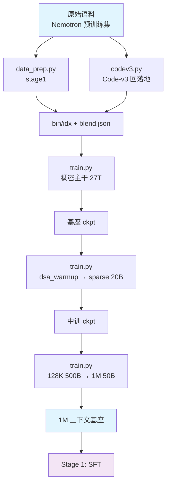

# Stage 0: 预训练

把基座从零训到 1M 上下文窗口，分三段：稠密主干 → DSA 两段式引入 → 长上下文扩展。

## 总览

| 组件 | 做什么 |
|------|--------|
| [`stage1_pretrain/`](./stage1_pretrain/README.md) | ① 稠密主干（`csa_dense_mode: true`，indexer 不参与），4K → 8K，27T 量级 |
| [`stage2_midtrain/`](./stage2_midtrain/README.md) | ② 32K；DSA 两段式：`dsa_warmup`（冻主干只训 indexer，1000 步）→ sparse adaptation（20B tokens） |
| [`stage3_longctx/`](./stage3_longctx/README.md) | ③ 长上下文：128K / 500B → 1M / 50B，长文档 up-sample |
| `codev3.py` | `Nemotron-Pretraining-Code-v3` 只有元数据 → 按 `repo/rel_path@commit` 回 GitHub 落地文本 |
| `fetch_code_from_metadata.py` | 同一件事的独立小工具（只需要一批元数据时用它） |

| 段 | 序列长度 | token 预算 | 关键开关 |
|----|---------|-----------|---------|
| ① 稠密主干 | 4096 → 8192 | 27T | `csa_dense_mode: true`（三个 loss 里 indexer KL 为 0） |
| ② warm-up | 32768 | 1000 步 | `csa_dense_mode: false` + `dsa_indexer_use_sparse_loss: false` + `shensi_freeze: indexer` |
| ② sparse adaptation | 32768 | 20B | `dsa_indexer_use_sparse_loss: true`（KL 目标切到 top-k 集合） |
| ③ 长上下文 | 131072 → 1048576 | 500B → 50B | 稀疏注意力保持打开，YaRN factor 16 / 原位置 65536 |

每个子 stage 里都有 `train.py`（入口）、`data_prep.py`（语料 → bin/idx）、`test_train.py`（tiny 几何跑 5 步）、
`config/`（`default.yaml` 全量档 + `debug.yaml` 极小档 + 对照档）。三段共用一套优化器口径
（[`AdaMuon（矩阵腿）+ AdEMAMix（标量腿）`](../README.md#优化器)，与 SFT / RL 相同）。

## 快速开始

```bash
# 集成测试：tiny 几何 + 本段档，5 步判 PASS/FAIL（没准备语料就退回 mock 数据）
cd stage1_pretrain && python test_train.py

# 真实语料的极小档
python data_prep.py --discover                 # 看语料面貌（格式 / 条数 / 字段名 / 权重）
python data_prep.py --prepare --blend config/data_prep/debug_sample.json
python train.py --profile debug                # 单卡 5 步

# 三段连跑（正式）
cd stage1_pretrain && python data_prep.py --prepare && python train.py --tokens 27e12
cd ../stage2_midtrain && python data_prep.py --prepare && python train.py --profile dsa_warmup
cd ../stage3_longctx && python data_prep.py --prepare && python train.py --tokens 500e9
```

日志实时写 `<exp_dir>/logs/host_0_localhost.output`；`train.py --dry-run` 只写 run 目录并打印 torchrun 命令。
早停看门狗在三段都**默认开**（盯 `lm loss value`，patience=3、grace=600s；`--no-early-stop` 关掉）——
步数给大、收尾交给它，口径见[配方总览的「早停」](../README.md#早停)。

## 数据准备

语料放 `$SHENSI_FS/datasets/llm/pre-training/<目录名>`，目录名去掉 HuggingFace 的 `nvidia/` 前缀。
三段各有一份 `config/data_prep/data_blend_raw.json`，后两段用 `base:` 继承上一段的权重、只改
`min_chars` 与个别权重；`--prepare` 把它们分别编码成 `.bin/.idx` + `blend.json`。

产物（`$SHENSI_FS/shensi/data/<stage>/`）：

```text
<stage>/
├── <数据集>__<config>_text_document.bin / .idx     # 一篇文章一条样本 + 尾部 EOD
├── <数据集>__<config>.jsonl                        # 编码前的中间文本（便于回查）
└── blend.json                                      # 权重 × 前缀（交错），train.py 自己注入 data_path
```

来源都在 [nemotron-pre-training-datasets](https://huggingface.co/collections/nvidia/nemotron-pre-training-datasets)
集合里，按域加权：

| 域 | 数据集（目录名） | 文本列 |
| --- | --- | --- |
| 英文网页 | `Nemotron-CC-v2.1`（High-Quality / -DQA / -Synthetic / -Translated-To-English 等）、`DCLM-Baseline`、`FineWeb-Edu` | `text` |
| 中文与多语 | `FineWiki`（`en`）、`SkyPile-150B`、`Fineweb-Edu-Chinese-V2.2` | `text` |
| 代码 | `Nemotron-CC-Code-v1`、`Nemotron-Pretraining-Code-v1`、`-v2`（Synthetic-* 系列）、`OpenCoder-Pretrain`、`Ultra-FineWeb-L3`、`UltraData-Code` | `text` / `content` |
| 数学与科学 | `Nemotron-CC-Math-v1`、`UltraData-Math`、`UltraX-Preview` | `text` / `content` / `cleaned_content` |
| 专门领域 | `Nemotron-Pretraining-Specialized-v1/v1.1/v1.2`、`Nemotron-Pretraining-Legal-v1`、`Nemotron-Pretraining-SFT-v1`（类 SFT 合成，小权重） | `text` |
| 只有元数据 | `Nemotron-Pretraining-Code-v3` | 无（见下节） |

`data_prep.py --prepare` 会**明确跳过**只有元数据的数据集（`--include-metadata-only` 可以放开），
先跑 `--codev3` 落地文本，落地后自动进 blend。

### Code-v3：只有元数据时的文本落地

`Nemotron-Pretraining-Code-v3` 的 `Nemotron-Code-Metadata` 只有 `repo / rel_path / language / commit_id`
（1.46 亿行，没有文本）。`codev3.py` 做三件事：

1. **读元数据**：本地 parquet/jsonl（`--v1-meta/--v2-meta/--v3-meta`）或 HF 采样（`--hf-sample N`，调试不下载全量）；
2. **在 v1/v2 基础上分类**：按 `(repo, rel_path)` 把 v3 逐行判成"与 v1/v2 重叠且 commit 相同 / 重叠但 commit 变了 /
   v3 增量"，并给出反向覆盖（v1/v2 的清单有多少还在 v3 里）。v1/v2 的 `Synthetic-*` 配置只有数据集级
   `seed_source`、没有文件级键，不能按文件对接，所以 v1/v2 给的是**文件清单**（避免重复抓/重复训），不是文本；
3. **落地文本**：先查本地文本缓存（`--text-cache`，任何含 `repo/rel_path + text/content` 的文件都能复用），
   未命中再按 `raw.githubusercontent.com/<repo>/<commit>/<rel_path>` 取（路径 percent-encode），
   产出 `{"text": ...}` jsonl（正文首行 `# repo/rel_path @ commit`）+ 账本（404 / 跳过扩展名 / 超体积 / 太短）。

```bash
cd stage1_pretrain
python data_prep.py --codev3 --hf-sample 40 --limit 20       # 调试：分类 + 抓 20 条
python data_prep.py --codev3 --v1-meta <v1元数据> --v2-meta <v2> --v3-meta <v3>    # 正式
python ../codev3.py --selftest                                # 离线自检（分类/URL 转义/缓存/账本）
python data_prep.py --prepare                                  # 落地产物自动进 blend
```

## 训练

三段共用一套结构（`train/system` 并行与显存、`train/model` 几何与优化器、`train/data` 语料），差异只在档里：

| 档 | 用途 | 关键差异 |
|----|------|---------|
| `stage1_pretrain/config/{default,debug,adamw,lion,muon,ademamix,grokfast}.yaml` | ① 主预训练 | 全量档 GBS 128 / 35 层 / 8K / `mtp_num_layers: 3`；`debug` 是 2 层小几何；对照档换优化器口径 |
| `stage2_midtrain/config/{default,debug,dsa_warmup,mtp_draft}.yaml` | ② 中训练 | `dsa_warmup` 冻主干只训 indexer（LR 5e-3 常数）；`mtp_draft` 冻主干只训 MTP |
| `stage3_longctx/config/{default,debug,1m}.yaml` | ③ 长上下文 | `1m` 把 `seq_length` 拉到 1048576、CP 8 |

覆写与调试：

```bash
python train.py --set train.model.global_batch_size=256        # 改超参
python train.py --profile muon --set experiment.load=<ckpt>    # 从某个 ckpt 续
python train.py --early-stop 20                                # 换耐心（默认 3）
```

`experiment.load` 默认接上一段的产物（stage2 接 `stage1_pretrain`、stage3 接 `stage2_midtrain`），
从头跑就把 `experiment.load` 与 `train.system.checkpoint.load` 设为空。

## 验证

| 段 | 判据 |
| --- | --- |
| ① 稠密主干 | `validation loss` 稳定下行；三个 loss 列都在日志里；ckpt 可存可续（`torch_dist`，含优化器状态） |
| ② warm-up | `indexer loss` 非零并下降，且**主干权重逐位不变**（`--shensi-freeze indexer`） |
| ② sparse | `indexer loss` 继续下降；`lm loss` 不因切稀疏跳变 |
| ③ 长上下文 | 长度切换后 `lm loss` 无台阶式恶化；1M 档不 OOM；长文检索抽测通过 |

集成测试（每段都能单独跑）：`python test_train.py`（tiny 几何 5 步 + 收尾校验，判据见
[配方总览的「验证」](../README.md#验证)）。本轮优化器改动后，三段闸门都跑在
`--optimizer adaptive_muon --muon-scalar-optimizer ademamix` 上并通过。

**本机实跑记录**（WSL2 + RTX 5080 16G，单卡）：三段按顺序连着跑，迭代号是**连续**的
（mcore 的迭代计数跨阶段接着算）：

```bash
cd stage1_pretrain   && python data_prep.py --prepare --blend config/data_prep/debug_sample.json --limit 200 \
                     && python train.py --profile debug            # 5/5 步，存 iter_0000005
cd ../stage2_midtrain && python train.py --profile debug            # 载入 iter 5 → 跑到 10
cd ../stage3_longctx  && python train.py --profile debug            # 载入 iter 10 → 跑到 15
```

优化器状态往返（同一 stage 单卡）：第 5 步存（含优化器状态）→ `--load <ckpt 根目录>` 续训到 10
（`successfully loaded checkpoint ... at iteration 5`）；检查点元数据里 AdEMAMix 的三种状态键
（`exp_avg` / `exp_avg_sq` / `exp_avg_slow`）与 AdaMuon 的 `momentum_buffer` 都在。

每段的 debug 档都自带 `checkpoint.load`（指向上一环的产物），所以单独跑 `--profile debug` 就能接上。

## 产物链路



## 局限

1. 全规模收敛未验收（只跑过极小几何与集成测试）；
2. 长上下文段的三类语料已就位（自然长文档 up-sample / 本地产出的合成与 MRCR 类），
   详见 [`stage3_longctx/README.md`](./stage3_longctx/README.md)；
3. 云端数据集的实际列名与分片以 `--discover` 实测为准，本 README 与 blend 里给的是预期值；
4. MTP 与 mHC 可同开（Bridge 侧有 mHC 感知的 MTP 层与功能测试），极小档把 1 层与 2 层都真跑过
   （日志里有 `mtp_1`/`mtp_2` loss）；
5. 优化器只在本机极小几何上验过"跑得通、存得住、续得上"；分布式 + LayerWise 下保存优化器状态会撞
   mcore 的断言（`muon + lion` 旧口径同样撞，与优化器无关），本机极小档都用非分布式档位。

## 下一步

预训练完成后进 [Stage 1: SFT](../stage1_sft/README.md) 做指令微调。环境相关的实测坑（SM120 / ray 内存账 /
vllm 版本钉法）见[配方总览的「环境注意事项」](../README.md#环境注意事项实测)。
