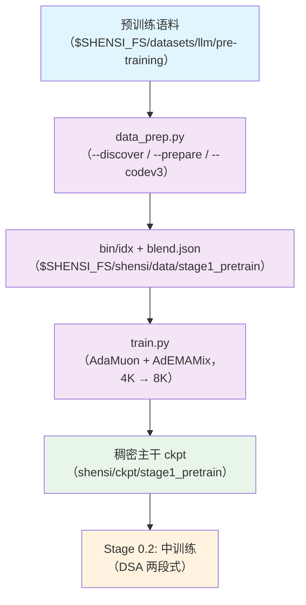

# Stage 0.1: 主预训练（稠密主干）

预训练第一段：用短序列把主干训起来，**不引入 DSA**（`csa_dense_mode: true`，Lightning Indexer 不参与），
27T 语料量级。DSA 与长上下文在 [`../stage2_midtrain`](../stage2_midtrain/README.md) /
[`../stage3_longctx`](../stage3_longctx/README.md) 引入。

## 总览

| 组件 | 做什么 |
|------|--------|
| `train.py` | 入口：`--profile` / `--config` 选档、`--smoke`、`--tokens` 按预算换算 `train_iters`、`--set` 覆写 |
| `test_train.py` | 集成测试：tiny 几何 + 本档，5 步判 PASS/FAIL |
| `data_prep.py` | 语料 → mcore `.bin/.idx` + `blend.json`（`--discover` / `--prepare` / `--codev3`） |
| `config/` | `default.yaml`（全量）+ `tiny.yaml`（冒烟）+ `debug.yaml`（极小）+ 五个优化器对照档 |
| `config/data_prep/` | `data_blend_raw.json` / `data_blend_tiny.json` + `default.yaml` / `tiny.yaml` |

| 项 | 结论 |
| --- | --- |
| 目标 | 稠密主干收敛到可做中训练的底座；序列 4K 起步、收尾拉到 8K |
| 关键决定 | 优化器用 **AdaMuon（矩阵腿）+ AdEMAMix（标量腿）**，两条腿共用一条 LR 曲线（峰值 2.7e-4） |
| 验收 | 集成测试 5 步 PASS + ckpt 存续往返（含优化器状态）+ 参数路由 / 分裂 / 状态键逐项核对 |

## 快速开始

```bash
python test_train.py                    # 集成测试：tiny 几何 5 步（没准备语料就退回 mock）
python data_prep.py --discover          # 语料面貌（列名 / 条数 / 权重）
python data_prep.py --prepare           # → $SHENSI_FS/shensi/data/stage1_pretrain/{*.bin,*.idx,blend.json}
python train.py --profile tiny          # 冒烟：tiny 几何 + mock 数据 + 5 步（等价 --smoke）
python train.py --profile debug         # 真实语料的极小档（单卡 5 步）
python train.py --tokens 27e12          # 正式跑
```

`--profile tiny` 是 mock 档（不碰语料）：即使 `$SHENSI_FS/shensi/data/stage1_pretrain/blend.json` 已经存在，
也不会被注入 `data_path`（mcore 要求「mock / data-path / data-args」三者恰好给一种）。

`train_iters` 用 token 预算换算：`--tokens 27e12` → `iters = tokens / (global_batch_size × seq_length)`；
同时把 `lr_decay_iters` 钉在这次预算上，之后放大 `train_iters` 不会拉长 LR 余弦退火。

## 数据准备

### Pipeline

1. `--discover` → 语料根 + 各数据集的列名 / 条数 / 权重；
2. `--codev3`（按需）→ 只有元数据的代码集先回捞文本（本段配比里它默认被 `--prepare` 跳过）；
3. `--prepare` → 编码成 `.bin/.idx` 并写 `blend.json`。

### CLI 命令

```bash
python data_prep.py --discover | --prepare [选项]
```

| 选项 | 说明 |
|------|------|
| `--discover` / `--prepare` | 只扫描并打印语料面貌 / 产出 `.bin/.idx` 与 `blend.json` |
| `--config <档>` | 数据准备档（`config/data_prep/{default,tiny}.yaml`） |
| `--blend <json>` | 换一份配比（默认 `config/data_prep/data_blend_raw.json`） |
| `--limit N` / `--only <子串>` | 每个数据集最多取 N 条 / 只处理名字含子串的数据集（冒烟用） |
| `--root` / `--out` / `--tokenizer` | 语料根 / 产物目录 / tokenizer 目录（默认取环境变量） |
| `--workers N` | 并行度（默认 32） |
| `--skip-missing` | 语料没齐时跳过缺的数据集（默认遇到缺的就停下报错） |
| `--include-metadata-only` | 把「只有元数据」的数据集当硬报错（提醒先回捞文本） |
| `--codev3` + `--hf-sample N` | 回捞元数据类数据集的文本；配套 `--only-new` / `--only-carried`（增量 / 已有部分）、`--v1-meta` / `--v2-meta` / `--v3-meta`（本地元数据）、`--text-cache`（命中就不回捞）、`--min-chars` / `--max-bytes`（落地阈值） |

### 输入

- 语料根 `$SHENSI_FS/datasets/llm/pre-training/`；
- `config/data_prep/data_blend_raw.json` 是可直接使用的预训练配比（web / code / math / specialized /
  SFT 合成 / legal），权重和 = 1.0；域的构成与权重见 [`../README.md`](../README.md#数据准备)；
- 极小档用 `config/data_prep/data_blend_tiny.json`；tokenizer 可以是自训的小 tokenizer（`SHENSI_TOKENIZER=<dir>`）。

### 输出

`$SHENSI_FS/shensi/data/stage1_pretrain/`：

```
<数据集>__<config>_text_document.bin / .idx   # 一篇文章一条样本 + 尾部 EOD
<数据集>__<config>.jsonl                      # 编码前的中间文本（便于回查）
blend.json                                    # 权重 × 前缀（交错），train.py 自动注入 data_path
```

只有元数据的数据集（Code-v3）在 `--prepare` 时明确跳过，先跑 `--codev3` 落地文本（见
[`../README.md`](../README.md#数据准备) 的 Code-v3 一节）。

### 配置

| 文件 | 说明 |
|------|------|
| `config/data_prep/data_blend_raw.json` | 生产配比（权重和 = 1.0） |
| `config/data_prep/data_blend_tiny.json` | 冒烟配比 |
| `config/data_prep/default.yaml` | 准备档：`root` / `out` / `tokenizer` / `workers` / `split: 98,1,1` / `append_eod` / `limit` |
| `config/data_prep/tiny.yaml` | 极小档准备口径 |

## 训练

### CLI 命令

```bash
python train.py [选项] [--set k=v ...]
```

| 选项 | 说明 |
|------|------|
| `--profile <档>` / `--config <路径>` | 选档（两者等价，例：`--config config/tiny.yaml`） |
| `--smoke` | 跑仓库内 tiny 配置 5 步 |
| `--tokens N` | 按 token 预算换算 `train_iters`（`27e12` = 正式跑） |
| `--data-dir <目录>` | 预处理产物目录（含 `blend.json`） |
| `--set k=v` | 点号键覆写，可多次 |
| `--dry-run` | 只打印命令，不启动 |
| `--early-stop N` / `--no-early-stop` / `--early-stop-grace S` | 早停耐心（默认 3）/ 关掉 / 宽限秒数（默认 600） |

### 输入 / 输出

- **输入**：`$SHENSI_FS/shensi/data/stage1_pretrain/` 下的 `bin/idx + blend.json`；本段从头训
  （`experiment.load: null`），要续训就 `--set experiment.load=<ckpt>`；
- **输出**：`$SHENSI_FS/shensi/ckpt/stage1_pretrain`（`torch_dist`，含优化器状态；下段
  `stage2_midtrain` 的 `dsa_warmup` 默认接它）。

### 关键配置

| 项 | 值 |
| --- | --- |
| 序列长度 | 4096（主体）→ 8192（收尾，`--set train.model.seq_length=8192`） |
| 全局批 | `global_batch_size: 128`（= micro_batch × DP，按卡数调） |
| 优化器 | AdaMuon（矩阵腿）+ AdEMAMix（标量腿），wd 0.1、grad clip 1.0 |
| 学习率 | 2.7e-4 → 2.7e-5，warmup 3%，cosine；两条腿共用 |
| 并行 | EP=8、TP=1、PP=1、CP=1、distributed optimizer + overlap；生产档 `no_use_layer_wise_param_layout: true` |
| 精度 | bf16 + attention softmax fp32 + allreduce 累加 fp32 |
| MTP | 全量档 `mtp_num_layers: 3`；极小档几何由 `tiny_model.TINY` 注入、MTP 默认 0，要试 `--set train.model.mtp_num_layers=1` |
| loss | aux 0.001 + ERC 1.0/0.5（本段 indexer KL 为 0） |
| 深度连接 | GDAR（AttnRes 的读写）：四门合成一个 `g_scale(4)`（初始 0 → init 精确等于 `prefix + delta`）；`t` 是可学逐通道 log 时间常数；写是 gated delta rule 的闭式解；读 = 白化打分 + Softmax₁；投影是低秩具名对（秩 = `routed_expert_hidden_size`） |

### 优化器

| 参数 | 走哪条腿 |
| --- | --- |
| 2D 矩阵（attention q/kv/o、MLA 的 `linear_q_up_proj` / `linear_o_group_proj`、MoE 专家、latent 投影） | **AdaMuon**：Newton–Schulz 正交化 + 每参数谱尺度 + 第二矩自适应；`muon_split_qkv` 拆 q/kv，再叠加 MLA 的按头（q_up）/ 按组（o_group）切分 |
| embedding / 输出头 / norm / MoE router / mHC 静态与 AttnRes 门控 / 哈希嵌入 / 压缩器位置表 | **AdEMAMix**（换 GrokFastAdamW 用 `--profile grokfast`） |

关键旋钮：`muon_extra_scale_factor: 0.18`（把更新幅度归一到 Adam 系量级，两条腿共用一条 LR）、
`muon_scale_mode: spectral`、`muon_nesterov: true`、`muon_coefficient_type: polar_express` +
`muon_num_ns_steps: 5`、`muon_tp_mode: distributed`；标量腿的 `ademamix_betas` / `ademamix_alpha`。
**不启用 QK-clip**：`qk_layernorm: true` 已把 q/k 归一化。

对照档：`grokfast`（标量腿换 GrokFastAdamW）、`ademamix`（整个模型用 AdEMAMix）、`muon`（quintic + blockwise）、
`adamw`、`lion`（旧口径 Muon + Lion）。七档的同预算对照读数（极小几何 20 步）见
[配方 README 的「优化器」一节](../../README.md#优化器)：Muon 家族三档 `lm loss` 5.75~5.87，
AdamW / Lion / 单 AdEMAMix / 旧口径（Muon + Lion）6.23~6.47；跑法
`python test_train.py --profile <档> --iters 20`。

### 覆写示例

```bash
python train.py --set train.model.global_batch_size=256        # 改超参（按卡数与显存调）
python train.py --set train.model.seq_length=8192              # 收尾拉长序列
python train.py --profile muon --set experiment.load=<ckpt>    # 换优化器对照档 / 从 ckpt 续
```

## 验证

1. **参数路由不变量**：2D 非标量参数在 AdaMuon 那条腿，embedding / 头 / 1D / 名单在标量腿（AdEMAMix）；
2. **MLA Muon Split**：`linear_q_up_proj` 按头切开、`linear_o_group_proj` 按组切开；
3. **两条腿共用一条 LR**，AdaMuon 侧幅度由 `muon_extra_scale_factor` 归一；
4. **训练健康**：loss 有限且两条腿都更新；optimizer state（`exp_avg` / `exp_avg_sq` / `exp_avg_slow` /
   `momentum_buffer`）齐全；
5. **可续训**：极小档 10 步、第 5 步存（含优化器状态）→ 从 `iter_0000005` 载入接着训到 10
   （`successfully loaded checkpoint ... at iteration 5`、`Traceback=0`）；
6. **集成测试**：`python test_train.py` 5 步 PASS。

本机实测：200 步极小档（`--no-early-stop`，`train_iters=200`）loss 6.47 → 3.38，单步中位 241 ms，0 skipped / 0 NaN；冒烟 5/5 步（loss 4.91 → 4.45，日志里能看到标量腿旋钮挂载与接入行）；`--profile debug` 5/5 步
存 `pt_tiny_debug/iter_0000005`；参数分组 / 分裂 / 状态键逐项核对通过。

## 局限

1. 全规模收敛未验收：集成测试与极小档只证明「口径正确、能跑、能续」，token 效率要真机预算；
2. 优化器对照是冒烟级（20 步 × GBS 2 × seq 128，各档自带超参）：能看出 Muon 家族与 AdamW / Lion 的
   量级差，但不构成收敛性结论；`muon_extra_scale_factor` 等系数换规模要重新扫；
3. 极小档的 LR / 批大小与生产档不同，微调（SFT）与 RL 的 LR 沿用各自档位（SFT 侧另有一组 20 步扫描，
   见 [SFT README](../../stage1_sft/README.md)）。

## 产物流



## 下一步

中训练（DSA 两段式）见 [`../stage2_midtrain/README.md`](../stage2_midtrain/README.md)。

## 前序阶段

- [Stage 0: 预训练](../README.md) — 本段是其中第 ① 段；语料与几何口径见该 README 的「数据准备」。
