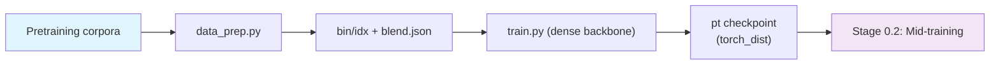

# Stage 0.1: Main Pretraining (Dense Backbone)

The first pretraining segment: train the backbone on short sequences with **no DSA**
(`csa_dense_mode: true`, the Lightning Indexer stays out), on the order of 27T tokens. The architecture
is the family geometry: CSA / HCA compression paths, mHC multi-stream hyper-connections and 3 shared MTP
layers. DSA and long context arrive in
[`../stage2_midtrain`](../stage2_midtrain/README.md) / [`../stage3_longctx`](../stage3_longctx/README.md).

## Overview

| Component | Description |
|-----------|-------------|
| `train.py` | Entry point: `--profile`, `--smoke` (in-repo tiny profile), `--tokens` (budget → `train_iters`), `--set` overrides |
| `test_train.py` | Integration test: tiny geometry + this stage's profile, 5 steps, PASS/FAIL (criteria in the [recipe overview](../../README.md#integration-tests)) |
| `data_prep.py` | Corpora → mcore `.bin/.idx` + `blend.json` (`--discover` / `--prepare` / `--codev3`) |
| `config/` | `default.yaml` (production) + `debug.yaml` (tiny) + `adamw` / `lion` / `muon` / `ademamix` (optimizer comparison) |

| Item | Result |
|------|--------|
| Goal | A dense backbone converged enough to mid-train on; sequences start at 4K and end at 8K |
| Key decision | **Muon (matrices) + Lion (non-matrices)**, both legs sharing a single LR curve (peak 2.7e-4) |
| Acceptance | 5-step integration test PASS + checkpoint save/resume round trip (including optimizer state) + 11 offline optimizer checks |
| Registered, not enabled | CSA2 cross-layer KV reuse / FP4 KV cache / Causal Encoder-Decoder; loss-free bias balancing and IndexShare (this recipe uses the three-loss setup, see the [recipe overview](../../README.md#model-overview)) |

## Quick Start

```bash
python test_train.py                    # integration test: tiny geometry, 5 steps (mock fallback)
python data_prep.py --discover          # corpus shape (columns / rows / weights)
python data_prep.py --prepare           # → $SHENSI_FS/shensi/data/stage1_pretrain/{*.bin,*.idx,blend.json}
python train.py --smoke                 # in-repo tiny profile, a few steps (environment / entry point)
python train.py --profile debug         # tiny run on real corpora (5 steps, one GPU)
python train.py --tokens 27e12          # production
```

`--tokens` converts a budget into steps: `train_iters = tokens / (global_batch_size × seq_length)`, and
pins `lr_decay_iters` to that budget, so raising `train_iters` later does not stretch the LR cosine tail.

## Data Preparation

`config/data_prep/data_blend_raw.json` is a ready-to-use pretraining blend (web / code / math /
specialized / SFT-like synthetic / legal) with weights summing to 1.0; the corpus sources, directory
names and columns are in the [parent README's domain table](../README.md#data-preparation).
Metadata-only datasets such as `Nemotron-Pretraining-Code-v3` are skipped by `--prepare`; run `--codev3`
first to materialize their text (classified against the v1/v2 metadata, then fetched from GitHub), after
which they join the blend automatically.

Outputs: `$SHENSI_FS/shensi/data/stage1_pretrain/<dataset>__<config>_text_document.{bin,idx}` plus
`blend.json` (weights × prefixes; `train.py` injects it as `data_path`). A tiny run uses
`config/data_prep/debug_sample.json` (two configs of `Nemotron-Pretraining-Dataset-sample`) and may use
a locally trained small tokenizer (`SHENSI_TOKENIZER=<dir>`; the smoke profile does not need the full
vocabulary).

## Training

| Item | Value |
|------|-------|
| Sequence length | 4096 (bulk) → 8192 (tail, `--set train.model.seq_length=8192`) |
| Global batch | `global_batch_size: 128` (= micro_batch × DP; size it to your GPUs) |
| Optimizer | **Muon (matrices) + Lion (non-matrices)**, wd 0.1, grad clip 1.0 (see below) |
| Learning rate | 2.7e-4 → 2.7e-5, 3 % warmup, cosine; one curve for both legs |
| Parallelism | EP=8, TP=1, PP=1, CP=1, distributed optimizer + overlap (PP>1 needs separate testing of the mHC/AttnRes cross-stage handoff) |
| Precision | bf16 + attention softmax in fp32 + allreduce accumulation in fp32 |
| MTP | production: `mtp_num_layers: 3` (matching the geometry's shared MTP depth); tiny geometry from `tiny_model.TINY` defaults to 0, try `--set train.model.mtp_num_layers=1` (MTP runs together with mHC; 1 and 2 layers both ran) |
| Losses | aux 0.001 + ERC 1.0/0.5 (indexer KL is 0 here, there is no indexer) |
| Depth connection | **GDAR** (AttnRes reads and writes): four gate scalings combined into one `g_scale(4)` (initialized to 0 → init is bit-exactly `prefix + delta`, and the read is silenced too); `t` is a learnable per-channel log time constant (log-uniform over [1, 2×layers]); the write is the closed-form gated delta rule (λ=0 falls back to additive, λ→∞ clears an address); the read is a whitened score + `config.attn_res_read_heads` heads + Softmax₁; the projections are low-rank named pairs `q_a/q_b`, `g_a/g_b`, `k_a/k_b` (rank = `routed_expert_hidden_size`; full rank would add ≈2.3B parameters) |

### Optimizer: Muon (matrices) + Lion (non-matrices)

The production profile (`config/default.yaml`) does not use AdamW:

| Parameters | Leg | Rationale |
|------------|-----|-----------|
| 2D matrices: attention q/kv/o projections, MLA's `linear_q_up_proj` / `linear_o_group_proj`, MoE experts, latent projections | **Muon**: Newton–Schulz orthogonalization + per-parameter spectral scaling; `muon_split_qkv` separates q/kv, and this family additionally splits MLA **per head** (`q_up`) and **per group** (`o_group`) | Muon's token efficiency and per-parameter scaling ([2502.16982](https://arxiv.org/abs/2502.16982)) |
| embeddings / output head / norms / **MoE router** / **mHC static and AttnRes gates** / hash embeddings / compressor position table | **Lion** (sign momentum, about half of AdamW's state memory) | The one non-AdamW optimizer upstream mcore explicitly supports on the scalar leg (which only knows adam/adamw/lion/sgd, see below) |

Key knobs (`optimizer:` in `config/default.yaml`):

- **`muon_extra_scale_factor: 0.18`**: normalizes Muon's update magnitude to the AdamW range, so **both
  legs share one LR curve**;
- `muon_scale_mode: spectral` (per-parameter scaling), `muon_nesterov: true`,
  `muon_coefficient_type: polar_express` + `muon_num_ns_steps: 5` (current-generation NS coefficients,
  more stable at low step counts), `muon_tp_mode: distributed` (zero-redundancy distributed Muon;
  upstream defaults to `duplicated` with a full all-gather every step);
- **QK-clip stays off**: `qk_layernorm: true` already normalizes q/k, and mcore asserts `qk_clip` cannot
  be enabled under DSv4 hybrid attention.

Comparison profiles (`--profile`):

| Profile | What it does | Use |
|---------|--------------|-----|
| `default` | Muon (matrices) + Lion (non-matrices) | production |
| `ademamix` | the **whole model** on AdEMAMix (`--optimizer ademamix`, through the emerging-optimizer table) | the "replace both legs" comparison |
| `muon` | same Muon with two-stage coefficients (`quintic` + 8 steps) and `blockwise` tp_mode | coefficients / tp_mode comparison |
| `adamw` | the older AdamW setup (0.9/0.999, lr 1e-5→1e-6, 3 % warmup, cosine) | fallback and comparison |
| `lion` | Lion as the **main** optimizer | the "all Lion" comparison |
| `debug` | tiny geometry, few steps | smoke / integration tests |

**Why AdEMAMix cannot be the scalar leg**: upstream mcore only routes the **main** optimizer group
through the emerging-optimizer table; the scalar group always lands in
`_get_megatron_optimizer_based_on_param_groups`, which only knows adam/adamw/lion/sgd — so
`--muon-scalar-optimizer ademamix` cannot be constructed. AdEMAMix as the main optimizer is supported
(the `ademamix` profile).

Depends on `emerging-optimizers >= 0.2`: mcore's `TensorParallelMuon` uses its Newton–Schulz kernels and
NS coefficient table; `train.py` fails fast with a clear message when the package is missing (the
production profile triggers this check).

## Verification

1. **Parameter-routing invariant**: every 2D non-scalar parameter is on the Muon leg; embeddings / head /
   1D / named lists (router, mHC, AttnRes gates, hash embeddings) are on the scalar leg (Lion);
2. **MLA Muon Split**: `linear_q_up_proj` splits per head, `linear_o_group_proj` per group;
3. **Both legs share one LR** (same `lr`), with Muon's magnitude normalized by `muon_extra_scale_factor`;
4. **Training health**: 3 steps with finite loss and both legs updating; optimizer state present (Lion's
   `exp_avg`, Muon's `momentum_buffer`);
5. **Resumable**: the tiny profile ran the full round trip — 10 steps, save at step 5 (with optimizer
   state), load `iter_0000005` and continue to step 10 (`successfully loaded checkpoint ... at iteration
   5`, `Traceback=0`), then save `iter_0000010`;
6. **Integration test**: `python test_train.py` passes 5 steps (rc=0, `[after training is done]`, no
   Traceback).

Items 1–4 are decided by 11 offline checks; the `muon` profile's alternative coefficients also ran
through the gate.

**Local verification** (WSL2 + RTX 5080 16G, single GPU):

- `python train.py --profile debug`: 5/5 steps, `after training is done`, checkpoint at
  `$SHENSI_FS/shensi/ckpt/pt_tiny_debug/iter_0000005`;
- MTP probe (same geometry, one MTP layer): 3/3 steps, `mtp_1 loss` in the log;
- Data: `data_prep.py --prepare --blend config/data_prep/debug_sample.json --limit 200` (two Nemotron
  samples, 400 documents → `blend.json` + `*_text_document.bin/.idx`).

## Artifact Lineage



## Limitations

1. Full-scale convergence is not verified: the integration test and tiny runs only prove the recipe is
   correct, runs and resumes; token efficiency needs a real budget;
2. AdaMuon / PolarGrad / SOAP and friends exist in `emerging-optimizers` but are not end-to-end
   verified; switching profiles (`--profile adamw / lion / muon / ademamix`) does run at tiny scale;
3. SFT and RL still use the Adam family: Muon's evidence is at pretraining scale, small-data fine-tuning
   needs its own LR sweep;
4. MTP runs together with mHC (1 and 2 layers both ran at tiny scale).

## Next Steps

Mid-training (the two-phase DSA introduction) is in
[`../stage2_midtrain/README.md`](../stage2_midtrain/README.md). Training-time potholes are in the
[recipe overview's "Environment Notes"](../../README.md#environment-notes).
