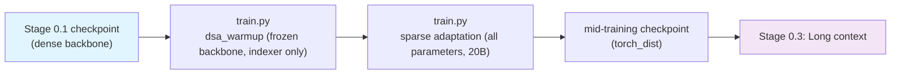

# Stage 0.2: Mid-training + DSA Introduction

The second pretraining segment: turn the dense backbone trained in stage 0.1 into a sparse-attention
model. Two phases of our own: first let the Lightning Indexer catch up with the backbone (the KL target
is the dense attention distribution), then switch to sparse attention with all parameters trainable (the
KL target is the selected top-k set). The indexer is the DSA Lightning Indexer on the CSA layers; the
sparse path stays on through stage 0.3 and everything after.

## Overview

| Component | Description |
|-----------|-------------|
| `train.py` | Entry point; the two phases are profiles (`dsa_warmup` / `default`), plus `mtp_draft` to train the draft head only |
| `test_train.py` | Integration test: tiny geometry, 5 steps (both the sparse path and the indexer loss are exercised) |
| `data_prep.py` | Corpora → bin/idx + `blend.json` (`base:`-inherits stage 0.1's weights, only `min_chars` changes) |
| `config/` | `default.yaml` (sparse adaptation) + `dsa_warmup.yaml` + `mtp_draft.yaml` + `debug.yaml` |

| Phase | What it does | Key switches |
|-------|--------------|--------------|
| `dsa_warmup` | backbone fully frozen, indexer only: KL target = the **dense attention distribution**; 1000 steps at constant LR 5e-3 | `csa_dense_mode: false`, `dsa_indexer_use_sparse_loss: false`, `shensi_freeze: indexer` |
| `default` (sparse adaptation) | full-parameter training: KL target switches to the **selected top-k set**; 20B tokens, sequence 32768 | `dsa_indexer_use_sparse_loss: true` |
| `mtp_draft` | backbone fully frozen, MTP draft head only (DeepSpec-style); draft acceptance shows up in mcore's MTP loss | `--shensi-freeze mtp` |

## Quick Start

```bash
python test_train.py                                # integration test (tiny geometry, 5 steps)
python data_prep.py --discover && python data_prep.py --prepare
python train.py --profile dsa_warmup --dry-run      # 1) frozen backbone, indexer only
python train.py --profile dsa_warmup
python train.py --tokens 20e9                       # 2) sparse adaptation (default profile)
python train.py --profile mtp_draft                 # 3) MTP draft head only
```

`experiment.load` points at `shensi/ckpt/stage1_pretrain` / `shensi/ckpt/stage2_dsa_warmup` by default;
adjust to the actual checkpoint paths.

## Data Preparation

`config/data_prep/data_blend_raw.json` `base:`-inherits stage 0.1's weights (see the
[parent README](../README.md#data-preparation)) and only raises `min_chars` (web/legal around 2000, code
around 1000) so mid-training sees longer samples. Outputs have the same shape as stage 0.1 (bin/idx +
`blend.json`) under `$SHENSI_FS/shensi/data/stage2_midtrain/`.

## Training

| Item | Value | Notes |
|------|-------|-------|
| Dense warm-up steps | 1000 | `dsa_warmup.yaml` |
| Warm-up tokens per step | `global_batch_size: 14` × `seq_length: 32768` | scaled down to fit memory; warm-up only needs the indexer to catch up |
| Warm-up LR | constant 5e-3 | short run for a small module |
| Warm-up freezing | backbone fully frozen, indexer only | `shensi_freeze: indexer` (parameter-level; backbone stays bit-identical) |
| Sparse adaptation | 20B tokens at constant LR 1e-5 | `--tokens 20e9`; data = the `min_chars`-filtered stage-2 blend |
| KL target | warm-up: dense → sparse: top-k | `dsa_indexer_use_sparse_loss` false → true |
| Indexer top-k | `shensi_index_topk: 512` | geometry default; inference pins the same 512 |
| Sequence length | 32768 | mid-training start; long context comes in stage 0.3 |
| Optimizer | stage 0.1's setup (Muon + Lion) | see [`../stage1_pretrain/README.md`](../stage1_pretrain/README.md) |
| MTP | sparse switching and MTP training are independent; use `mtp_draft` to train the draft head alone | 1 / 2 layers ran together with mHC |

### Two training-side additions

| Item | Where | Acceptance |
|------|-------|------------|
| **DSA top-k external kernel** (DeepSelect-style) | `--shensi-index-topk-kernel pkg.module:function`: the forward-pass top-k switches from the built-in torch version to an external kernel (leave empty when not installed) | the stub kernel is actually called; a bad spec fails loudly (offline gate) |
| **MTP draft-only training** | `config/mtp_draft.yaml`: backbone frozen, MTP only | 5 offline checks: freeze/backward semantics, hard failure on an empty set, backbone bit-identical under the frozen profile, non-zero draft gradients |

## Verification

1. **Warm-up**: `indexer loss` is non-zero and decreasing; **the backbone weights stay bit-identical**
   (that is the definition of this phase, and the one thing to watch);
2. **Sparse adaptation**: `indexer loss` keeps decreasing; `lm loss` shows no jump when switching to
   sparse (a jump means the top-k selection is poor);
3. `load_balancing_loss` / `erc loss` / `indexer loss` all appear in the log (three losses on);
4. Logits relative deviation against a dense forward pass is around 1e-3 (build the comparison once the
   scale grows);
5. **Integration test**: `python test_train.py` passes 5 steps.

The warm-up freeze semantics are offline-verified (non-indexer parameters bit-identical after 3 steps,
indexer parameters actually updated, non-zero KL report).

**Local verification** (WSL2 + RTX 5080 16G, single GPU):

- `python train.py --profile debug`: loads `pt_tiny_debug` (`missing=0 unexpected=0`, iter 5), runs to
  10/10 and saves `stage2_tiny_debug`;
- Iteration numbers continue from stage 0.1, so the `debug` profile uses `train_iters: 10` (not 5).

## Artifact Lineage



## Limitations

1. Sparse adaptation's 20B tokens is this recipe's budget choice, not a hidden 943.7B-scale run —
   scaling the budget up needs real machine time;
2. Warm-up tokens per step are scaled down to 14×32768 to fit memory: the criterion (backbone
   bit-identical) is unaffected, convergence is slower;
3. MTP runs together with mHC; the `mtp_draft` profile runs normally (1 / 2 layers verified at tiny
   scale).

## Next Steps

Long-context extension is in [`../stage3_longctx/README.md`](../stage3_longctx/README.md).
