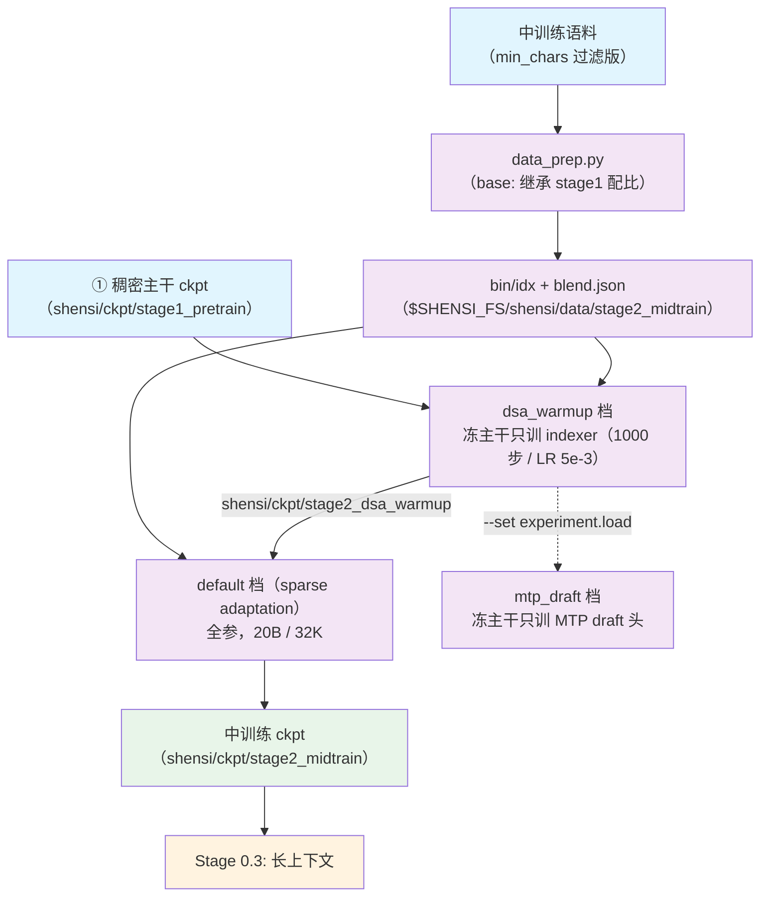

# Stage 0.2: 中训练 + DSA 引入

预训练第二段：把稠密主干换成稀疏注意力。两段式——先让 Lightning Indexer 追上主干（KL 目标是稠密
注意力分布），再全参切稀疏（KL 目标是被选中的 top-k 集合）。稀疏路径在 stage3 与后续阶段一直保持打开。

## 总览

| 组件 | 做什么 |
|------|--------|
| `train.py` | 入口；两段各是一个 profile（`dsa_warmup` / `default`），另有 `mtp_draft` 只训 draft 头 |
| `test_train.py` | 集成测试：tiny 几何 5 步（稀疏路径 + indexer loss 都走到） |
| `data_prep.py` | 语料 → bin/idx + `blend.json`（`base:` 继承 stage1 的权重，只调 `min_chars`） |
| `config/` | `default.yaml`（sparse adaptation）+ `tiny.yaml` + `debug.yaml` + `dsa_warmup.yaml` + `mtp_draft.yaml` |
| `config/data_prep/` | `data_blend_raw.json`（继承 stage1）+ `data_blend_tiny.json` + 两个准备档 |

| 段 | 做什么 | 关键开关 |
| --- | --- | --- |
| `dsa_warmup` | 主干全冻、只训 indexer：KL 目标 = 稠密注意力分布；1000 步、LR 5e-3 恒定 | `csa_dense_mode: false`、`dsa_indexer_use_sparse_loss: false`、`shensi_freeze: indexer` |
| `default`（sparse adaptation） | 全参训练：KL 目标切到被选中的 top-k 集合；20B tokens、序列 32768 | `dsa_indexer_use_sparse_loss: true` |
| `mtp_draft` | 主干全冻、只训 MTP draft 头，接受长度由 mcore 的 MTP loss 反映 | `--shensi-freeze mtp` |

优化器沿用 stage1 的口径（AdaMuon + AdEMAMix）。

## 快速开始

```bash
python test_train.py                                # 集成测试（tiny 几何，5 步）
python data_prep.py --discover && python data_prep.py --prepare
python train.py --profile dsa_warmup --dry-run      # ① 冻主干只训 indexer
python train.py --profile dsa_warmup
python train.py --tokens 20e9                       # ② sparse adaptation（default 档）
python train.py --profile mtp_draft                 # ③ 只训 MTP draft 头
```

`experiment.load` 默认指向 `shensi/ckpt/stage1_pretrain` / `shensi/ckpt/stage2_dsa_warmup`，按实际路径改。

## 数据准备

### Pipeline

1. `--discover` → 看过滤后的语料面貌（列名 / 条数 / 权重）；
2. `--prepare` → 编码成 `.bin/.idx` + `blend.json`（与 stage1 同形）。

### CLI 命令

```bash
python data_prep.py --discover | --prepare [选项]
```

| 选项 | 说明 |
|------|------|
| `--discover` / `--prepare` | 只扫描并打印语料面貌 / 产出 `.bin/.idx` 与 `blend.json` |
| `--config <档>` | 数据准备档（`config/data_prep/{default,tiny}.yaml`） |
| `--blend <json>` | 换一份配比（默认 `config/data_prep/data_blend_raw.json`，带 `base:` 继承） |
| `--limit N` / `--only <子串>` | 每个数据集最多取 N 条 / 只处理名字含子串的数据集（冒烟用） |
| `--root` / `--out` / `--tokenizer` | 语料根 / 产物目录 / tokenizer 目录（默认取环境变量） |
| `--workers N` | 并行度（默认 32） |
| `--skip-missing` | 语料没齐时跳过缺的数据集（默认遇到缺的就停下报错） |
| `--include-metadata-only` | 把「只有元数据」的数据集当硬报错 |

### 输入

- `config/data_prep/data_blend_raw.json` 用 `base:` 继承 stage1 的权重，只把 `min_chars` 拉高
  （web/legal 2000、code 1000 量级），让中训练的样本更长；
- 语料根同 stage1：`$SHENSI_FS/datasets/llm/pre-training/`；配比里的数据集目录名以 `--discover` 实测为准。

### 输出

产物与 stage1 同形（bin/idx + `blend.json`），落在 `$SHENSI_FS/shensi/data/stage2_midtrain/`。

### 配置

| 文件 | 说明 |
|------|------|
| `config/data_prep/data_blend_raw.json` | 中训练配比（`base:` 继承 stage1，改 `min_chars`） |
| `config/data_prep/data_blend_tiny.json` | 冒烟配比 |
| `config/data_prep/default.yaml` / `tiny.yaml` | 准备档（root / out / tokenizer / workers / split / limit） |

## 训练

### CLI 命令

```bash
python train.py [选项] [--set k=v ...]
```

| 选项 | 说明 |
|------|------|
| `--profile <档>` / `--config <路径>` | 选档：`dsa_warmup` / `default`（sparse）/ `mtp_draft` / `tiny` / `debug` |
| `--smoke` | 跑仓库内 tiny 配置 5 步 |
| `--tokens N` | 按 token 预算换算 `train_iters`（sparse adaptation 用 `20e9`） |
| `--data-dir <目录>` | 预处理产物目录（含 `blend.json`） |
| `--set k=v` | 点号键覆写，可多次 |
| `--dry-run` | 只打印命令，不启动 |
| `--early-stop N` / `--no-early-stop` / `--early-stop-grace S` | 早停耐心（默认 3）/ 关掉 / 宽限秒数（默认 600） |

### 输入 / 输出

- **输入**：`$SHENSI_FS/shensi/data/stage2_midtrain/` 的 bin/idx + `blend.json`；ckpt 接力由
  `experiment.load` 指定（warm-up 默认接 `shensi/ckpt/stage1_pretrain`，sparse 默认接
  `shensi/ckpt/stage2_dsa_warmup`）；
- **输出**：`shensi/ckpt/stage2_dsa_warmup`（①）与 `shensi/ckpt/stage2_midtrain`（②），下段长上下文接后者。

### 关键配置

| 项 | 值 | 说明 |
| --- | --- | --- |
| dense warm-up 步数 | 1000 步 | `dsa_warmup.yaml` |
| warm-up 每步 tokens | `global_batch_size: 14` × `seq_length: 32768` | 按显存下调；warm-up 只需 indexer 追上主干 |
| warm-up LR | 5e-3 恒定 | indexer 是小模块，追平用的短训 |
| warm-up 冻结范围 | 主干全冻，只训 indexer | `shensi_freeze: indexer`（参数级冻结，主干逐位不变） |
| sparse adaptation | 20B tokens、LR 常数 1e-5 | `--tokens 20e9`；数据 = stage2 的 `min_chars` 过滤版 |
| KL 目标 | warm-up 稠密 → sparse top-k | `dsa_indexer_use_sparse_loss` false → true |
| indexer top-k | `shensi_index_topk: 512` | 几何默认；推理侧同样固定 512 |
| 序列长度 | 32768 | 中训练起点；长上下文在 stage3 拉 |
| 优化器 | AdaMuon（矩阵腿）+ AdEMAMix（标量腿） | 与 stage1 / SFT / RL actor 同一套 |

### 训练侧的两件增量

| 件 | 落在哪 | 验收 |
| --- | --- | --- |
| **DSA TopK 外部内核** | `--shensi-index-topk-kernel 包.模块:函数`：训练前向的 top-k 从内置 torch 版换成外部内核 | 桩内核被调用、配错会报错 |
| **MTP draft 单独训练** | `config/mtp_draft.yaml`：主干全冻、只训 MTP | 冻结/反向语义、空集合硬失败、主干逐位不变、draft 梯度非零 |

### 覆写示例

```bash
python train.py --profile dsa_warmup --set experiment.load=<stage1 ckpt>   # 指向实际的上游 ckpt
python train.py --profile mtp_draft --set experiment.load=<ckpt>           # draft 头单独练
python train.py --early-stop 20                                            # 换耐心（默认 3）
```

## 验证

1. **warm-up**：`indexer loss` 非零并下降；**主干权重逐位不变**（本段的定义）；
2. **sparse adaptation**：`indexer loss` 继续下降；`lm loss` 不因切稀疏跳变；
3. `load_balancing_loss` / `erc loss` / `indexer loss` 三列都在日志里；
4. 与 dense 前向的 logits 相对偏差在 1e-3 量级内（规模稍大时自建对拍）；
5. **集成测试**：`python test_train.py` 5 步 PASS。

本机实测：`--profile debug` 先载入 `pt_tiny_debug`（`missing=0 unexpected=0`，iter 5），接着跑到 10/10
并存 `stage2_tiny_debug`；迭代计数与 stage1 连着算（debug 档 `train_iters` 是 10）。

## 局限

1. sparse adaptation 的 20B tokens 是本配方的预算选择，放大预算需要真机时间；
2. warm-up 每步 tokens 按显存下调到 14×32768：判据（主干逐位不变）不受影响，收敛会慢一些；
3. MTP 与 mHC 可同开，`mtp_draft` 档可以正常跑（1 / 2 层极小档跑过）。

## 产物流



## 下一步

长上下文扩展见 [`../stage3_longctx/README.md`](../stage3_longctx/README.md)。

## 前序阶段

- [Stage 0: 预训练](../README.md) — 三段中的第 ② 段；
- [Stage 0.1: 主预训练（稠密主干）](../stage1_pretrain/README.md) — `dsa_warmup` 的起点：它的
  `shensi/ckpt/stage1_pretrain` 产物就是本段 `experiment.load` 的默认值。
