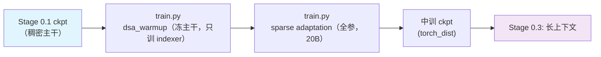

# Stage 0.2: 中训练 + DSA 引入

预训练第二段：把 stage1 训好的稠密主干换成稀疏注意力。自己做两段式——先让 Lightning Indexer 追上主干
（KL 目标是稠密注意力分布），再全参切稀疏（KL 目标是被选中的 top-k 集合）。indexer 就是 CSA 层上的
DSA Lightning Indexer，稀疏路径在 stage3 与后续阶段一直保持打开。

## 总览

| 组件 | 做什么 |
|------|--------|
| `train.py` | 入口；两段各是一个 profile（`dsa_warmup` / `default`），另有 `mtp_draft` 只训 draft 头 |
| `test_train.py` | 集成测试：tiny 几何 5 步（稀疏路径 + indexer loss 都走到） |
| `data_prep.py` | 语料 → bin/idx + `blend.json`（`base:` 继承 stage1 的权重，只调 `min_chars`） |
| `config/` | `default.yaml`（sparse adaptation）+ `dsa_warmup.yaml` + `mtp_draft.yaml` + `debug.yaml` |

| 段 | 做什么 | 关键开关 |
| --- | --- | --- |
| `dsa_warmup` | 主干全冻、只训 indexer：KL 目标 = **稠密注意力分布**；1000 步、LR 5e-3 恒定 | `csa_dense_mode: false`、`dsa_indexer_use_sparse_loss: false`、`shensi_freeze: indexer` |
| `default`（sparse adaptation） | 全参训练：KL 目标切到**被选中的 top-k 集合**；20B tokens、序列 32768 | `dsa_indexer_use_sparse_loss: true` |
| `mtp_draft` | 主干全冻、只训 MTP draft 头（DeepSpec 口径），draft 的接受长度由 mcore 的 MTP loss 反映 | `--shensi-freeze mtp` |

优化器沿用 stage1 的口径（AdaMuon + AdEMAMix，见
[`../stage1_pretrain/README.md`](../stage1_pretrain/README.md#优化器adamuon矩阵腿-ademamix标量腿)）。

## 快速开始

```bash
python test_train.py                                # 集成测试（tiny 几何，5 步）
python data_prep.py --discover && python data_prep.py --prepare
python train.py --profile dsa_warmup --dry-run      # ① 冻主干只训 indexer
python train.py --profile dsa_warmup
python train.py --tokens 20e9                       # ② sparse adaptation（default 档）
python train.py --profile mtp_draft                 # ③ 只训 MTP draft 头
```

`experiment.load` 默认指向 `shensi/ckpt/stage1_pretrain` / `shensi/ckpt/stage2_dsa_warmup`，按实际 ckpt 路径改。

## 数据准备

`config/data_prep/data_blend_raw.json` 用 `base:` 继承 stage1 的权重（见
[`../README.md`](../README.md#数据准备)），只把 `min_chars` 拉高（web/legal 2000、code 1000 量级），
让中训练的样本更长；产物与 stage1 同形（bin/idx + `blend.json`），落在 `$SHENSI_FS/shensi/data/stage2_midtrain/`。

## 训练

| 项 | 值 | 说明 |
| --- | --- | --- |
| dense warm-up 步数 | 1000 步 | `dsa_warmup.yaml` |
| warm-up 每步 tokens | `global_batch_size: 14` × `seq_length: 32768` | 按显存下调；warm-up 只需 indexer 追上主干 |
| warm-up LR | 5e-3 恒定 | indexer 是小模块，追平用的短训 |
| warm-up 冻结范围 | 主干全冻，只训 indexer | `shensi_freeze: indexer`（参数级冻结，主干逐位不变） |
| sparse adaptation | 20B tokens、LR 常数 1e-5 | `--tokens 20e9`；数据 = stage2 的 `min_chars` 过滤版 |
| KL 目标 | warm-up 稠密 → sparse top-k | `dsa_indexer_use_sparse_loss` false → true |
| indexer top-k | `shensi_index_topk: 512` | 几何默认；推理侧同样固定 512 |
| 序列长度 | 32768 | 中训练起点；长上下文在 stage3 拉 |
| 优化器 | AdaMuon（矩阵腿）+ AdEMAMix（标量腿） | 与 stage1、SFT、RL actor 同一套 |
| MTP | 稀疏切换与 MTP 训练互不依赖；要单独训 draft 用 `mtp_draft` 档 | 1 / 2 层都实跑过（与 mHC 同开） |

### 训练侧的两件增量

| 件 | 落在哪 | 验收 |
| --- | --- | --- |
| **DSA TopK 外部内核**（DeepSelect 这类） | `--shensi-index-topk-kernel 包.模块:函数`：训练前向的 top-k 从内置 torch 版换成外部内核（没装就留空） | 桩内核被调用、配错会报错 |
| **MTP draft 单独训练** | `config/mtp_draft.yaml`：主干全冻、只训 MTP | 冻结/反向语义、空集合硬失败、冻结档下主干逐位不变、draft 梯度非零 |

## 验证

1. **warm-up**：日志里 `indexer loss` 非零并下降；**主干权重逐位不变**（这既是本段的定义，也是唯一必须盯的点）；
2. **sparse adaptation**：`indexer loss` 继续下降；`lm loss` 不因切稀疏而跳变（跳变说明 top-k 选得差）；
3. `load_balancing_loss` / `erc loss` / `indexer loss` 三列都在日志里（三个 loss 全开）；
4. 与 dense 前向的 logits 相对偏差在 1e-3 量级内（规模稍大时自建对拍）；
5. **集成测试**：`python test_train.py` 5 步 PASS。

warm-up 的冻结语义已离线验证（非 indexer 参数 3 步后逐位不变、indexer 参数确实被更新、KL 上报非零）。

**本机实跑记录**（WSL2 + RTX 5080 16G，单卡）：

- `python train.py --profile debug`：先载入 `pt_tiny_debug`（`missing=0 unexpected=0`，iter 5），
  接着跑到 10/10 并存 `stage2_tiny_debug`；
- 迭代计数与 stage1 连着算，所以 debug 档的 `train_iters` 是 10（不是 5）；
- 本轮优化器改动后 `python test_train.py` 同样 PASS（命令里带
  `--optimizer adaptive_muon --muon-scalar-optimizer ademamix`）。

## 产物链路



## 局限

1. sparse adaptation 的 20B tokens 是本次配方的预算选择，不是公开的 943.7B 级量级——放大预算需要真机时间；
2. warm-up 每步 tokens 按显存下调到 14×32768：indexer 追平主干的判据（主干逐位不变）不受影响，
   收敛速度会慢一些；
3. MTP 与 mHC 可同开，`mtp_draft` 档可以正常跑（1 / 2 层极小档实跑过）。

## 下一步

长上下文扩展见 [`../stage3_longctx/README.md`](../stage3_longctx/README.md)。
