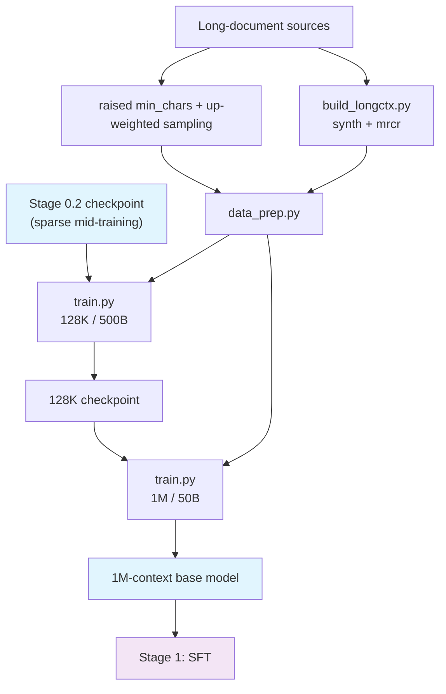

# Stage 0.3: Long-context Extension

The third pretraining segment: push the context from 32K to the model's limit in two profiles. Sparse
attention stays on (inherited from stage 0.2), all three losses remain active, and the optimizer keeps
stage 0.1 / 0.2's setup (Muon + Lion).

## Overview

| Component | Description |
|-----------|-------------|
| `train.py` | Entry point: `--profile default` (128K) / `--profile 1m` (1M), `--tokens` for the budget |
| `test_train.py` | Integration test: tiny geometry, 5 steps (same rope/YaRN parameter path) |
| `data_prep.py` | Corpora → bin/idx + `blend.json` (`base:`-inherits stage 0.2, raises `min_chars` again and up-weights long documents) |
| `build_longctx.py` | Produces the long-context corpora locally: synthetic (NextLong / EntropyLong) and MRCR-style multi-needle retrieval |
| `config/` | `default.yaml` (128K) + `1m.yaml` (1M) + `debug.yaml` |

| Profile | Sequence length | Token budget | Notes |
|---------|-----------------|--------------|-------|
| `default` | 131072 | 500B (`--tokens 500e9`) | CP defaults to 2, size it to memory |
| `1m` | 1048576 | 50B (`--tokens 50e9`) | the compression layers' position encoding goes to 1M (YaRN factor 16 / original position 65536); switch to 200000 for a strict 200K-segment reading |

| Item | Value |
|------|-------|
| Learning rate | constant 1e-5 continued training (the mid-training tail magnitude, since mid-training's LR has no separate target) |
| Losses | aux 0.001 + ERC 1.0/0.5 + indexer KL 0.01 (all three on) |
| Registered, not enabled | CSA2 cross-layer KV reuse, FP4 KV cache, Causal Encoder-Decoder (each needs matching inference-side and checkpoint changes) |

## Quick Start

```bash
python test_train.py                                     # integration test (tiny geometry, 5 steps)
python data_prep.py --discover && python data_prep.py --prepare
python train.py --profile default --tokens 500e9 --dry-run
python train.py --profile default --tokens 500e9         # 128K / 500B
python train.py --profile 1m      --tokens 50e9          # 1M / 50B
```

`experiment.load` points at `shensi/ckpt/stage2_midtrain` (128K profile) and `shensi/ckpt/stage3_128k`
(1M profile) by default.

## Data Preparation

`config/data_prep/data_blend_raw.json` raises `min_chars` on top of stage 0.2 (web/legal 20000, code
4000) and up-weights the long-document sources (legal, specialized-generative): the tail of pretraining
targets the **role** of long documents with the same sources, just sampling longer. Of the three
long-context corpus kinds, kind (a) comes from this up-sampling; kinds (b) and (c) are produced locally
by `build_longctx.py` and enter the blend as three `mode: built` entries (relative weights: NextLong
0.06 / EntropyLong 0.04 / MRCR 0.04).

### The three long-context corpus kinds

1. **Natural long documents**: no separate book/paper corpus is built; existing long-document sources get
   a raised `min_chars` (20000 here) and up-weighted sampling;
2. **Synthetic**: `build_longctx.py --step synth` produces two flavors — NextLong-style (consecutive
   documents from one source concatenated, topic-continuous) and EntropyLong-style (documents split into
   chunks, shuffled and re-packed, so topic boundaries are frequent and localization is harder);
3. **MRCR-style multi-needle retrieval**: `--step mrcr` plants N needles in order inside a long document
   (200K segments, 8 needles by default); training uses the full text with the questions and answers,
   evaluation uses `mrcr_eval.jsonl` with the same needles
   ([stage 3](../../stage3_eval/README.md)'s long-context suite reads it directly, and its judging
   demands that every needle appear in order).

```bash
python build_longctx.py --step all                     # synthetic + MRCR (default)
python build_longctx.py --step synth --items 500       # synthetic only, 500 documents per kind
python build_longctx.py --step mrcr --needles 8 --target-chars 200000
python data_prep.py --prepare                          # encode the outputs into bin/idx
```

| Option | Default | Description |
|--------|---------|-------------|
| `--step` | `all` | `synth` / `mrcr` / `all` |
| `--root` | `$SHENSI_FS/datasets/llm/pre-training` | Long-document source root |
| `--out` | `$SHENSI_FS/shensi/data/stage3_longctx` | Output directory |
| `--eval-out` | `<out>/mrcr_eval.jsonl` | Where the MRCR evaluation set lands |
| `--source` / `--source-jsonl` | long-document dataset names (repeatable) / a local jsonl for offline self-tests | Source selection |
| `--target-chars` | 200000 | Target characters per MRCR document |
| `--synth-target-chars` | 64000 | Target length of a synthetic long document |
| `--needles` | 8 | Needles planted per MRCR document |
| `--items` | 2000 | Documents produced per kind |
| `--min-chars` | 20000 | Minimum source-document length |
| `--seed` | 0 | Same seed, same output |

## Training

| Item | Value | Notes |
|------|-------|-------|
| Sequence length | 131072 (`default`) → 1048576 (`1m`) | get 128K working before going to 1M |
| Parallelism | CP 2 (`default`) / CP 8 (`1m`), micro-batch from 1 up | the 1M profile needs real memory sizing |
| Learning rate | constant 1e-5 | continued training does not restart the schedule |
| Data | stage 0.2's blend + raised `min_chars` + the three long-context kinds | see above |

## Verification

1. No step-change in `lm loss` after the length switch (a step means RoPE/YaRN or the data's length
   distribution is misaligned);
2. `indexer loss` stays sane at long sequences (the sparse selection remains effective at 128K / 1M);
3. The 1M profile fits in memory: size CP and micro-batch to the hardware, get `micro_batch_size=1`
   working before increasing it;
4. Long-document retrieval spot checks (plant a fact in a long prompt, see whether it is reproduced) pass
   at 128K and 1M;
5. **Integration test**: `python test_train.py` passes 5 steps (it also checks: all three corpus kinds
   produced, each needle appears exactly once in its material, the ground-truth order matches the order
   of appearance, and the same seed reproduces).

**Local verification** (WSL2 + RTX 5080 16G, single GPU):

- `python train.py --profile debug`: loads `stage2_tiny_debug` (iter 10) → runs to 15/15 and saves;
- At tiny scale the length switch only checks geometric consistency; a real 128K→1M switch needs a real
  budget.

## Artifact Lineage



## Limitations

1. All three long-context corpus kinds are in place, but the **MRCR-style items are built from this
   repository's own corpora** (see [stage 3](../../stage3_eval/README.md)) — say so when comparing
   numbers across models;
2. The 1M profile's convergence and memory budget need a real machine; the local runs only verify
   geometry and the parameter path;
3. The three unenabled items (CSA2 cross-layer KV reuse / FP4 KV / Causal Encoder-Decoder) need matching
   inference-side and checkpoint work.

## Next Steps

The base model is done here → [Stage 1: SFT](../../stage1_sft/README.md).
