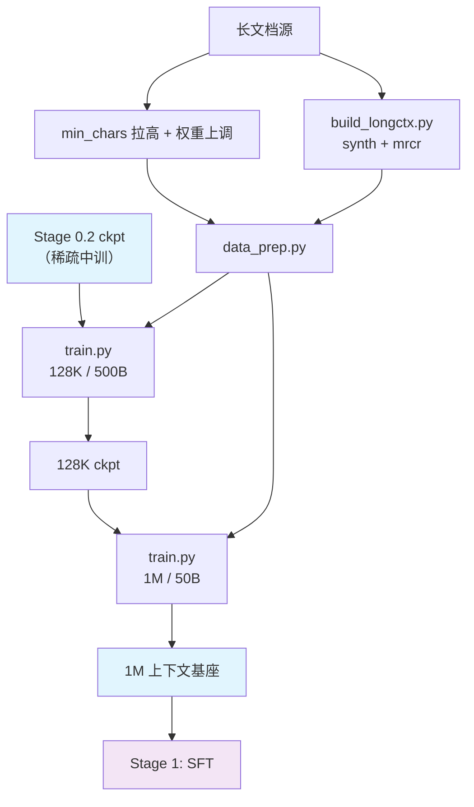

# Stage 0.3: 长上下文扩展

预训练第三段：把上下文从 32K 拉到模型上限，分两档跑。稀疏注意力保持打开（继承 stage2），三个 loss 继续生效；
优化器沿用 stage1/stage2 的口径（AdaMuon + AdEMAMix）。

## 总览

| 组件 | 做什么 |
|------|--------|
| `train.py` | 入口：`--profile default`（128K）/ `--profile 1m`（1M），`--tokens` 给 token 预算 |
| `test_train.py` | 集成测试：tiny 几何 5 步（走同一套 rope/YaRN 参数路径） |
| `data_prep.py` | 语料 → bin/idx + `blend.json`（`base:` 继承 stage2，`min_chars` 再拉高、长文档权重上调） |
| `build_longctx.py` | 本地产出长上下文语料：合成（NextLong / EntropyLong）与 MRCR 类多针检索 |
| `config/` | `default.yaml`（128K）+ `1m.yaml`（1M）+ `debug.yaml` |

| 档 | 序列长度 | token 预算 | 备注 |
| --- | --- | --- | --- |
| `default` | 131072 | 500B（`--tokens 500e9`） | CP 默认 2，按显存调 |
| `1m` | 1048576 | 50B（`--tokens 50e9`） | compress 层位置编码支持到 1M（YaRN factor 16 / 原位置 65536）；要严格照 200K 段的口径就改成 200000 |

| 项 | 值 |
| --- | --- |
| 学习率 | 1e-5 恒定续训（沿用中训练超参的量级；mid-training 的 LR 没有单独口径，取 midtrain 收尾值） |
| loss | aux 0.001 + ERC 1.0/0.5 + indexer KL 0.01（三个 loss 全开） |
| 优化器 | AdaMuon（矩阵腿）+ AdEMAMix（标量腿），续训不重启调度器 |
| 未启用（登记） | CSA2 跨层 KV 复用、FP4 KV 缓存、Causal Encoder-Decoder（要落到本配方需改推理侧与 ckpt 口径） |

## 快速开始

```bash
python test_train.py                                     # 集成测试（tiny 几何，5 步）
python data_prep.py --discover && python data_prep.py --prepare
python train.py --profile default --tokens 500e9 --dry-run
python train.py --profile default --tokens 500e9         # 128K / 500B
python train.py --profile 1m      --tokens 50e9          # 1M / 50B
```

`experiment.load` 默认接 `shensi/ckpt/stage2_midtrain`（128K 档）与 `shensi/ckpt/stage3_128k`（1M 档）。

## 数据准备

`config/data_prep/data_blend_raw.json` 在 stage2 的基础上把 `min_chars` 拉高（web/legal 20000、code 4000），
并把长文档来源（legal、specialized-generative）的权重上调——后段训练按**角色**对齐长文档：同样的来源，
只是采到更长的样本。三类长上下文语料里，① 靠这条 up-sample；② / ③ 由 `build_longctx.py` 本地产出，
在 blend 里是三条 `mode: built` 条目（相对权重：NextLong 0.06 / EntropyLong 0.04 / MRCR 0.04）。

### 长上下文语料（三类）

1. **自然长文档**：不另建书/论文语料，对现成的长文档源拉高 `min_chars`（本档 20000）并上调权重；
2. **合成**：`build_longctx.py --step synth` 产两类——
   NextLong 式（同源连续文档拼接，话题连续）与 EntropyLong 式（文档切段后打散再拼，跨话题边界多、定位更难）；
3. **MRCR 类多针检索**：`--step mrcr` 把 N 个「针」按序埋进长文（默认 200K 段、8 针），训练用含问答的整篇文本，
   评测用同一批针的 `mrcr_eval.jsonl`（[`../../stage3_eval`](../../stage3_eval/README.md) 的长文套件直接读它，
   判分要求按出现顺序全对）。

```bash
python build_longctx.py --step all                     # 合成 + MRCR 都产出（默认）
python build_longctx.py --step synth --items 500       # 只产合成，每类 500 篇
python build_longctx.py --step mrcr --needles 8 --target-chars 200000
python data_prep.py --prepare                          # 把产物编码成 bin/idx
```

| 参数 | 默认 | 说明 |
|------|------|------|
| `--step` | `all` | `synth` / `mrcr` / `all` |
| `--root` | `$SHENSI_FS/datasets/llm/pre-training` | 长文档源根目录 |
| `--out` | `$SHENSI_FS/shensi/data/stage3_longctx` | 产物目录 |
| `--eval-out` | `<out>/mrcr_eval.jsonl` | MRCR 评测集落点 |
| `--source` / `--source-jsonl` | 长文档源数据集名（可重复）/ 本地 jsonl（离线自检） | 源选择 |
| `--target-chars` | 200000 | MRCR 每篇长文的目标字符数 |
| `--synth-target-chars` | 64000 | 合成长文的目标长度 |
| `--needles` | 8 | MRCR 每篇埋几个针 |
| `--items` | 2000 | 每类产出多少篇 |
| `--min-chars` | 20000 | 源文档的最短长度 |
| `--seed` | 0 | 同种子可复现 |

## 训练

| 项 | 值 | 说明 |
| --- | --- | --- |
| 序列长度 | 131072（`default`）→ 1048576（`1m`） | 先跑通 128K 再上 1M |
| 并行 | CP 2（`default`）/ CP 8（`1m`），micro-batch 从 1 起加 | 1M 档的显存账按卡调 |
| 学习率 | 1e-5 恒定 | 续训段不重启调度器 |
| 数据 | stage2 的配比 + `min_chars` 拉高 + 三类长上下文语料 | 见上节 |

## 验证

1. 长度切换后 `lm loss` 不出现台阶式恶化（出现说明 RoPE/YaRN 或数据的长度分布没对齐）；
2. `indexer loss` 在长序列上不炸（稀疏选择在 128K/1M 上仍有效）；
3. 1M 档不 OOM：CP 与 micro-batch 按显存调，先把 `micro_batch_size=1` 跑通再往上加；
4. 长文检索类能力（把一篇长文档的某个事实放进 prompt，看能否复述）在 128K 与 1M 上抽测通过；
5. **集成测试**：`python test_train.py` 5 步 PASS（会验：三类语料都有产物、针在材料里各出现一次、
   ground_truth 顺序与出现顺序一致、同种子可复现）。

**本机实跑记录**（WSL2 + RTX 5080 16G，单卡）：

- `python train.py --profile debug`：载入 `stage2_tiny_debug`（iter 10）→ 跑到 15/15 并存盘；
- 长度切换在极小档上只是几何一致性的检查，真正的 128K→1M 切换要真机预算；
- 本轮优化器改动后 `python test_train.py` 同样 PASS，构建自检：NextLong 3 篇 / EntropyLong 1 篇 /
  MRCR 3 篇 + 评测 3 条（针各出现一次、顺序正确、同种子可复现）。

## 产物链路



## 局限

1. 三类长上下文语料都已落地，但 **MRCR 类题面来自本仓库自己的语料**（见
   [`../../stage3_eval/README.md`](../../stage3_eval/README.md)），跨模型比数字时要说清楚；
2. 1M 档的收敛与显存账要真机预算，本机只验证了几何与参数路径；
3. 未启用的三项（CSA2 跨层 KV 复用 / FP4 KV / Causal Encoder-Decoder）需要推理侧与 ckpt 口径的配套改动。

## 下一步

基座到这里完成 → [Stage 1: SFT](../../stage1_sft/README.md)。
