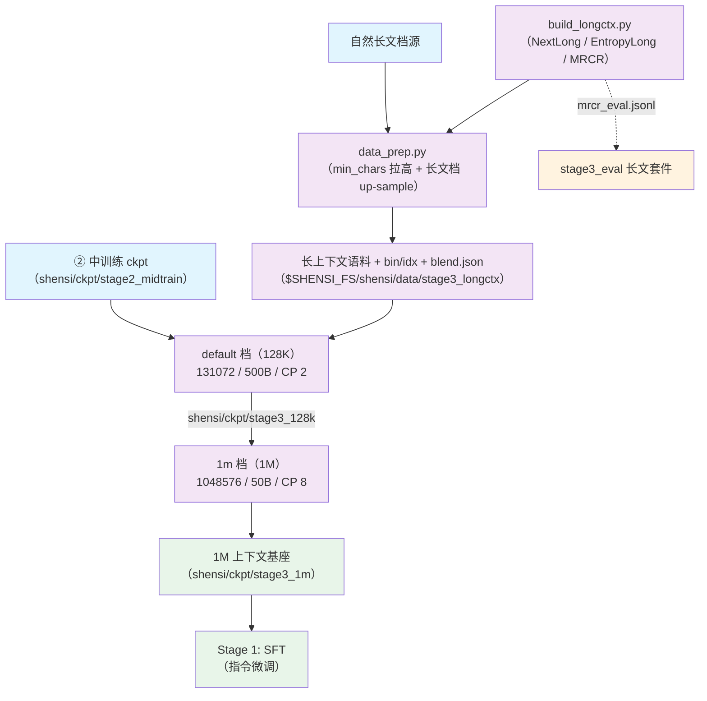

# Stage 0.3: 长上下文扩展

预训练第三段：把上下文从 32K 拉到模型上限，分两档跑。稀疏注意力保持打开（继承 stage2），三个 loss
继续生效；优化器沿用 stage1/stage2 的口径（AdaMuon + AdEMAMix）。

## 总览

| 组件 | 做什么 |
|------|--------|
| `train.py` | 入口：`--profile default`（128K）/ `--profile 1m`（1M），`--tokens` 给预算 |
| `test_train.py` | 集成测试：tiny 几何 5 步（走同一套 rope/YaRN 参数路径） |
| `data_prep.py` | 语料 → bin/idx + `blend.json`（`base:` 继承 stage2，`min_chars` 再拉高、长文档权重上调） |
| `build_longctx.py` | 本地产出长上下文语料：合成（NextLong / EntropyLong）与多针检索（MRCR 类） |
| `config/` | `default.yaml`（128K）+ `tiny.yaml` + `debug.yaml` + `1m.yaml` |
| `config/data_prep/` | `data_blend_raw.json`（继承 stage2）+ `data_blend_tiny.json` + 两个准备档 |

| 档 | 序列长度 | token 预算 | 备注 |
| --- | --- | --- | --- |
| `default` | 131072 | 500B（`--tokens 500e9`） | CP 默认 2，按显存调 |
| `1m` | 1048576 | 50B（`--tokens 50e9`） | compress 层位置编码支持到 1M（YaRN factor 16 / 原位置 65536）；要严格照 200K 段口径就改成 200000 |

| 项 | 值 |
| --- | --- |
| 学习率 | 1e-5 恒定续训 |
| loss | aux 0.001 + ERC 1.0/0.5 + indexer KL 0.01（三个 loss 全开） |
| 优化器 | AdaMuon（矩阵腿）+ AdEMAMix（标量腿），续训不重启调度器 |
| 未启用（登记） | CSA2 跨层 KV 复用、FP4 KV 缓存、Causal Encoder-Decoder（需要推理侧与 ckpt 口径的配套改动） |

## 快速开始

```bash
python test_train.py                                     # 集成测试（tiny 几何，5 步）
python data_prep.py --discover && python data_prep.py --prepare
python train.py --profile default --tokens 500e9 --dry-run
python train.py --profile default --tokens 500e9         # 128K / 500B
python train.py --profile 1m      --tokens 50e9          # 1M / 50B
```

`experiment.load` 默认接 `shensi/ckpt/stage2_midtrain`（128K 档）与 `shensi/ckpt/stage3_128k`（1M 档）。

## 数据准备

### Pipeline

1. **自然长文档** → 不另建语料，对现成长文档源在配比里拉高 `min_chars`（web/legal 20000、code 4000），
   并把长文档角色（legal、specialized-generative）的权重上调；
2. **合成长文** → `build_longctx.py --step synth` 本地产出；
3. **多针检索** → `build_longctx.py --step mrcr` 本地产出（评测集 `mrcr_eval.jsonl` 给 stage3_eval）；
4. **编码** → `data_prep.py --prepare` 把上面三类 + 自然长文档一起编码成 bin/idx 与 `blend.json`。

三类长上下文语料里，① 靠 `min_chars` 与权重 up-sample；② / ③ 由 `build_longctx.py` 本地产出，
在 blend 里是三条 `mode: built` 条目（相对权重：NextLong 0.06 / EntropyLong 0.04 / MRCR 0.04）。

### 长上下文语料（三类）

1. **自然长文档**：不另建书/论文语料，对现成长文档源拉高 `min_chars`（本档 20000）并上调权重——
   按**角色**对齐长文档：同一批语料，只是采到更长的样本；
2. **合成**：`--step synth` 产两类——NextLong 式（同源连续文档拼接，话题连续）与 EntropyLong 式
   （文档切段后打散再拼，跨话题边界多、定位更难）；
3. **多针检索（MRCR 类）**：`--step mrcr` 把 N 个「针」按序埋进长文（默认 200K 段、8 针），
   训练用含问答的整篇文本，评测用同一批针的 `mrcr_eval.jsonl`（[`../../stage3_eval`](../../stage3_eval/README.md)
   的长文套件直接读它）。官方 MRCR 开放集接在同一段的 `--suite mrcr`。

```bash
python build_longctx.py --step all                     # 合成 + 多针都产出（默认）
python build_longctx.py --step synth --items 500
python build_longctx.py --step mrcr --needles 8 --target-chars 200000
python data_prep.py --prepare                          # 编码成 bin/idx
```

### 输入

- 长文档源根目录（默认 `$SHENSI_FS/datasets/llm/pre-training`，`--root` 可改）；
- 配比 `config/data_prep/data_blend_raw.json`（`base:` 继承 stage2）+ 两个准备档。

### 输出

`$SHENSI_FS/shensi/data/stage3_longctx/` 下三类长上下文语料 + bin/idx + `blend.json`，
评测集落 `<out>/mrcr_eval.jsonl`。

### 配置参数

`build_longctx.py`：

| 参数 | 默认 | 说明 |
|------|------|------|
| `--step` | `all` | `synth` / `mrcr` / `all` |
| `--root` | `$SHENSI_FS/datasets/llm/pre-training` | 长文档源根目录 |
| `--out` | `$SHENSI_FS/shensi/data/stage3_longctx` | 产物目录 |
| `--eval-out` | `<out>/mrcr_eval.jsonl` | 评测集落点 |
| `--source` / `--source-jsonl` | 无 | 指定长文档源数据集（可重复）/ 改用本地 jsonl 当源（离线自检用） |
| `--target-chars` / `--synth-target-chars` | 200000 / 64000 | 长文与合成长文的目标长度 |
| `--needles` / `--items` / `--min-chars` / `--seed` | 8 / 2000 / 20000 / 0 | 针数 / 每类篇数 / 源最短长度 / 随机种子 |

`data_prep.py` 的准备档：`config/data_prep/{default,tiny}.yaml`（root / out / tokenizer / workers /
split / limit），配比里 ②③ 是 `mode: built` 条目——先跑构建脚本再 `--prepare`。

## 训练

### CLI 命令

```bash
python train.py [选项] [--set k=v ...]
```

| 选项 | 说明 |
|------|------|
| `--profile <档>` / `--config <路径>` | 选档：`default`（128K）/ `1m` / `tiny` / `debug` |
| `--smoke` | 跑仓库内 tiny 配置 5 步 |
| `--tokens N` | 按 token 预算换算 `train_iters`（128K 段 `500e9`、1M 段 `50e9`） |
| `--data-dir <目录>` | 预处理产物目录（含 `blend.json`） |
| `--set k=v` | 点号键覆写，可多次 |
| `--dry-run` | 只打印命令，不启动 |
| `--early-stop N` / `--no-early-stop` / `--early-stop-grace S` | 早停耐心（默认 3）/ 关掉 / 宽限秒数（默认 600） |

### 输入 / 输出

- **输入**：`$SHENSI_FS/shensi/data/stage3_longctx/` 的 bin/idx + `blend.json`；ckpt 接力由
  `experiment.load` 指定（128K 档默认接 `shensi/ckpt/stage2_midtrain`，1M 档默认接 `shensi/ckpt/stage3_128k`）；
- **输出**：`shensi/ckpt/stage3_128k`（128K 档）与 `shensi/ckpt/stage3_1m`（1M 档，1M 上下文基座，
  SFT 段默认接它）。

### 关键配置

| 项 | 值 | 说明 |
| --- | --- | --- |
| 序列长度 | 131072（`default`）→ 1048576（`1m`） | 先跑通 128K 再上 1M |
| 并行 | CP 2（`default`）/ CP 8（`1m`），micro-batch 从 1 起加 | 1M 档显存按卡调 |
| 学习率 | 1e-5 恒定 | 续训段不重启调度器 |
| 数据 | stage2 的配比 + `min_chars` 拉高 + 三类长上下文语料 | 见上节 |

### 覆写示例

```bash
python train.py --profile default --set experiment.load=<实际 ckpt>       # 指向实际的上游 ckpt
python train.py --profile default --set train.model.micro_batch_size=1    # 显存紧时从 1 起加
python train.py --early-stop 20                                           # 换耐心（默认 3）
```

## 验证

1. 长度切换后 `lm loss` 不出现台阶式恶化（RoPE/YaRN 或长度分布没对齐会出台阶）；
2. `indexer loss` 在长序列上不炸（稀疏选择在 128K/1M 上仍有效）；
3. 1M 档不 OOM：先把 `micro_batch_size=1` 跑通再往上加；
4. 长文检索抽测（把长文档里的某个事实放进 prompt，看能否复述）在 128K 与 1M 上通过；
5. **集成测试**：`python test_train.py` 5 步 PASS（另验：三类语料都有产物、针在材料里各出现一次、
   ground_truth 顺序与出现顺序一致、同种子可复现）。

本机实测：`--profile debug` 载入 `stage2_tiny_debug`（iter 10）→ 跑到 15/15 并存盘；构建自检
NextLong 3 篇 / EntropyLong 1 篇 / MRCR 3 篇 + 评测 3 条（针各出现一次、顺序正确、同种子可复现）。

## 局限

1. 本地的多针题面来自本仓库自己的语料（跨模型比数字时要说清楚）；官方 MRCR 套件已接入，
   需要长上下文模型才跑得出分数；
2. 1M 档的收敛与显存账要真机预算，本机只验证了几何与参数路径；
3. 未启用的三项（CSA2 / FP4 KV / Causal Encoder-Decoder）需要推理侧与 ckpt 口径的配套改动。

## 产物流



## 下一步

基座到这里完成 → [Stage 1: SFT](../../stage1_sft/README.md)。

## 前序阶段

- [Stage 0: 预训练](../README.md) — 三段中的第 ③ 段；
- [Stage 0.2: 中训练 + DSA 引入](../stage2_midtrain/README.md) — 128K 档的起点：它的
  `shensi/ckpt/stage2_midtrain` 产物就是本段 `experiment.load` 的默认值，稀疏路径也由它引入。
