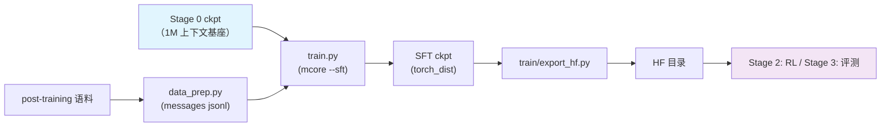

# Stage 1: SFT（指令微调）

从预训练末段 ckpt 起做多域指令微调：数据是 messages jsonl（含编码 / 推理 / 工具调用），
用 mcore 的 `--sft`（SFTDataset + SFTTokenizer 按 chat 模板生成 loss mask），模型与训练循环跟 PT 同一条
（[`../train/`](../train/) 那个入口，模型来自 Megatron-Bridge 的 `models/shensi/`）。

## 总览

| 组件 | 做什么 |
|------|--------|
| `train.py` | 入口：`--profile` 选档、`--smoke`（tiny + mock）、`--data-jsonl` 指定语料、`--set` 覆写 |
| `test_train.py` | 集成测试：tiny 几何 5 步（走 `--sft` + `ShensiSFTDataset` 的 loss mask 路径） |
| `data_prep.py` | post-training 语料 → `{"messages": [...]}` jsonl（按 DSV4 chat 模板，`truncation` 可配） |
| `encoding_dsv4.py` | DSV4 的编码/解码与 chat 模板实现（外部来源，保持原样） |
| `config/` | `default.yaml`（全量）+ `debug.yaml`（极小） |

| 项 | 值 |
| --- | --- |
| 起点 | `shensi/ckpt/stage3_1m`（1M 上下文基座），由 `experiment.load` 指定 |
| 序列长度 | 32768（指令数据比预训练语料短，先不拉满上下文） |
| 全局批 / 步数 | `global_batch_size: 32`、`train_iters: 5000`（`split: 98,1,1` 切出验证集，靠早停看门狗收尾） |
| 优化器 | **AdaMuon（矩阵腿）+ AdEMAMix（标量腿）**（与预训练同一套；微调只换 LR 曲线：1e-5 → 1e-6 cosine、warmup 1%、wd 0） |
| loss | 只算 assistant span（`SFTTokenizer` 生成 mask）；aux/ERC/indexer 三个 loss 按 SFT 口径自动关掉 |
| tokenizer | `SFTTokenizer`：正式档 `default`（用 tokenizer 自带的 chat_template）、极小档 `identity`（只串 content） |

## 快速开始

```bash
python test_train.py                    # 集成测试（tiny 几何 5 步）
python data_prep.py --discover          # post-training 语料面貌
python data_prep.py --prepare           # → $SHENSI_FS/shensi/data/stage1_sft/sft_{train,val}.jsonl
python train.py --smoke                 # 仓库内 tiny 档
python train.py --profile debug         # 真实数据的极小档
python train.py                         # 正式跑（default 档）
```

`data_prep.py` 的输出是**一行一条**的 `{"messages": [{"role": ..., "content": ...}, ...]}`；
mcore 的 `--sft` 直接读 jsonl（不用 bin/idx），loss mask 由 `SFTTokenizer` 按模板切。
`train.py` 会把 `sft_train.jsonl` 写进 `train.data.data_path`（也可以用 `--data-jsonl` 指别的文件），不用手工拼。

## 数据准备

来源是 post-training 集（`$SHENSI_FS/datasets/llm/post-training/`，配比见
`config/data_prep/data_blend_raw.json`，`--discover` 看实际列名）。多轮样本按 DSV4 chat 模板拼成单条
messages；超长样本按 `truncation` 策略处理（默认 `error`，即直接报错提醒调 `max_length`）。

### 不打包（本段的实际口径）

上游的 `SFTDataset` 会把多条对话打进一条 `sequence_length` 的样本并给出 `cu_seqlens`（THD），
而 CSA/HCA 层（上游的 `DSv4HybridAttention`）明确断言 `packed_seq_params is None`——打包这条路在
本家族上走不通。所以本栈换成 [`../train/sft_dataset.py`](../train/sft_dataset.py) 的 `ShensiSFTDataset`：
**一条对话一条样本 + 右侧 padding**，tokenize 与 loss mask（prompt 段与被 padding 的段都不算 loss）
沿用上游同一套口径，只是不产出 `cu_seqlens`；[`../train/train_shensi.py`](../train/train_shensi.py)
里也不再让 `--sft` 隐含"打包"（`has_cu_seqlens` 只看 `--shensi-sft-packed` / mock /
`--dataloader-inter-document-masking`）。

右 padding 对因果注意力无害：有效 token 看不到后面的 pad，pad 段本身也被 loss mask 排掉。
要回到上游的 THD 打包口径（只有非 CSA 模型才用得上）加 `--shensi-sft-packed`。

## 训练

| 项 | 值 | 说明 |
| --- | --- | --- |
| `--profile` | `default` / `debug` | `debug` 的 `--profile` 是入口默认值（极小档最常用） |
| 覆写 | `--set train.model.train_iters=...` 等 | 与 PT 同一套摊平语义 |
| 早停 | 默认开（盯 `lm loss value`，patience=3、grace=600s） | `split: 98,1,1` 提供验证信号 |

## 验证

1. 极小档能续：`experiment.load` 指向 PT 的 debug ckpt 时，`no_load_optim/no_load_rng` 要显式给
   （PT 极小档是 `--no-save-optim` 存的）；
2. 日志里 `lm loss` 下行、`grad norm` 不炸；loss mask 只覆盖 assistant 段与结尾的 eos（padding 与 prompt 段都是 0）；
3. 指令跟随抽测（固定若干 prompt 生成，人工看格式与工具调用标签是否正确）；
4. **集成测试**：`python test_train.py` 5 步 PASS。

**本机实跑记录**（WSL2 + RTX 5080 16G，单卡）：

- 数据：`python data_prep.py --prepare --blend config/data_prep/debug_local.json --limit 40`
  （离线档：用本机 post-training 的样例集，不连 HF）→ `sft_train.jsonl` 38 行 + parquet 三态；
- `python train.py --profile debug`：2/2 步，载入 `pt_tiny_debug`（finetune 口径，迭代号重开），存 `stage1_sft_debug`；
- 早停实测：`train_iters=200`、patience=1、grace=5s 时在第 42 步收尾（`early_stop.json` 里 `why=patience`），返回 0；
- 优化器：`python test_train.py` PASS，命令里带 `--optimizer adaptive_muon --muon-scalar-optimizer ademamix`
  （`--ademamix-betas 0.9 0.95 0.9999` 与 SFT 档的 beta2 一致）；
- SFT 的产物可以交给 RL / 评测（HF 目录由 `export_hf.py` 导出）：

```bash
python -m shensi.recipes.shensi.train.export_hf \
    --ckpt $SHENSI_FS/shensi/ckpt/stage1_sft_debug --out $SHENSI_FS/shensi/models/sft-hf --tiny
# 之后 stage2_rl 用 --set model.path=<out>，stage3_eval 用 --model-path <out>，都实跑过
```

## 产物链路



## 局限

1. 微调规模上的优化器口径直接沿用预训练（AdaMuon + AdEMAMix），LR 没做过单独扫描；
2. `encoding_dsv4.py` 与 chat 模板是外部来源，模板改动要同步 HF 侧的同名实现（否则 loss mask 与训练侧不一致）；
3. 数据配比沿用公开的 post-training 集，没有自建指令数据——覆盖的是**域**：math / code / agent / safety / 多语
   各有公开集对应。

## 下一步

对齐 / RL 见 [Stage 2: RL](../stage2_rl/README.md)。
