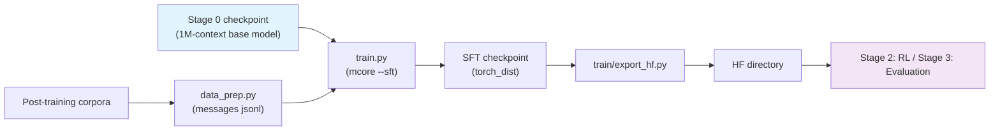

# Stage 1: Supervised Fine-Tuning (SFT)

Multi-domain instruction tuning from the last pretraining checkpoint: the data is messages jsonl
(coding / reasoning / tool calling), training uses mcore's `--sft` (SFTDataset + SFTTokenizer build the
loss mask from the chat template), and the model and training loop are the same as pretraining's
(the entry point in [`../train/`](../train/), the model from Megatron-Bridge's `models/shensi/`).

## Overview

| Component | Description |
|-----------|-------------|
| `train.py` | Entry point: `--profile`, `--smoke` (tiny + mock), `--data-jsonl` to point at the corpus, `--set` overrides |
| `test_train.py` | Integration test: tiny geometry, 5 steps (exercises `--sft` + `ShensiSFTDataset`'s loss mask path) |
| `data_prep.py` | Post-training corpora → `{"messages": [...]}` jsonl (DSV4 chat template; `truncation` is configurable) |
| `encoding_dsv4.py` | DSV4 encoding/decoding and the chat template implementation (external source, kept as is) |
| `config/` | `default.yaml` (production) + `debug.yaml` (tiny) |

| Item | Value |
|------|-------|
| Start point | `shensi/ckpt/stage3_1m` (the 1M-context base model), set via `experiment.load` |
| Sequence length | 32768 (instruction data is shorter than pretraining corpora; the context is not maxed out yet) |
| Global batch / steps | `global_batch_size: 32`, `train_iters: 5000` (`split: 98,1,1` carves out a validation set; the early-stop watchdog ends the run) |
| Optimizer | **AdamW** (`adam_beta1/2 = 0.9/0.95`, wd 0, lr 1e-5 → 1e-6 cosine, 1 % warmup): Muon's evidence is at pretraining scale, fine-tuning keeps the Adam family |
| Loss | assistant spans only (`SFTTokenizer` builds the mask); aux/ERC/indexer losses switch off automatically under the SFT setup |
| Tokenizer | `SFTTokenizer`: production uses `default` (the tokenizer's own chat_template), tiny profiles use `identity` (plain concatenation) |

## Quick Start

```bash
python test_train.py                    # integration test (tiny geometry, 5 steps)
python data_prep.py --discover          # post-training corpus shape
python data_prep.py --prepare           # → $SHENSI_FS/shensi/data/stage1_sft/sft_{train,val}.jsonl
python train.py --smoke                 # in-repo tiny profile
python train.py --profile debug         # tiny run on real data
python train.py                         # production (default profile)
```

`data_prep.py` writes **one json object per line**: `{"messages": [{"role": ..., "content": ...}, ...]}`.
mcore's `--sft` reads jsonl directly (no bin/idx) and `SFTTokenizer` slices the loss mask per the
template. `train.py` injects `sft_train.jsonl` into `train.data.data_path` (or `--data-jsonl` points
somewhere else) — no manual wiring.

## Data Preparation

Sources are the post-training corpora under `$SHENSI_FS/datasets/llm/post-training/` (the blend is in
`config/data_prep/data_blend_raw.json`; `--discover` prints the actual column names). Multi-turn samples
are flattened into a single messages list by the DSV4 chat template; over-long samples follow the
`truncation` policy (default `error`, i.e. fail loudly and ask for a larger `max_length`).

### No packing (the actual setup here)

Upstream's `SFTDataset` packs several conversations into one `sequence_length` sample and emits
`cu_seqlens` (THD), but the CSA/HCA layers (upstream's `DSv4HybridAttention`) assert
`packed_seq_params is None` — packing does not work for this family. This stack therefore uses
[`../train/sft_dataset.py`](../train/sft_dataset.py)'s `ShensiSFTDataset`: **one conversation per
sample plus right padding**, reusing upstream's tokenization and loss-mask rules (neither prompt tokens
nor padding count toward the loss) without producing `cu_seqlens`.
[`../train/train_shensi.py`](../train/train_shensi.py) also no longer lets `--sft` imply packing
(`has_cu_seqlens` depends only on `--shensi-sft-packed` / mock / `--dataloader-inter-document-masking`).

Right padding is harmless for causal attention: valid tokens cannot see the pads behind them, and the
padded span is masked out of the loss anyway. To return to upstream's THD packing (only usable by
non-CSA models) add `--shensi-sft-packed`.

## Training

| Item | Value | Notes |
|------|-------|-------|
| `--profile` | `default` / `debug` | the entry point defaults to `debug` (the common local case) |
| Overrides | `--set train.model.train_iters=...` etc. | same flattening rules as pretraining |
| Early stopping | on by default (`lm loss value`, patience=3, grace=600s) | `split: 98,1,1` provides the validation signal |

## Verification

1. Tiny runs resume: when `experiment.load` points at a pretraining debug checkpoint,
   `no_load_optim/no_load_rng` must be set explicitly (the tiny pretraining profile saves with
   `--no-save-optim`);
2. `lm loss` trends down and `grad norm` stays sane; the loss mask covers assistant spans and the final
   eos only (prompt and padding are 0);
3. Instruction-following spot checks (generate from a fixed set of prompts and read the format and tool
   tags);
4. **Integration test**: `python test_train.py` passes 5 steps.

**Local verification** (WSL2 + RTX 5080 16G, single GPU):

- Data: `python data_prep.py --prepare --blend config/data_prep/debug_local.json --limit 40` (offline
  profile: local post-training samples, no HF access) → `sft_train.jsonl` with 38 rows plus a three-way
  parquet split;
- `python train.py --profile debug`: 2/2 steps, loads `pt_tiny_debug` (finetune setup, the iteration
  counter restarts) and saves `stage1_sft_debug`;
- Early-stop demonstration: with `train_iters=200`, patience=1 and grace=5s the watchdog ended the run
  at step 42 (`early_stop.json`: `why=patience`) and the entry point returned 0;
- The SFT artifact feeds RL and evaluation (an HF directory via `export_hf.py`):

```bash
python -m shensi.recipes.shensi.train.export_hf \
    --ckpt $SHENSI_FS/shensi/ckpt/stage1_sft_debug --out $SHENSI_FS/shensi/models/sft-hf --tiny
# then stage2_rl with --set model.path=<out>, stage3_eval with --model-path <out>; both ran
```

## Artifact Lineage



## Limitations

1. SFT still runs the Adam family (Muon's evidence is at pretraining scale);
2. `encoding_dsv4.py` and the chat template are external sources: template changes must be mirrored in
   the HF-side implementation, or the loss mask and the training side drift apart;
3. The blend uses public post-training collections; no instruction data is self-built — the goal is
   domain coverage: math / code / agent / safety / multilingual each have public counterparts.

## Next Steps

Alignment / RL is in [Stage 2: RL](../stage2_rl/README.md).
