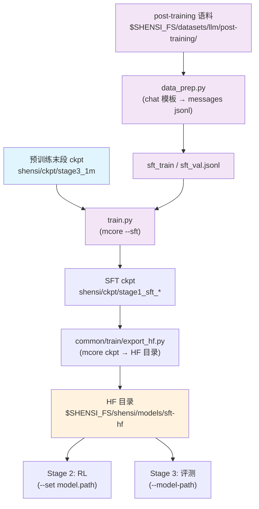

# Stage 1: SFT（指令微调）

从预训练末段 ckpt 起做多域指令微调：数据是 messages jsonl（含编码 / 推理 / 工具调用），
用 mcore 的 `--sft`（SFTDataset + SFTTokenizer 按 chat 模板生成 loss mask），模型与训练循环跟 PT 同一条。

## 总览

| 组件 | 说明 |
|------|------|
| `train.py` | 入口：`--profile` / `--config`、`--smoke`、`--data-jsonl`、`--set` |
| `test_train.py` | 集成测试：tiny 几何 5 步（走 `--sft` + `ShensiSFTDataset` 的 loss mask 路径） |
| `data_prep.py` | post-training 语料 → `{"messages": [...]}` jsonl（chat 模板，`truncation` 可配） |
| `encoding_dsv4.py` | DSV4 的编码 / 解码与 chat 模板实现：与 HF 侧同口径，保持原样（改这里要同步 HF 侧） |
| `config/` | `default.yaml`（全量档）+ `tiny.yaml`（冒烟档）+ `debug.yaml`（极小档） |
| `config/data_prep/` | `data_blend_raw.json` / `data_blend_tiny.json` / `debug_local.json` + 两份准备档 |
| `../common/train/sft_dataset.py` | `ShensiSFTDataset`：本仓的 SFT 数据集（一条对话一条样本 + 右 padding），见「数据准备」 |

关键口径：

| 项 | 值 |
| --- | --- |
| 起点 | `shensi/ckpt/stage3_1m`（1M 上下文基座），由 `experiment.load` 指定 |
| 序列长度 | 32768（指令数据比预训练语料短） |
| 全局批 / 步数 | `global_batch_size: 32`、`train_iters: 5000`（`split: 98,1,1` 切验证集，靠早停收尾） |
| 优化器 | AdaMuon（矩阵腿）+ AdEMAMix（标量腿）（微调只换 LR 曲线：1e-5 → 1e-6 cosine、warmup 1%、wd 0） |
| loss | 只算 assistant span（`SFTTokenizer` 生成 mask）；aux / ERC / indexer 三个 loss 按 SFT 口径自动关掉 |
| tokenizer | `SFTTokenizer`：正式档 `default`（tokenizer 自带 chat_template）、极小档 `identity` |

## 快速开始

```bash
python test_train.py                    # 集成测试（tiny 几何 5 步）
python data_prep.py --discover          # post-training 语料面貌
python data_prep.py --prepare           # → $SHENSI_FS/shensi/data/stage1_sft/sft_{train,val}.jsonl
python train.py --profile tiny          # 冒烟（tiny + mock）
python train.py --profile debug         # 真实数据的极小档
python train.py                         # 正式跑（default 档）
```

`data_prep.py` 的输出是**一行一条**的 `{"messages": [{"role": ..., "content": ...}, ...]}`；
mcore 的 `--sft` 直接读 jsonl（不用 bin/idx），loss mask 由 `SFTTokenizer` 按模板切。
`train.py` 会把 `sft_train.jsonl` 写进 `train.data.data_path`（也可 `--data-jsonl` 指别的文件）。

## 数据准备

### 流程

1. **取语料**：来源是 post-training 集（`$SHENSI_FS/datasets/llm/post-training/`），配比见
   `config/data_prep/data_blend_raw.json`，`--discover` 看实际列名；
2. **拼 messages**：多轮样本按 chat 模板拼成单条 `messages`；
3. **超长处理**：按 `truncation` 策略处理（默认 `error`，直接报错提醒调 `max_length`）；
4. **落盘**：一行一条的 jsonl（`sft_train.jsonl` + `sft_val.jsonl`）。

### CLI 命令

```bash
python data_prep.py --discover [选项]     # 只看面貌，不落盘
python data_prep.py --prepare [选项]      # 产出 sft_{train,val}.jsonl
```

| 选项 | 说明 |
|------|------|
| `--discover` | 打印语料面貌（数据集在不在、条数、列名） |
| `--prepare` | 产出 `sft_train.jsonl` / `sft_val.jsonl` |
| `--tiny` | 只产出极小冒烟语料 `tiny_sft.jsonl`（`--profile tiny` 用，不碰真实语料） |
| `--blend <json>` | 换一份配比（默认 `config/data_prep/data_blend_raw.json`；离线档用 `debug_local.json`） |
| `--limit N` | 每个数据集最多取 N 条（冒烟 / 调试） |
| `--out <目录>` | 产物目录（默认 `$SHENSI_FS/shensi/data/stage1_sft`） |
| `--val-ratio <r>` | 验证集比例（默认 0.005） |
| `--thinking-mode auto / chat / thinking` | DSV4 编码模式：`auto` = 有 `reasoning_content` 就走 thinking |

### 输入

| 输入 | 位置 |
|------|------|
| 语料根 | `$SHENSI_FS/datasets/llm/post-training/`（`--root` 可换） |
| 配比 | `config/data_prep/data_blend_raw.json`（全量）/ `data_blend_tiny.json`（小配比）/ `debug_local.json`（离线档） |
| 样本形态 | OpenAI 风格 `messages`（多轮样本按 chat 模板拼成单条） |

### 输出

```
$SHENSI_FS/shensi/data/stage1_sft/
├── sft_train.jsonl   # 一行一条 {"messages": [...]}
└── sft_val.jsonl     # 同一口径切出的验证集
```

### 单样本口径（不打包）

上游的 `SFTDataset` 会把多条对话打进一条样本并给出 `cu_seqlens`（THD），而 CSA/HCA 层明确断言
`packed_seq_params is None`——打包在本家族上走不通。本栈换成 `../common/train/sft_dataset.py` 的
`ShensiSFTDataset`：**一条对话一条样本 + 右侧 padding**，tokenize 与 loss mask（prompt 段与 padding 段
都不算 loss）沿用上游同一套口径，只是不产出 `cu_seqlens`；要回上游的 THD 打包口径加 `--shensi-sft-packed`。
右 padding 对因果注意力无害：有效 token 看不到后面的 pad，pad 段本身也被 loss mask 排掉。

### 配置

`config/data_prep/default.yaml`：

| 参数 | 说明 |
|------|------|
| `root` | 语料根（默认 `$SHENSI_FS/datasets/llm/post-training`） |
| `out` | 产物目录（默认 `$SHENSI_FS/shensi/data/stage1_sft`） |
| `val_ratio` | 验证集比例（默认 0.005） |
| `thinking_mode` | `auto` / `chat` / `thinking` |
| `limit` | 每个数据集取多少条（默认 null = 全量） |

## 训练

### CLI 命令

```bash
python train.py [选项] [--set k=v ...]
```

| 选项 | 说明 |
|------|------|
| `--profile <档>` | `default` / `tiny` / `debug`；入口默认 `debug`（极小档最常用） |
| `--config <路径>` | 直接给配置档路径（与 `--profile` 等价，例：`config/tiny.yaml`） |
| `--smoke` | 走配方级冒烟档（mock 数据），不需要真实语料 |
| `--data-jsonl <文件>` | messages jsonl（默认 `<FS>/shensi/data/stage1_sft/sft_train.jsonl`） |
| `--set k=v` | 点号覆写（与 PT 同一套摊平语义），可多次；显式 `--set` 最后生效 |
| `--early-stop N` / `--no-early-stop` | 早停看门狗：默认开，盯 `lm loss value`，patience=3 |
| `--early-stop-grace S` | 早停宽限秒数（默认 600；跑过预热再判耐心） |
| `--dry-run` | 只打印将执行的命令 |

### 输入

- **模型**：预训练末段 ckpt（`experiment.load` 指向 `$SHENSI_FS/shensi/ckpt/stage3_1m`）；
- **数据**：`sft_train.jsonl` —— `train.py` 把它注入 `train.data.data_path`，`split: 98,1,1` 切出验证信号；
- **档**：`config/default.yaml`（正式）/ `config/tiny.yaml`（冒烟）/ `config/debug.yaml`（极小档）。

### 输出

- SFT ckpt：`train.system.checkpoint.save`（`$SHENSI_FS/shensi/ckpt/stage1_sft`；极小档实测存 `stage1_sft_debug`）；
- 送 RL / 评测前先用 `../common/train/export_hf.py` 把 mcore ckpt 转成 HF 目录（命令见「验证」）。

### 配置文件

| 文件 | 用途 |
|------|------|
| `config/default.yaml` | 全量档（正式跑） |
| `config/tiny.yaml` | 冒烟档（mock 数据） |
| `config/debug.yaml` | 极小几何 + 真实数据（入口默认） |
| `config/data_prep/data_blend_raw.json` / `data_blend_tiny.json` / `debug_local.json` | 数据配比（全量 / 小 / 离线） |
| `config/data_prep/default.yaml` / `tiny.yaml` | 数据准备档 |

### 覆写示例

```bash
# 覆写迭代数
python train.py --profile debug --set train.model.train_iters=200

# 早停：耐心 1、宽限 5s（「验证」里的实测口径）
python train.py --profile debug --set train.model.train_iters=200 --early-stop 1 --early-stop-grace 5

# 换一份 messages jsonl
python train.py --data-jsonl $SHENSI_FS/shensi/data/stage1_sft/sft_train.jsonl
```

## 验证

1. 极小档能续：`experiment.load` 指向 PT 的 debug ckpt 时要显式给 `no_load_optim/no_load_rng`；
2. 日志里 `lm loss` 下行、`grad norm` 不炸；loss mask 只覆盖 assistant 段与结尾 eos；
3. 指令跟随抽测（固定 prompt 生成，人工看格式与工具调用标签）；
4. **集成测试**：`python test_train.py` 5 步 PASS。

本机实测：离线档 `--prepare --blend config/data_prep/debug_local.json --limit 40` 出 38 行 jsonl；
`--profile debug` 2/2 步（载入 `pt_tiny_debug`，finetune 口径迭代号重开）存 `stage1_sft_debug`；
早停实测 `train_iters=200`、patience=1、grace=5s 在第 42 步收尾（`early_stop.json` 里 `why=patience`）；
导出给 RL / 评测：

```bash
python -m shensi.recipes.shensi.common.train.export_hf \
    --ckpt $SHENSI_FS/shensi/ckpt/stage1_sft_debug --out $SHENSI_FS/shensi/models/sft-hf --tiny
# 之后 stage2_rl 用 --set model.path=<out>，stage3_eval 用 --model-path <out>
```

## 局限

1. 微调规模上的优化器口径沿用预训练，LR 另有一组 20 步扫描（极小档、constant 曲线，读数见「验证」）；
2. `encoding_dsv4.py` 的 chat 模板与 HF 侧是同一口径：模板改动要两边同步，否则 loss mask 会不一致；
3. 数据配比走公开 post-training 集，没有自建指令数据——覆盖的是**域**：math / code / agent / safety / 多语。

## 产物流



## 下一步

对齐 / RL 见 [Stage 2: RL](../stage2_rl/README.md)。

## 前序阶段

- [Stage 0: 预训练](../stage0_pretrain/README.md) — 稠密主干 → DSA 引入 → 1M 长上下文；
  本段起点 `shensi/ckpt/stage3_1m` 就是它的末段产物。
