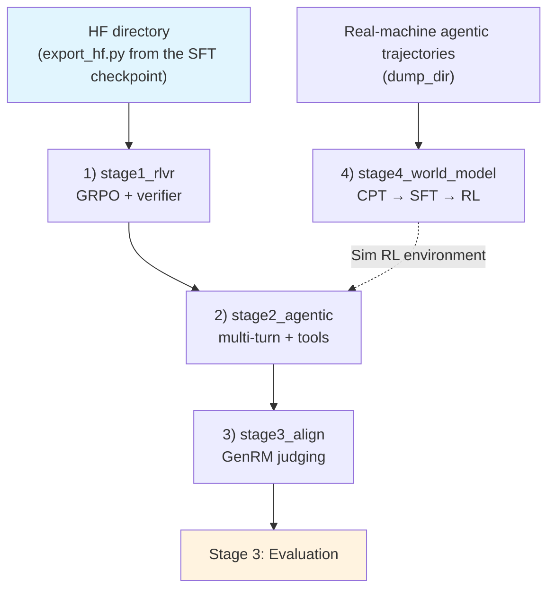

# Stage 2: Reinforcement Learning (four sub-stages, verl)

RL is not one monolithic stage: the task shapes split it into four sub-stages that share **one verl
trainer and one reward stack**, differing in data, sampling budget, trajectory length and environment
backend. The policy line runs 1) RLVR → 2) agentic → 3) alignment; 4) the world model runs in parallel and
its artifact becomes 2)'s Sim RL environment.

## Overview

| Sub-stage | What it is | Data | Environment |
|-----------|------------|------|-------------|
| [`stage1_rlvr`](./stage1_rlvr/README.md) | 1) Multi-environment verifiable-reward RL (math / science / code / reasoning, mostly single-turn) | 11 verifiable sets | none (pure verifier) |
| [`stage2_agentic`](./stage2_agentic/README.md) | 2) Long-horizon agentic RL (multi-turn + tools + environments) | SWE / terminal / retrieval trajectories | real containers, or the world model (`--profile world_model`) |
| [`stage3_align`](./stage3_align/README.md) | 3) Preference / instruction / safety alignment | preference pairs + GenRM judging | a judge model (`reward.judge_model`) |
| [`stage4_world_model`](./stage4_world_model/README.md) | 4) World model: action → observation (CPT → SFT → RL) | interaction trajectories | its artifact is 2)'s Sim RL environment |

Shared components: [`../rl.py`](../rl.py) (YAML → verl CLI mapping, RL schema normalization, launch and
environment handling), [`reward.py`](./reward.py) (verifier rewards and judge wiring) and
[`agentworld/`](./agentworld/README.md) (multi-turn prompt assets and judge parsing, an external source
kept as is). Every sub-stage has `train.py` (a thin wrapper over `rl.launch`), `data_prep.py`,
`test_train.py` and `config/`.

| Setup | Value | Where |
|-------|-------|-------|
| Algorithm | GRPO + **IcePop-style two-sided clipping** (`clip_ratio_low/high = 0.2/0.28`), no KL (`kl_coef 0`) | `stage1_rlvr/config/default.yaml` |
| Learning rate | constant 1e-6 (RLVR) → 5e-7 (agentic / align) | each sub-stage's `actor.optim.lr` |
| Sampling | `rollout.n: 8` (4 for agentic), temperature 1.0; `max_response_length` per stage (32K / 64K / 8K) | each sub-stage's `rollout` / `data` |
| Parallelism | actor TP=PP=1 (size `rollout.tensor_model_parallel_size` to the machine); `use_remove_padding: false` (CSA does not support packing) | `model.use_remove_padding` |
| Single-box memory budget | ray dashboard off, `num_cpus: 8`, `num_data_storage_units: 2` | `ray_kwargs` / `transfer_queue` |
| Environments / harness | single wiring in [`../harness.py`](../harness.py) (DeepSeek Harness by default; Gym is one of its hosts) | each sub-stage's `harness:` section |

## Quick Start

```bash
cd stage1_rlvr
python test_train.py --data-dir <parquet dir>       # preflight (config/data/ray/GPU/imports/env vars)
python data_prep.py --prepare                        # → train.parquet / val.parquet
python train.py --profile debug --data-dir <dir>     # tiny: 1 epoch, few samples
python train.py --profile default --data-dir <dir>   # production
```

`train.py --dry-run` prints the `python -m verl.trainer.main_ppo ...` command (with every override)
instead of launching. All four sub-stages share the same switches:

| Switch | Description |
|--------|-------------|
| `--profile` | `debug` (1 epoch, small batches) / `default` (production); `stage4_world_model` additionally takes `--step cpt/sft/rl/all` |
| `--data-dir` | parquet directory, defaults to `$SHENSI_FS/shensi/data/<stage>` |
| `--set k=v` | dotted overrides, e.g. `--set rollout.n=1 --set actor.optim.lr=5e-6` |
| `--early-stop N` / `--no-early-stop` | early-stop watchdog (default patience=3, metric `acc/mean@1:np.float64(`, `--mode max`) |

## Data Preparation

`data_prep.py --prepare` normalizes corpora into verl's RL schema (`prompt` + `reward_model.ground_truth`
+ `extra_info`) and writes `train.parquet` / `val.parquet`; sources and weights are in each sub-stage's
`config/data_prep/data_blend_raw.json` (`--discover` prints the actual directories and columns).

```bash
python data_prep.py --discover                    # corpus shape (which datasets exist, field names)
python data_prep.py --prepare --blend config/data_prep/debug_sample.json --max-chars 2000
```

## Interface with mcore / upstream

The `stage1_rlvr` debug profile runs to training steps (rc=0, `step:0` → `step:N`); import-time and
config-time potholes are closed by [`shensi.runtime`](../../../runtime.py):

- verl's v012 compatibility layer imports two FL-fork-only modules before its version guard → runtime
  provides two minimal implementations;
- `mcore_fsdp_adapter.FullyShardedDataParallel` is a factory function upstream while this verl build
  treats it as a class in type checks;
- `dsa_kernel_backend` defaults to `cudnn` under dsv4_hybrid (requires flash_mla) → runtime falls back to
  `none` when no fused kernel is available;
- Attention contract: mcore's CSA does not accept an explicit mask while verl right-pads responses to
  `max_response_length` → Bridge's `ShensiModel.forward` drops pure right-padding masks (left padding /
  document boundaries fail loudly); the trailing pads still flow through the compression blocks.

## Verification

1. **Preflight PASS**: `python test_train.py --data-dir <dir>` (config/data/ray/GPU/imports all ✓);
2. The log shows `Training Progress` and `step:N`, and `critic/score/mean` has non-zero variance (the
   reward actually differentiates);
3. `actor/recompute` logprob deviation stays within threshold (rollout and training agree on the setup);
4. The early-stop watchdog uses `critic/score/mean` (`--mode max`).

**Local verification** (WSL2 + RTX 5080 16G, single GPU) — both RL and evaluation start from checkpoints
trained here rather than from random weights:

```bash
# 1) SFT's mcore artifact → HF directory
python -m shensi.recipes.shensi.train.export_hf \
    --ckpt $SHENSI_FS/shensi/ckpt/stage1_sft_debug --out $SHENSI_FS/shensi/models/sft-hf --tiny
# 2) all four sub-stages use it as model.path
cd stage1_rlvr && python train.py --profile debug --data-dir $SHENSI_FS/shensi/data/stage1_rlvr \
    --set model.path=$SHENSI_FS/shensi/models/sft-hf
```

| Sub-stage | Result |
|-----------|--------|
| stage1_rlvr | 19/19 steps (1 epoch), 20 weight syncs |
| stage2_agentic | 19/19 steps (1 epoch), 20 weight syncs |
| stage3_align | 19/19 steps (1 epoch), 20 weight syncs |
| stage4_world_model | CPT and SFT segments passed, RL 3 steps (CPU stub judge endpoint) |

The three RLVR / agentic / align runs sync actor weights to vLLM every step (`update_weights done` in the
log), so both directions — HF → mcore (load) and mcore → HF (per-step sync) — ran on real weights.

## Artifact Lineage



## Limitations

1. All four sub-stages reached training steps locally (RLVR / agentic / align at 19/19 steps, world model
   with all three segments passing); real scores and real environments still need the target machine
   (each sub-stage's README has the details);
2. MTP and mHC run together: HF artifacts carrying `mtp.*` convert and flow into RL; the local tiny RL
   runs use an MTP=0 checkpoint — enabling MTP is just adding `--mtp 1` to `export_hf`;
3. Agentic and alignment environments and judge models are external dependencies: the harness wiring is
   unified on DeepSeek Harness (dsh) ([`../harness.py`](../harness.py), the same wiring
   [stage 3 evaluation](../stage3_eval/README.md) uses; vLLM remains the serving layer), and the GenRM
   judge needs an endpoint of your own — the preflight reports what is missing and how to install it.

## Next Steps

- Policy line: `stage1_rlvr` → `stage2_agentic` → `stage3_align`;
- World-model line (parallel): `stage4_world_model`, whose artifact becomes `stage2_agentic --profile
  world_model`'s environment;
- Evaluation is in [Stage 3: Evaluation](../stage3_eval/README.md).
