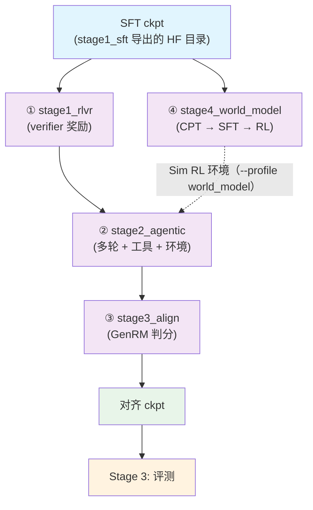

# Stage 2: RL（四个子段，verl）

RL 按任务形态拆成四个子 stage，**同一个 verl 训练器 + 同一套奖励函数**，差别在数据、采样预算、
轨迹长度与环境后端。策略这条线是 ① RLVR → ② agentic → ③ 对齐；④ 世界模型与它并行（产物回给 ② 当环境）。

## 总览

| 子 stage | 内容 | 数据 | 环境 |
|----------|------|------|------|
| [`stage1_rlvr`](./stage1_rlvr/README.md) | ① 多环境可验证奖励 RL（数学 / 科学 / 代码 / 推理，单轮为主） | 11 个可校验集 | 无（纯 verifier） |
| [`stage2_agentic`](./stage2_agentic/README.md) | ② 长时程 agentic RL（多轮 + 工具 + 环境） | SWE / 终端 / 检索轨迹 | 容器内真机或世界模型（`--profile world_model`） |
| [`stage3_align`](./stage3_align/README.md) | ③ 偏好 / 指令 / 安全对齐 | 偏好对 + GenRM 判分 | 判分模型（`reward.judge_model`） |
| [`stage4_world_model`](./stage4_world_model/README.md) | ④ 世界模型：动作 → 观测（CPT → SFT → RL） | 交互轨迹 | 产物即 ② 的 Sim RL 环境 |

共用件分两层。仓库级公共件在 `../common/`：[`rl.py`](../common/rl.py)（yaml → verl CLI 映射、RL schema
归一、启动与环境处理）、`harness.py`（外部 harness 的统一接线，默认 dsh）。RL 子段共用件收在 `./common/`：
[`reward.py`](./common/reward.py)（verifier 奖励）+ [`agentworld/`](./common/agentworld/README.md)（多轮环境的
提示词与判分解析，保持原样）——四个子段都从这里取奖励与环境资产。每个子 stage：`train.py`（`rl.launch`
的薄封装）/ `data_prep.py` / `test_train.py` / `config/` / `config/data_prep/`。

关键口径：

| 口径 | 值 | 落在哪 |
| --- | --- | --- |
| 算法 | GRPO + IcePop 式双侧截断（`clip_ratio_low/high = 0.2/0.28`）、不做 KL | `stage1_rlvr/config/default.yaml` |
| 优化器 | AdaMuon（矩阵腿）+ AdEMAMix（标量腿），与预训练 / SFT 同一套 | `actor.optim.*` |
| 学习率 | 1e-6 恒定（RLVR）→ 5e-7（agentic / align） | 各子段 `actor.optim.lr` |
| 采样 | `rollout.n: 8`（agentic 为 4）、温度 1.0；`max_response_length` 按段给（32K / 64K / 8K） | 各子段 `rollout` / `data` |
| 并行 | actor TP=PP=1；`use_remove_padding: false`（CSA 不支持打包） | `model.use_remove_padding` |
| 单机显存账 | 关 ray dashboard、`num_cpus: 8`、`num_data_storage_units: 2` | `ray_kwargs` / `transfer_queue` |

## 快速开始

```bash
cd stage1_rlvr
python test_train.py --data-dir <parquet 目录>       # 集成预检（配置/数据/ray/GPU/import/环境变量）
python data_prep.py --prepare --config config/data_prep/tiny.yaml
python train.py --profile debug --data-dir <目录>     # 极小档：1 epoch、少采样
python train.py --profile default --data-dir <目录>   # 正式跑
```

四个子段的开关一致：`train.py --dry-run` 只打印将要执行的 `verl.trainer.main_ppo` 命令（含所有覆盖项）；
`data_prep.py --discover` 先看数据在不在。正式跑用 `--set model.path=<SFT 导出的 HF 目录>` 把起点指过去。

## 数据准备

`data_prep.py --prepare` 把语料归一成 verl 的 RL schema——每条训练行带
`prompt` + `reward_model.ground_truth` + `extra_info`——产出 `train.parquet` / `val.parquet`。
来源与配比见各子 stage 的 `config/data_prep/data_blend_raw.json`；`--discover` 打印实际目录与列名
（数据集在不在、条数、字段名），冒烟可以换 `config/data_prep/tiny.yaml` 那一档。

```bash
python data_prep.py --discover
python data_prep.py --prepare --config config/data_prep/tiny.yaml
```

### 输出

```
$SHENSI_FS/shensi/data/<stage>/
├── train.parquet   # prompt + reward_model.ground_truth + extra_info
└── val.parquet     # 早停看门狗盯的验证集
```

## 训练

### CLI 命令

```bash
python train.py [选项] [--set k=v ...]
```

| 选项 | 说明 |
|------|------|
| `--profile` / `--config` | `debug`（1 epoch、小批）/ `default`（正式）；`stage4_world_model` 另有 `--step cpt/sft/rl/all` |
| `--data-dir` | parquet 目录，默认 `$SHENSI_FS/shensi/data/<stage>` |
| `--set k=v` | 点号覆写，例如 `--set rollout.n=1 --set actor.optim.lr=5e-6` |
| `--early-stop N` / `--no-early-stop` | 早停看门狗（默认 patience=3，盯验证准确率 `acc/mean@1:np.float64(`，越大越好） |
| `--dry-run` | 只打印将执行的 `verl.trainer.main_ppo` 命令 |

### 输入

- **模型**：SFT 段导出的 HF 目录（正式跑用 `--set model.path=<sft-hf>`；不给就用档里的 `model.path`）；
- **数据**：`train.parquet` / `val.parquet`（`data_prep.py` 产出，`--data-dir` 指目录）；
- **配置**：各子段的 `config/<档>.yaml`（`default` / `debug` / `tiny` + 子段自己的档）。

### 输出

- **run 目录**：`$SHENSI_FS/shensi/runs/<stage>`（`hydra.run.dir` 由 `rl.launch` 追加）；
- **checkpoint**：verl 侧默认不存（`trainer.save_freq=-1`），要存就覆写 `trainer.save_freq` 与保存目录；
- 每步把 actor 权重同步给 vLLM rollout 引擎（日志里的 `update_weights done`），这条通路是 RL 段最核心的健康信号。

### 配置文件

| 文件 | 用途 |
|------|------|
| `config/default.yaml` | 各子段的正式档 |
| `config/debug.yaml` | 极小档（1 epoch、小批、少采样，只验「数据 → verl → rollout → 打分」链路） |
| `config/tiny.yaml` | 冒烟档（本地 tiny 模型 + 最小采样） |
| `config/gspo.yaml` / `config/dapo.yaml` | 算法档（`stage1_rlvr`：verl 原生 `algorithm.adv_estimator`，`--profile` 直接切） |
| `config/world_model.yaml`（agentic）/ `config/rl/*.yaml`（world_model）/ `config/tools/world_model.yaml` | 子段自己的档（Sim 环境、RL 步、工具接线） |
| `config/data_prep/` | 各子段的配比与准备档（`data_blend_raw.json` / `data_blend_tiny.json` / `default.yaml` / `tiny.yaml`） |

### 覆写示例

```bash
# 极小档 + 单卡最小采样
python train.py --profile debug --data-dir <目录> --set rollout.n=1 --set actor.optim.lr=5e-6

# 换起点（上一段导出的 HF 目录）
python train.py --profile default --data-dir <目录> --set model.path=<sft-hf>

# 只打印将执行的 verl 命令
python train.py --profile default --data-dir <目录> --dry-run
```

## 与上游的对接口径

`stage1_rlvr` 的 debug 档已跑到训练步，导入期与配置期的坑由 `shensi.runtime` 收口：

- verl 的 v012 兼容层在版本守卫之前就 import 两个 FL fork 才有的模块 → runtime 补最小实现；
- `mcore_fsdp_adapter.FullyShardedDataParallel` 在上游是工厂函数，而这份 verl 把它当类做类型判断；
- `dsa_kernel_backend` 在 dsv4_hybrid 下默认 `cudnn`（要 flash_mla）→ runtime 在本机没有融合内核时回退 `none`；
- 优化器：verl 只对名字正好是 `muon` 的情况透传 Muon 旋钮，runtime 把名字集合扩到 `adaptive_muon`
  （否则 actor 的标量腿会退回 mcore 默认的 adam）；
- 优化器的分片口径：LayerWise 分布式优化器在这套 verl + mcore 组合上被 verl 的守卫挡住
  （verl 构造 `DistributedDataParallelConfig(use_layer_wise_param_layout=True)`，而本仓这份 mcore main
  的 DDPConfig 没有这个字段）——所以 actor 走普通 DDP（`actor.optim.use_layer_wise_distributed_optimizer:
  false` + `actor.megatron.use_distributed_optimizer: false`），标量腿仍由 `shensi.utils.optimizer`
  接到 AdEMAMix；分片优化器的显存账见「局限」第 2 条；
- 注意力口径：mcore 的 CSA 不接受显式 mask，而 verl 会把 response 右 padding 到 `max_response_length` →
  Bridge 的 `ShensiModel.forward` 丢掉纯右 padding 的 mask（左 padding / 文档边界直接报错）。

## 验证

1. **集成预检 PASS**：`python test_train.py --data-dir <目录>`；
2. 日志里出现 `Training Progress` 与 `step:N`，`critic/score/mean` 有非零方差；
3. `actor/recompute` 的 logprob 偏差在阈值内（rollout 与训练口径一致）；
4. 早停看门狗用验证准确率收尾。

本机实测（单卡，从 SFT 导出的 ckpt 起）：

| 子段 | 结果 |
| --- | --- |
| stage1_rlvr | 19/19 步（1 epoch），权重同步 20 次；换 AdaMuon + AdEMAMix 后重跑同样 100% |
| stage2_agentic | 19/19 步（1 epoch），权重同步 20 次 |
| stage3_align | 19/19 步（1 epoch），权重同步 20 次 |
| stage4_world_model | CPT 与 SFT 两段通过、RL 3 步（CPU 判分） |

每步都会把 actor 权重同步给 vLLM（日志里的 `update_weights done`），说明 HF → mcore（载入）与
mcore → HF（每步同步）两个方向都在真实权重上跑通。

## 局限

1. 四个子段都在本机跑到过训练步；真分数与真环境仍要目标机；
2. 优化器在 RL 规模上的分片口径受限：LayerWise 分布式优化器被 verl 的守卫挡在这套 mcore 之外
   （见「与上游的对接口径」），actor 的优化器状态不跨卡分片——**生产规模（8 卡 × 9B）的显存账
   要等 mcore 侧把 `use_layer_wise_param_layout` 补回 DDPConfig 或 verl 放宽守卫**；收敛对照也没做，
   `muon_extra_scale_factor` 沿用预训练的值（0.18）；
3. MTP 与 mHC 已打通：带 `mtp.*` 的 HF 产物能转换、能进 RL（极小档用的是 MTP=0 的 ckpt）；
4. agentic / align 的环境与判分模型属于外部依赖：harness 统一在 `../common/harness.py`（默认 dsh，
   Gym 是它的宿主之一），判分可以用 CPU 上的小模型服务（`stage4_world_model/local_judge.py`）或外部端点。

## 产物流



## 下一步

- 策略这条线：`stage1_rlvr` → `stage2_agentic` → `stage3_align`；
- 世界模型这条线（与策略并行）：`stage4_world_model`，产物被 `stage2_agentic --profile world_model` 当环境用；
- 评测见 [Stage 3: 评测](../stage3_eval/README.md)。

## 前序阶段

- [Stage 1: SFT](../stage1_sft/README.md) — 四个子段共同的起点：SFT ckpt 经
  `../common/train/export_hf.py` 导出成 HF 目录后由 `--set model.path` 指定。
