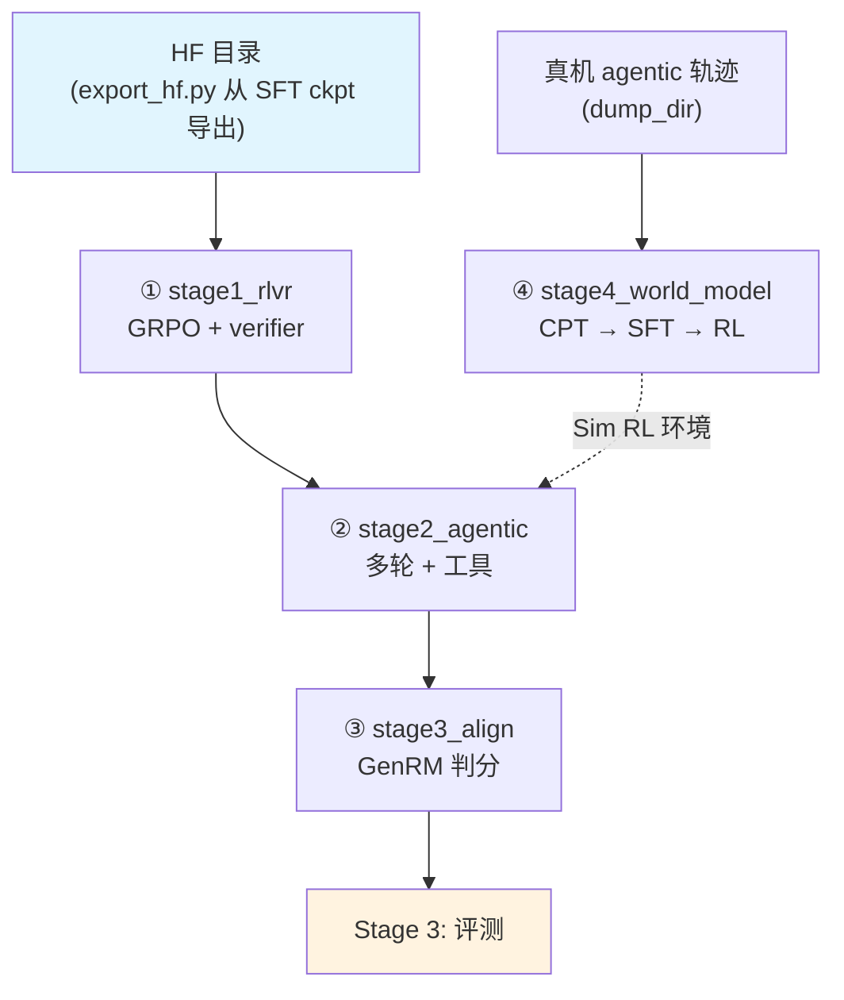

# Stage 2: RL（四个子段，verl）

RL 不是一个阶段跑完的：按任务形态拆成四个子 stage，**同一个 verl 训练器 + 同一套奖励函数**，
差别在数据、采样预算、轨迹长度与环境后端。策略这条线是 ① RLVR → ② agentic → ③ 对齐；
④ 世界模型与它并行（产物回给 ② 当 Sim RL 环境）。

## 总览

| 子 stage | 内容 | 数据 | 环境 |
|----------|------|------|------|
| [`stage1_rlvr`](./stage1_rlvr/README.md) | ① 多环境可验证奖励 RL（数学 / 科学 / 代码 / 推理，单轮为主） | 11 个可校验集 | 无（纯 verifier） |
| [`stage2_agentic`](./stage2_agentic/README.md) | ② 长时程 agentic RL（多轮 + 工具 + 环境） | SWE / 终端 / 检索轨迹 | 容器内真机或世界模型（`--profile world_model`） |
| [`stage3_align`](./stage3_align/README.md) | ③ 偏好 / 指令 / 安全对齐 | 偏好对 + GenRM 判分 | 判分模型（`reward.judge_model`） |
| [`stage4_world_model`](./stage4_world_model/README.md) | ④ 世界模型：动作 → 观测（CPT → SFT → RL） | 交互轨迹 | 产物即 ② 的 Sim RL 环境 |

公共件：[`../rl.py`](../rl.py)（yaml → verl CLI 映射、RL schema 归一、启动与环境处理）、
[`reward.py`](./reward.py)（verifier 奖励与判分接线）、[`agentworld/`](./agentworld/README.md)
（多轮环境的提示词资产与判分解析，外部来源保持原样）；每个子 stage 有
`train.py`（`rl.launch` 的薄封装）/ `data_prep.py` / `test_train.py` / `config/`。

| 口径 | 值 | 落在哪 |
| --- | --- | --- |
| 算法 | GRPO + **IcePop 式双侧截断**（`clip_ratio_low/high = 0.2/0.28`）、不做 KL（`kl_coef 0`） | `stage1_rlvr/config/default.yaml` |
| 优化器 | **AdaMuon（矩阵腿）+ AdEMAMix（标量腿）**，与预训练 / SFT 同一套（`actor.optim` 里选，`use_layer_wise_distributed_optimizer: true`） | `actor.optim.*` |
| 学习率 | 1e-6 恒定（RLVR）→ 5e-7（agentic / align） | 各子段 `actor.optim.lr` |
| 采样 | `rollout.n: 8`（agentic 为 4）、温度 1.0；`max_response_length` 按段给（32K / 64K / 8K） | 各子段 `rollout` / `data` |
| 并行 | actor TP=PP=1（单机 1~8 卡按机器调）；`use_remove_padding: false`（CSA 不支持打包） | `model.use_remove_padding` |
| 单机显存账 | 关 ray dashboard、`num_cpus: 8`、`num_data_storage_units: 2` | `ray_kwargs` / `transfer_queue` |
| 环境 / harness | 统一接线在 [`../harness.py`](../harness.py)（默认 DeepSeek Harness，Gym 是它的宿主之一） | 各子段 yaml 的 `harness:` 段 |

## 快速开始

```bash
cd stage1_rlvr
python test_train.py --data-dir <parquet 目录>       # 集成预检（配置/数据/ray/GPU/import/环境变量）
python data_prep.py --prepare                        # → train.parquet / val.parquet
python train.py --profile debug --data-dir <目录>     # 极小档：1 epoch、少采样
python train.py --profile default --data-dir <目录>   # 正式跑
```

`train.py --dry-run` 只打印将要执行的 `python -m verl.trainer.main_ppo ...` 命令（含所有覆盖项）。
四个子段的开关一致：

| 旋钮 | 说明 |
|------|------|
| `--profile` | `debug`（1 epoch、小批）/ `default`（正式）；`stage4_world_model` 另有 `--step cpt/sft/rl/all` |
| `--data-dir` | parquet 目录，默认 `$SHENSI_FS/shensi/data/<stage>` |
| `--set k=v` | 点号覆写，例如 `--set rollout.n=1 --set actor.optim.lr=5e-6` |
| `--early-stop N` / `--no-early-stop` | 早停看门狗（默认 patience=3，盯验证准确率 `acc/mean@1:np.float64(`，`--mode max`） |

## 数据准备

`data_prep.py --prepare` 把语料归一成 verl 的 RL schema（`prompt` + `reward_model.ground_truth` +
`extra_info`），产出 `train.parquet` / `val.parquet`；来源与配比见各子 stage 的
`config/data_prep/data_blend_raw.json`（`--discover` 看实际目录与列名）。

```bash
python data_prep.py --discover                    # 语料面貌（哪些数据集在位、字段名）
python data_prep.py --prepare --blend config/data_prep/debug_sample.json --max-chars 2000
```

## 与 mcore / 上游的对接口径

`stage1_rlvr` 的 debug 档已跑到训练步（rc=0、`step:0` → `step:N`），导入期与配置期的坑由
[`shensi.runtime`](../../../runtime.py) 收口：

- verl 的 v012 兼容层在版本守卫之前就 import 两个 FL fork 才有的模块 → runtime 补两个最小实现；
- `mcore_fsdp_adapter.FullyShardedDataParallel` 在上游是工厂函数，而这份 verl 把它当类做类型判断；
- `dsa_kernel_backend` 在 dsv4_hybrid 下默认 `cudnn`（要 flash_mla）→ runtime 在本机没有融合内核时回退 `none`；
- 优化器：verl 的 `init_megatron_optim_config` 只对名字正好是 `muon` 的情况透传那批旋钮，
  runtime 把名字集合扩到 `adaptive_muon`（否则 actor 的标量腿会退回 mcore 默认的 adam）；
- 注意力口径：mcore 的 CSA 不接受显式 mask，而 verl 会把 response 右 padding 到 `max_response_length` →
  Bridge 的 `ShensiModel.forward` 丢掉纯右 padding 的 mask（左 padding / 文档边界直接报错），
  尾部 pad 仍会经压缩块参与计算。

## 验证

1. **集成预检 PASS**：`python test_train.py --data-dir <目录>`（配置/数据/ray/GPU/import 全 ✓）；
2. 日志里出现 `Training Progress` 与 `step:N`，且 `critic/score/mean` 有非零方差（奖励真的在分化）；
3. `actor/recompute` 的 logprob 偏差在阈值内（rollout 侧与训练侧的口径一致）；
4. 早停看门狗用 `critic/score/mean`（`--mode max`）收尾。

**本机实跑记录**（WSL2 + RTX 5080 16G，单卡）——RL 与评测都从前面训出来的 ckpt 起：

```bash
# ① SFT 的 mcore 产物 → HF 目录
python -m shensi.recipes.shensi.train.export_hf \
    --ckpt $SHENSI_FS/shensi/ckpt/stage1_sft_debug --out $SHENSI_FS/shensi/models/sft-hf --tiny
# ② 四个子段都拿它当 model.path
cd stage1_rlvr && python train.py --profile debug --data-dir $SHENSI_FS/shensi/data/stage1_rlvr \
    --set model.path=$SHENSI_FS/shensi/models/sft-hf
```

| 子段 | 结果 |
| --- | --- |
| stage1_rlvr | 19/19 步（1 epoch），权重同步 20 次——本轮换 AdaMuon + AdEMAMix 后重跑同样 100% |
| stage2_agentic | 19/19 步（1 epoch），权重同步 20 次 |
| stage3_align | 19/19 步（1 epoch），权重同步 20 次 |
| stage4_world_model | CPT 与 SFT 两段通过、RL 3 步（用 CPU 桩判分端点） |

三个 RLVR/agentic/align 段每步都会把 actor 权重同步给 vLLM（日志里的 `update_weights done`），
说明 HF → mcore（载入）与 mcore → HF（每步同步）两个方向都在真实权重上跑通了。

## 产物链路



## 局限

1. 四个子段都在本机跑到过训练步（RLVR / agentic / align 各 19/19 步，world_model 三段全通过）；
   真分数与真环境仍要目标机（见各子段 README）；
2. 优化器：actor 与预训练同一套（AdaMuon + AdEMAMix），但 RL 规模上的收敛对照没做；
   `muon_extra_scale_factor` 沿用预训练的值（0.18）；
3. MTP 与 mHC 已打通：带 `mtp.*` 的 HF 产物能转换、能进 RL；本机的 RL 极小档用的是 MTP=0 的 ckpt，
   开 MTP 只是把 `--mtp 1` 加到 `export_hf` 上；
4. agentic / align 的环境与判分模型属于外部依赖：agent harness 统一在 DeepSeek Harness（dsh）下
   （[`../harness.py`](../harness.py)，[`../stage3_eval`](../stage3_eval/README.md) 与本段共用同一份接线；
   vLLM 仍是服务层），GenRM 判分模型要自备端点——预检会报缺什么、怎么装。

## 下一步

- 策略这条线：`stage1_rlvr` → `stage2_agentic` → `stage3_align`；
- 世界模型这条线（与策略并行）：`stage4_world_model`，产物被 `stage2_agentic --profile world_model` 当环境用；
- 评测见 [Stage 3: 评测](../stage3_eval/README.md)。
