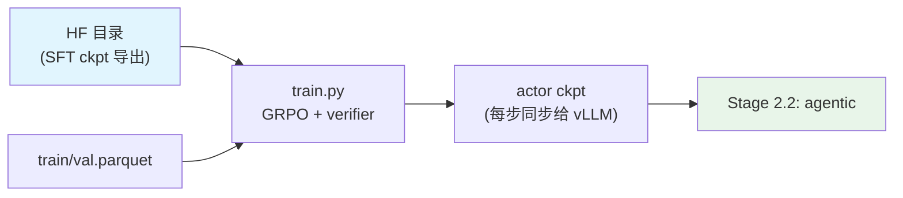

# Stage 2.1: 多环境可验证奖励 RL（RLVR）

`stage2_rl` 的第一段：单轮为主、答案可校验。数据用 post-training 里带 verifier 的 RL 集与官方
`*-Training-Blends`（它们已经把多环境、多奖励混好了），奖励由 [`../reward.py`](../reward.py) 按 verifier 规则判。

## 总览

| 组件 | 做什么 |
|------|--------|
| `train.py` | 入口（[`../../rl.py`](../../rl.py) 的薄封装）：`--profile` / `--data-dir` / `--dry-run` / `--set` |
| `test_train.py` | 集成预检：配置→命令、数据 parquet、ray、GPU、import、环境变量 |
| `data_prep.py` | 语料 → verl 的 RL schema（`train.parquet` / `val.parquet`） |
| `config/` | `default.yaml` + `debug.yaml` + 算法档 `gspo.yaml` / `dapo.yaml` |

| 项 | 值 |
| --- | --- |
| 目标 | 在可校验任务上把「答对」的比例顶起来（数学 / 科学 / 代码 / 推理） |
| 数据 | `config/data_prep/data_blend_raw.json`：11 个可校验集，权重按本阶段归一 |
| 算法 | GRPO（verl 原生 `algorithm.adv_estimator`），不做 KL（`kl_coef 0`） |
| 采样 | `rollout.n = 8`，`max_response_length = 32768`（推理链要够长） |
| LR / 截断 | 1e-6 恒定；`clip_ratio_low/high = 0.2/0.28`（IcePop 式双侧截断） |
| 优化器 | **AdaMuon（矩阵腿）+ AdEMAMix（标量腿）**，与预训练 / SFT 同一套（`actor.optim.optimizer` / `actor.optim.muon_scalar_optimizer`）；极小档关掉 LayerWise，走普通 bf16 包装 |

**算法档**：默认 GRPO；`config/gspo.yaml`（序列级重要性比，长思维链更稳）与 `config/dapo.yaml`
（clip-higher + 动态采样，group 拉到 16）都是 verl 原生的 `algorithm.adv_estimator`，
`--profile gspo` / `--profile dapo` 直接切。判分侧：[`../reward.py`](../reward.py) 是 verifier 规则
（`string_match` / 精确 / 数字 / `pass_rate` 软标签）+ 兜底 0；代码类没有单测时可接模型判分端点
（CodeRM 思路），预检会报端点是否就位。

## 快速开始

```bash
python test_train.py --data-dir <parquet 目录>    # 集成预检（不跑完整 GRPO）
python data_prep.py --discover                     # 看数据在不在
python data_prep.py --prepare                      # → $SHENSI_FS/shensi/data/stage1_rlvr/{train,val}.parquet
python train.py --dry-run                          # 看 verl 命令
python train.py --profile debug --data-dir <目录>   # 极小档（1 epoch、少采样）
python train.py --set model.path=<sft ckpt>        # 正式跑：上一段 ckpt 用 --set 指过去
```

## 数据准备

11 个可校验集（数学 / 科学 / 代码 / 推理），每条数据行带 `verifier`（判分规则）与
`reward_model.ground_truth`；`--discover` 会打印每个数据集在不在、条数与字段名。
本机冒烟可以只用 40 条自造的小语料（`problem` + `answer`）跑通全链路：

```bash
python data_prep.py --prepare --blend config/data_prep/data_blend_tiny.json --limit 40
```

## 训练

| 项 | 值 | 说明 |
| --- | --- | --- |
| 并行 | actor TP=PP=1 | 单机 1~8 卡按机器调 `rollout.tensor_model_parallel_size` 等 |
| 每步权重同步 | mcore actor → vLLM rollout 引擎 | 日志里的 `update_weights done` |
| 优化器 | AdaMuon + AdEMAMix（`actor.optim.*`） | 默认档 `use_layer_wise_distributed_optimizer: true`；极小档关掉 |
| 早停 | `acc/mean@1:np.float64(`（验证准确率，越大越好） | `trainer.early_stop_metric` / `early_stop_mode` 可覆写 |

## 验证

1. **集成预检 PASS**：`python test_train.py --data-dir <目录>`；
2. `critic/score/mean` 高于基线并上行；
3. `actor/entropy` 不塌到 0；
4. 同一 prompt 采样 8 次能看到不同解法（多样性还在）；
5. 早停：验证准确率超耐心即收尾（默认 patience=3）。

**本机实跑记录**（WSL2 + RTX 5080 16G，单卡）：

```bash
python data_prep.py --prepare --blend config/data_prep/data_blend_tiny.json --limit 40
python -m shensi.recipes.shensi.common.train.export_hf \
    --ckpt $SHENSI_FS/shensi/ckpt/stage1_sft_debug --out $SHENSI_FS/shensi/models/sft-hf --tiny
python train.py --profile debug --data-dir $SHENSI_FS/shensi/data/stage1_rlvr \
  --set model.path=$SHENSI_FS/shensi/models/sft-hf
```

- 从**导出的 SFT ckpt** 起跑：19/19 步（`Training Progress: 100%`），权重同步 20 次，无报错；
- 本轮把 actor 换成 AdaMuon + AdEMAMix 后重跑：同样 19/19 步、100%、20 次权重同步
  （dry-run 里能看到 `actor_rollout_ref.actor.optim.optimizer=adaptive_muon` 与
  `...optim.muon_scalar_optimizer=ademamix` 进到 verl 的命令行）；
- 末尾指标里能看到 `actor/entropy`、`actor/grad_norm`、`training/rollout_probs_diff_*`（on-policy 一致性）
  与 `global_seqlen/*`，说明 rollout 的 log-prob 与 actor 的重算是对齐的。

## 产物链路



## 局限

1. 奖励只覆盖规则可判的部分；开放式任务的判分要等 [`../stage3_align`](../stage3_align/README.md) 的 GenRM 通道；
2. 11 个集的相对权重按本阶段归一，实际 token 占比要看 `--discover` 的实测条数；
3. 注意力口径：verl 会把 response 右 padding，而 mcore 的 CSA 不接受显式 mask →
   丢掉右 padding 的 mask（等价），尾部 pad 仍会经压缩块参与计算（同上游 FL 分支的口径）；
4. 优化器在 RL 规模上的 LR / 系数没有单独扫过，沿用预训练口径。

## 下一步

[`../stage2_agentic`](../stage2_agentic/README.md)（多轮 + 工具 + 环境）。
