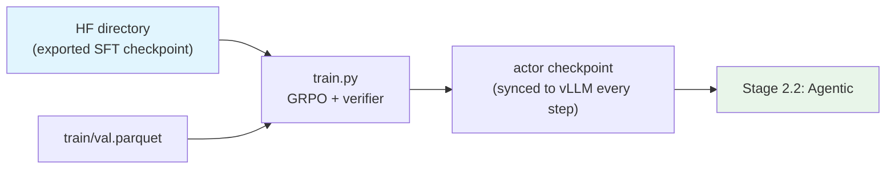

# Stage 2.1: Multi-environment Verifiable-reward RL (RLVR)

The first segment of `stage2_rl`: mostly single-turn tasks with checkable answers. The data comes from
verifiable RL sets and the official `*-Training-Blends` (which already mix multiple environments and
rewards); the reward is decided by [`../reward.py`](../reward.py) following the verifier rules.

## Overview

| Component | Description |
|-----------|-------------|
| `train.py` | Entry point (a thin wrapper over [`../../rl.py`](../../rl.py)): `--profile` / `--data-dir` / `--dry-run` / `--set` |
| `test_train.py` | Preflight: config → command, data parquet, ray, GPU, imports, env vars |
| `data_prep.py` | Corpora → verl's RL schema (`train.parquet` / `val.parquet`) |
| `config/` | `default.yaml` + `debug.yaml` + algorithm profiles `gspo.yaml` / `dapo.yaml` |

| Item | Value |
|------|-------|
| Goal | Raise the fraction of verifiably correct answers (math / science / code / reasoning) |
| Data | `config/data_prep/data_blend_raw.json`: 11 verifiable sets, weights normalized within this stage |
| Algorithm | GRPO (verl's native `algorithm.adv_estimator`), no KL (`kl_coef 0`) |
| Sampling | `rollout.n = 8`, `max_response_length = 32768` (reasoning chains need room) |
| LR / clipping | constant 1e-6; `clip_ratio_low/high = 0.2/0.28` (IcePop-style two-sided clipping) |
| Optimizer | verl's `actor.optim` (Adam family) — fine-tuning scale keeps the Adam family over Muon |

**Algorithm profiles**: GRPO is the default; `config/gspo.yaml` (sequence-level importance ratios, more
stable for long chains of thought) and `config/dapo.yaml` (clip-higher + dynamic sampling, group size 16)
are both verl-native `algorithm.adv_estimator` choices, selected with `--profile gspo` / `--profile dapo`.
On the judging side, [`../reward.py`](../reward.py) is verifier rules (`string_match` / exact / numeric /
`pass_rate` soft labels) with a 0 fallback; code tasks without unit tests can use a model-judge endpoint
(CodeRM-style) — the preflight reports whether the endpoint is in place.

## Quick Start

```bash
python test_train.py --data-dir <parquet dir>    # preflight (does not run full GRPO)
python data_prep.py --discover                     # is the data there
python data_prep.py --prepare                      # → $SHENSI_FS/shensi/data/stage1_rlvr/{train,val}.parquet
python train.py --dry-run                          # print the verl command
python train.py --profile debug --data-dir <dir>   # tiny (1 epoch, few samples)
python train.py --set model.path=<sft ckpt>        # production: point at the previous stage's checkpoint
```

## Data Preparation

11 verifiable sets (math / science / code / reasoning); every row carries a `verifier` (the judging rule)
and `reward_model.ground_truth`; `--discover` prints which datasets exist, their row counts and field
names. For a local smoke test, 40 hand-built small rows (`problem` + `answer`) exercise the whole chain:

```bash
python data_prep.py --prepare --blend config/data_prep/debug_sample.json --limit 40
```

## Training

| Item | Value | Notes |
|------|-------|-------|
| Parallelism | actor TP=PP=1 | size `rollout.tensor_model_parallel_size` etc. to the machine (1–8 GPUs) |
| Per-step weight sync | mcore actor → vLLM rollout engine | `update_weights done` in the log |
| Early stopping | `acc/mean@1:np.float64(` (validation accuracy, maximized) | override via `trainer.early_stop_metric` / `early_stop_mode` |

## Verification

1. **Preflight PASS**: `python test_train.py --data-dir <dir>`;
2. `critic/score/mean` is above the baseline and trending up;
3. `actor/entropy` does not collapse to 0;
4. Sampling one prompt 8 times yields different solutions (diversity survives);
5. Early stop: the run ends once validation accuracy exceeds patience (default 3).

**Local verification** (WSL2 + RTX 5080 16G, single GPU):

```bash
python data_prep.py --prepare --blend config/data_prep/debug_sample.json --limit 40
python -m shensi.recipes.shensi.train.export_hf \
    --ckpt $SHENSI_FS/shensi/ckpt/stage1_sft_debug --out $SHENSI_FS/shensi/models/sft-hf --tiny
python train.py --profile debug --data-dir $SHENSI_FS/shensi/data/stage1_rlvr \
  --set model.path=$SHENSI_FS/shensi/models/sft-hf
```

- Starting from the **exported SFT checkpoint**: 19/19 steps (`Training Progress: 100%`), 20 weight syncs,
  no errors;
- The final metrics include `actor/entropy`, `training/rollout_probs_diff_*` (on-policy consistency) and
  `global_seqlen/*`, showing that rollout log-probs and the actor's recomputation agree.

## Artifact Lineage



## Limitations

1. Rewards only cover the rule-checkable part; open-ended tasks wait for
   [`../stage3_align`](../stage3_align/README.md)'s GenRM channel;
2. The 11 sets' relative weights are normalized within this stage; actual token shares follow
   `--discover`'s measured row counts;
3. Attention contract: verl right-pads responses while mcore's CSA does not accept an explicit mask →
   pure right-padding masks are dropped (equivalent), and trailing pads still pass through the
   compression blocks (same setup as the upstream FL branch).

## Next Steps

[`../stage2_agentic`](../stage2_agentic/README.md) (multi-turn + tools + environments).
