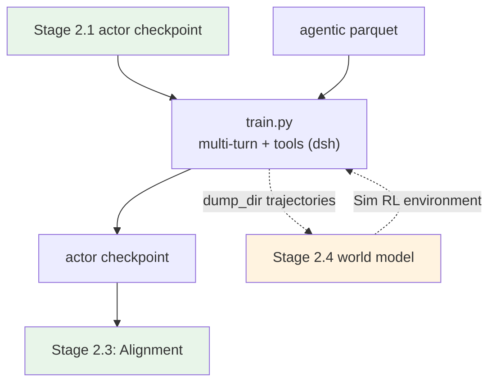

# Stage 2.2: Long-horizon Agentic RL

The second segment of `stage2_rl`: multi-turn + tools + environments, with rewards from an environment
verifier (running tests inside a container) or an environment played by the
[world model](../stage4_world_model/README.md) (Sim RL).

## Overview

| Component | Description |
|-----------|-------------|
| `train.py` | Entry point (two modes: real containers / `--profile world_model`) |
| `test_train.py` | Preflight (config → command, data, ray, GPU, imports, `agentworld` assets) |
| `data_prep.py` | Agentic / SWE / tool-call RL sets → parquet (`agent_ref` and `verifier` travel with each training row) |
| `world_model.py` | **The Sim RL environment**: a language world model (three modes) plus an optional HTTP environment server |
| `world_model_tool.py` + `config/tools/world_model.yaml` | Attaches the world model as a verl tool (the multi-turn state machine runs upstream's `ToolAgentLoop`) |
| `config/` | `default.yaml` (real environment) + `world_model.yaml` (Sim) + `debug.yaml` + `data_prep/` |

| Item | Value |
|------|-------|
| Data | Agentic / SWE / tool-call RL sets (6 of them, see `config/data_prep/data_blend_raw.json`) |
| Differences from RLVR | `base:`-inherits [`../stage1_rlvr/config`](../stage1_rlvr/config): `rollout.n: 4`, `max_response_length: 65536`, `lr: 5e-7`, `total_epochs: 50` (steps unbounded; the early-stop watchdog ends the run) |
| harness (real mode) | Environment and tool layer run **DeepSeek Harness (dsh)** (needs an OpenAI/DeepSeek-compatible endpoint — our `vllm serve`); Gym is one of its hosts. Installation: [`../../stage3_eval/setup_env.sh`](../../stage3_eval/setup_env.sh) |
| harness (Sim mode) | `--profile world_model`: the environment becomes a **language world model**, observations are predicted |
| Criteria | Task completion rate trends up; trajectory length distribution stays stable; tool-call format error rate drops |

## Quick Start

```bash
python test_train.py --data-dir <parquet dir>      # preflight
python data_prep.py --prepare && python train.py --dry-run && python train.py
```

### Sim RL mode: the world model as the environment

`--profile world_model` swaps the environment for a **language world model** (seven domains: terminal /
swe / search / mcp / android / web / os); observations come from the model rather than a real machine.
Environments scale without limit, perturbations can be injected, and fictional worlds are possible — the
real-machine setup is unchanged, the two modes differ only by `--profile`.

- `world_model.py`: the environment itself. `WorldModelEnv` is a session (history accumulates turn by
  turn) with three modes — `sim` / `control` (`spec.perturbations` injects perturbations) / `fiction`
  (`spec.world` is a fictional world); it can also serve an HTTP environment for external harnesses:
  `python world_model.py serve --port 9000` → `GET /health`, `POST /reset`, `POST /step`. Offline
  self-test (a fake world model server, no GPU needed): `python world_model.py check` (15 checks).
- `world_model_tool.py` + `config/tools/world_model.yaml`: attaches it as a **verl tool**; the multi-turn
  state machine and tool-call parsing run upstream's `ToolAgentLoop` and this repository implements one
  tool; data rows can override `domain / mode / spec / task` per row via
  `extra_info.tools_kwargs.env_action.create_kwargs`. With `dump_dir` enabled in the tool config, the
  (action, observation) trajectories land on disk — that is
  [`../stage4_world_model`](../stage4_world_model/README.md)'s corpus.
- Sim-mode multi-turn parameters live in `config/world_model.yaml`: `max_assistant_turns: 12`,
  `max_tool_response_length: 8192`, tool-call format `hermes` (upstream `ToolParser`).
- If this verl build restricts vLLM multi-turn, switch `rollout.name` to `sglang` (the engine choice is
  orthogonal to Sim RL).

```bash
vllm serve Qwen/Qwen-AgentWorld-35B-A3B --port 8000 --tensor-parallel-size 4 --max-model-len 262144 \
  --reasoning-parser qwen3 --language-model-only --trust-remote-code
export SHENSI_WORLD_MODEL_URL=http://127.0.0.1:8000/v1
python data_prep.py --prepare && python train.py --profile world_model --dry-run && python train.py --profile world_model
```

The reported wins of Sim RL (world models as environments) — OOD Claw-Eval-style scores across 4k
environments, controllable perturbations, retrieval transfer under fictional worlds, and single-turn LWM
RL warm-up transferring to multi-turn tool calling — are cited in the
[recipe overview's "References"](../../README.md#references).

## Verification

1. **Preflight PASS**;
2. Task completion rate (environment verifier scores) trends up with steps;
3. Trajectory length distribution stays stable (neither collapsing to one turn nor pinning at the cap);
4. Tool-call format error rate drops;
5. The Sim-vs-real gap narrows as the world model improves (the gap is the world model's modeling error).

**Local verification** (WSL2 + RTX 5080 16G, single GPU):

```bash
python data_prep.py --prepare --blend config/data_prep/debug_sample.json --limit 40
python train.py --profile debug --data-dir $SHENSI_FS/shensi/data/stage2_agentic \
  --set model.path=$SHENSI_FS/shensi/models/sft-hf          # exported from the SFT checkpoint
```

- Starting from the exported SFT checkpoint: 19/19 steps, 20 weight syncs (the agent loop and tool calls
  run through verl's multi-turn implementation).

## Artifact Lineage



## Limitations

1. The real mode needs the harness (dsh by default) containers and benchmark assets; the harness wiring
   and the vLLM endpoint are unified in [`../../harness.py`](../../harness.py) (the same wiring
   [stage 3 evaluation](../../stage3_eval/README.md) uses), and the preflight reports what is missing and
   how to install it;
2. Sim-mode observations are generated by the world model, so **fidelity bounds the result**: domains the
   world model has never seen (long-tail GUIs, say) are systematically over-optimistic — watch criterion
   5;
3. Trajectory dumping (`dump_dir`) is off by default; assess disk usage and the downstream corpus cleanup
   cost before enabling it.

## Next Steps

[`../stage3_align`](../stage3_align/README.md) (preference / safety alignment).
