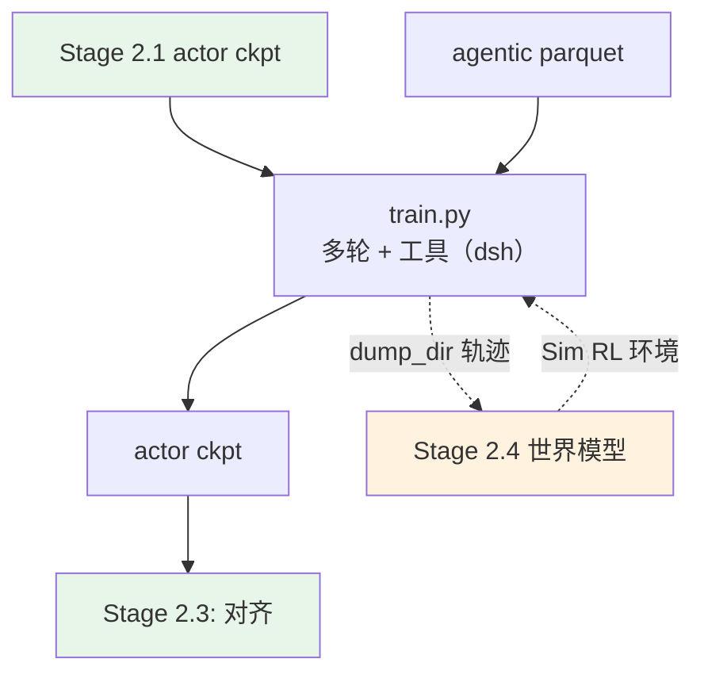

# Stage 2.2: 长时程 agentic RL

`stage2_rl` 的第二段：多轮 + 工具 + 环境，奖励来自环境 verifier（容器内真机跑测试），
或者由[世界模型](../stage4_world_model/README.md)扮演环境（Sim RL）。

## 总览

| 组件 | 做什么 |
|------|--------|
| `train.py` | 入口（两档：真机容器 / `--profile world_model`） |
| `test_train.py` | 集成预检（配置→命令、数据、ray、GPU、import、`agentworld` 资产） |
| `data_prep.py` | agentic / SWE / 工具调用类 RL 集 → parquet（`agent_ref` 与 `verifier` 一起带进训练行） |
| `world_model.py` | **Sim RL 档的环境**：语言世界模型（三种口径）+ 可选的 HTTP 环境服务 |
| `world_model_tool.py` + `config/tools/world_model.yaml` | 把世界模型接成 verl 工具（多轮状态机走上游 `ToolAgentLoop`） |
| `config/` | `default.yaml`（真机档）+ `world_model.yaml`（Sim 档）+ `debug.yaml` + `data_prep/` |

| 项 | 值 |
| --- | --- |
| 数据 | agentic / SWE / 工具调用类 RL 集（6 个，见 `config/data_prep/data_blend_raw.json`） |
| 与 RLVR 的差别 | `base:` 继承 [`../stage1_rlvr/config`](../stage1_rlvr/config)：`rollout.n: 4`、`max_response_length: 65536`、`lr: 5e-7`、`total_epochs: 50`（步数不设限，早停收尾） |
| 优化器 | 继承 RLVR 档：AdaMuon（矩阵腿）+ AdEMAMix（标量腿） |
| harness（真机档） | 环境与工具层用 **DeepSeek Harness（dsh）**（要一个 OpenAI/DeepSeek 兼容端点，就是我们的 `vllm serve`）；Gym 是它的宿主之一。装法见 [`../../stage3_eval/setup_env.sh`](../../stage3_eval/setup_env.sh) |
| harness（Sim 档） | `--profile world_model`：环境换成**语言世界模型**，观测由模型预测 |
| 判据 | 任务完成率上行；轨迹长度分布稳定；工具调用格式错误率下降 |

## 快速开始

```bash
python test_train.py --data-dir <parquet 目录>      # 集成预检
python data_prep.py --prepare && python train.py --dry-run && python train.py
```

### Sim RL 档：世界模型当环境

`--profile world_model` 把环境换成**语言世界模型**（七个域：terminal / swe / search / mcp / android / web / os），
观测由它预测而不是真机给。环境可以无限扩、可以注入扰动、可以是虚构世界；真机那套照旧——两档只差一个 `--profile`。

- `world_model.py`：环境本身。`WorldModelEnv` 是一个 session（历史逐轮累积），三种口径 `sim` /
  `control`（`spec.perturbations` 注入扰动）/ `fiction`（`spec.world` 虚构世界）；还能起 HTTP 环境服务
  给外部 harness：`python world_model.py serve --port 9000` → `GET /health`、`POST /reset`、`POST /step`。
  离线自测（假世界模型起端点，不需要 GPU）：`python world_model.py check`（15 项判定）。
- `world_model_tool.py` + `config/tools/world_model.yaml`：接成 **verl 工具**，多轮状态机与工具调用解析
  直接走上游 `ToolAgentLoop`，本仓库只实现一个工具；数据行可用
  `extra_info.tools_kwargs.env_action.create_kwargs` 逐行覆盖 `domain / mode / spec / task`。
  工具配置里把 `dump_dir` 打开，就把（动作, 观测）轨迹落盘——那是 [`../stage4_world_model`](../stage4_world_model/README.md) 的语料。
- Sim 档的多轮参数在 `config/world_model.yaml`：`max_assistant_turns: 12`、`max_tool_response_length: 8192`、
  工具调用格式 `hermes`（上游 `ToolParser`）。
- 若本仓库的 verl 版本对 vLLM 多轮有限制，把 `rollout.name` 换成 `sglang` 即可（引擎选择与 Sim RL 无关）。

```bash
vllm serve Qwen/Qwen-AgentWorld-35B-A3B --port 8000 --tensor-parallel-size 4 --max-model-len 262144 \
  --reasoning-parser qwen3 --language-model-only --trust-remote-code
export SHENSI_WORLD_MODEL_URL=http://127.0.0.1:8000/v1
python data_prep.py --prepare && python train.py --profile world_model --dry-run && python train.py --profile world_model
```

Sim RL 的收益面（世界模型当环境）：4k 个 OOD 环境上的 Claw-Eval 类评测、可控扰动、虚构世界下的检索迁移，
以及单轮 LWM RL warm-up 迁移到多轮工具调用——口径见[配方总览的「参考」](../../README.md#参考)。

## 验证

1. **集成预检 PASS**；
2. 任务完成率（环境 verifier 给分）随步数上行；
3. 轨迹长度分布稳定（不塌成 1 轮、不顶到上限）；
4. 工具调用格式错误率下降；
5. Sim 档与真机档的完成率差距随世界模型变强而收窄（差距就是世界模型的建模误差）。

**本机实跑记录**（WSL2 + RTX 5080 16G，单卡）：

```bash
python data_prep.py --prepare --blend config/data_prep/debug_sample.json --limit 40
python train.py --profile debug --data-dir $SHENSI_FS/shensi/data/stage2_agentic \
  --set model.path=$SHENSI_FS/shensi/models/sft-hf          # 由 export_hf.py 从 SFT ckpt 导出
```

- 从导出的 SFT ckpt 起跑：19/19 步通过，权重同步 20 次（agent loop + 工具调用走 verl 的 multi-turn 实现）。

## 产物链路



## 局限

1. 真机档要 harness（默认 dsh）的容器与基准资产；harness 的接线与 vLLM 端点已统一到
   [`../../harness.py`](../../harness.py)（与 [`../../stage3_eval`](../../stage3_eval/README.md) 同一份），
   预检会报缺什么、怎么装；
2. Sim 档的观测由世界模型生成，**保真度决定上限**：世界模型没见过的域（比如长尾 GUI）会系统性偏乐观，
   要在判据 5 里盯着；
3. 轨迹落盘（`dump_dir`）默认关，开之前先评估磁盘与后续语料清洗成本。

## 下一步

[`../stage3_align`](../stage3_align/README.md)（偏好 / 安全对齐）。
