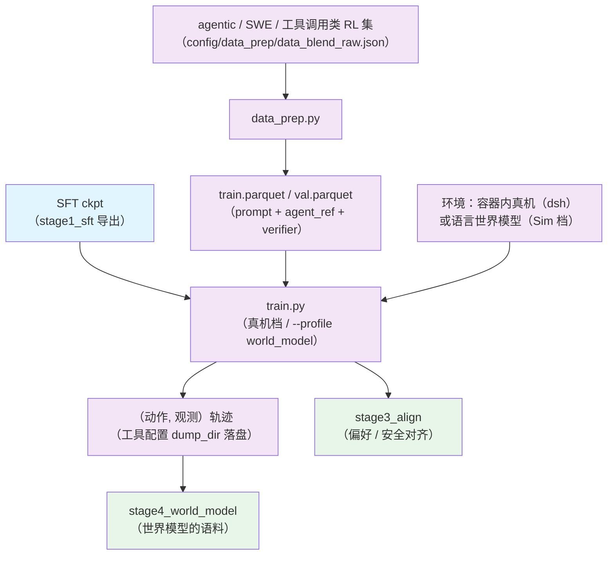

# Stage 2.2: 长时程 agentic RL

`stage2_rl` 的第二段：多轮 + 工具 + 环境。奖励来自环境 verifier（容器内真机跑测试），
或者由[世界模型](../stage4_world_model/README.md)扮演环境（Sim RL）。

## 总览

策略的每次动作交给环境/工具执行，观测回到上下文，轨迹放长到 64K response；判分仍走数据行的
verifier（`reward_model.ground_truth`）。真机档与 Sim 档共用同一套 verl 训练器与奖励函数，
两档只差一个 `--profile`。

| 组件 | 做什么 |
|------|--------|
| `train.py` | 入口（两档：真机容器 / `--profile world_model`） |
| `test_train.py` | 集成预检（配置→命令、数据、ray、GPU、import） |
| `data_prep.py` | agentic / SWE / 工具调用类 RL 集 → parquet（`agent_ref` 与 `verifier` 一起带进训练行） |
| `world_model.py` | Sim 档的环境：语言世界模型（三种口径）+ 可选的 HTTP 环境服务 |
| `world_model_tool.py` + `config/tools/world_model.yaml` | 把世界模型接成 verl 工具（多轮状态机走上游 `ToolAgentLoop`） |
| `config/` | `default.yaml`（真机档）+ `world_model.yaml`（Sim 档）+ `tiny.yaml` + `debug.yaml` + `data_prep/` |
| `../common/reward.py` | 共享件：环境 verifier 奖励（两档共用） |
| `../common/agentworld/` | 共享件：七个域的系统提示词与观测/判分解析 |

| 项 | 值 |
| --- | --- |
| 数据 | agentic / SWE / 工具调用类 RL 集（6 个，见 `config/data_prep/data_blend_raw.json`） |
| 与 RLVR 的差别 | `base:` 继承 `../stage1_rlvr/config`：`rollout.n: 4`、`max_response_length: 65536`、`lr: 5e-7`、`total_epochs: 50`（步数不设限，早停收尾） |
| 优化器 | 继承 RLVR 档：AdaMuon（矩阵腿）+ AdEMAMix（标量腿） |
| harness（真机档） | 环境与工具层用 DeepSeek Harness（dsh）；Gym 是它的宿主之一。装法见 [`../../stage3_eval/setup_env.sh`](../../stage3_eval/setup_env.sh) |
| harness（Sim 档） | `--profile world_model`：环境换成语言世界模型，观测由模型预测 |
| 判据 | 任务完成率上行；轨迹长度分布稳定；工具调用格式错误率下降 |

## 快速开始

```bash
python test_train.py --data-dir <parquet 目录>      # 集成预检
python data_prep.py --prepare && python train.py --dry-run && python train.py
python train.py --profile tiny --data-dir <目录>    # 冒烟：本地 tiny 模型 + 最小采样、不挂工具/环境
```

### Sim 档：世界模型当环境

`--profile world_model` 把环境换成语言世界模型（七个域：terminal / swe / search / mcp / android / web / os），
观测由它预测而不是真机给。环境可以无限扩、可以注入扰动、可以是虚构世界；两档只差一个 `--profile`。

- `world_model.py`：环境本体。`WorldModelEnv` 是一个 session（历史逐轮累积），三种口径 `sim` /
  `control`（`spec.perturbations` 注入扰动）/ `fiction`（`spec.world` 虚构世界）；能起 HTTP 环境服务
  给外部 harness：`python world_model.py serve --port 9000` → `GET /health`、`POST /reset`、`POST /step`。
  离线自测（假世界模型起端点，不需要 GPU）：`python world_model.py check`（15 项判定）。
- `world_model_tool.py` + `config/tools/world_model.yaml`：接成 verl 工具，多轮状态机与工具调用解析
  走上游 `ToolAgentLoop`；数据行可用 `extra_info.tools_kwargs.env_action.create_kwargs` 逐行覆盖
  `domain / mode / spec / task`。工具配置里把 `dump_dir` 打开就把（动作, 观测）轨迹落盘——那是
  [`../stage4_world_model`](../stage4_world_model/README.md) 的语料。
- Sim 档多轮参数：`max_assistant_turns: 12`、`max_tool_response_length: 8192`、格式 `hermes`。
- 若本仓库的 verl 版本对 vLLM 多轮有限制，把 `rollout.name` 换成 `sglang`（引擎选择与 Sim RL 无关）。

```bash
vllm serve <世界模型> --port 8000 --tensor-parallel-size 4 --max-model-len 262144 \
  --reasoning-parser qwen3 --language-model-only --trust-remote-code
export SHENSI_WORLD_MODEL_URL=http://127.0.0.1:8000/v1
python data_prep.py --prepare && python train.py --profile world_model --dry-run && python train.py --profile world_model
```

## 数据准备

### 流程

1. **读配比** → `config/data_prep/data_blend_raw.json`（agentic / SWE / 工具调用类 RL 集，6 个）
2. **定位语料** → 在语料根（默认 `$SHENSI_FS/datasets/llm/post-training`）下按数据集名找文件
3. **归一 schema** → `prompt` + `reward_model.ground_truth`（答案或 verifier 规格），`agent_ref` / `verifier` 带进训练行
4. **拆 train / val** → 按 `--val-ratio`（默认 0.02）
5. **写 parquet** → `train.parquet` / `val.parquet`

### CLI

```bash
python data_prep.py --discover        # 看语料在不在（文件数与权重）
python data_prep.py --prepare         # 产出 train.parquet / val.parquet
```

| 选项 | 说明 |
|------|------|
| `--discover` | 只打印语料根下每个数据集的文件数（不产出） |
| `--prepare` | 真正产出 parquet |
| `--config` | 数据准备档（`config/data_prep/default.yaml` / `tiny.yaml`），档里的 blend / limit / only / data_dir 并进本次参数 |
| `--blend` | 换配比 json（默认 `config/data_prep/data_blend_raw.json`） |
| `--root` | 语料根（默认 `$SHENSI_FS/datasets/llm/post-training`） |
| `--out` | 产物目录（默认 `$SHENSI_FS/shensi/data/stage2_agentic`） |
| `--limit` | 每个数据集最多取多少条 |
| `--only` | 只处理名字含该子串的数据集 |
| `--skip-missing` | 数据集缺失时跳过（而不是报错） |
| `--val-ratio` | 验证集比例（默认 0.02） |
| `--max-chars` | 丢掉 prompt 超过该字符数的样本（调试档用） |

### 输入

配比 json 的条目：`name`（语料根下的数据集目录）、`config`（子目录过滤）、`weight`。
归一后的训练行（verl 的 RL schema）：

```json
{
  "prompt": [{"role": "user", "content": "..."}],
  "data_source": "数据集名",
  "agent": "agent_ref",
  "verifier": {"type": "..."},
  "reward_model": {"style": "rule", "ground_truth": "..."},
  "extra_info": {"source": "数据集名", "split": "train", "index": 0}
}
```

### 输出

```
$SHENSI_FS/shensi/data/stage2_agentic/
├── train.parquet    # 训练行（默认 98%）
└── val.parquet      # 验证行（默认 2%，--val-ratio 可改）
```

### 配置

`config/data_prep/default.yaml`：

| 参数 | 说明 |
|------|------|
| `root` | 语料根（默认 `$SHENSI_FS/datasets/llm/post-training`） |
| `out` | 产物目录（默认 `$SHENSI_FS/shensi/data/stage2_agentic`） |
| `val_ratio` | 验证集比例（默认 0.02） |
| `max_chars` | 丢掉 prompt 超过该字符数的样本（调试档用；默认关） |
| `limit` | 每个数据集最多取多少条（默认不限） |

冒烟/调试档 `config/data_prep/tiny.yaml`：`blend: data_blend_tiny.json`（小配比）、`limit: 200`。

## 训练

### CLI

```bash
python train.py --profile <档> --data-dir <parquet 目录> [--set k=v]
```

| 选项 | 说明 |
|------|------|
| `--profile <档>` | 读 `config/<档>.yaml`：`default`（真机档）/ `world_model`（Sim 档）/ `tiny` / `debug` |
| `--config <文件>` | 直接指配置文件（不给则按 `--profile` 找） |
| `--data-dir <目录>` | data_prep 产物目录（含 `train.parquet` / `val.parquet`），默认 `$SHENSI_FS/shensi/data/stage2_agentic` |
| `--dry-run` | 只打印 `verl.trainer.main_ppo` 命令（含全部覆盖项） |
| `--set k=v` | 点号覆写，可多次 |
| `--early-stop N` / `--no-early-stop` | 早停看门狗（默认 patience=3，盯验证准确率 `acc/mean@1`，越大越好） |

### 输入

- **模型**：导出的 SFT ckpt（`--set model.path=<ckpt>`；不给则用继承档里的路径）
- **数据**：`train.parquet` / `val.parquet`（数据准备的产物）
- **环境**：真机档要 harness（默认 dsh）的容器与基准资产；Sim 档要世界模型端点（`SHENSI_WORLD_MODEL_URL`）

### 输出

- 每步把 actor 权重同步给 vLLM rollout 引擎（日志里的 `update_weights done`）；
- checkpoint 默认不存，要存显式给 `trainer.save_freq` 与 `trainer.default_local_dir`；
- 运行目录：`$SHENSI_FS/shensi/runs/stage2_agentic`（`hydra.run.dir`）。

### 配置文件

| 文件 | 用途 |
|------|------|
| `config/default.yaml` | 真机档（`base:` 继承 `../stage1_rlvr/config`） |
| `config/world_model.yaml` | Sim 档（`base: .` 叠在真机档上，环境换成语言世界模型） |
| `config/tiny.yaml` | 冒烟档：本地 tiny 模型 + 最小采样，不挂工具/环境 |
| `config/debug.yaml` | 极小档：1 epoch、小批，只验链路 |
| `config/tools/world_model.yaml` | Sim 档的工具配置（世界模型接成 `env_action` 工具） |
| `config/data_prep/` | 配比 json + 两个准备档 |

### 覆写示例

```bash
# 指到上一段导出的 SFT ckpt
python train.py --set model.path=<SFT ckpt>

# Sim 档：环境交给世界模型
python train.py --profile world_model --data-dir <目录>

# 极小档少采样，只验链路
python train.py --profile debug --set rollout.n=2
```

## 验证

1. **集成预检 PASS**；
2. 任务完成率（环境 verifier 给分）随步数上行；
3. 轨迹长度分布稳定（不塌成 1 轮、不顶到上限）；
4. 工具调用格式错误率下降；
5. Sim 档与真机档的完成率差距随世界模型变强而收窄（差距就是世界模型的建模误差）。

本机实测：从导出的 SFT ckpt 起跑 19/19 步通过，权重同步 20 次（agent loop + 工具调用走 verl 的
multi-turn 实现）；`world_model.py check` 离线 15 项判定通过。

## 局限

1. 真机档要 harness（默认 dsh）的容器与基准资产；harness 接线与 vLLM 端点统一在
   [`../../common/harness.py`](../../common/harness.py)，预检会报缺什么、怎么装；
2. Sim 档的观测由世界模型生成，**保真度决定上限**：没见过的域会系统性偏乐观；
3. 轨迹落盘（`dump_dir`）默认关，开之前先评估磁盘与语料清洗成本。

## 产物流



## 下一步

[`../stage3_align`](../stage3_align/README.md)（偏好 / 安全对齐）。

## 前序阶段

- [Stage 2.1: 多环境可验证奖励 RL（RLVR）](../stage1_rlvr/README.md) — 配置基座（`base:` 继承）
- [Stage 1: SFT](../../stage1_sft/README.md) — 本段从它导出的 ckpt 起跑
