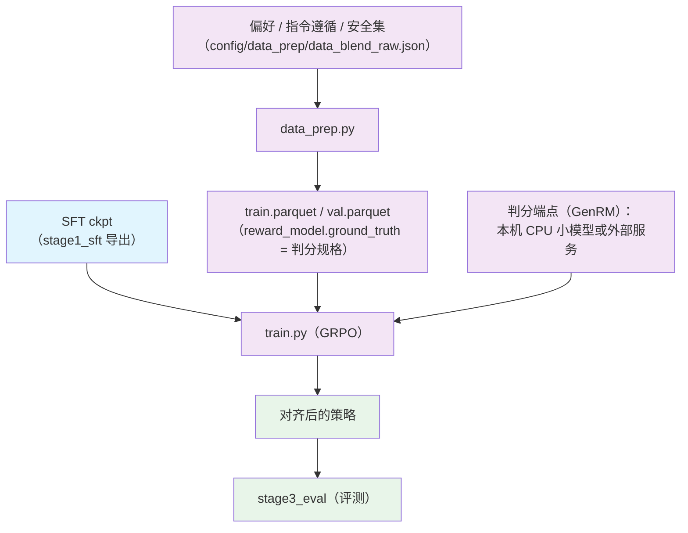

# Stage 2.3: 偏好 / 指令 / 安全对齐

`stage2_rl` 的第三段：轨迹不再靠规则判分，接 GenRM 判分模型（verl 的 `reward_model` 通道）；
GRPO 与双侧截断口径不变，优化器继续用 AdaMuon（矩阵腿）+ AdEMAMix（标量腿）。

## 总览

奖励不再由数据行的 verifier 规则计算，而是把偏好 / 评分规格塞进 `reward_model.ground_truth`，
由判分模型（本机 CPU 小模型或外部端点）打分；训练器与超参口径从 agentic 档继承。

| 组件 | 做什么 |
|------|--------|
| `train.py` | 入口（同一套 verl 命令） |
| `test_train.py` | 集成预检 |
| `data_prep.py` | 偏好 / 指令遵循 / 安全集 → parquet（`reward_model.ground_truth` 换成判分规格） |
| `config/` | `default.yaml` + `tiny.yaml` + `debug.yaml`（`base:` 继承 `../stage2_agentic/config`） |
| `config/data_prep/` | `data_blend_raw.json` + `data_blend_tiny.json` + 两个准备档 |
| `../common/reward.py` | 共享件：verifier 奖励（RL 各段共用） |

| 项 | 值 |
| --- | --- |
| 目标 | 指令遵循（结构化输出 / 日历 / 多轮）、安全性（红线）、偏好质量 |
| 数据 | 指令遵循、InverseIFEval、安全（5 个集） |
| 超参 | 继承 agentic 档，覆盖：`rollout.n: 8`、`max_response_length: 8192`、`lr: 5e-7`、`total_epochs: 50` |
| 优化器 | AdaMuon（矩阵腿）+ AdEMAMix（标量腿） |
| 判分 | 打开 verl 的 `reward_model` 通道，`reward_model.ground_truth` 换成偏好 / 评分规格；判分模型可以是自己的 ckpt 或托管端点 |

## 快速开始

```bash
python test_train.py --data-dir <parquet 目录>       # 集成预检
python data_prep.py --prepare && python train.py --dry-run && python train.py
python train.py --profile tiny --data-dir <目录>     # 冒烟：本地 tiny 模型 + 最小采样、不挂工具/环境
```

### 判分端点

判分端点用外部服务（GenRM）或本机的 CPU 判分服务：

```bash
python -m shensi.recipes.shensi.stage2_rl.stage4_world_model.local_judge \
    --model-dir $SHENSI_FS/models/SmolLM2-360M-Instruct --port 8000
export SHENSI_JUDGE_URL=http://127.0.0.1:8000/v1 SHENSI_JUDGE_MODEL=SmolLM2-360M-Instruct
```

## 数据准备

### 流程

1. **读配比** → `config/data_prep/data_blend_raw.json`（指令遵循 / InverseIFEval / 安全，5 个集）
2. **定位语料** → 在语料根（默认 `$SHENSI_FS/datasets/llm/post-training`）下按数据集名找文件
3. **归一 schema** → `prompt` + `reward_model.ground_truth`（**换成判分规格**，不是直给答案）
4. **拆 train / val** → 按 `--val-ratio`（默认 0.02）
5. **写 parquet** → `train.parquet` / `val.parquet`

### CLI

```bash
python data_prep.py --discover        # 看语料在不在（文件数与权重）
python data_prep.py --prepare         # 产出 train.parquet / val.parquet
```

| 选项 | 说明 |
|------|------|
| `--discover` | 只打印语料根下每个数据集的文件数（不产出） |
| `--prepare` | 真正产出 parquet |
| `--config` | 数据准备档（`config/data_prep/default.yaml` / `tiny.yaml`），档里的 blend / limit / only / data_dir 并进本次参数 |
| `--blend` | 换配比 json（默认 `config/data_prep/data_blend_raw.json`） |
| `--root` | 语料根（默认 `$SHENSI_FS/datasets/llm/post-training`） |
| `--out` | 产物目录（默认 `$SHENSI_FS/shensi/data/stage3_align`） |
| `--limit` | 每个数据集最多取多少条 |
| `--only` | 只处理名字含该子串的数据集 |
| `--skip-missing` | 数据集缺失时跳过（而不是报错） |
| `--val-ratio` | 验证集比例（默认 0.02） |
| `--max-chars` | 丢掉 prompt 超过该字符数的样本（调试档用） |

### 输入

配比 json 的条目：`name`（语料根下的数据集目录）、`config`（子目录过滤）、`weight`。
归一后的训练行里 `reward_model.ground_truth` 是判分规格（偏好 / 评分维度），不是参考答案：

```json
{
  "prompt": [{"role": "user", "content": "..."}],
  "data_source": "数据集名",
  "reward_model": {"style": "...", "ground_truth": "<判分规格>"},
  "extra_info": {"source": "数据集名", "split": "train", "index": 0}
}
```

### 输出

```
$SHENSI_FS/shensi/data/stage3_align/
├── train.parquet    # 训练行（默认 98%）
└── val.parquet      # 验证行（默认 2%，--val-ratio 可改）
```

### 配置

`config/data_prep/default.yaml`：

| 参数 | 说明 |
|------|------|
| `root` | 语料根（默认 `$SHENSI_FS/datasets/llm/post-training`） |
| `out` | 产物目录（默认 `$SHENSI_FS/shensi/data/stage3_align`） |
| `val_ratio` | 验证集比例（默认 0.02） |
| `max_chars` | 丢掉 prompt 超过该字符数的样本（调试档用；默认关） |
| `limit` | 每个数据集最多取多少条（默认不限） |

冒烟/调试档 `config/data_prep/tiny.yaml`：`blend: data_blend_tiny.json`（小配比）、`limit: 200`。

## 训练

### CLI

```bash
python train.py --profile <档> --data-dir <parquet 目录> [--set k=v]
```

| 选项 | 说明 |
|------|------|
| `--profile <档>` | 读 `config/<档>.yaml`：`default` / `tiny` / `debug` |
| `--config <文件>` | 直接指配置文件（不给则按 `--profile` 找） |
| `--data-dir <目录>` | data_prep 产物目录（含 `train.parquet` / `val.parquet`），默认 `$SHENSI_FS/shensi/data/stage3_align` |
| `--dry-run` | 只打印 `verl.trainer.main_ppo` 命令（含全部覆盖项） |
| `--set k=v` | 点号覆写，可多次 |
| `--early-stop N` / `--no-early-stop` | 早停看门狗（默认 patience=3，盯验证准确率 `acc/mean@1`，越大越好） |

### 输入

- **模型**：导出的 SFT ckpt（`--set model.path=<ckpt>`；不给则用继承档里的路径）
- **数据**：`train.parquet` / `val.parquet`（判分规格在 `reward_model.ground_truth`）
- **判分端点**：`SHENSI_JUDGE_URL` / `SHENSI_JUDGE_MODEL`（外部 GenRM 服务或本机 CPU 小模型）

### 输出

- 每步把 actor 权重同步给 vLLM rollout 引擎（日志里的 `update_weights done`）；
- checkpoint 默认不存，要存显式给 `trainer.save_freq` 与 `trainer.default_local_dir`；
- 运行目录：`$SHENSI_FS/shensi/runs/stage3_align`（`hydra.run.dir`）。

### 配置文件

| 文件 | 用途 |
|------|------|
| `config/default.yaml` | 正式档：`base:` 继承 `../stage2_agentic/config`，覆盖 `rollout.n: 8` / `max_response_length: 8192` / `lr: 5e-7` / `total_epochs: 50` |
| `config/tiny.yaml` | 冒烟档：本地 tiny 模型 + 最小采样预算 |
| `config/debug.yaml` | 极小档：1 epoch、小批，只验链路 |
| `config/data_prep/` | 配比 json + 两个准备档 |

### 覆写示例

```bash
# 指到上一段导出的 SFT ckpt
python train.py --set model.path=<SFT ckpt>

# 冒烟档：本地 tiny 模型 + 最小采样
python train.py --profile tiny --data-dir <目录>

# 点号覆写，可多次
python train.py --set rollout.n=4 --set trainer.total_epochs=10
```

## 验证

1. **集成预检 PASS**；
2. 安全类不退化（红线用例 0 命中）；
3. 指令遵循的结构化输出合法率上升；
4. `critic/score/mean` 不塌；
5. 早停：验证准确率超耐心即收尾。

本机实测：从导出的 SFT ckpt 起跑 19/19 步通过，权重同步 20 次。

## 局限

1. GenRM 判分模型的选型与规模未做消融；判分器自身的偏好会直接进入策略（同源风险），
   接托管端点或换更大判分器时先小规模对拍；
2. 判分端点属于外部依赖：本机可用 CPU 小模型（`local_judge.py`，逐维打分后组装五维 JSON，
   解析率会打印）或外部端点；
3. 优化器沿用 RLVR / agentic 口径，LR 与系数未单独扫描。

## 产物流



## 下一步

评测见 [Stage 3: 评测](../../stage3_eval/README.md)。

## 前序阶段

- [Stage 2.2: 长时程 agentic RL](../stage2_agentic/README.md) — 配置基座（`base:` 继承）
- [Stage 1: SFT](../../stage1_sft/README.md) — 本段从它导出的 ckpt 起跑
