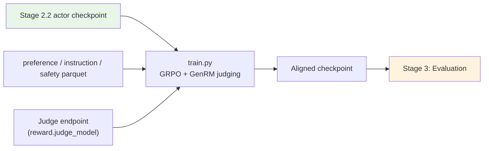

# Stage 2.3: Preference / Instruction / Safety Alignment

The third segment of `stage2_rl`: trajectories are no longer judged by rules; a **GenRM** judge model
steps in through verl's `reward_model` channel. The GRPO and IcePop clipping setup is unchanged (see
[`../README.md`](../README.md)).

## Overview

| Component | Description |
|-----------|-------------|
| `train.py` | Entry point (the simplest of the three RL segments: the same verl command) |
| `test_train.py` | Preflight |
| `data_prep.py` | Preference / instruction-following / safety sets → parquet (`reward_model.ground_truth` becomes the judging spec) |
| `config/` | `default.yaml` + `debug.yaml` (`base:`-inherits [`../stage2_agentic/config`](../stage2_agentic/config)) |

| Item | Value |
|------|-------|
| Goal | Instruction following (structured output / calendar / multi-turn), safety (red lines), preference quality |
| Data | Instruction following (structured output / calendar / multi-turn), InverseIFEval, safety (5 sets), see `config/data_prep/data_blend_raw.json` |
| Hyperparameters | `base:`-inherits the agentic profile and overrides: `rollout.n: 8`, `max_response_length: 8192`, `lr: 5e-7`, `total_epochs: 50` |
| Judging | verl's `reward_model` channel is enabled and `reward_model.ground_truth` becomes a preference / scoring spec; the judge model (GenRM) can be a checkpoint of your own or a hosted endpoint |

## Quick Start

```bash
python test_train.py --data-dir <parquet dir>       # preflight
python data_prep.py --prepare && python train.py --dry-run && python train.py
```

## Verification

1. **Preflight PASS**;
2. Safety does not regress (zero hits on the red-line cases);
3. The structured-output validity rate of instruction following rises;
4. `critic/score/mean` does not collapse;
5. Early stop: the run ends once validation accuracy exceeds patience (default 3).

**Local verification** (WSL2 + RTX 5080 16G, single GPU):

```bash
python data_prep.py --prepare --blend config/data_prep/debug_sample.json --limit 40
python train.py --profile debug --data-dir $SHENSI_FS/shensi/data/stage3_align \
  --set model.path=$SHENSI_FS/shensi/models/sft-hf          # exported from the SFT checkpoint
```

- Starting from the exported SFT checkpoint: 19/19 steps, 20 weight syncs.

## Artifact Lineage



## Limitations

1. The GenRM judge's model choice and size have no ablation; the judge's own preferences flow straight
   into the policy (a same-source risk) — compare on a small scale first when moving to a hosted endpoint
   or a larger judge;
2. The judge endpoint is an external dependency (the chain was verified locally with a stub): point
   `reward.judge_model` at an external endpoint and the preflight reports whether the endpoint and
   environment are in place.

## Next Steps

Evaluation is in [Stage 3: Evaluation](../../stage3_eval/README.md).
