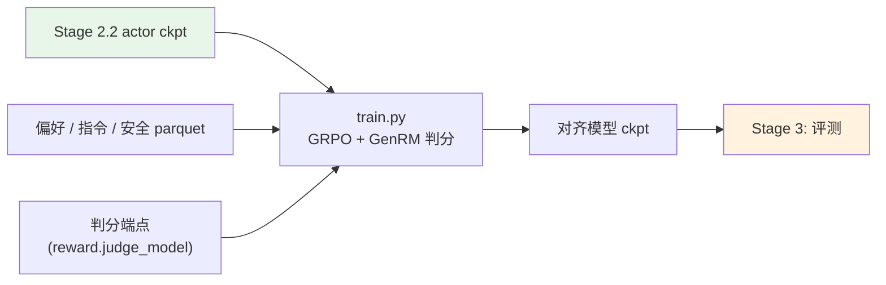

# Stage 2.3: 偏好 / 指令 / 安全对齐

`stage2_rl` 的第三段：轨迹不再靠规则判分，接 **GenRM** 判分模型（verl 的 `reward_model` 通道）；
GRPO 与 IcePop 截断口径不变（见 [`../README.md`](../README.md)），优化器也继续用
AdaMuon（矩阵腿）+ AdEMAMix（标量腿）。

## 总览

| 组件 | 做什么 |
|------|--------|
| `train.py` | 入口（RL 三段里最简单的一个：同一套 verl 命令） |
| `test_train.py` | 集成预检 |
| `data_prep.py` | 偏好 / 指令遵循 / 安全集 → parquet（`reward_model.ground_truth` 换成判分规格） |
| `config/` | `default.yaml` + `debug.yaml`（`base:` 继承 [`../stage2_agentic/config`](../stage2_agentic/config)） |

| 项 | 值 |
| --- | --- |
| 目标 | 指令遵循（结构化输出 / 日历 / 多轮）、安全性（红线）、偏好质量 |
| 数据 | 指令遵循（结构化输出 / 日历 / 多轮）、InverseIFEval、安全（5 个集），见 `config/data_prep/data_blend_raw.json` |
| 超参 | `base:` 继承 agentic 档，覆盖：`rollout.n: 8`、`max_response_length: 8192`、`lr: 5e-7`、`total_epochs: 50` |
| 优化器 | 继承 RLVR / agentic 档：AdaMuon（矩阵腿）+ AdEMAMix（标量腿） |
| 判分 | 打开 verl 的 `reward_model` 通道，`reward_model.ground_truth` 换成偏好/评分规格；判分模型（GenRM）可以是自己的 ckpt 或托管端点 |

## 快速开始

```bash
python test_train.py --data-dir <parquet 目录>       # 集成预检
python data_prep.py --prepare && python train.py --dry-run && python train.py
```

## 验证

1. **集成预检 PASS**；
2. 安全类不退化（红线用例 0 命中）；
3. 指令遵循的结构化输出合法率上升；
4. `critic/score/mean` 不塌；
5. 早停：验证准确率超耐心即收尾（默认 patience=3）。

**本机实跑记录**（WSL2 + RTX 5080 16G，单卡）：

```bash
python data_prep.py --prepare --blend config/data_prep/debug_sample.json --limit 40
python train.py --profile debug --data-dir $SHENSI_FS/shensi/data/stage3_align \
  --set model.path=$SHENSI_FS/shensi/models/sft-hf          # 由 export_hf.py 从 SFT ckpt 导出
```

- 从导出的 SFT ckpt 起跑：19/19 步通过，权重同步 20 次。

## 产物链路



## 局限

1. GenRM 判分模型的选型与规模未做消融；判分器的自身偏好会直接进入策略（同源风险），
   要接托管端点或换更大判分器时先小规模对拍；
2. 判分端点属于外部依赖（本机用桩验过链路）：把 `reward.judge_model` 指向外部端点即可，
   预检会报端点与环境是否就位；
3. 优化器沿用 RLVR / agentic 的口径（AdaMuon + AdEMAMix），LR 与系数没做单独扫描。

## 下一步

评测见 [Stage 3: 评测](../../stage3_eval/README.md)。
