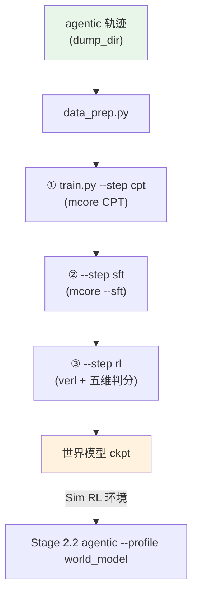

# Stage 2.4: 世界模型（动作 → 观测）

`stage2_rl` 的第四个（与策略这条线**并行**的子 stage）：把「动作 → 观测」练成一个模型，
产物就是 [`../stage2_agentic --profile world_model`](../stage2_agentic/README.md) 的 Sim RL 环境。
三个域口径（真机 / 可控扰动 / 虚构世界）与判分维度的出处见
[`../agentworld/README.md`](../agentworld/README.md) 与[配方总览的「参考」](../../README.md#参考)。

## 总览

| 组件 | 做什么 |
|------|--------|
| `train.py` | 入口：`--step cpt/sft/rl/all` 三段；`--profile` 选档；`--dry-run` |
| `test_train.py` | 集成预检（RL 段用 `config/rl/<档>.yaml`；另查 Sim RL 样例轨迹在不在） |
| `data_prep.py` | 轨迹 → ① CPT 纯文本 / ② SFT「历史 + 动作 → 观测」/ ③ RL 交互行 |
| `wm_common.py` | 三段共用的路径与数据口径 |
| `reward.py` | RL 段的奖励：AgentWorldBench 的五维判分 |
| `bench.py` | 按 AgentWorldBench 口径给任意世界模型打分（含自家训练的） |
| `stub_judge.py` | CPU 上的 OpenAI 兼容判分桩（不占显存，用来验链路） |
| `config/` | `default.yaml`（三段各自的上游档）+ `debug.yaml` + `rl/*.yaml` + `data_prep/sample_traj.jsonl` |

| 段 | 上游训练器 | 数据形态 | 目标 |
|----|-----------|---------|------|
| ① CPT `--step cpt` | [`stage0_pretrain/stage2_midtrain`](../../stage0_pretrain/stage2_midtrain/README.md)（默认档） | 轨迹文本（含动作与观测） | 注入环境知识：把交互轨迹当纯文本继续预训练 |
| ② SFT `--step sft` | [`stage1_sft`](../../stage1_sft/README.md)（mcore `--sft`，DSV4 编码） | `{"messages": [...]}` | 学「下一状态」：给历史 + 动作，输出 `**Environment Observation:**` + `<predicted_observation>` |
| ③ RL `--step rl` | verl（GRPO + 五维判分） | 交互行（含 `spec`） | 对齐模拟保真度 |

三段都走仓库统一的优化器口径（AdaMuon + AdEMAMix）：①② 用 mcore 的档，③ 用 verl 的 actor 档。

轨迹的来源：[`../stage2_agentic`](../stage2_agentic/README.md) 的工具配置里打开 `dump_dir`，
落盘的（动作, 观测）就是本段的语料；`config/data_prep/sample_traj.jsonl` 是给冒烟用的一小份样例（自带七个域各一条）。

## 快速开始

```bash
python test_train.py                       # 集成预检
python data_prep.py --discover             # 轨迹面貌
python data_prep.py --prepare              # 三段的数据都产出
python train.py --step cpt --dry-run        # ① 环境知识
python train.py --step sft                 # ② 下一状态
python train.py --step rl                  # ③ 保真度对齐
python train.py --step all                  # 三段连着跑
```

三段的端点从环境变量读：`SHENSI_WORLD_MODEL_URL` / `SHENSI_WORLD_MODEL`（世界模型）、
`SHENSI_JUDGE_URL` / `SHENSI_JUDGE_MODEL`（判分，默认同世界模型）。

## 验证

1. **集成预检 PASS**（含样例轨迹在位）；
2. ② 的 SFT：`<predicted_observation>` 的格式合法率上升；对留出轨迹的观测做文本相似度抽测；
3. ③ 的 RL：`critic/score/mean`（五维判分）上行；
4. 端到端：把 ③ 的产物接回 `stage2_agentic --profile world_model`，Sim 档与真机档的完成率差距收窄。

**本机实跑记录**（WSL2 + RTX 5080 16G，单卡）：

```bash
# 数据：自带 7 条轨迹（每个域一条）；极小档要把 system 与每轮都掐短，否则 prompt 放不下
python data_prep.py --step all --blend config/data_prep/debug_sample.json --limit 40 \
    --max-system-chars 1200 --max-turn-chars 600
# 三段一次跑通（RL 用 CPU 桩判分端点，不占显存）
python -m shensi.recipes.shensi.stage2_rl.stage4_world_model.stub_judge --port 8000 &
SHENSI_WORLD_MODEL_URL=http://127.0.0.1:8000/v1 SHENSI_WORLD_MODEL=stub-judge \
  python train.py --step all --profile debug \
  --data-dir $SHENSI_FS/shensi/data/stage2_world_model \
  --set trainer.n_gpus_per_node=1 --set model.path=$SHENSI_FS/shensi/models/sft-hf
```

- **三段全通过**：CPT 78 步（接 stage1 的 ckpt）→ SFT 2 步 → RL 3 步（奖励来自桩判分）；
- **真裁判**（LLM 判分服务）本机跑不了：16G 单卡上"判分服务 + rollout 引擎 + actor"会把 WSL 的
  GPU 驱动压爆（`CUDA driver error: device not ready`，`dmesg` 是 `dxgkio_make_resident: Ioctl failed: -12`）；
  桩跑在 CPU 上，用来验链路；要真分数就换成一个裁判模型的端点；
- 桩的分数与预测内容无关（`--mode hash` 按输入伪随机，保证 GRPO 组内有区分度）。

## 产物链路



## 局限

1. 三段（CPT → SFT → RL）都在本机跑通到训练步：前两段接 stage1 的 ckpt，RL 用 CPU 桩判分端点；
   真裁判需要同卡第二个模型服务或外部端点；
2. 判分（AgentWorldBench 五维）依赖判分模型，判分器自身的偏好会进入世界模型；
3. 轨迹数据依赖真机 agentic 段落盘，量不够时世界模型会过拟合到少数域。

## 下一步

产物回给 [`../stage2_agentic`](../stage2_agentic/README.md)（Sim RL 环境）；策略这条线继续
[`../stage3_align`](../stage3_align/README.md) 与[评测](../../stage3_eval/README.md)。
