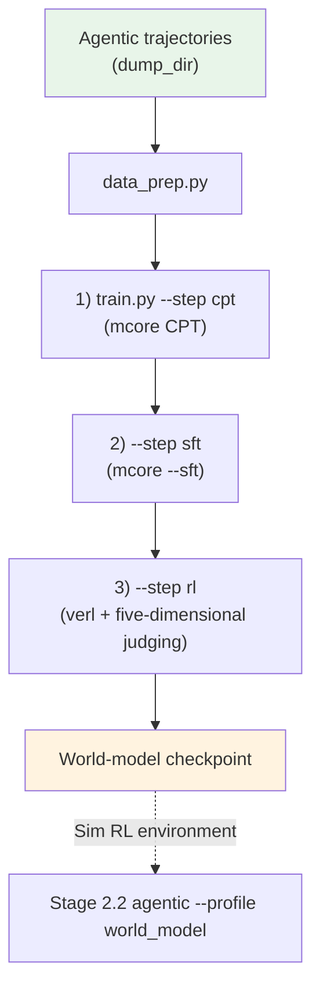

# Stage 2.4: World Model (action → observation)

The fourth sub-stage of `stage2_rl` (running **in parallel** with the policy line): train "action →
observation" into a model whose artifact becomes [`../stage2_agentic --profile world_model`](../stage2_agentic/README.md)'s
Sim RL environment. The three domain modes (real / controlled perturbation / fictional world) and the
judge dimensions are documented in [`../agentworld/README.md`](../agentworld/README.md) and cited in the
[recipe overview's "References"](../../README.md#references).

## Overview

| Component | Description |
|-----------|-------------|
| `train.py` | Entry point: `--step cpt/sft/rl/all`; `--profile` selects the config; `--dry-run` |
| `test_train.py` | Preflight (the RL step uses `config/rl/<profile>.yaml`; also checks that Sim RL sample trajectories exist) |
| `data_prep.py` | Trajectories → 1) CPT plain text / 2) SFT "history + action → observation" / 3) RL interaction rows |
| `wm_common.py` | Paths and data conventions shared by the three steps |
| `reward.py` | The RL step's reward: the five-dimensional AgentWorldBench judging |
| `bench.py` | Scores any world model (including trained ones) under the AgentWorldBench protocol |
| `stub_judge.py` | A CPU-resident, OpenAI-compatible judge stub (no GPU memory, for chain verification) |
| `config/` | `default.yaml` (each step's upstream profile) + `debug.yaml` + `rl/*.yaml` + `data_prep/sample_traj.jsonl` |

| Step | Upstream trainer | Data shape | Goal |
|------|------------------|------------|------|
| 1) CPT `--step cpt` | [`stage0_pretrain/stage2_midtrain`](../../stage0_pretrain/stage2_midtrain/README.md) (default profile) | trajectory text (actions and observations) | inject environment knowledge by continued pretraining on interaction trajectories |
| 2) SFT `--step sft` | [`stage1_sft`](../../stage1_sft/README.md) (mcore `--sft`, DSV4 encoding) | `{"messages": [...]}` | learn the next state: given history + action, emit `**Environment Observation:**` + `<predicted_observation>` |
| 3) RL `--step rl` | verl (GRPO + five-dimensional judging) | interaction rows (carrying `spec`) | align simulation fidelity |

Trajectories come from [`../stage2_agentic`](../stage2_agentic/README.md)'s tool config with `dump_dir`
enabled; the dumped (action, observation) pairs are this stage's corpus. `config/data_prep/sample_traj.jsonl`
is a small set for smoke tests (one sample per domain, seven in total).

## Quick Start

```bash
python test_train.py                       # preflight
python data_prep.py --discover             # trajectory shape
python data_prep.py --prepare              # produces the data for all three steps
python train.py --step cpt --dry-run        # 1) environment knowledge
python train.py --step sft                 # 2) next state
python train.py --step rl                  # 3) fidelity alignment
python train.py --step all                  # all three in sequence
```

The endpoints for all three steps come from environment variables: `SHENSI_WORLD_MODEL_URL` /
`SHENSI_WORLD_MODEL` (the world model) and `SHENSI_JUDGE_URL` / `SHENSI_JUDGE_MODEL` (the judge, defaulting
to the world model).

## Verification

1. **Preflight PASS** (including the sample trajectories being present);
2. Step 2's SFT: the `<predicted_observation>` format validity rate rises; spot-check text similarity
   against held-out observations;
3. Step 3's RL: `critic/score/mean` (five-dimensional judging) trends up;
4. End to end: feed step 3's artifact back into `stage2_agentic --profile world_model` and watch the
   Sim-vs-real completion-rate gap narrow.

**Local verification** (WSL2 + RTX 5080 16G, single GPU):

```bash
# Data: 7 bundled trajectories (one per domain); tiny runs must shorten the system prompt and each turn
python data_prep.py --step all --blend config/data_prep/debug_sample.json --limit 40 \
    --max-system-chars 1200 --max-turn-chars 600
# All three steps in one go (RL uses the CPU judge stub, no GPU memory)
python -m shensi.recipes.shensi.stage2_rl.stage4_world_model.stub_judge --port 8000 &
SHENSI_WORLD_MODEL_URL=http://127.0.0.1:8000/v1 SHENSI_WORLD_MODEL=stub-judge \
  python train.py --step all --profile debug \
  --data-dir $SHENSI_FS/shensi/data/stage2_world_model \
  --set trainer.n_gpus_per_node=1 --set model.path=$SHENSI_FS/shensi/models/sft-hf
```

- **All three steps pass**: CPT 78 steps (continuing from stage 1's checkpoint) → SFT 2 steps → RL 3 steps
  (rewards from the judge stub);
- **The real judge** (an LLM judging service) does not fit on this box: on a 16 GB card "judge + rollout
  engine + actor" blows up the WSL GPU driver (`CUDA driver error: device not ready`; `dmesg` shows
  `dxgkio_make_resident: Ioctl failed: -12`). The stub runs on CPU and verifies the chain; point the
  endpoint at a real judge model for real scores;
- The stub's scores do not depend on the predicted content (`--mode hash` is pseudo-random per input, so
  GRPO groups keep a signal).

## Artifact Lineage



## Limitations

1. All three steps (CPT → SFT → RL) reached training steps locally: the first two continue from stage 1's
   checkpoint, RL used the CPU judge stub; the real judge needs a second model server on the same card or
   an external endpoint;
2. The five-dimensional AgentWorldBench judging depends on a judge model, whose own preferences leak into
   the world model;
3. Trajectory data depends on the real-machine agentic segment dumping to disk; with too little data the
   world model overfits to a few domains.

## Next Steps

The artifact goes back to [`../stage2_agentic`](../stage2_agentic/README.md) (the Sim RL environment); the
policy line continues with [`../stage3_align`](../stage3_align/README.md) and
[evaluation](../../stage3_eval/README.md).
