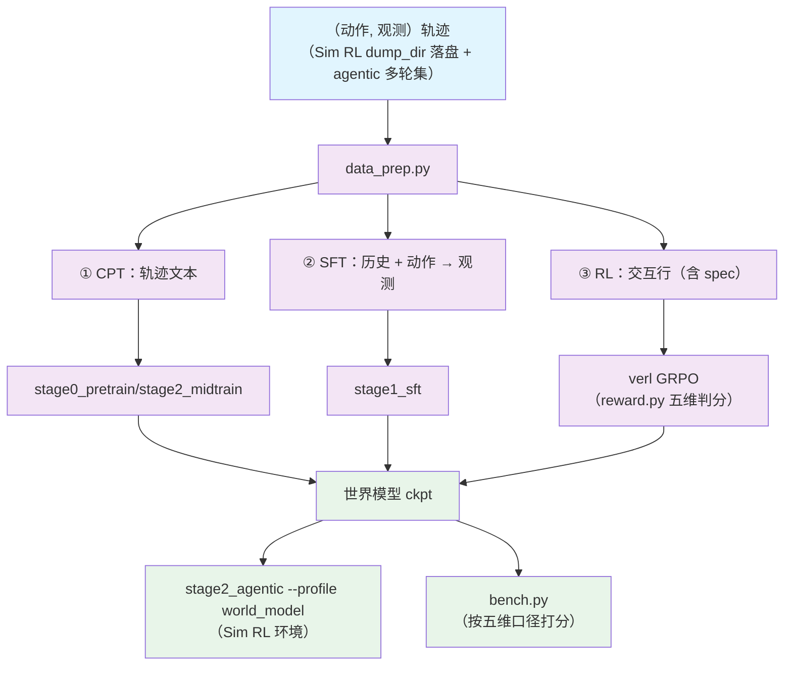

# Stage 2.4: 世界模型（动作 → 观测）

`stage2_rl` 的第四个（与策略这条线**并行**）：把「动作 → 观测」练成一个模型，产物就是
[`../stage2_agentic --profile world_model`](../stage2_agentic/README.md) 的 Sim RL 环境。

## 总览

三段对应 CPT → SFT → RL：先注入环境知识，再学「下一状态」，最后用判分把保真度顶上去；
三段都复用现成训练器，本目录只放世界模型自己的口径与数据。

| 组件 | 做什么 |
|------|--------|
| `train.py` | 入口：`--step cpt/sft/rl/all` 三段；`--profile` 选档；`--dry-run` |
| `test_train.py` | 集成预检（RL 段用 `config/rl/<档>.yaml`；另查样例轨迹在不在） |
| `data_prep.py` | 轨迹 → ① CPT 纯文本 / ② SFT「历史 + 动作 → 观测」/ ③ RL 交互行 |
| `wm_common.py` | 三段共用的路径与数据口径（含判分提示词的组装） |
| `reward.py` | RL 段的奖励：五维判分（0~1） |
| `bench.py` | 按五维口径（Format / Factuality / Consistency / Realism / Quality）给任意世界模型打分 |
| `stub_judge.py` | CPU 上的判分桩（`--mode hash` 按输入伪随机，保证组内有区分度） |
| `local_judge.py` | **CPU 上的真模型判分**：小模型逐维打分后组装五维 `<final_evaluation>` JSON，打印解析率 |
| `config/` | `default.yaml` + `tiny.yaml` + `debug.yaml` + `rl/*.yaml` + `data_prep/` |
| `../common/agentworld/` | 共享件：七个域的系统提示词与五维判分解析 |

| 段 | 上游训练器 | 数据形态 | 目标 |
|----|-----------|---------|------|
| ① CPT `--step cpt` | [`stage0_pretrain/stage2_midtrain`](../../stage0_pretrain/stage2_midtrain/README.md) | 轨迹文本（含动作与观测） | 注入环境知识 |
| ② SFT `--step sft` | [`stage1_sft`](../../stage1_sft/README.md)（mcore `--sft`） | `{"messages": [...]}` | 学「下一状态」：输出 `**Environment Observation:**` + `<predicted_observation>` |
| ③ RL `--step rl` | verl（GRPO + 五维判分） | 交互行（含 `spec`） | 对齐模拟保真度 |

轨迹来源：[`../stage2_agentic`](../stage2_agentic/README.md) 的工具配置里打开 `dump_dir`，落盘的
（动作, 观测）就是本段语料；`config/data_prep/sample_traj.jsonl` 是冒烟样例（七个域各一条）。

## 快速开始

```bash
python test_train.py                       # 集成预检
python data_prep.py --discover             # 轨迹面貌
python data_prep.py                        # 三段的数据都产出（默认 --step all）
python train.py --step cpt --dry-run        # ① 环境知识
python train.py --step sft                 # ② 下一状态
python train.py --step rl                  # ③ 保真度对齐
python train.py --step all                  # 三段连着跑
python train.py --profile tiny --step all   # 冒烟：CPT / SFT 走 mock 档，RL 步用 config/rl/debug.yaml
```

`--profile` 选的是本目录 `config/<档>.yaml`（三段各自的档写在 `cpt` / `sft` / `rl` / `bench` 段里）；
`tiny` 那份把 CPT / SFT 指到各自的 mock 冒烟档、RL 步指到 `config/rl/debug.yaml`。

端点从环境变量读：`SHENSI_WORLD_MODEL_URL` / `SHENSI_WORLD_MODEL`（世界模型）、
`SHENSI_JUDGE_URL` / `SHENSI_JUDGE_MODEL`（判分，默认同世界模型）。

### 判分端点（本机可全 CPU）

```bash
# 世界模型：桩（不占显存）或自己的服务
python -m shensi.recipes.shensi.stage2_rl.stage4_world_model.stub_judge --port 9000 --mode hash
# 判分：CPU 小模型（逐维打分 → 五维 JSON；解析率会打印）
python -m shensi.recipes.shensi.stage2_rl.stage4_world_model.local_judge \
    --model-dir $SHENSI_FS/models/SmolLM2-360M-Instruct --port 8000
export SHENSI_WORLD_MODEL_URL=http://127.0.0.1:9000/v1 SHENSI_WORLD_MODEL=stub-judge
export SHENSI_JUDGE_URL=http://127.0.0.1:8000/v1 SHENSI_JUDGE_MODEL=SmolLM2-360M-Instruct
```

## 数据准备

### 流程

1. **收集轨迹** → Sim RL 落盘目录（默认 `$SHENSI_FS/shensi/data/world_model_traj`）+ 配比 json 里的多轮 agentic 集
2. **解析轮次** → 轨迹 →（动作, 观测）轮次，丢掉观测短于 `--min-obs-chars` 的轮次
3. **① CPT** → 轨迹文本 → `cpt_src/` → 走 stage0_pretrain 的 prepare（切片 / 分词）→ `cpt_bins/blend.json`
4. **② SFT** → 「历史 + 动作 → 观测」的 `{"messages": [...]}` → `sft_src/` → 走 stage1_sft 的 data_prep（渲染 / loss mask / 打包）→ `sft/`
5. **③ RL** → 交互行（含 `spec`）→ `train.parquet` / `val.parquet`

### CLI

```bash
python data_prep.py --discover             # 只打印轨迹目录与语料面貌
python data_prep.py --step cpt             # 只产 CPT 语料（sft / rl / all 同理）
```

| 选项 | 说明 |
|------|------|
| `--step cpt/sft/rl/all` | 产出哪几段的数据（默认 `all`） |
| `--discover` | 只打印轨迹目录与各数据集文件数（不产出） |
| `--blend` | 换配比 json（默认 `config/data_prep/data_blend_raw.json`） |
| `--traj-dir` | Sim RL 落盘轨迹目录（默认 `$SHENSI_FS/shensi/data/world_model_traj`） |
| `--root` | 轨迹语料根（默认 `$SHENSI_FS/datasets/llm/post-training`） |
| `--out` | 产物目录（默认 `$SHENSI_FS/shensi/data/stage2_world_model`） |
| `--tokenizer` | 分词器（默认 `$SHENSI_TOKENIZER`） |
| `--limit` | 每个文件最多取多少条 |
| `--max-history` | SFT / RL 带几轮历史（默认 4） |
| `--min-obs-chars` | 丢掉观测短于该字符数的轮次（默认 8） |
| `--max-turn-chars` | 每轮动作/观测掐到多少字符（极小档用；不给就不截） |
| `--max-system-chars` | 每个域的 system prompt 掐到多少字符（极小档用；不给就不截） |
| `--val-ratio` | 验证集比例（默认 0.02） |

### 输入

- Sim RL 落盘的交互轨迹（agentic 工具配置里 `dump_dir` 打开后落的那份）
- 配比 json 里的多轮 agentic 集（同一批 RL 语料，这里只读它的（动作, 观测））
- 冒烟：`config/data_prep/sample_traj.jsonl`，七个域各一条

### 输出

```
$SHENSI_FS/shensi/data/stage2_world_model/
├── cpt_src/ → cpt_bins/     # ① CPT：轨迹文本 → 切片 / 分词产物（blend.json）
├── sft_src/ → sft/          # ② SFT：下一状态样本 → packed parquet
├── train.parquet            # ③ RL：训练行
└── val.parquet              # ③ RL：验证行
```

### 配置

`config/data_prep/default.yaml`：

| 参数 | 说明 |
|------|------|
| `traj_dir` | Sim RL 落盘轨迹目录（默认 `$SHENSI_FS/shensi/data/world_model_traj`） |
| `root` | 轨迹语料根（默认 `$SHENSI_FS/datasets/llm/post-training`） |
| `out` | 产物目录（默认 `$SHENSI_FS/shensi/data/stage2_world_model`） |
| `tokenizer` | 分词器（默认 `$SHENSI_TOKENIZER`） |
| `max_history` | SFT / RL 带几轮历史（默认 4；Consistency 那一维靠它） |
| `min_obs_chars` | 观测太短的轮次丢掉（默认 8） |
| `val_ratio` | 验证集比例（默认 0.02） |
| `limit` | 每个文件最多取多少条（默认不限） |

冒烟档 `config/data_prep/tiny.yaml`：只用自带的 `sample_traj.jsonl`（七个域各一条），不依赖外部语料。

## 训练

### CLI

```bash
python train.py --step <段> --profile <档> [--data-dir <目录>] [--dry-run] [--set k=v]
```

| 选项 | 说明 |
|------|------|
| `--step cpt/sft/rl/all` | 跑哪段（默认 `all`，按 cpt → sft → rl 顺序） |
| `--profile <档>` | 读 `config/<档>.yaml`；三段各自的档写在里面的 `cpt` / `sft` / `rl` / `bench` 段 |
| `--data-dir <目录>` | data_prep 产物目录，默认 `$SHENSI_FS/shensi/data/stage2_world_model` |
| `--dry-run` | 只打印各段将要执行的命令 |
| `--set k=v` | 点号覆写，透传给各段 |

### 输入

- **数据**：data_prep 的三段产物（`cpt_bins` / `sft` / `train.parquet` + `val.parquet`）
- **训练器**：① `stage0_pretrain/stage2_midtrain`、② `stage1_sft/train.py`、③ verl——各自读现成的档
- **端点**：世界模型与判分端点从环境变量读（`SHENSI_WORLD_MODEL_URL` / `SHENSI_JUDGE_URL` 等）

### 输出

- ① CPT → `$SHENSI_FS/shensi/ckpt/stage2_world_model/cpt`
- ② SFT → `$SHENSI_FS/shensi/ckpt/stage2_world_model/sft`
- ③ RL → `$SHENSI_FS/shensi/runs/stage2_world_model`（verl；checkpoint 默认不存，要存显式给 `trainer.save_freq`）
- 产物回给 `stage2_agentic --profile world_model` 当 Sim RL 环境

### 配置文件

| 文件 | 用途 |
|------|------|
| `config/default.yaml` | 正式档：三段各自的 profile + `cpt.tokens: 20B` + `bench.limit: 200` |
| `config/tiny.yaml` | 冒烟档：CPT / SFT 指到各自的 mock 档，RL 步指到 `config/rl/debug.yaml` |
| `config/debug.yaml` | 极小档：CPT `cpt.tokens: 20000`（≈78 步） |
| `config/rl/default.yaml` | ③ 的 verl 档（`rollout.n: 4`、`max_prompt_length: 16384`、`max_response_length: 4096`、`total_epochs: 20`） |
| `config/rl/debug.yaml` | ③ 的单卡极小档（两步、`enforce_eager`、`tensor_model_parallel_size: 1`） |
| `config/data_prep/` | 配比 json + `sample_traj.jsonl` + 两个准备档 |

### 覆写示例

```bash
# 只跑 RL 段（不重跑 CPT / SFT）
python train.py --step rl --profile default --data-dir <目录>

# 点号覆写，透传给该段
python train.py --step rl --set rollout.n=2

# 冒烟：三段连着跑（CPT / SFT 走 mock 档）
python train.py --profile tiny --step all
```

## 验证

1. **集成预检 PASS**（含样例轨迹在位）；
2. ② 的 SFT：`<predicted_observation>` 格式合法率上升；对留出轨迹做文本相似度抽测；
3. ③ 的 RL：`critic/score/mean`（五维）上行；
4. 端到端：把 ③ 的产物接回 `stage2_agentic --profile world_model`，Sim 与真机完成率差距收窄。

本机实测：三段一次跑通（CPT 78 步 → SFT 2 步 → RL 3 步，判分来自桩端点）；`local_judge --check`
离线自检把 360M 模型的 `1 2 3 4 5` 组装成五维 JSON（五维键齐全，CPU、不占显存）。

## 局限

1. 判分器自身的偏好会进入世界模型；换裁判模型时先小规模对拍（`local_judge` 会报解析率，
   解析率低说明该换更大裁判）；
2. 轨迹数据依赖真机 agentic 段落盘，量不够时世界模型会过拟合到少数域；
3. 世界模型的"真裁判"若用外部大模型端点，速度与配额是外部约束；本机默认走 CPU 小模型或桩。

## 产物流



## 下一步

产物回给 [`../stage2_agentic`](../stage2_agentic/README.md)（Sim RL 环境）；策略这条线继续
[`../stage3_align`](../stage3_align/README.md) 与[评测](../../stage3_eval/README.md)。

## 前序阶段

- [Stage 2.2: 长时程 agentic RL](../stage2_agentic/README.md) — 轨迹语料来源（工具配置里打开 `dump_dir`）
- [Stage 0.2: 中训练 + DSA 引入](../../stage0_pretrain/stage2_midtrain/README.md) — ① CPT 的上游训练器
- [Stage 1: SFT（指令微调）](../../stage1_sft/README.md) — ② SFT 的上游训练器（渲染 / packed 口径复用）
